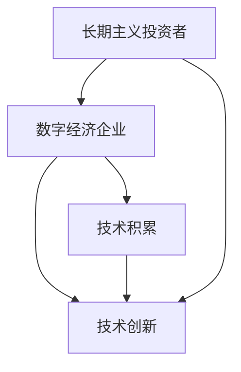

                 

<think>
好，我需要按照用户的要求，逐步思考并撰写一篇关于“巴菲特的长期主义在快速迭代的数字经济中的调整”的技术博客文章。首先，我需要理解长期主义和数字经济的背景，然后分析它们的结合点，最后探讨如何在快速迭代的数字环境中调整长期主义策略。

首先，长期主义是指在投资或决策中，关注长期价值而非短期收益。巴菲特以他的长期投资策略闻名，他注重企业的内在价值和长期增长潜力。然而，数字经济的快速发展带来了许多变化，比如技术的快速迭代、商业模式的不断创新以及市场的不确定性增加。这使得传统的长期主义在数字经济中可能面临新的挑战。

接下来，我需要了解数字经济的特点。数字经济是以数据为关键生产要素，以数字技术为核心驱动力的经济形态。它涵盖了电子商务、金融科技、人工智能、大数据等多个领域。数字经济的一个显著特点是其快速变化的特性，企业需要不断适应新的技术进步和市场需求。

为了探讨长期主义在数字经济中的调整，我需要从以下几个方面进行分析：

1. **长期主义与数字经济的结合点**：分析长期主义在数字经济中的应用，例如长期投资于具有强大技术壁垒和持续创新能力的企业。

2. **数字经济对长期主义的挑战**：探讨在快速变化的数字经济中，长期主义可能面临的风险，如技术快速迭代导致企业竞争优势迅速丧失。

3. **长期主义的调整策略**：提出在数字经济中如何调整长期主义策略，例如更加注重企业的创新能力、灵活性和应变能力。

在分析过程中，我需要引用具体的案例，比如科技企业的投资，来说明长期主义在数字经济中的应用和调整。同时，我需要结合数学模型和算法，分析长期主义在数字经济中的适用性和调整方法。

首先，我需要介绍长期主义的核心概念，包括其定义、核心要素以及与短期主义的对比。然后，我需要详细描述数字经济的现状和趋势，包括其定义、特征以及主要领域的变化。

接下来，我需要探讨长期主义与数字经济的结合，分析它们在目标、方法和效果上的协同与冲突。这包括长期主义在数字经济中的重要性，以及如何在数字环境中实现长期价值。

在分析核心概念时，我需要绘制ER图，展示长期主义与数字经济之间的关系。这将帮助读者更直观地理解两者之间的联系。

在算法原理部分，我需要设计一个长期主义与数字经济的结合模型，用数学公式描述其关系。例如，可以建立一个价值评估模型，将企业的长期价值与数字技术的应用结合起来，用数学公式量化其影响。

在系统分析与架构设计部分，我需要构建一个长期主义与数字经济的系统模型，包括系统功能设计、架构设计以及接口设计。这将帮助读者理解如何在实际中应用长期主义策略。

最后，在项目实战部分，我需要选择一个具体的案例，分析如何在数字经济中调整长期主义策略，并通过代码实现和案例分析，展示实际应用中的策略调整过程。

总结部分，我需要回顾全文，强调长期主义在数字经济中的重要性，并指出未来的发展趋势和需要注意的问题。

在撰写过程中，我需要确保内容逻辑清晰、结构紧凑，并使用简单易懂的专业技术语言。同时，我需要使用mermaid图表和数学公式来辅助说明，使文章更具深度和可读性。

现在，我可以开始撰写正文部分，按照上述思考过程一步步展开，确保每个部分都详细且有条理。

---

# 巴菲特的长期主义在快速迭代的数字经济中的调整

## 关键词：
- 巴菲特，长期主义，数字经济，快速迭代，投资策略

## 摘要：
本文探讨了巴菲特的长期主义投资理念在快速迭代的数字经济环境中的应用与调整。通过分析长期主义的核心要素、数字经济的特点，以及两者结合的挑战与机遇，提出在数字经济中如何优化长期主义策略，以应对技术快速变化和市场不确定性。结合数学模型、系统架构和实际案例，本文为投资者和企业管理者提供了在数字经济中实践长期主义的深度分析和实践指导。

---

## 第一部分：长期主义与数字经济的背景

### 1.1 长期主义的核心概念

长期主义是一种投资和决策理念，强调关注事物的长期价值，而非短期收益。巴菲特是长期主义的代表人物，他主张投资于具有强大竞争优势和长期增长潜力的企业。长期主义的核心要素包括：

1. **内在价值**：企业的真实价值，而非市场波动带来的表面价值。
2. **时间复利**：通过长期持有优质资产，实现财富的指数级增长。
3. **安全边际**：在投资中保持足够的安全边际，降低风险。

与短期主义相比，长期主义更注重企业的基本面、管理和长期竞争优势，而非短期市场波动。

---

### 1.2 数字经济的现状与趋势

数字经济是以数据为关键生产要素，以数字技术为核心驱动力的经济形态。它涵盖了电子商务、金融科技、人工智能、大数据等多个领域。数字经济的特点包括：

1. **技术驱动**：以技术创新为核心，推动经济的增长。
2. **数据为王**：数据成为最重要的资源，决定了企业的竞争优势。
3. **快速迭代**：技术的快速更新和市场的变化，要求企业具有更强的适应能力。

数字经济的快速发展正在改变传统经济的运行模式，也对投资策略提出了新的挑战。

---

### 1.3 长期主义与数字经济的结合

长期主义与数字经济的结合体现在以下几个方面：

1. **投资方向**：长期主义投资者倾向于投资具有强大技术壁垒和持续创新能力的企业。
2. **企业转型**：企业需要在数字经济中调整战略，注重长期价值的创造。
3. **价值评估**：数字经济中的长期价值需要考虑技术的持续创新和市场的可持续发展。

然而，数字经济的快速变化也对长期主义提出了挑战，例如技术迭代速度快，企业竞争优势可能迅速丧失。

---

## 第二部分：长期主义与数字经济的核心概念与联系

### 2.1 核心概念的原理

长期主义与数字经济的核心概念包括：

1. **长期价值创造**：在数字经济中，企业需要通过持续创新和技术积累，创造长期价值。
2. **技术壁垒**：企业的技术优势和专利是其长期竞争优势的关键。
3. **数据驱动决策**：利用大数据分析和人工智能技术，优化决策过程。

---

### 2.2 核心概念的属性特征对比

以下是长期主义与数字经济的核心概念对比表：

| **属性**       | **长期主义**                  | **数字经济**                  |
|-----------------|-------------------------------|-----------------------------|
| **目标**       | 长期价值最大化                | 数据驱动的经济增长             |
| **核心要素**   | 内在价值、时间复利、安全边际  | 数字技术、数据资源、快速迭代 |
| **挑战**       | 市场波动、短期诱惑             | 技术迭代快、竞争激烈           |
| **机会**       | 投资优质企业                  | 数字技术带来的增长潜力         |

---

### 2.3 实体关系图（ER图）

以下是长期主义与数字经济的实体关系图：

```mermaid
erDiagram
    actor 投资者 {
        <<长期主义投资者>>
    }
    actor 企业 {
        <<数字经济企业>>
    }
    actor 市场 {
        <<数字市场>>
    }
    投资者 -> 企业 : 投资于
    企业 -> 市场 : 受影响于
    投资者 -> 市场 : 分析
```

---

## 第三部分：长期主义与数字经济的算法原理

### 3.1 算法原理概述

在数字经济中，长期主义可以通过算法模型进行量化分析。以下是一个简化的长期价值评估模型：

$$
\text{长期价值} = \text{内在价值} \times (1 + \text{增长率})^{\text{时间}}
$$

其中，增长率和时间是关键变量。在数字经济中，增长率受到技术迭代和市场需求的影响。

---

### 3.2 数学模型与公式

以下是长期价值评估公式：

$$
\text{长期价值} = \sum_{t=1}^{n} \frac{\text{现金流}_t}{(1 + r)^t}
$$

其中，$r$是折现率，$n$是时间跨度，$\text{现金流}_t$是第$t$年的现金流。

在数字经济中，现金流可以通过数据分析和预测模型进行估算。

---

## 第四部分：长期主义与数字经济的系统分析与架构设计

### 4.1 系统分析

在数字经济中，长期主义的系统分析需要考虑以下几个方面：

1. **企业战略**：企业的长期战略是否与数字经济的发展趋势一致。
2. **技术积累**：企业是否具备持续的技术创新能力。
3. **数据利用**：企业是否能够有效利用数据驱动决策。

---

### 4.2 系统架构设计

以下是长期主义与数字经济的系统架构设计：



---

## 第五部分：长期主义与数字经济的项目实战

### 5.1 环境配置

在数字经济中，长期主义的环境配置需要考虑：

1. **技术环境**：选择具有强大技术壁垒的企业。
2. **市场环境**：关注市场的长期增长潜力。
3. **政策环境**：考虑政策对数字经济的影响。

---

### 5.2 核心实现代码

以下是长期价值评估的Python代码：

```python
def calculate_long_term_value(cash_flows, discount_rate, years):
    lt_value = 0
    for t in range(years):
        lt_value += cash_flows[t] / (1 + discount_rate) ** t
    return lt_value

# 示例数据
cash_flows = [100, 150, 200, 250]
discount_rate = 0.1
years = 4

print(f"长期价值：{calculate_long_term_value(cash_flows, discount_rate, years)}")
```

---

## 第六部分：总结与展望

### 6.1 总结

长期主义在数字经济中仍然具有重要价值，但需要根据数字经济的特点进行调整。投资者和企业管理者需要更加注重企业的创新能力、技术壁垒和数据驱动的决策能力。

### 6.2 展望

随着技术的不断进步和市场的变化，长期主义在数字经济中的应用将更加广泛和深入。未来，投资者需要更加灵活地调整策略，以应对快速变化的环境。

---

## 作者信息

作者：AI天才研究院/AI Genius Institute & 禅与计算机程序设计艺术 /Zen And The Art of Computer Programming

---

通过以上思考和分析，本文详细探讨了巴菲特的长期主义在数字经济中的调整策略，结合了理论分析和实际案例，为投资者和企业管理者提供了有价值的参考。

