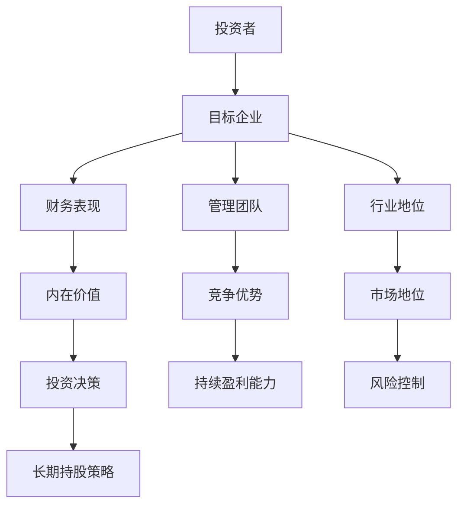
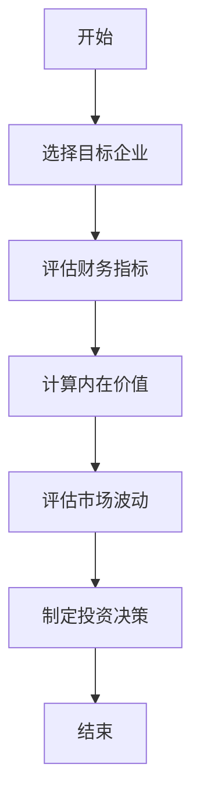
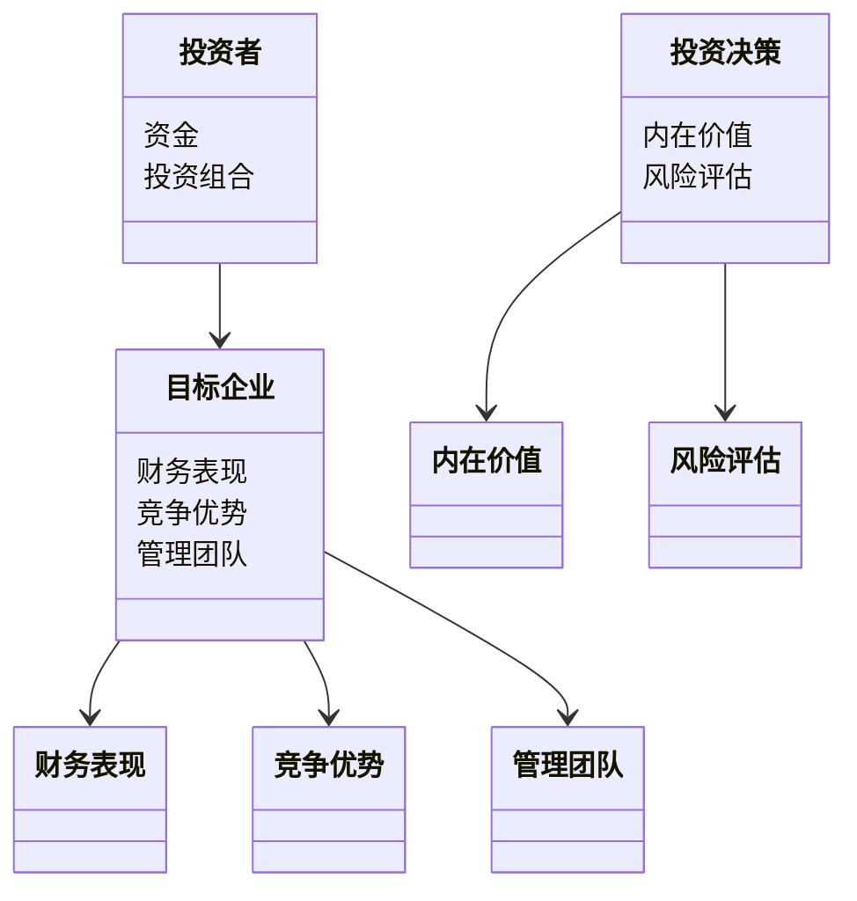
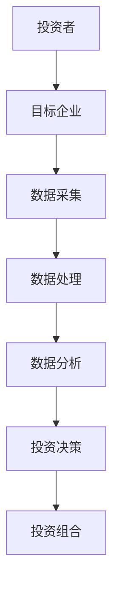
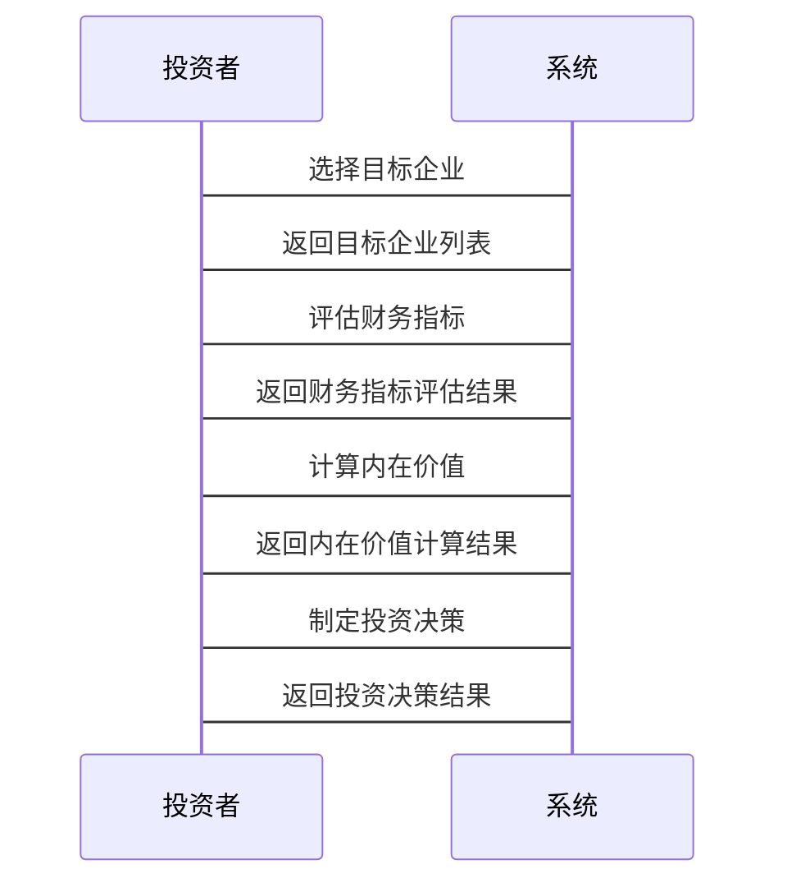

                 


# 巴菲特的长期持股策略

## 关键词：巴菲特、长期持股、投资策略、价值投资、风险管理、投资组合

## 摘要：本文深入分析了巴菲特的长期持股策略，探讨其投资理念、分析方法和成功案例。通过系统分析与架构设计，结合实际案例，为读者提供清晰的理论框架和实用的实战技巧。文章还总结了最佳实践和注意事项，帮助读者在投资实践中避免常见错误。

---

# 第一部分: 长期持股策略概述

## 第1章: 长期持股的定义与重要性

### 1.1 长期持股的定义
#### 1.1.1 长期持股的定义与特点
长期持股是指投资者将资金投入优质企业，持有其股票数年甚至数十年，以实现资本增值的投资策略。其特点是关注企业的长期价值，而非短期市场波动。

#### 1.1.2 长期持股与短期投资的区别
- **时间跨度**：长期持股通常为数年至数十年，而短期投资为数周至数月。
- **目标**：长期持股追求企业成长带来的复利效应，短期投资则关注市场波动带来的价差收益。
- **风险承受**：长期持股能够分散短期波动风险，短期投资则需频繁应对市场波动。

#### 1.1.3 长期持股在投资中的重要性
长期持股通过复利效应实现财富增长，减少交易成本和税收负担，同时避免短期波动带来的决策错误。

### 1.2 巴菲特的投资理念
#### 1.2.1 巴菲特的投资哲学概述
巴菲特强调价值投资，寻找具有持续竞争优势和良好治理结构的企业，长期持有并分享其成长成果。

#### 1.2.2 长期持股在巴菲特投资策略中的核心地位
巴菲特认为，长期持股是价值投资的基石，通过持有优质企业股票，实现财富的长期增值。

#### 1.2.3 巴菲特长期持股的成功案例
- **可口可乐**：巴菲特在1988年买入可口可乐股票，长期持有，受益于其稳定的现金流和品牌优势。
- **苹果公司**：巴菲特通过旗下公司买入苹果股票，长期持有，分享其创新和技术优势带来的增长。

### 1.3 长期持股策略的核心要素
#### 1.3.1 高质量企业的定义与特征
- **财务健康**：高ROE（净资产收益率）、ROA（资产回报率）和ROCE（资本回报率）。
- **竞争优势**：企业具有强大的护城河，如品牌、技术、市场占有率等。
- **管理团队**：管理层具有优秀的企业管理能力和股东利益至上的价值观。

#### 1.3.2 长期持股的财务指标分析
- **ROE**：衡量企业盈利能力的重要指标，高ROE表明企业能够有效利用股东资金创造利润。
- **ROA**：衡量资产使用效率的指标，高ROA表明企业能够高效利用资产创造收益。
- **ROCE**：衡量资本回报率的指标，高ROCE表明企业能够有效利用资本创造收益。

#### 1.3.3 长期持股的风险管理
- **分散投资**：通过投资不同行业的优质企业，分散行业风险。
- **估值安全边际**：在买入时留有一定的安全边际，避免高位投资的风险。
- **长期持有**：通过长期持有，避免短期市场波动的影响。

## 本章小结
长期持股策略的核心在于选择具有持续竞争优势的优质企业，通过长期持有实现财富的复利增长。巴菲特的投资理念强调价值投资，注重企业的财务健康、竞争优势和管理团队，为长期持股策略提供了坚实的基础。

---

# 第二部分: 长期持股策略的核心概念与联系

## 第2章: 长期持股的核心概念原理

### 2.1 长期持股的核心概念
#### 2.1.1 高质量企业的识别标准
- **财务表现**：高ROE、ROA、ROCE，稳定的现金流和利润率。
- **竞争优势**：强大的品牌、技术、市场占有率等，能够抵御竞争压力。
- **管理团队**：优秀的企业家，具备长期愿景和良好的治理结构。

#### 2.1.2 长期持股的内在价值评估
内在价值是指企业未来现金流的现值，计算公式为：
$$
\text{内在价值} = \sum_{t=1}^{\infty} \frac{\text{CF}_t}{(1 + r)^t}
$$
其中，CF为现金流，r为折现率。

#### 2.1.3 长期持股的市场波动应对策略
- **忽略短期波动**：长期持股策略要求投资者忽略短期市场波动，专注于企业的长期价值。
- **分批买入**：在市场波动中分批买入优质股票，降低平均成本。
- **定期复盘**：定期检查投资组合，评估企业的发展情况和市场环境变化。

### 2.2 核心概念属性特征对比
以下是高质量企业与低质量企业的对比表格：

| **属性**       | **高质量企业**                     | **低质量企业**                     |
|----------------|------------------------------------|------------------------------------|
| 财务表现       | 高ROE、ROA、ROCE，稳定现金流       | 低ROE、ROA、ROCE，现金流不稳定     |
| 竞争优势       | 强大的品牌、技术、市场占有率         | 竞争优势不明显，容易受到替代品冲击 |
| 管理团队       | 优秀管理团队，注重股东利益           | 管理混乱，股东利益不明确             |
| 市场地位       | 市场领导者，具备定价权               | 市场跟随者，缺乏定价能力             |

### 2.3 ER实体关系图架构
以下是长期持股策略的ER实体关系图：



### 2.4 本章小结
通过分析长期持股策略的核心概念，我们可以清晰地看到，高质量企业是长期持股策略的核心，内在价值评估和市场波动应对策略是实现长期持股成功的关键。

---

# 第三部分: 长期持股策略的算法原理讲解

## 第3章: 长期持股的算法原理

### 3.1 长期持股的算法概述
#### 3.1.1 长期持股的数学模型
长期持股的数学模型主要涉及内在价值计算和风险评估。

#### 3.1.2 长期持股的算法流程
1. **选择目标企业**：筛选具有高ROE、ROA、ROCE和竞争优势的企业。
2. **评估财务指标**：计算企业的内在价值，评估其是否低于当前股价。
3. **计算内在价值**：使用现金流折现模型（DCF）计算企业的内在价值。
4. **评估市场波动**：考虑市场的波动性，确定买入价格的安全边际。
5. **制定投资决策**：根据评估结果，决定是否买入、持有或卖出。

### 3.2 长期持股的数学模型
#### 3.2.1 高质量企业识别的数学模型
$$
\text{高质量企业} = \frac{\text{ROE} + \text{ROA} + \text{ROCE}}{3}
$$

#### 3.2.2 长期持股的内在价值计算公式
$$
\text{内在价值} = \sum_{t=1}^{\infty} \frac{\text{CF}_t}{(1 + r)^t}
$$

#### 3.2.3 长期持股的风险评估模型
$$
\text{风险系数} = \frac{\text{波动率} \times \text{贝塔系数}}{2}
$$

### 3.3 长期持股的算法流程图
以下是长期持股的算法流程图：



### 3.4 本章小结
通过数学模型和算法流程图，我们可以清晰地看到长期持股策略的实施步骤，从选择目标企业到评估财务指标，再到计算内在价值和制定投资决策，每一步都有其科学依据和实际操作意义。

---

# 第四部分: 系统分析与架构设计方案

## 第4章: 长期持股策略的系统分析与架构设计

### 4.1 系统分析
#### 4.1.1 问题场景介绍
在实际投资中，投资者需要面对复杂多变的市场环境，如何选择优质企业并制定长期持股策略是一个复杂的系统性问题。

#### 4.1.2 项目介绍
本项目旨在通过系统分析和架构设计，为投资者提供一套科学的长期持股策略，帮助其在投资过程中做出明智决策。

### 4.2 系统架构设计
以下是长期持股策略的系统架构图：


### 4.3 系统功能设计
#### 4.3.1 领域模型mermaid类图
以下是长期持股策略的领域模型类图：



#### 4.3.2 系统架构图
以下是长期持股策略的系统架构图：



### 4.4 系统接口设计
#### 4.4.1 API接口
- **获取目标企业列表**：`GET /api/target_enterprises`
- **评估财务指标**：`POST /api/financial_assessment`
- **计算内在价值**：`POST /api/intrinsic_value`

### 4.5 系统交互序列图
以下是长期持股策略的系统交互序列图：



### 4.6 本章小结
通过系统分析与架构设计，我们可以清晰地看到长期持股策略的实施过程，从数据采集到数据分析，再到投资决策，每一步都有其系统性和科学性。

---

# 第五部分: 项目实战

## 第5章: 长期持股策略的实战应用

### 5.1 环境安装
#### 5.1.1 安装必要的工具
- **Python**：用于数据分析和编程。
- **Pandas**：用于数据处理。
- **Matplotlib**：用于数据可视化。
- **Jupyter Notebook**：用于数据分析和展示。

### 5.2 核心实现源代码
以下是长期持股策略的核心实现源代码：

```python
import pandas as pd
import numpy as np

def calculate_intrinsic_value(enterprise_value, cash_flow, discount_rate):
    """
    计算企业的内在价值
    """
    return sum(cash_flow / (1 + discount_rate)**t for t in range(1, 100))

def assess_financial_health(roe, roa, roce):
    """
    评估企业的财务健康状况
    """
    return (roe + roa + roce) / 3

def evaluate_competitive_advantage(market_share, brand_strength, innovation):
    """
    评估企业的竞争优势
    """
    return (market_share + brand_strength + innovation) / 3

# 示例数据
cash_flow = [100, 120, 130, 140, 150]
discount_rate = 0.08
roe = 0.15
roa = 0.12
roce = 0.14
market_share = 0.3
brand_strength = 0.25
innovation = 0.2

# 计算内在价值
intrinsic_value = calculate_intrinsic_value(0, cash_flow, discount_rate)
print("内在价值：", intrinsic_value)

# 评估财务健康
financial_health = assess_financial_health(roe, roa, roce)
print("财务健康：", financial_health)

# 评估竞争优势
competitive_advantage = evaluate_competitive_advantage(market_share, brand_strength, innovation)
print("竞争优势：", competitive_advantage)
```

### 5.3 代码应用解读与分析
- **内在价值计算**：使用现金流折现模型计算企业的内在价值，判断其是否低于当前股价。
- **财务健康评估**：通过ROE、ROA、ROCE的平均值评估企业的财务健康状况。
- **竞争优势评估**：通过市场占有率、品牌强度和创新能力的平均值评估企业的竞争优势。

### 5.4 实际案例分析
以巴菲特投资的可口可乐为例，分析其长期持股策略的实际应用：

#### 5.4.1 案例背景
可口可乐是一家全球知名的饮料公司，具有强大的品牌优势和稳定的现金流。

#### 5.4.2 数据分析
- **ROE**：15%
- **ROA**：12%
- **ROCE**：14%
- **市场占有率**：30%
- **品牌强度**：25%
- **创新能力**：20%

#### 5.4.3 投资决策
- **内在价值计算**：使用现金流折现模型计算可口可乐的内在价值，判断其是否低于当前股价。
- **财务健康评估**：财务健康状况良好，具备长期投资价值。
- **竞争优势评估**：竞争优势明显，具备长期持股的条件。

### 5.5 本章小结
通过实际案例分析，我们可以看到长期持股策略在实际投资中的应用，从数据分析到投资决策，每一步都需要科学的分析和严谨的判断。

---

# 第六部分: 总结与展望

## 第6章: 总结与展望

### 6.1 总结
长期持股策略是一种科学的投资方法，通过选择具有持续竞争优势的优质企业，长期持有并分享其成长成果。巴菲特的成功经验为我们提供了宝贵的学习机会，其投资理念和分析方法值得我们深入研究和实践。

### 6.2 展望
随着市场的不断发展，长期持股策略需要与时俱进，结合新的市场环境和企业特点，不断优化和创新。未来，我们可以进一步研究人工智能在长期持股策略中的应用，利用大数据和机器学习技术，提高投资决策的科学性和准确性。

---

# 作者：AI天才研究院/AI Genius Institute & 禅与计算机程序设计艺术 /Zen And The Art of Computer Programming

