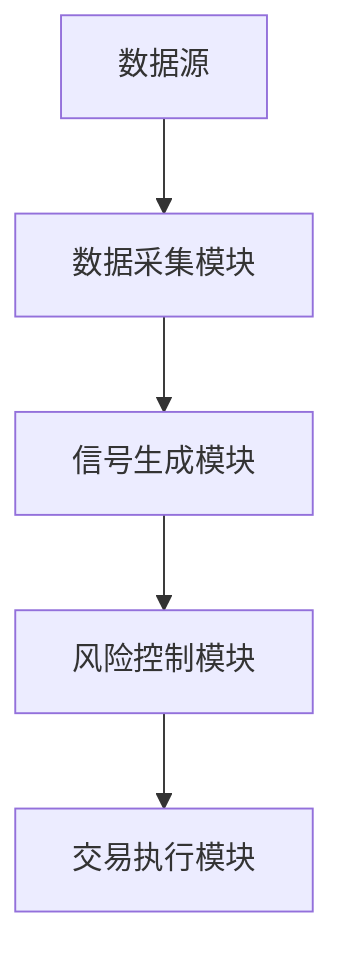

                 


# 市场中性策略：降低系统性风险的投资方法

## 关键词：
市场中性策略、系统性风险、投资方法、配对交易、统计套利、多因子模型、风险控制

## 摘要：
市场中性策略是一种通过同时做多和做空相关资产来降低系统性风险的投资方法。本文将深入分析市场中性策略的核心原理、数学模型、系统架构及实际应用，帮助读者理解如何在复杂市场环境中实现稳定收益。

---

## 第一章: 市场中性策略概述

### 1.1 什么是市场中性策略
市场中性策略是一种投资策略，旨在通过做多和做空相关资产，使投资组合的收益与市场整体波动脱钩。其核心思想是通过构建对冲组合，降低系统性风险，追求绝对收益。

#### 1.1.1 核心概念
- **做多**：买入资产，预期其价格上涨。
- **做空**：借入资产卖出，预期其价格下跌。
- **对冲**：通过相反头寸抵消市场风险。

#### 1.1.2 主要方法
1. **配对交易**：同时买入和卖出相关资产，利用价差获利。
2. **统计套利**：利用资产价格短期偏离均值的机会进行交易。
3. **多因子模型**：基于多个因子构建投资组合，降低单一因子风险。

### 1.2 市场中性策略的背景与意义
随着金融市场波动加剧，传统投资策略面临系统性风险上升的挑战。市场中性策略通过降低对市场整体波动的依赖，为投资者提供了更稳定的投资选择。

#### 1.2.1 系统性风险的来源
1. **市场波动**：整体市场下跌导致资产价格普跌。
2. **宏观经济因素**：经济衰退、政策变化等对市场的影响。
3. **流动性风险**：市场流动性不足导致价格大幅波动。

#### 1.2.2 市场中性策略的作用
- 降低投资组合的波动性。
- 减少对市场趋势的依赖。
- 实现风险可控下的绝对收益。

### 1.3 市场中性策略的主要方法

#### 1.3.1 配对交易
配对交易通过同时买入和卖出相关资产，利用两者的价差获利。例如，买入一只股票的同时卖出其竞争对手股票。

#### 1.3.2 统计套利
统计套利利用资产价格短期偏离均值的机会进行交易。例如，当两只股票的价格偏离历史平均值时，进行对冲交易。

#### 1.3.3 多因子模型
多因子模型通过多个因子（如市值、价值、动量等）构建投资组合，降低单一因子风险。

---

## 第二章: 市场中性策略的数学模型

### 2.1 均值回归模型
均值回归模型假设资产价格会回归其历史均值。公式为：
$$ r_t = \alpha + \beta r_{t-1} + \epsilon_t $$
其中，$\alpha$为截距，$\beta$为回归系数，$\epsilon_t$为误差项。

### 2.2 配对交易模型
配对交易模型通过计算两只股票的价差，判断是否偏离均值。公式为：
$$ d_t = (p_t - p_{t-1}) - (q_t - q_{t-1}) $$

### 2.3 统计套利模型
统计套利模型通过计算资产价格的短期偏离，判断交易机会。公式为：
$$ \text{Spread}_t = \frac{p_t}{q_t} $$

### 2.4 算法实现
以下是配对交易算法的Python代码示例：
```python
import pandas as pd
import numpy as np

def calculate_spread(asset1, asset2):
    spread = pd.DataFrame({'Spread': asset1 / asset2})
    return spread

def generate_signals(spread, threshold=0.05):
    signals = pd.Series(0, index=spread.index, dtype='int')
    signals[spread['Spread'] > (1 + threshold)] = -1
    signals[spread['Spread'] < (1 - threshold)] = 1
    return signals
```

---

## 第三章: 市场中性策略的系统分析与架构设计

### 3.1 系统架构概述
市场中性策略的系统架构包括数据采集、信号生成、风险控制和交易执行四个模块。

#### 3.1.1 数据采集模块
- 从多个数据源获取实时或历史数据。
- 数据清洗和预处理。

#### 3.1.2 信号生成模块
- 计算价差、均值回归等指标。
- 生成买卖信号。

#### 3.1.3 风险控制模块
- 设置最大头寸和杠杆限制。
- 动态调整头寸以控制风险。

#### 3.1.4 交易执行模块
- 根据信号执行交易。
- 记录交易日志。

### 3.2 系统架构图


---

## 第四章: 项目实战

### 4.1 环境安装
- 安装Python和相关库（pandas、numpy、matplotlib）。

### 4.2 核心实现代码
```python
import pandas as pd
import numpy as np

def calculate_spread(asset1, asset2):
    return asset1 / asset2

def generate_signals(spread, threshold=0.05):
    signals = pd.Series(0, index=spread.index, dtype='int')
    signals[spread > (1 + threshold)] = -1
    signals[spread < (1 - threshold)] = 1
    return signals
```

### 4.3 实际案例分析
以两只股票为例，计算价差并生成交易信号。

---

## 第五章: 结论

### 5.1 总结
市场中性策略通过构建对冲组合，有效降低了系统性风险。其核心在于合理配置多空头寸，利用均值回归和统计套利等方法实现稳定收益。

### 5.2 未来展望
随着人工智能和大数据技术的发展，市场中性策略将更加精准和高效。投资者需结合技术进步，优化策略模型，应对复杂市场环境。

### 5.3 注意事项
- 严格控制杠杆和头寸。
- 定期监控和调整策略参数。
- 风险提示：市场中性策略并不能完全消除风险，需谨慎操作。

---

## 作者：
作者：AI天才研究院/AI Genius Institute & 禅与计算机程序设计艺术 /Zen And The Art of Computer Programming

