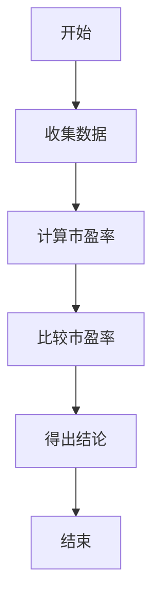
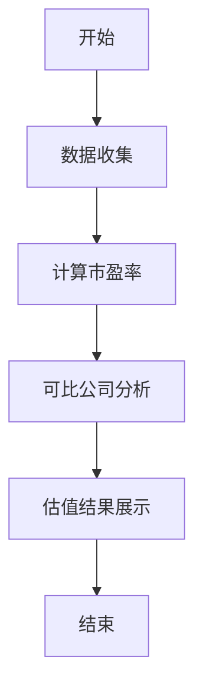

                 


# 市盈率法在企业估值中的应用

## 关键词：市盈率法, 企业估值, 财务分析, 估值模型, 股市投资

## 摘要：市盈率法是一种常用的财务分析方法，用于评估企业的内在价值。本文详细探讨了市盈率法的核心概念、数学模型、算法原理及其在实际企业估值中的应用。通过对比分析、系统设计和项目实战，帮助读者全面理解并掌握市盈率法的应用技巧。

---

# 第1章: 市盈率法的基本概念与应用背景

## 1.1 企业估值的基本概念
### 1.1.1 企业估值的定义与意义
企业估值是指通过对企业的财务状况、市场表现和未来盈利能力进行分析，确定其在市场上的合理价值。企业估值是投资决策的重要依据，能够帮助投资者评估企业的潜在价值和风险。

### 1.1.2 企业估值的核心要素
企业估值的核心要素包括企业的财务状况（收入、利润、资产）、市场环境、行业竞争状况、管理团队等因素。这些要素共同影响企业的市场价值。

### 1.1.3 市盈率法的定义与特点
市盈率法是一种基于市盈率（P/E）的企业估值方法。市盈率是股价与每股收益的比值，反映了市场对企业盈利能力的预期。市盈率法简单易用，但也有一定的局限性。

## 1.2 市盈率法的背景与应用领域
### 1.2.1 市盈率法的历史发展
市盈率法起源于20世纪初，随着金融市场的不断发展，市盈率法逐渐成为企业估值的重要工具之一。

### 1.2.2 市盈率法在企业估值中的应用领域
市盈率法广泛应用于股票投资、企业并购、上市定价等领域。它特别适用于那些盈利稳定、具有可比性的企业。

### 1.2.3 市盈率法与其他估值方法的对比
市盈率法与市净率法、现金流折现法等方法相比，具有计算简单、易于理解的特点，但其准确性依赖于企业盈利的稳定性。

## 1.3 市盈率法的核心原理
### 1.3.1 市盈率法的基本原理
市盈率法通过比较企业的市盈率与行业平均水平或可比公司的市盈率，评估企业的相对价值。

### 1.3.2 市盈率法的数学模型
市盈率法的数学模型为：
$$
\text{市盈率} = \frac{\text{股价}}{\text{每股收益}}
$$

### 1.3.3 市盈率法的适用条件与限制
市盈率法适用于盈利稳定的企业，但不适用于亏损企业或周期性波动较大的行业。

---

# 第2章: 市盈率法的理论基础

## 2.1 市盈率法的理论基础
### 2.1.1 股价与收益的关系
股价与收益呈正相关关系，收益越高，股价可能越高。

### 2.1.2 市盈率的计算公式
市盈率（P/E）的计算公式为：
$$
P/E = \frac{\text{股价}}{\text{每股收益}}
$$

### 2.1.3 市盈率的分类与特点
市盈率可以分为静态市盈率和动态市盈率，静态市盈率基于历史收益，动态市盈率基于预期收益。

## 2.2 市盈率法的数学模型
### 2.2.1 市盈率的计算公式
如前所述，市盈率的计算公式为：
$$
P/E = \frac{\text{股价}}{\text{每股收益}}
$$

### 2.2.2 市盈率与企业价值的关系
市盈率反映了市场对企业未来盈利能力的预期，市盈率越低，可能意味着企业价值被低估。

### 2.2.3 市盈率法的数学推导
通过市盈率法，可以推导出企业的目标股价：
$$
\text{目标股价} = \text{市盈率} \times \text{每股收益}
$$

## 2.3 市盈率法的适用范围与限制
### 2.3.1 市盈率法的适用范围
适用于盈利稳定、具有可比性的企业。

### 2.3.2 市盈率法的局限性
不适用于亏损企业或周期性波动较大的行业。

### 2.3.3 市盈率法的改进方向
结合其他估值方法，如现金流折现法，提高估值的准确性。

---

# 第3章: 市盈率法的核心概念与联系

## 3.1 市盈率法的核心概念
### 3.1.1 市盈率法的定义与属性
市盈率法是一种基于市盈率的企业估值方法，具有简单、直观的特点。

### 3.1.2 市盈率法的核心要素
市盈率法的核心要素包括股价、每股收益、市盈率和可比公司分析。

### 3.1.3 市盈率法的逻辑结构
市盈率法的逻辑结构包括确定可比公司、计算可比公司平均市盈率、计算目标企业价值。

## 3.2 市盈率法与相关概念的对比
### 3.2.1 市盈率法与市净率法的对比
市盈率法基于收益，市净率法基于资产，两者各有优缺点。

### 3.2.2 市盈率法与现金流折现法的对比
市盈率法简单易用，现金流折现法更为准确但计算复杂。

### 3.2.3 市盈率法与股息折现法的对比
市盈率法基于收益，股息折现法基于股息支付能力。

## 3.3 市盈率法的ER实体关系图
```mermaid
erDiagram
    actor 投资者 {
        <属性>
        股价
        每股收益
        市盈率
    }
    actor 可比公司 {
        <属性>
        股价
        每股收益
        市盈率
    }
    actor 估值结果 {
        <属性>
        目标股价
        企业价值
    }
    投资者 --> 可比公司 : 收集数据
    投资者 --> 估值结果 : 计算结果
```

---

# 第4章: 市盈率法的算法原理与数学模型

## 4.1 市盈率法的算法原理
### 4.1.1 算法步骤
1. 收集目标企业和可比公司的财务数据。
2. 计算目标企业的市盈率和可比公司的市盈率。
3. 比较目标企业的市盈率与行业平均水平，得出估值结果。

### 4.1.2 算法流程图


## 4.2 市盈率法的数学模型
### 4.2.1 市盈率计算公式
$$
P/E = \frac{\text{股价}}{\text{每股收益}}
$$

### 4.2.2 目标股价计算公式
$$
\text{目标股价} = \text{市盈率} \times \text{每股收益}
$$

### 4.2.3 企业价值计算公式
$$
\text{企业价值} = \text{市盈率} \times \text{每股收益} \times \text{总股本}
$$

---

# 第5章: 系统分析与架构设计方案

## 5.1 系统功能设计
### 5.1.1 系统功能模块
- 数据收集模块
- 市盈率计算模块
- 可比公司分析模块
- 估值结果展示模块

### 5.1.2 系统功能流程图


## 5.2 系统架构设计
### 5.2.1 系统架构图


---

# 第6章: 项目实战

## 6.1 项目环境安装
### 6.1.1 环境要求
- Python 3.8+
- Jupyter Notebook

## 6.2 系统核心实现源代码
### 6.2.1 数据收集
```python
import pandas as pd
import requests

def get_data(symbol):
    url = f"https://api.example.com/stock/{symbol}"
    response = requests.get(url)
    data = response.json()
    return pd.DataFrame(data)
```

### 6.2.2 市盈率计算
```python
def calculate_pe_ratio(data):
    pe_ratio = data['股价'] / data['每股收益']
    return pe_ratio
```

### 6.2.3 可比公司分析
```python
def comparable_analysis(pe_ratio, industry_pe):
    if pe_ratio < industry_pe:
        return "低估"
    elif pe_ratio == industry_pe:
        return "合理"
    else:
        return "高估"
```

## 6.3 实际案例分析
### 6.3.1 苹果公司估值案例
1. 收集苹果公司和行业可比公司的财务数据。
2. 计算苹果公司的市盈率。
3. 比较苹果公司的市盈率与行业平均水平，得出估值结论。

---

# 第7章: 总结与展望

## 7.1 总结
市盈率法是一种简单易用的企业估值方法，适用于盈利稳定的企业。通过本文的介绍，读者可以全面理解市盈率法的核心概念、算法原理和实际应用。

## 7.2 注意事项
- 市盈率法的准确性依赖于企业的盈利能力和市场环境。
- 在实际应用中，应结合其他估值方法提高准确性。

## 7.3 拓展阅读
- 《企业价值评估》
- 《股票投资实战技巧》

---

作者：AI天才研究院 & 禅与计算机程序设计艺术

