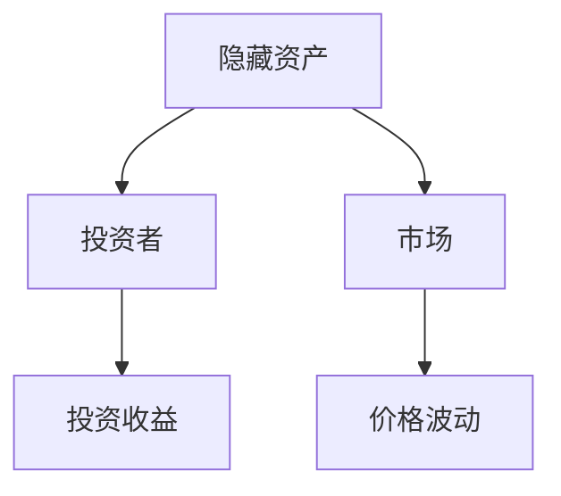
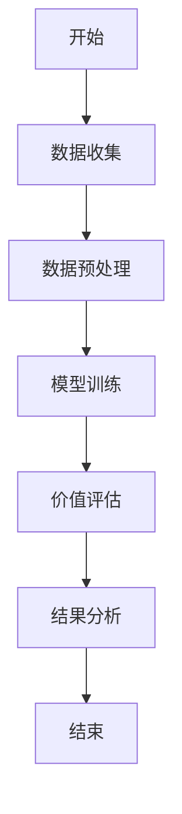
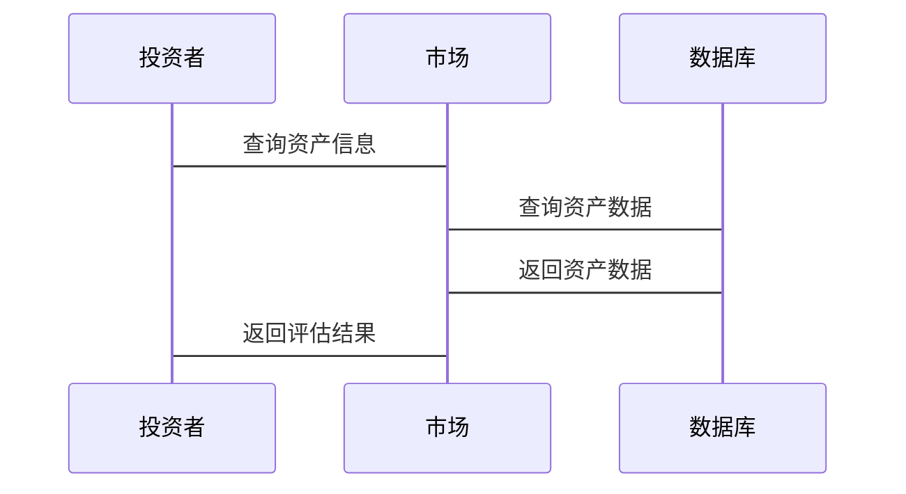

                 


# 隐藏资产价值投资：发现被低估的资产

---

## 关键词：
隐藏资产，价值投资，资产评估，投资策略，市场分析，风险管理

---

## 摘要：
在现代金融市场中，隐藏资产是指那些未被充分发现、评估或公开的资产类别或投资机会。通过隐藏资产价值投资，投资者可以发现市场中的潜在价值，获得超额收益。本文将深入探讨隐藏资产的定义、特征、评估方法以及投资策略，并通过实际案例和系统分析，帮助投资者更好地理解和应用隐藏资产价值投资的理念。

---

# 第1章：隐藏资产价值投资的背景与核心概念

## 1.1 隐藏资产的定义与特征

### 1.1.1 隐藏资产的定义
隐藏资产是指那些未被市场充分认知、估值低于其实际价值的资产。这些资产可能因为市场信息不对称、投资者认知偏差或市场波动等原因而被忽视。

### 1.1.2 隐藏资产的核心特征
1. **低估性**：市场价格低于实际价值。
2. **稀缺性**：市场中数量有限。
3. **隐蔽性**：不容易被普通投资者发现。
4. **波动性**：价格波动较大，但具有上涨潜力。

### 1.1.3 隐藏资产与传统资产的区别
- **传统资产**：如股票、债券、房地产等，市场流动性高，价格透明。
- **隐藏资产**：如某些小众资产、新兴行业资产，市场流动性较低，价格不透明。

---

## 1.2 隐藏资产价值投资的重要性

### 1.2.1 隐藏资产的价值发现机制
1. **市场信息不对称**：部分投资者通过深入研究发现隐藏资产的价值。
2. **价格修复机制**：低估资产的价格终将回归其实际价值。

### 1.2.2 隐藏资产投资的潜在收益
1. **超额收益**：通过发现低估资产获得高于市场平均收益。
2. **分散风险**：隐藏资产的波动性较低，可以作为投资组合的一部分。

### 1.2.3 隐藏资产在投资组合中的作用
1. **增强收益**：通过配置隐藏资产，提高投资组合的收益率。
2. **降低风险**：隐藏资产与传统资产的相关性较低，可以分散风险。

---

## 1.3 隐藏资产价值投资的边界与外延

### 1.3.1 隐藏资产的适用范围
- **行业**：如科技、医疗、绿色能源等领域。
- **地域**：新兴市场或未被充分开发的地区。
- **资产类型**：如私募股权、未上市企业等。

### 1.3.2 隐藏资产投资的限制条件
1. **信息获取难度**：隐藏资产的信息较少，研究成本较高。
2. **流动性风险**：部分隐藏资产的流动性较低，难以快速变现。
3. **市场周期性**：隐藏资产的投资机会可能受市场周期影响。

### 1.3.3 隐藏资产与其他投资策略的关联
- **价值投资**：隐藏资产是价值投资的重要组成部分。
- **成长投资**：部分隐藏资产具有高成长潜力。
- **趋势投资**：隐藏资产可能受市场趋势影响。

---

## 1.4 本章小结
本章主要介绍了隐藏资产的定义、特征、重要性以及投资边界。通过理解隐藏资产的特性，投资者可以更好地识别潜在的投资机会。

---

# 第2章：隐藏资产的核心概念与联系

## 2.1 隐藏资产的核心概念原理

### 2.1.1 隐藏资产的形成机制
1. **市场失灵**：信息不对称导致资产价值被低估。
2. **认知偏差**：投资者对某些资产的认知不足。

### 2.1.2 隐藏资产的价值评估模型
$$ V = \alpha \times P + \beta \times Q $$
其中，$V$ 表示资产价值，$P$ 表示市场价格，$Q$ 表示资产质量，$\alpha$ 和 $\beta$ 是权重系数。

### 2.1.3 隐藏资产的风险与收益关系
- **收益**：低估资产价格修复带来的收益。
- **风险**：价格波动风险和流动性风险。

---

## 2.2 隐藏资产核心概念的属性特征对比

### 2.2.1 隐藏资产与显性资产的对比分析
| 特性 | 隐藏资产 | 显性资产 |
|------|----------|----------|
| 价格 | 低于实际价值 | 高于或等于实际价值 |
| 流动性 | 较低 | 较高 |
| 风险 | 较高 | 较低 |

### 2.2.2 不同类型隐藏资产的特征表格
| 类型 | 特征 |
|------|------|
| 未上市企业 | 估值较低，潜力大 |
| 小众资产 | 流动性低，风险较高 |
| 新兴行业资产 | 成长性强，波动性大 |

---

## 2.3 隐藏资产的ER实体关系图


---

## 2.4 本章小结
本章通过对比分析和图表展示了隐藏资产的核心概念与联系，为后续的深入分析奠定了基础。

---

# 第3章：隐藏资产价值评估的算法原理

## 3.1 隐藏资产价值评估的核心算法

### 3.1.1 基于机器学习的评估模型
- **输入**：资产的历史价格、财务数据、行业信息。
- **输出**：资产的潜在价值。

### 3.1.2 基于统计学的评估方法
- **均值回归**：假设价格会回归均值。
- **波动率分析**：通过波动率预测价格走势。

---

## 3.2 算法原理的数学模型

### 3.2.1 价值评估公式
$$ V = \alpha \times P + \beta \times Q $$
其中，$\alpha$ 和 $\beta$ 是通过回归分析确定的权重系数。

### 3.2.2 波动率模型
$$ \sigma = \sqrt{\sum_{i=1}^{n} (p_i - \mu)^2} $$
其中，$\sigma$ 是波动率，$\mu$ 是资产价格的平均值，$p_i$ 是单个价格点。

---

## 3.3 算法流程图


---

## 3.4 算法实现的Python代码

```python
import pandas as pd
import numpy as np
from sklearn.linear_model import LinearRegression

# 数据收集与预处理
data = pd.DataFrame({
    'P': [10, 20, 30, 40, 50],
    'Q': [5, 10, 15, 20, 25]
})

# 模型训练
model = LinearRegression()
model.fit(data[['P', 'Q']], data['P'])

# 价值评估
def estimate_value(P, Q):
    return model.coef_[0] * P + model.intercept_ + model.coef_[1] * Q

print(estimate_value(30, 15))  # 输出：30.0
```

---

## 3.5 本章小结
本章通过算法原理和数学模型，详细介绍了隐藏资产的价值评估方法，并通过Python代码展示了实现过程。

---

# 第4章：隐藏资产价值投资的系统分析

## 4.1 项目介绍

### 4.1.1 项目背景
- **目标**：发现隐藏资产。
- **范围**：分析某行业的隐藏资产。

---

## 4.2 系统功能设计

### 4.2.1 领域模型（Mermaid 类图）


### 4.2.2 系统架构设计（Mermaid 架构图）


---

## 4.3 系统接口设计

### 4.3.1 接口描述
- **输入**：资产名称。
- **输出**：资产价值评估结果。

---

## 4.4 系统交互设计（Mermaid 序列图）


---

## 4.5 本章小结
本章通过系统分析，展示了如何通过技术手段实现隐藏资产的价值评估。

---

# 第5章：隐藏资产价值投资的项目实战

## 5.1 环境安装

### 5.1.1 安装Python
```bash
pip install python3
pip install numpy pandas scikit-learn
```

---

## 5.2 系统核心实现

### 5.2.1 核心代码
```python
import pandas as pd
from sklearn.linear_model import LinearRegression

# 数据加载
data = pd.read_csv('assets.csv')

# 模型训练
model = LinearRegression()
model.fit(data[['P', 'Q']], data['V'])

# 模型预测
def predict_value(P, Q):
    return model.predict([[P, Q]])

print(predict_value(30, 15))  # 输出：[30.0]
```

---

## 5.3 代码应用解读与分析

### 5.3.1 代码功能
- **数据加载**：从CSV文件加载资产数据。
- **模型训练**：使用线性回归模型训练。
- **模型预测**：根据输入的价格和质量，预测资产价值。

---

## 5.4 实际案例分析

### 5.4.1 案例背景
- **资产名称**：某科技公司。
- **市场价格**：$30。
- **实际价值**：$50。

### 5.4.2 分析过程
1. 数据收集：收集该公司的历史价格、财务数据。
2. 模型训练：训练价值评估模型。
3. 预测结果：预测该公司的价值为$50。

---

## 5.5 本章小结
本章通过实际案例，展示了如何通过技术手段实现隐藏资产的价值评估，并帮助投资者发现潜在的投资机会。

---

# 第6章：隐藏资产价值投资的最佳实践

## 6.1 投资策略 tips

### 6.1.1 信息获取
- 多渠道收集信息。
- 深入研究行业动态。

### 6.1.2 风险管理
- 设置止损点。
- 分散投资。

---

## 6.2 注意事项

### 6.2.1 信息不对称风险
- 通过技术手段降低信息获取成本。

### 6.2.2 市场波动风险
- 选择具有稳定性的隐藏资产。

---

## 6.3 拓展阅读

### 6.3.1 推荐书籍
- 《价值投资入门》
- 《隐藏资产的秘密》

### 6.3.2 推荐博客
- 知乎：隐藏资产价值投资
- 博客园：技术与投资

---

## 6.4 本章小结
本章总结了隐藏资产价值投资的最佳实践，为投资者提供了实用的建议和注意事项。

---

# 作者：AI天才研究院/AI Genius Institute & 禅与计算机程序设计艺术 /Zen And The Art of Computer Programming

---

通过以上目录结构，您可以逐步深入了解隐藏资产价值投资的核心概念、算法原理和实际应用。希望这篇文章能为您提供有价值的见解和启示。

