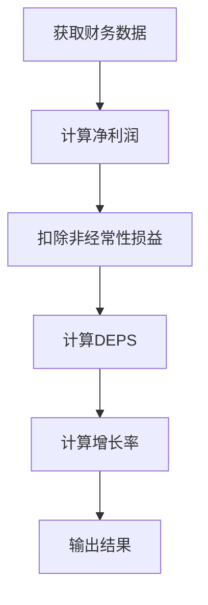
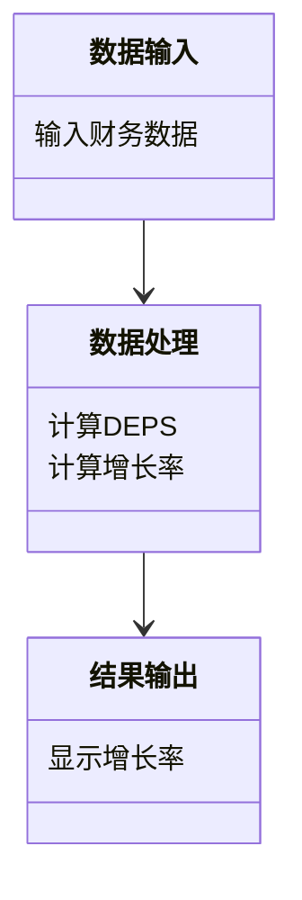

                 


# 10年扣非每股收益增长率的意义

> 关键词：扣非每股收益增长率、财务指标分析、投资决策支持、企业盈利能力、非经常性损益

> 摘要：本文深入探讨了扣非每股收益增长率这一关键财务指标的含义、计算方法及其在投资分析中的应用。通过分析其背后的意义，结合实际案例，帮助读者理解如何利用这一指标评估企业的长期盈利能力，从而做出更明智的投资决策。

---

## 第一部分: 扣非每股收益增长率的背景与意义

### 第1章: 问题背景与问题描述

#### 1.1 问题背景
在投资领域，评估企业的盈利能力是至关重要的一环。企业通过每股收益（EPS）向投资者展示其盈利能力，但这一指标可能会受到非经常性损益的影响，从而扭曲企业的实际经营状况。因此，扣除非经常性损益后的每股收益增长率（扣非EPS增长率）成为更准确的衡量工具。

#### 1.2 问题描述
- 每股收益（EPS）是衡量企业盈利能力的核心指标，但其波动性较大，容易受到一次性事件的影响。
- 非经常性损益（如出售资产收益或法律赔偿支出）会影响EPS的准确性，导致投资者难以准确评估企业的持续盈利能力。
- 投资者需要一个更稳定的指标来评估企业的长期盈利能力。

#### 1.3 解决方法
扣除非经常性损益后的每股收益增长率能够剔除一次性因素的影响，更准确地反映企业主营业务的盈利能力。

#### 1.4 边界与外延
- 数据范围：过去10年的财务数据。
- 行业限制：适用于所有上市公司，尤其是周期性较强或经常性损益波动较大的行业。
- 方法论：基于财务报表分析，结合定量分析和定性分析。

---

### 第2章: 扣非每股收益增长率的核心概念

#### 2.1 核心概念
- **扣非每股收益（Diluted Earnings Per Share, DEPS）**：在计算每股收益时，扣除非经常性损益后的净利润。
- **每股收益增长率（Growth Rate of DEPS）**：扣非每股收益在一定时间内的年均增长率。

#### 2.2 属性特征对比

| 指标名称          | 计算公式                                                                 | 特点                                                                 |
|-------------------|--------------------------------------------------------------------------|----------------------------------------------------------------------|
| 每股收益（EPS）    | （净利润 - 优先股股息） / 平均流通股数                                         | 受非经常性损益影响较大，可能扭曲企业实际盈利能力。                     |
| 扣非每股收益（DEPS）| （净利润 - 非经常性损益） / 平均流通股数                                       | 剔除非经常性损益的影响，反映企业主营业务的盈利能力。                   |
| 每股收益增长率    | [(DEPS_{t} - DEPS_{t-1}) / DEPS_{t-1}] * 100%                                  | 衡量企业主营业务盈利能力的长期增长趋势。                               |

#### 2.3 ER实体关系图（Mermaid）

```mermaid
erDiagram
    class 企业 {
        id
        名称
        行业
        市值
    }
    class 财务数据 {
        id
        年份
        净利润
        非经常性损益
        DEPS
        EPS
    }
    企业 --> 财务数据 : 具有
```

---

### 第3章: 扣非每股收益增长率的算法原理

#### 3.1 算法原理与流程

1. **计算净利润**：从公司财务报表中获取净利润。
2. **扣除非经常性损益**：从净利润中减去非经常性损益，得到扣非净利润。
3. **计算DEPS**：扣非净利润除以平均流通股数，得到扣非每股收益（DEPS）。
4. **计算每股收益增长率**：通过时间序列分析，计算DEPS的年均增长率。

#### 3.2 算法流程图（Mermaid）



#### 3.3 数学模型与公式

- **DEPS公式**：
  $$ DEPS = \frac{\text{扣非净利润}}{\text{平均流通股数}} $$

- **每股收益增长率公式**：
  $$ \text{增长率} = \frac{\text{DEPS}_t - \text{DEPS}_{t-1}}{\text{DEPS}_{t-1}} \times 100\% $$

---

## 第4章: 系统分析与架构设计

### 4.1 系统分析

#### 4.1.1 数据来源与处理
- 数据来源：公司财务报表（包括净利润、非经常性损益、流通股数等）。
- 数据处理：清洗、转换和计算DEPS及增长率。

#### 4.1.2 系统功能设计
- 数据输入：读取财务数据。
- 数据处理：计算DEPS和增长率。
- 结果输出：展示增长率。

#### 4.1.3 领域模型类图（Mermaid）



### 4.2 系统架构设计

#### 4.2.1 系统架构图（Mermaid）


---

## 第5章: 项目实战

### 5.1 环境安装

- **工具**：Python（版本3.8及以上）、Pandas、Matplotlib。
- **安装命令**：
  ```bash
  pip install pandas matplotlib
  ```

### 5.2 核心代码实现

#### 5.2.1 计算DEPS

```python
import pandas as pd

# 假设df为包含财务数据的DataFrame，包含列"净利润"和"非经常性损益"
df['扣非净利润'] = df['净利润'] - df['非经常性损益']
df['平均流通股数'] = df['总股本'].mean()
df['DEPS'] = df['扣非净利润'] / df['平均流通股数']
```

#### 5.2.2 计算增长率

```python
import numpy as np

# 假设df按年份排序
df['DEPS增长率'] = df['DEPS'].pct_change() * 100
```

### 5.3 案例分析

假设某公司过去10年的财务数据如下：

| 年份 | 净利润 | 非经常性损益 | 流通股数 |
|------|--------|--------------|----------|
| 2013 | 100    | 20           | 100      |
| 2014 | 120    | 10           | 100      |
| 2015 | 110    | -5           | 100      |
| ...  | ...     | ...          | ...      |

计算DEPS：

$$ DEPS = \frac{\text{净利润} - \text{非经常性损益}}{\text{流通股数}} $$

计算DEPS增长率：

$$ \text{DEPS增长率} = \frac{\text{DEPS}_t - \text{DEPS}_{t-1}}{\text{DEPS}_{t-1}} \times 100\% $$

---

## 第6章: 总结与展望

### 6.1 总结

扣非每股收益增长率是一个重要的财务指标，能够帮助投资者更准确地评估企业的长期盈利能力。通过扣除非经常性损益的影响，这一指标更能反映企业主营业务的持续增长能力。

### 6.2 注意事项

- 数据质量：确保财务数据的准确性和完整性。
- 时间跨度：选择足够长的时间跨度（如10年）以观察长期趋势。
- 行业差异：不同行业的非经常性损益可能有不同的影响。

### 6.3 未来研究方向

- 结合其他财务指标（如ROE、ROA）进行综合分析。
- 开发自动化工具，实现对大量企业的批量分析。

---

## 作者信息

作者：AI天才研究院/AI Genius Institute  
联系邮箱：contact@aigeniusinstitute.com  
文章标题：10年扣非每股收益增长率的意义  
文章链接：[点击此处查看完整文章](#)

