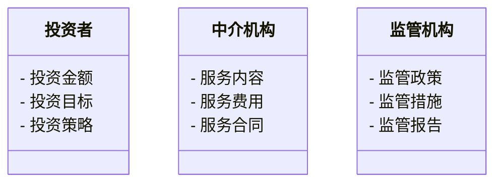
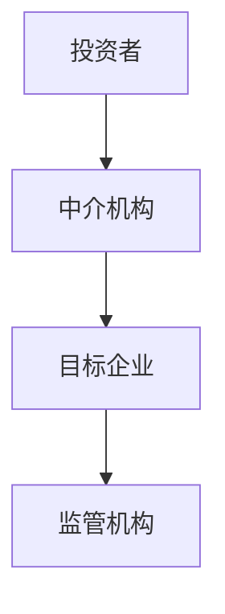
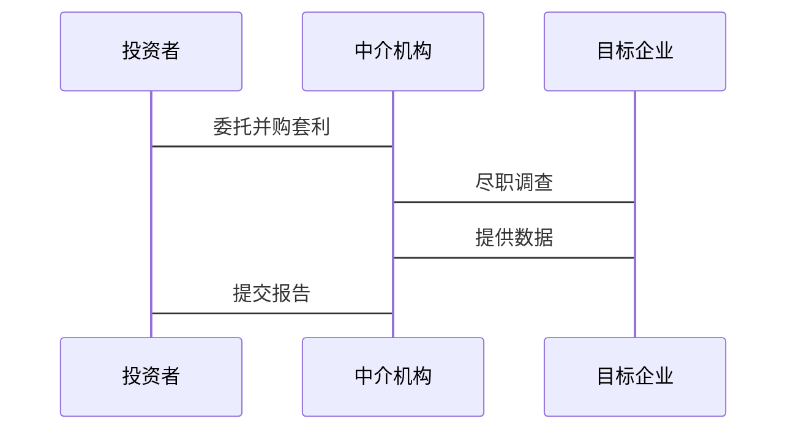

                 


---

# 并购套利策略：从企业重组中获取收益

## 关键词：并购套利、企业重组、套利机会、财务分析、市场分析、投资策略

## 摘要：本文系统地探讨了并购套利的核心策略，分析了企业重组的类型及其带来的套利机会，并通过详细的算法原理和实际案例展示了如何从企业重组中获取收益。文章结合理论与实践，提供了从市场分析、套利机会识别到系统实现的完整框架，帮助读者掌握并购套利的技巧和最佳实践。

---

# 第1章 并购套利概述

## 1.1 并购套利的基本概念

### 1.1.1 什么是并购套利

并购套利是指通过识别和利用企业重组中的价值低估或高估机会，进行投资以获取超额收益的一种策略。其核心在于发现市场定价与企业实际价值之间的差异，并通过买入低估资产或卖出高估资产来获利。

### 1.1.2 并购套利的定义与特点

- **定义**：并购套利是基于企业重组过程中，由于市场信息不对称或市场效率不足导致的价格偏差，通过套利行为来获利。
- **特点**：
  - 短期性：套利机会通常短暂，需快速识别和行动。
  - 高风险：依赖于市场定价偏差，风险较高。
  - 技术性：需要深入的财务分析和市场研究。

### 1.1.3 并购套利的背景与现状

随着全球并购活动的增加，市场中频繁出现定价偏差的机会。并购套利作为一种高风险高回报的投资策略，在金融市场中占据重要地位。本文将探讨其核心策略和实现方法。

---

## 1.2 并购套利的市场环境

### 1.2.1 并购市场的基本特征

- **市场参与者**：包括企业、投资者、投行、律师等。
- **交易类型**：包括收购、合并、分立等。
- **市场效率**：并购市场可能存在信息不对称和定价偏差。

### 1.2.2 市场失灵与套利机会

市场失灵导致的价格偏差为套利提供了可能。例如，目标企业被低估时，套利者买入后在价值回归时获利。

### 1.2.3 并购套利的驱动因素

- **信息不对称**：部分投资者掌握更多信息，导致定价偏差。
- **市场参与者行为**：某些企业或投资者的行为可能导致市场定价偏离实际价值。

---

## 1.3 并购套利的参与者

### 1.3.1 投资者角色

套利者通过分析市场定价与实际价值的差异，进行买卖操作以获利。

### 1.3.2 中介机构的作用

投行、律师事务所、财务顾问等在并购过程中提供专业服务，影响市场定价。

### 1.3.3 监管机构的职责

监管机构通过规范并购行为，减少市场失灵，降低套利机会。

---

## 1.4 本章小结

并购套利是一种基于市场定价偏差的投资策略，需要深入分析企业重组中的价值变化，识别套利机会并制定相应的投资策略。

---

# 第2章 企业重组的类型

## 2.1 横向并购

### 2.1.1 横向并购的定义与特点

横向并购是指同一行业内的企业合并，旨在扩大市场份额或消除竞争。

### 2.1.2 横向并购的套利机会

当目标企业被低估时，套利者可以买入其股票，等待价值回归。

## 2.2 纵向并购

### 2.2.1 纵向并购的定义与特点

纵向并购是指企业与供应商或客户合并，以控制供应链。

### 2.2.2 纵向并购的套利机会

供应链整合可能带来协同效应，套利者可从中获利。

## 2.3 混合并购

### 2.3.1 混合并购的定义与特点

混合并购是指企业与不同行业的企业合并，寻求多元化发展。

### 2.3.2 混合并购的套利机会

多元化可能带来新的增长点，套利者需识别潜在价值。

---

## 2.4 本章小结

不同类型的并购带来不同的套利机会，套利者需根据具体情况选择合适策略。

---

# 第3章 套利机会的识别与评估

## 3.1 套利机会的识别方法

### 3.1.1 市场分析法

通过分析市场趋势和企业财务状况，识别套利机会。

---

## 3.2 套利机会的评估方法

### 3.2.1 财务分析法

使用市盈率（PE）、市净率（PB）等指标评估企业价值。

---

## 3.3 套利策略的实施步骤

### 3.3.1 确定套利目标

基于财务分析和市场研究，选择具有套利潜力的企业。

---

## 3.4 本章小结

套利机会的识别与评估是并购套利成功的关键，需要结合财务分析和市场研究。

---

# 第4章 套利机会的评估方法

## 4.1 财务分析工具

### 4.1.1 市盈率模型

$$ PE = \frac{\text{股价}}{\text{每股收益}} $$

### 4.1.2 市净率模型

$$ PB = \frac{\text{股价}}{\text{每股净资产}} $$

---

## 4.2 市场分析工具

### 4.2.1 行业趋势分析

通过分析行业趋势，评估企业并购的潜在价值。

---

## 4.3 本章小结

套利机会的评估需要结合财务分析和市场分析，使用多种工具和模型。

---

# 第5章 系统架构与实现

## 5.1 系统功能设计

### 5.1.1 领域模型



---

## 5.2 系统架构设计

### 5.2.1 系统架构图



---

## 5.3 系统接口设计

### 5.3.1 数据接口

- 数据来源：企业财务报表、市场数据等。

---

## 5.4 系统交互设计

### 5.4.1 交互流程图



---

## 5.5 本章小结

系统架构设计为并购套利提供了技术支持，确保数据收集和分析的高效性。

---

# 第6章 项目实战

## 6.1 案例分析

### 6.1.1 案例背景

分析某公司并购案例，评估套利机会。

---

## 6.2 代码实现

### 6.2.1 数据处理代码

```python
import pandas as pd

# 读取数据
data = pd.read_csv('并购数据.csv')

# 计算市盈率
data['PE'] = data['股价'] / data['每股收益']

# 找出PE低于行业平均值的公司
mean_pe = data['PE'].mean()
data[数据['PE'] < mean_pe]
```

---

## 6.3 案例分析与解读

### 6.3.1 并购后的整合

分析并购后的整合过程，评估套利收益。

---

## 6.4 本章小结

通过实际案例分析，验证套利策略的有效性。

---

# 第7章 最佳实践与未来趋势

## 7.1 最佳实践

### 7.1.1 小结

套利机会的识别和评估是关键。

---

## 7.2 注意事项

### 7.2.1 风险提示

并购套利风险较高，需谨慎操作。

---

## 7.3 未来趋势

### 7.3.1 并购市场的发展

未来并购活动将更加频繁，套利机会也将增加。

---

## 7.4 拓展阅读

### 7.4.1 相关书籍

推荐相关书籍和资源，供读者深入学习。

---

## 作者

作者：AI天才研究院/AI Genius Institute & 禅与计算机程序设计艺术 /Zen And The Art of Computer Programming

---

通过以上目录大纲，读者可以系统地了解并购套利的策略和方法，从理论到实践，全面掌握如何从企业重组中获取收益。

