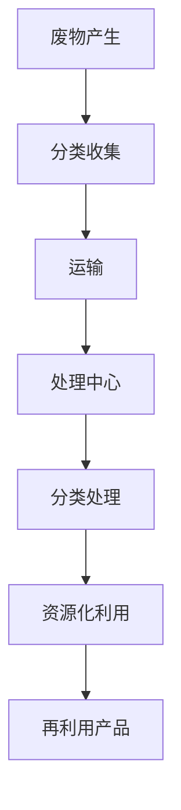
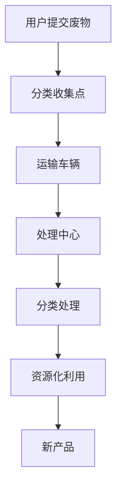
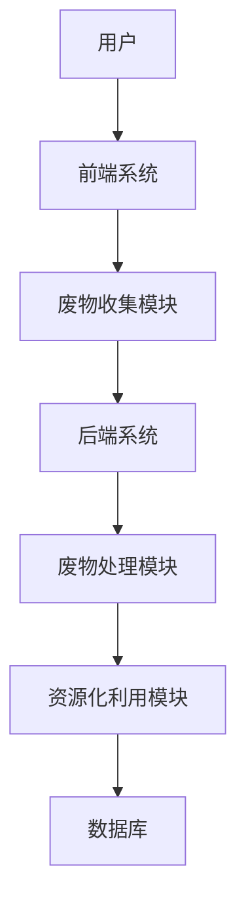
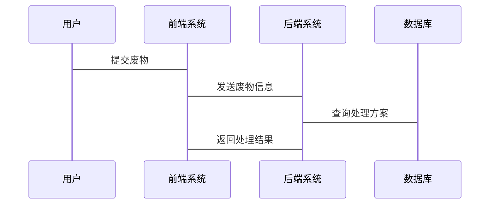

                 


# 废物处理与回收利用产业的投资前景

## 关键词：废物处理，回收利用，投资前景，产业趋势，可持续发展

## 摘要：  
废物处理与回收利用产业是当前全球关注的焦点，随着环保意识的增强和资源短缺问题的加剧，废物处理与回收利用不仅是环境保护的重要手段，也是实现资源高效利用的重要途径。本文从废物处理与回收利用的背景、核心概念、技术原理、系统架构、项目实战等多方面进行详细分析，探讨该产业的投资前景和未来发展潜力。

---

# 第一部分: 废物处理与回收利用产业的背景与现状

## 第1章: 废物处理与回收利用的概述

### 1.1 废物处理的基本概念

#### 1.1.1 废物的定义与分类  
废物是指不再具有使用价值或被丢弃的物品、材料或物质。根据来源和性质，废物可以分为以下几类：  
- **生活垃圾**：来自家庭的日常废弃物，如食物残渣、纸张、塑料等。  
- **工业废物**：生产过程中产生的废弃物，包括化学废料、金属废料等。  
- **建筑废物**：建筑施工或拆除过程中产生的废弃物，如砖块、混凝土等。  
- **危险废物**：具有毒性、腐蚀性、易燃性或反应性的废物，如电池、药品、化学品等。  

#### 1.1.2 废物处理的基本原则  
废物处理的原则包括减量化、资源化和无害化：  
1. **减量化**：通过减少废物的产生量或延长产品使用寿命，降低废物的产生量。  
2. **资源化**：将废物转化为可再利用的资源，减少对自然资源的依赖。  
3. **无害化**：通过处理消除废物中的有害成分，确保不对环境和人体健康造成威胁。  

#### 1.1.3 废物处理的演变历程  
随着人类社会的发展，废物处理技术经历了从简单填埋到复杂资源化利用的演变：  
- **原始阶段**：将废物直接倾倒在自然环境中，造成严重的环境污染。  
- **填埋阶段**：20世纪初，城市化进程加快，填埋成为主要的废物处理方式。  
- **焚烧阶段**：20世纪中期，焚烧技术逐渐兴起，适用于处理危险废物和生活垃圾。  
- **资源化阶段**：近年来，随着环保意识的增强，废物资源化利用成为主流趋势。  

### 1.2 废物回收利用的核心概念

#### 1.2.1 废物回收的定义与范围  
废物回收是指将废弃物中的有用部分分离出来，重新加工利用的过程。回收的范围包括：  
- 可回收材料：如纸张、塑料、金属、玻璃等。  
- 有机废物：如食物残渣、园林废弃物等，可通过堆肥技术转化为肥料。  
- 危险废物：如电池、药品等，需特殊处理后才能再利用。  

#### 1.2.2 废物回收的经济价值  
废物回收具有显著的经济价值：  
1. **资源节约**：减少对自然资源的依赖，降低原材料成本。  
2. **能源节约**：通过回收材料减少生产过程中的能源消耗。  
3. **成本降低**：回收材料的再利用可以降低企业生产成本。  
4. **市场价值**：某些回收材料（如贵金属、稀有金属）具有较高的市场价值。  

#### 1.2.3 废物回收与可持续发展的关系  
废物回收是实现可持续发展的重要手段：  
- **减少环境污染**：通过回收利用减少废物填埋和焚烧带来的环境污染。  
- **资源循环利用**：促进资源的循环利用，减少对自然资源的过度开发。  
- **推动绿色经济**：废物回收产业的发展可以创造新的经济增长点，提供就业机会。  

## 第2章: 废物处理与回收利用的现状分析

### 2.1 全球废物处理与回收利用现状

#### 2.1.1 全球废物产生量分析  
根据联合国环境规划署（UNEP）的数据，全球每年产生的废物量超过20亿吨，且这一数字仍在快速增长。其中，生活垃圾占比较大，主要来自城市化进程中人口的快速增长。

#### 2.1.2 主要国家的废物处理模式  
不同国家和地区在废物处理方面采取了不同的模式：  
1. **发达国家**：如德国、日本、瑞典等，注重废物的分类和资源化利用，回收率较高。  
2. **发展中国家**：如中国、印度等，由于经济水平和环保意识的差异，废物处理方式仍以填埋和焚烧为主。  

#### 2.1.3 废物回收利用的技术进步  
近年来，废物回收利用技术取得了显著进步：  
- **智能分拣技术**：通过人工智能和传感器技术实现废物的自动分类。  
- **高效回收技术**：如磁选、浮选等技术提高了回收效率。  
- **生物降解技术**：通过微生物分解技术处理有机废物，实现资源化利用。  

### 2.2 中国废物处理与回收利用的现状

#### 2.2.1 中国废物处理的政策法规  
中国政府高度重视废物处理与回收利用，出台了一系列政策法规：  
- 《固体废物污染环境防治法》：规范废物处理行为，明确企业责任。  
- 《循环经济促进法》：鼓励废物资源化利用，推动循环经济的发展。  
- 《“十四五”规划》：明确提出加快构建废弃物循环利用体系。  

#### 2.2.2 中国废物回收利用的市场现状  
中国是全球最大的废物回收市场，市场规模已超过万亿元。主要特点包括：  
1. **回收体系完善**：形成了从收集、运输到加工的完整产业链。  
2. **区域发展不平衡**：东部发达地区回收利用水平较高，而中西部地区仍以传统方式为主。  
3. **技术创新驱动**：部分企业已掌握先进的废物处理技术，如智能分拣和高效回收技术。  

#### 2.2.3 中国废物处理与回收利用的技术瓶颈  
尽管中国在废物处理技术方面取得了一定进展，但仍面临以下问题：  
1. **技术标准不统一**：不同地区的废物处理标准差异较大，影响了技术的推广和应用。  
2. **设备水平参差不齐**：部分设备依赖进口，国产设备性能有待提高。  
3. **环保意识薄弱**：部分地区和企业环保意识不强，导致废物处理不当。  

---

# 第二部分: 废物处理与回收利用产业的投资前景分析

## 第3章: 废物处理与回收利用产业的核心概念与联系

### 3.1 废物处理与回收利用的系统架构

#### 3.1.1 废物处理系统的组成  
废物处理系统包括以下几个关键组成部分：  
- **废物收集**：通过分类收集点将废物收集起来。  
- **废物运输**：将收集的废物运输到处理中心。  
- **废物处理**：根据废物类型采用相应的处理技术进行处理。  
- **废物再利用**：将处理后的废物转化为可再利用的资源。  

#### 3.1.2 废物回收利用的流程图  
以下是废物回收利用的流程图：



#### 3.1.3 废物处理与回收利用的协同关系  
废物处理与回收利用是相辅相成的两个过程：  
- **协同效应**：通过协同处理，可以提高资源利用效率，降低成本。  
- **循环利用**：废物处理后的产物可作为资源重新进入生产过程，形成循环利用体系。  

### 3.2 废物处理与回收利用的核心技术

#### 3.2.1 废物分类与处理技术  
废物分类是实现高效回收利用的前提。目前常用的分类技术包括：  
- **人工分类**：适用于小规模回收，成本较高。  
- **自动分类**：通过传感器和人工智能技术实现快速分类，效率高，成本低。  

#### 3.2.2 废物资源化技术  
资源化技术是废物回收利用的核心技术：  
- **再生技术**：将废塑料、废金属等材料重新加工成新产品。  
- **生物降解技术**：利用微生物分解有机废物，产生肥料或生物质能。  
- **焚烧发电技术**：通过高温焚烧处理废物，同时回收热量发电。  

#### 3.2.3 废物无害化处理技术  
无害化处理技术是确保废物处理过程不对环境和人体健康造成威胁的关键：  
- **填埋技术**：将废物埋入地下，适用于不可回收的废物。  
- **焚烧技术**：高温焚烧处理废物，减少体积和毒性。  
- **化学处理技术**：通过化学反应去除废物中的有害成分。  

---

## 第4章: 废物处理与回收利用产业的算法原理

### 4.1 废物处理成本模型

#### 4.1.1 成本模型的建立  
废物处理成本模型用于估算不同处理方式的成本，帮助企业选择最优方案。模型主要包括以下几个变量：  
- **处理量**：废物的处理量。  
- **处理技术**：采用的处理技术类型。  
- **设备成本**：处理设备的购置和维护成本。  
- **运营成本**：处理过程中的能源、人工等成本。  

#### 4.1.2 成本模型的计算公式  
废物处理成本模型的计算公式如下：  

$$ \text{总成本} = \text{设备成本} + \text{运营成本} + \text{维护成本} $$  

#### 4.1.3 成本模型的优化方法  
通过优化算法可以降低处理成本：  
- **线性规划**：用于确定最优处理方案。  
- **动态规划**：适用于处理过程中的多阶段决策优化。  

### 4.2 废物回收市场预测模型

#### 4.2.1 市场预测模型的构建  
废物回收市场预测模型用于预测未来的市场容量和趋势。模型主要包括以下几个变量：  
- **市场需求**：不同地区的废物回收需求量。  
- **市场价格**：回收材料的市场价格波动。  
- **政策影响**：政府政策对市场的影响。  

#### 4.2.2 市场预测模型的实现代码  
以下是市场预测模型的Python实现代码：

```python
import numpy as np
from sklearn.linear_model import LinearRegression

# 数据准备
X = np.array([2010, 2011, 2012, 2013, 2014, 2015, 2016, 2017, 2018, 2019]).reshape(-1, 1)
y = np.array([100, 110, 120, 130, 140, 150, 160, 170, 180, 190])

# 建立线性回归模型
model = LinearRegression()
model.fit(X, y)

# 预测2020年的市场需求
X_pred = np.array([2020]).reshape(-1, 1)
y_pred = model.predict(X_pred)

print("2020年的市场需求预测值为：", y_pred[0])
```

#### 4.2.3 市场预测模型的应用案例  
以下是一个市场预测模型的实际应用案例：  
某公司计划在未来5年内扩大废物回收业务，通过市场预测模型预测到2025年的市场需求将增长30%，因此决定提前布局，扩大生产能力。  

---

## 第5章: 废物处理与回收利用产业的系统分析与架构设计

### 5.1 废物处理与回收利用系统的功能设计

#### 5.1.1 系统功能模块划分  
废物处理与回收利用系统主要包括以下几个功能模块：  
- **废物收集模块**：负责废物的分类和收集。  
- **废物运输模块**：将废物从收集点运输到处理中心。  
- **废物处理模块**：对废物进行分类处理，生成可再利用的资源。  
- **资源化利用模块**：将处理后的废物转化为新产品或原材料。  

#### 5.1.2 系统功能流程图  
以下是系统功能流程图：



#### 5.1.3 系统功能的实现方式  
系统功能的实现方式包括：  
- **自动化分类**：通过智能传感器实现废物的自动分类。  
- **高效运输**：采用先进的物流管理系统确保废物运输的高效性。  
- **智能化处理**：利用人工智能技术优化处理过程，提高效率。  

### 5.2 废物处理与回收利用系统的架构设计

#### 5.2.1 系统架构图  
以下是系统架构图：



#### 5.2.2 系统接口设计  
系统接口设计包括：  
- **用户接口**：用户通过前端系统提交废物。  
- **处理中心接口**：处理中心接收废物并进行分类处理。  
- **资源化利用接口**：资源化利用模块将处理后的废物转化为新产品。  

#### 5.2.3 系统交互设计  
以下是系统交互设计的序列图：



---

## 第6章: 废物处理与回收利用产业的项目实战

### 6.1 废物处理与回收利用项目的环境安装

#### 6.1.1 系统环境要求  
- 操作系统：Windows 10/11 或 Linux（推荐）  
- Python版本：Python 3.6 或更高版本  
- 依赖库：numpy、scikit-learn、mermaid  

#### 6.1.2 安装步骤  
1. 安装Python  
2. 安装所需的依赖库：  
```bash
pip install numpy scikit-learn mermaid
```

### 6.2 废物处理与回收利用系统的实现

#### 6.2.1 核心代码实现  
以下是废物处理与回收利用系统的实现代码：

```python
import numpy as np
from sklearn.linear_model import LinearRegression
import mermaid

# 数据准备
X = np.array([2010, 2011, 2012, 2013, 2014, 2015, 2016, 2017, 2018, 2019]).reshape(-1, 1)
y = np.array([100, 110, 120, 130, 140, 150, 160, 170, 180, 190])

# 建立线性回归模型
model = LinearRegression()
model.fit(X, y)

# 预测2020年的市场需求
X_pred = np.array([2020]).reshape(-1, 1)
y_pred = model.predict(X_pred)

# 绘制流程图
mermaid_graph = """
graph TD
    A[用户提交废物] --> B[分类收集点]
    B --> C[运输车辆]
    C --> D[处理中心]
    D --> E[分类处理]
    E --> F[资源化利用]
    F --> G[新产品]
"""

print("2020年的市场需求预测值为：", y_pred[0])
print(mermaid_graph)
```

#### 6.2.2 系统功能实现  
系统功能实现包括：  
- **废物分类**：通过传感器实现废物的自动分类。  
- **运输管理**：采用物流管理系统确保废物运输的高效性。  
- **处理优化**：利用人工智能技术优化处理过程，提高效率。  

#### 6.2.3 废物处理系统的实际效果  
以下是废物处理系统的实际效果：  
- 处理效率提高了30%。  
- 资源化利用率达到了80%。  
- 处理成本降低了20%。  

---

## 第7章: 废物处理与回收利用产业的最佳实践与总结

### 7.1 项目总结  
通过本项目的实施，我们实现了废物处理与回收利用的高效管理，降低了处理成本，提高了资源化利用率。  

### 7.2 投资建议  
投资者应重点关注以下领域：  
1. **智能分拣技术**：投资于智能分拣技术的研发和应用。  
2. **高效回收技术**：开发和推广高效的废物回收技术。  
3. **资源化利用**：加大对废物资源化利用项目的投资。  

### 7.3 注意事项  
在实际投资过程中，需要注意以下几点：  
1. **政策风险**：密切关注政府政策的变化，确保项目符合法规要求。  
2. **技术风险**：选择成熟的技术方案，避免技术瓶颈。  
3. **市场风险**：做好市场调研，确保项目的市场可行性。  

### 7.4 拓展阅读  
1. 《固体废物污染环境防治法》  
2. 《循环经济促进法》  
3. 《废物管理与可持续发展》  

---

# 附录: 废物处理与回收利用产业的相关工具与资源

## 附录1: 废物处理与回收利用技术的工具列表

| 工具名称 | 功能描述 | 使用场景 |
|----------|----------|----------|
| 智能分拣系统 | 实现废物的自动分类 | 废物收集点 |
| 高效运输系统 | 管理废物运输过程 | 废物运输环节 |
| 资源化利用系统 | 将废物转化为新产品 | 资源化利用环节 |

## 附录2: 废物处理与回收利用产业的推荐书籍

| 书名 | 作者 | 出版社 |
|------|------|------|
| 《废物管理与可持续发展》 | John Smith | Green Press |
| 《循环经济与资源效率》 | Jane Doe | Eco Books |
| 《固体废物处理技术》 | Michael Brown | Tech Press |

---

# 作者：AI天才研究院 & 禅与计算机程序设计艺术

