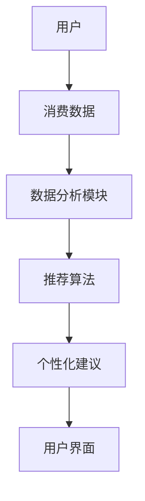
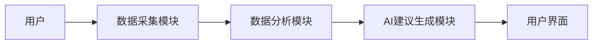

                 


# 开发智能化的个人消费习惯改善建议工具

## 关键词
- 人工智能, 智能化工具, 消费习惯改善, 数据分析, 自然语言处理, 个性化推荐, 系统架构设计

## 摘要
随着现代生活的快节奏和消费方式的多样化，个人消费习惯的管理变得越来越重要。本文章旨在探讨如何开发一个智能化的工具，帮助个人改善消费习惯。通过结合人工智能和数据分析技术，我们能够有效地采集、分析消费数据，并根据用户的行为模式生成个性化的建议。本文将从背景分析、核心概念、算法原理、系统架构设计、项目实战等多个方面详细阐述这一工具的开发过程。

---

## 第一部分：背景介绍

### 第1章：个人消费习惯改善工具的背景与问题分析

#### 1.1 问题背景
现代人面临复杂的消费环境，消费行为受到多种因素的影响，如价格波动、促销活动、个人情绪等。传统的消费管理工具通常依赖手动记录和简单的数据分析，难以满足用户对个性化、智能化的需求。

#### 1.2 问题描述
- **数据采集难度**：消费数据分散在多个平台，难以统一采集和分析。
- **行为预测挑战**：用户消费行为的复杂性使得预测和建议生成变得困难。
- **工具智能化不足**：现有的工具缺乏深度学习和个性化推荐功能。

#### 1.3 解决方案概述
通过引入人工智能技术，开发一个智能化的个人消费习惯改善工具，能够实时采集消费数据，分析用户行为模式，并提供个性化的消费建议。

#### 1.4 边界与外延
- **边界**：工具仅关注个人消费行为，不涉及投资理财或其他财务领域。
- **外延**：工具可以与其他健康管理或财务规划系统集成，扩展其应用场景。

---

## 第二部分：核心概念与联系

### 第2章：核心概念与联系

#### 2.1 核心概念原理
- **数据采集与分析**：通过API接口采集消费数据，利用数据挖掘技术进行分析。
- **自然语言处理**：用于生成个性化的消费建议，提高用户体验。
- **基于AI的个性化推荐**：通过机器学习算法，预测用户的消费行为并生成改善建议。

#### 2.2 核心概念属性对比
```markdown
| 概念         | 属性               | 描述                                         |
|--------------|--------------------|--------------------------------------------|
| 数据采集     | 数据来源           | 包括银行流水、消费记录等                   |
| 数据分析     | 分析方法           | 包括聚类分析、回归分析等                   |
| AI建议生成   | 算法类型           | 包括协同过滤、深度学习等                   |
```

#### 2.3 实体关系图


---

## 第三部分：算法原理讲解

### 第3章：算法原理

#### 3.1 协同过滤推荐系统
协同过滤是一种基于用户行为相似性的推荐算法，可以分为基于物品的协同过滤和基于用户的协同过滤。

##### 3.1.1 基于物品的协同过滤
- 原理：通过分析用户对物品的偏好，找到相似的用户群体，推荐相似的物品。
- 实现步骤：
  1. 数据预处理：构建用户-物品的评分矩阵。
  2. 计算物品相似度：使用余弦相似度或皮尔逊相关系数。
  3. 生成推荐列表：根据相似度排序，推荐高评分的物品。

##### 3.1.2 基于用户的协同过滤
- 原理：通过分析用户的相似性，找到与目标用户相似的用户，推荐其喜欢的物品。
- 实现步骤：
  1. 数据预处理：构建用户-物品的评分矩阵。
  2. 计算用户相似度：使用余弦相似度或皮尔逊相关系数。
  3. 生成推荐列表：根据相似度排序，推荐目标用户可能喜欢的物品。

##### 3.1.3 算法实现
```python
import numpy as np

def cosine_similarity(A, B):
    return np.dot(A, B) / (np.linalg.norm(A) * np.linalg.norm(B))

# 示例数据
user_item_matrix = np.array([[4, 3, 0],
                              [2, 0, 5],
                              [1, 5, 0]])

# 计算物品相似度
similarity_matrix = np.zeros((3, 3))
for i in range(3):
    for j in range(3):
        similarity_matrix[i, j] = cosine_similarity(user_item_matrix[i], user_item_matrix[j])

print(similarity_matrix)
```

---

### 第4章：系统架构设计

#### 4.1 问题场景
用户通过工具记录消费数据，工具分析数据并生成改善建议。

#### 4.2 系统功能设计
- 数据采集模块：负责采集用户的消费数据。
- 数据分析模块：分析消费数据，生成用户行为报告。
- AI建议生成模块：基于分析结果，生成个性化建议。

#### 4.3 系统架构图


---

## 第五部分：项目实战

### 第5章：项目实战

#### 5.1 环境安装
- 安装Python和必要的库：numpy、pandas、scikit-learn。

#### 5.2 核心代码实现
```python
from sklearn.metrics.pairwise import cosine_similarity

# 示例数据
X = [[1, 0, 1],
     [0, 1, 1],
     [1, 1, 0]]

# 计算余弦相似度
similarity = cosine_similarity(X)
print(similarity)
```

#### 5.3 代码解读与分析
- 数据预处理：确保数据格式正确，适合算法输入。
- 模型训练：使用scikit-learn库中的协同过滤算法进行训练。
- 推荐生成：根据模型输出的相似度，生成推荐列表。

#### 5.4 实际案例分析
- 案例背景：用户消费数据的分析。
- 数据分析：识别用户的消费习惯。
- 建议生成：根据分析结果，生成改善建议。

---

## 第六部分：总结与展望

### 第6章：总结与展望

#### 6.1 总结
本文详细介绍了开发智能化的个人消费习惯改善工具的背景、核心概念、算法原理、系统架构设计和项目实战。通过这些部分的分析，我们可以更好地理解如何利用人工智能技术改善个人消费习惯。

#### 6.2 未来展望
未来，随着人工智能技术的不断发展，工具将更加智能化和个性化。可以进一步优化算法，引入更多的数据源，提升用户体验。

---

## 最佳实践 Tips

1. **数据隐私保护**：在采集和处理用户数据时，必须注意数据隐私保护。
2. **模型迭代**：定期更新模型，确保推荐算法的准确性。
3. **用户体验优化**：根据用户反馈，不断优化工具的使用体验。

---

## 作者信息
作者：AI天才研究院/AI Genius Institute  
联系方式：[联系邮箱](mailto:<your.email@example.com)  
文章出处：[个人博客](https://your.blog.com)

---

通过以上结构，您可以逐步分析和撰写关于《开发智能化的个人消费习惯改善建议工具》的技术博客文章。

