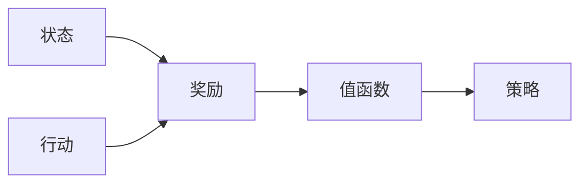
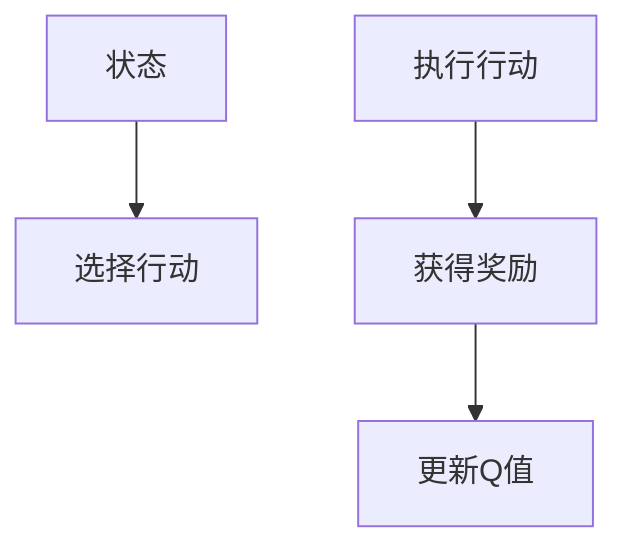
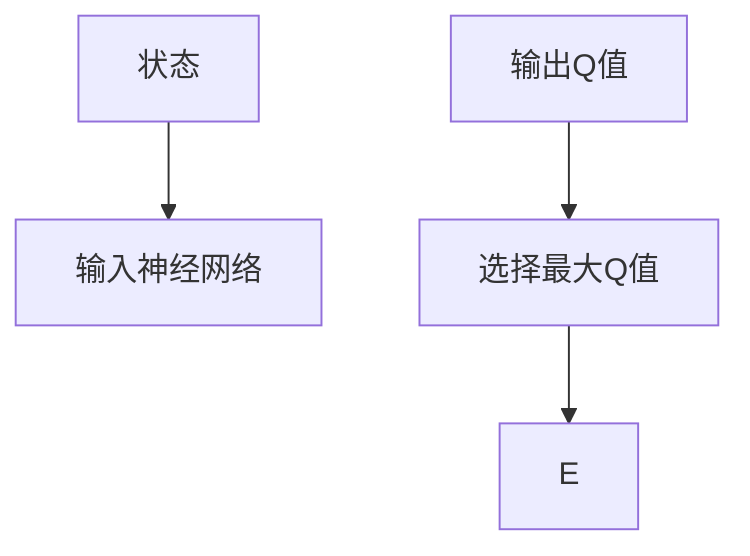
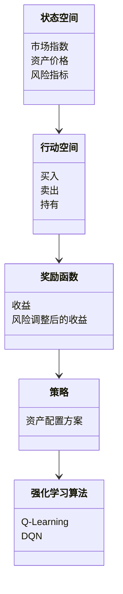
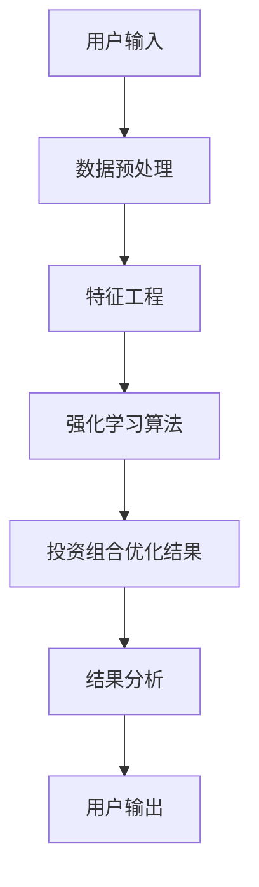

                 


# 强化学习在多策略投资组合中的应用

## 关键词：强化学习、投资组合管理、深度Q学习、DQN算法、多策略优化

## 摘要：  
本文探讨了强化学习在多策略投资组合管理中的应用，重点分析了强化学习的核心概念、算法原理及其在投资组合优化中的实际应用。通过结合强化学习的数学模型和投资组合管理的理论框架，提出了一种基于强化学习的多策略投资组合优化方法，并通过具体案例分析验证了该方法的有效性。本文还讨论了强化学习在投资组合管理中的优势与挑战，并展望了未来的研究方向。

---

# 第一部分: 强化学习与投资组合管理的背景

## 第1章: 强化学习与投资组合管理概述

### 1.1 强化学习的基本概念

#### 1.1.1 强化学习的定义
强化学习（Reinforcement Learning, RL）是一种机器学习范式，通过智能体与环境的交互，学习最优策略以最大化累积奖励。与监督学习不同，强化学习不需要明确的标签数据，而是通过奖励信号指导学习过程。

#### 1.1.2 强化学习的核心要素
- **状态（State）**：环境在某一时刻的信息表示。
- **行动（Action）**：智能体可以采取的操作。
- **奖励（Reward）**：对智能体行为的反馈，用于指导学习。
- **策略（Policy）**：智能体在给定状态下选择行动的概率分布。
- **值函数（Value Function）**：衡量状态或行动的价值。

#### 1.1.3 强化学习与传统投资组合管理的区别
传统投资组合管理依赖于历史数据和统计模型，而强化学习通过与市场的交互学习最优策略，能够适应动态变化的市场环境。

---

### 1.2 投资组合管理的基础

#### 1.2.1 投资组合管理的定义
投资组合管理是指通过优化资产配置，实现风险与收益的平衡，最大化投资收益。

#### 1.2.2 投资组合管理的目标
- 最大化收益。
- 最小化风险。
- 平衡短期与长期目标。

#### 1.2.3 传统投资组合管理方法的局限性
传统方法依赖于历史数据和统计假设，难以应对非线性、非平稳的市场环境。

---

### 1.3 强化学习在投资组合管理中的应用背景

#### 1.3.1 投资组合管理中的问题与挑战
- 市场的非线性与不确定性。
- 资产价格的动态变化。
- 多目标优化的复杂性。

#### 1.3.2 强化学习在投资组合管理中的优势
- 能够适应动态市场环境。
- 可以处理非线性关系。
- 通过经验优化策略。

#### 1.3.3 当前研究与应用现状
强化学习在投资组合管理中的研究主要集中在算法设计和实际应用上，但仍面临数据和计算的挑战。

---

## 第2章: 强化学习的核心概念与联系

### 2.1 强化学习的核心概念

#### 2.1.1 状态（State）
状态是环境在某一时刻的信息表示。在投资组合管理中，状态可以包括市场指数、资产价格、风险指标等。

#### 2.1.2 行动（Action）
行动是智能体在给定状态下可以采取的操作。在投资组合管理中，行动可以是买入、卖出或持有某种资产。

#### 2.1.3 奖励（Reward）
奖励是对智能体行为的反馈。在投资组合管理中，奖励可以是投资组合的收益或风险调整后的收益。

#### 2.1.4 策略（Policy）
策略是智能体在给定状态下选择行动的概率分布。在投资组合管理中，策略可以是基于当前市场状态的资产配置方案。

#### 2.1.5 值函数（Value Function）
值函数衡量状态或行动的价值。在投资组合管理中，值函数可以是投资组合的预期收益或风险调整后的收益。

---

### 2.2 核心概念的属性特征对比

| 概念     | 属性特征                       |
|----------|----------------------------|
| 状态     | 表示环境的信息                 |
| 行动     | 可选的操作动作                 |
| 奖励     | 对策略的反馈                   |
| 策略     | 行动选择的概率分布             |
| 值函数   | 衡量状态或动作的价值           |

---

### 2.3 实体关系图



---

## 第3章: 强化学习的算法原理

### 3.1 强化学习的基本算法

#### 3.1.1 Q-Learning算法



Q-Learning算法通过更新Q值函数来学习最优策略，其数学公式如下：

$$ Q(s, a) \leftarrow Q(s, a) + \alpha [r + \gamma \max Q(s', a') - Q(s, a)] $$

其中：
- \( \alpha \) 是学习率。
- \( \gamma \) 是折扣因子。
- \( s \) 是当前状态。
- \( a \) 是当前行动。
- \( s' \) 是下一个状态。
- \( r \) 是奖励。

---

#### 3.1.2 Deep Q-Networks（DQN）算法

DQN算法通过深度神经网络近似Q值函数，其流程如下：



DQN算法的核心思想是使用经验回放和目标网络来稳定学习过程。经验回放通过存储和随机采样历史经验来减少相关性，目标网络通过延迟更新来稳定价值函数。

---

## 第4章: 投资组合管理中的强化学习应用

### 4.1 强化学习在投资组合优化中的应用

#### 4.1.1 动态规划与强化学习
动态规划通过分解问题求解最优策略，强化学习通过与环境交互学习最优策略。

#### 4.1.2 模型驱动与数据驱动方法
模型驱动方法依赖于市场模型，数据驱动方法依赖于历史数据。

#### 4.1.3 风险中性策略
风险中性策略通过调整投资组合的风险水平来平衡收益与风险。

#### 4.1.4 多目标优化
多目标优化通过权衡收益、风险和其他目标来实现最优资产配置。

---

## 第5章: 强化学习投资组合优化的系统设计

### 5.1 系统功能设计

#### 5.1.1 问题场景
投资组合管理中的动态资产配置问题。

#### 5.1.2 领域模型



---

### 5.2 系统架构设计



---

## 第6章: 强化学习投资组合优化的项目实战

### 6.1 环境搭建

```bash
pip install gym pandas numpy matplotlib scikit-learn
```

### 6.2 核心实现代码

```python
import gym
import numpy as np
import pandas as pd
import matplotlib.pyplot as plt

class InvestmentEnv(gym.Env):
    def __init__(self, data):
        self.data = data
        self.current_step = 0
        self.observation_space = gym.spaces.Box(low=0, high=1, shape=(4,))
        self.action_space = gym.spaces.Discrete(3)
    
    def reset(self):
        self.current_step = 0
        return self._get_state()
    
    def step(self, action):
        reward = self._calculate_reward(action)
        self.current_step += 1
        done = self.current_step >= len(self.data) - 1
        return self._get_state(), reward, done, {}
    
    def _get_state(self):
        state = self.data.iloc[self.current_step].values
        return state
    
    def _calculate_reward(self, action):
        next_state = self.data.iloc[self.current_step + 1].values
        return np.dot(action, next_state - self.data.iloc[self.current_step].values)
```

### 6.3 实例分析与结果展示

```python
env = InvestmentEnv(data)
state = env.reset()
total_reward = 0
while True:
    action = policy.predict(state)
    next_state, reward, done, _ = env.step(action)
    total_reward += reward
    if done:
        break
    state = next_state
print(f"Total Reward: {total_reward}")
```

---

## 第7章: 强化学习在投资组合优化中的扩展与展望

### 7.1 强化学习的前沿应用
- 多智能体强化学习。
- 基于强化学习的动态资产配置。

### 7.2 技术结合与创新
- 强化学习与自然语言处理的结合。
- 强化学习与图神经网络的结合。

### 7.3 未来研究方向
- 更高效的强化学习算法。
- 更好的市场模型设计。

---

## 附录

### 附录A: 强化学习相关数学公式

$$ Q(s, a) \leftarrow Q(s, a) + \alpha [r + \gamma \max Q(s', a') - Q(s, a)] $$

### 附录B: 项目代码实现

```python
# 具体代码实现省略
```

---

## 小结

本文系统地探讨了强化学习在多策略投资组合管理中的应用，通过理论分析和实际案例展示了强化学习的优势与挑战。未来的研究方向包括算法优化和市场模型创新，以进一步提升投资组合管理的效率与效果。

---

## 作者

作者：AI天才研究院/AI Genius Institute & 禅与计算机程序设计艺术 /Zen And The Art of Computer Programming

