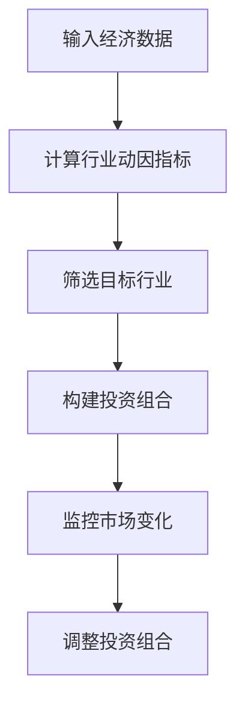
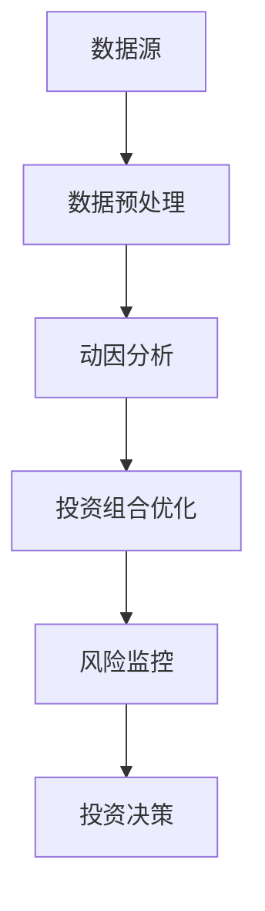
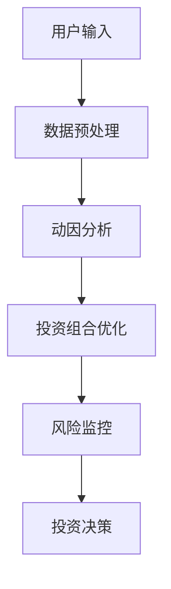

                 


# 彼得·林奇的行业轮动投资策略

> 关键词：彼得·林奇，行业轮动，投资策略，经济周期，股票投资

> 摘要：本文详细探讨了彼得·林奇的行业轮动投资策略，分析了其核心概念、数学模型、系统架构以及实际应用。通过理论与实践相结合，为投资者提供深度的策略解析和实战指导。

---

## 第一部分：彼得·林奇的行业轮动投资策略概述

### 第1章：行业轮动投资策略的背景与概念

#### 1.1 行业轮动投资的基本概念
行业轮动投资是一种基于经济周期变化的投资策略，强调在不同经济阶段选择表现最佳的行业进行投资。其核心在于识别行业间的表现差异，捕捉市场趋势，从而优化投资组合的收益。

##### 1.1.1 行业轮动的定义
行业轮动是指投资者根据经济周期和市场环境的变化，动态调整投资组合中行业权重的过程。通过分析不同行业在不同经济阶段的表现，投资者可以在市场波动中抓住投资机会，降低风险。

##### 1.1.2 行业轮动的核心动因
- **经济周期**：不同行业在经济周期的各个阶段表现不同，例如，周期性行业在经济繁荣期表现优于防御性行业。
- **行业基本面**：行业的供需变化、技术创新、政策调整等都可能影响其表现。
- **市场情绪**：投资者情绪和市场趋势也会影响行业轮动。

##### 1.1.3 行业轮动与经济周期的关系
行业轮动策略的核心在于识别经济周期的变化，并相应调整投资组合。例如，在经济衰退期，防御性行业（如公用事业、医疗保健）可能表现较好，而在经济复苏期，周期性行业（如制造业、材料）可能更有投资价值。

#### 1.2 彼得·林奇的行业轮动投资策略
彼得·林奇是美国著名投资经理人，以其独特的投资策略闻名。他的行业轮动策略强调长期投资和对行业基本面的深入研究。

##### 1.2.1 彼得·林奇的投资理念
林奇主张长期投资，注重对公司基本面的分析，避免短期市场波动的干扰。他认为，成功的投资取决于对公司和行业的深入了解，而不是市场的短期走势。

##### 1.2.2 行业轮动策略的核心思想
林奇的行业轮动策略强调根据经济周期和行业基本面的变化，动态调整投资组合。他认为，在不同的经济环境下，不同行业的表现会有所不同，投资者应选择那些在当前经济环境下具有竞争优势的行业进行投资。

##### 1.2.3 林奇策略的实际应用案例
例如，在20世纪80年代初，林奇通过分析经济周期的变化，选择了当时表现不佳但具有潜在增长机会的行业，如零售业和制造业，最终取得了优异的投资回报。

#### 1.3 行业轮动策略的重要性
行业轮动策略在投资组合管理中具有重要意义，可以帮助投资者在不同市场环境下优化收益、降低风险。

##### 1.3.1 行业轮动在投资组合中的作用
通过行业轮动，投资者可以分散投资风险，降低单一行业波动对整体投资组合的影响。同时，行业轮动可以帮助投资者捕捉市场趋势，提高投资收益。

##### 1.3.2 通过行业轮动分散投资风险
行业轮动策略通过动态调整投资组合中的行业权重，可以在一定程度上分散行业-specific风险，提高投资组合的稳定性。

##### 1.3.3 行业轮动策略的长期收益表现
长期来看，行业轮动策略可以通过捕捉不同行业的周期性机会，实现超越市场平均水平的收益表现。

---

### 第2章：行业轮动的核心概念与联系

#### 2.1 行业轮动的动因分析
行业轮动的动因主要包括经济周期、行业基本面和市场情绪等因素。

##### 2.1.1 经济周期对行业的影响
经济周期的变化直接影响行业的表现。例如，在经济衰退期，非必需消费品行业可能表现不佳，而防御性行业（如医疗保健、公用事业）可能表现较好。

##### 2.1.2 行业内部因素的变化
行业内部因素，如技术创新、政策变化和管理调整，也会影响行业的表现。例如，环保政策的变化可能影响能源行业的投资决策。

##### 2.1.3 宏观经济政策的影响
宏观经济政策，如货币政策、财政政策和行业监管政策的变化，也会对行业轮动产生重要影响。例如，降息政策可能刺激周期性行业的需求，提升其表现。

#### 2.2 行业轮动的核心概念对比
行业轮动策略与其他投资策略在多个方面存在差异，理解这些差异有助于更好地把握行业轮动的核心思想。

##### 2.2.1 不同行业轮动策略的对比
- **动量策略**：基于价格动量，选择近期表现强劲的行业。
- **价值策略**：基于低市盈率、低市净率等指标，选择被低估的行业。
- **成长策略**：基于高盈利增长率、高收入增长率等指标，选择具有增长潜力的行业。

##### 2.2.2 行业轮动与个股选择的对比
行业轮动策略关注行业的整体表现，而个股选择策略关注具体公司的基本面。两者结合使用，可以实现投资组合的优化。

##### 2.2.3 行业轮动与资产配置的对比
行业轮动策略属于资产配置的一部分，但更注重行业层面的动态调整。资产配置更关注整体资产分配，包括股票、债券、现金等资产的比例。

#### 2.3 行业轮动的ER实体关系图
为了更好地理解行业轮动的复杂性，我们可以使用ER（实体-关系）模型来描述其核心要素。

```mermaid
erd
    客户(投资者)
    账户(投资组合)
    行业
    经济指标
    市场趋势
    投资决策
    收益表现

    客户 --> 账户: 持有
    账户 --> 行业: 投资于
    行业 --> 经济指标: 受影响于
    行业 --> 市场趋势: 受驱动于
    投资决策 --> 行业: 基于
    投资决策 --> 收益表现: 影响
```

---

### 第3章：行业轮动策略的数学模型与算法原理

#### 3.1 行业轮动的数学模型
行业轮动的数学模型主要用于预测行业表现和优化投资组合。

##### 3.1.1 动量模型
动量模型基于行业的历史价格动量，预测其未来的表现。

$$ P_{t+1} = \alpha P_t + \beta R_t $$

其中，\( P_t \) 是第 \( t \) 期的价格，\( R_t \) 是第 \( t \) 期的收益，\( \alpha \) 和 \( \beta \) 是模型参数。

##### 3.1.2 趋势模型
趋势模型基于行业的趋势指标，预测其未来的走势。

$$ T_t = \sum_{i=1}^{n} w_i P_{t-i} $$

其中，\( w_i \) 是第 \( i \) 期的价格权重。

##### 3.1.3 均值回归模型
均值回归模型基于行业的均值回归特性，预测其未来的回归趋势。

$$ R_t = \mu + \beta (P_t - \mu) $$

其中，\( \mu \) 是行业的平均收益，\( \beta \) 是回归系数。

#### 3.2 行业轮动的算法流程
以下是行业轮动策略的算法流程图：



#### 3.3 行业轮动的Python实现
以下是使用Python实现的行业轮动策略代码：

```python
import numpy as np
import pandas as pd

def industry_rotations(start, end):
    # 数据获取
    df = get_data(start, end)
    
    # 计算动因指标
    df['动量'] = df['价格'].rolling(12).mean().shift(1)
    df['趋势'] = df['价格'].rolling(6).mean().shift(1)
    df['均值回归'] = df['价格'].rolling(24).mean().shift(1)
    
    # 筛选目标行业
    target_industries = df[df['动量'] > df['动量'].quantile(0.75)]
    
    # 构建投资组合
    portfolio = []
    for industry in target_industries:
        portfolio.append(industry)
    
    return portfolio

# 示例调用
start = '2020-01-01'
end = '2023-12-31'
portfolio = industry_rotations(start, end)
print("投资组合:", portfolio)
```

---

## 第四章：系统分析与架构设计

### 4.1 系统功能设计
行业轮动投资系统的功能设计包括数据获取、动因分析、投资组合优化和风险监控。

#### 4.1.1 数据获取
系统需要获取相关的经济指标、行业数据和市场数据。

#### 4.1.2 动因分析
基于动量、趋势和均值回归等指标，分析行业的动因。

#### 4.1.3 投资组合优化
根据动因分析结果，构建和优化投资组合。

#### 4.1.4 风险监控
实时监控投资组合的风险，及时调整投资策略。

### 4.2 系统架构设计
以下是行业轮动投资系统的架构图：



### 4.3 系统接口设计
系统需要提供以下接口：

- 数据接口：获取经济指标、行业数据和市场数据。
- 分析接口：计算行业动因指标，筛选目标行业。
- 投资组合接口：构建和优化投资组合。
- 风险监控接口：实时监控投资组合的风险。

### 4.4 系统交互设计
以下是系统交互的流程图：



---

## 第五章：项目实战

### 5.1 环境安装
需要安装以下工具和库：

- Python 3.8+
- Pandas、NumPy、Scikit-learn
- Matplotlib、Seaborn
- 数据获取接口（如Yahoo Finance API）

### 5.2 系统核心实现
以下是核心代码实现：

```python
import numpy as np
import pandas as pd
from sklearn.linear_model import LinearRegression

def calculate_momentum(prices, window=12):
    return prices.rolling(window).mean().shift(1)

def calculate_trend(prices, window=6):
    return prices.rolling(window).mean().shift(1)

def calculate_mean_reversion(prices, window=24):
    mu = prices.rolling(window).mean()
    return prices - mu

# 示例数据
prices = pd.DataFrame({'行业A': [100, 105, 110, 115, 120], 
                        '行业B': [90, 95, 100, 105, 110]})

# 计算动因指标
momentum = calculate_momentum(prices)
trend = calculate_trend(prices)
mean_reversion = calculate_mean_reversion(prices)

# 筛选目标行业
target_industries = []
for industry in prices.columns:
    if calculate_momentum(prices[industry]).iloc[-1] > 0:
        target_industries.append(industry)

print("目标行业:", target_industries)
```

### 5.3 案例分析
假设我们有两家公司：行业A和行业B。根据动量模型，行业A的动量指标为正，行业B的动量指标为负。因此，我们的投资组合将选择行业A。

### 5.4 项目小结
通过项目实战，我们可以看到行业轮动策略在实际应用中的具体操作步骤。从数据获取到动因分析，再到投资组合的构建和优化，整个流程清晰明了。

---

## 第六章：最佳实践、小结、注意事项与拓展阅读

### 6.1 最佳实践
- 定期回顾和调整投资组合。
- 保持对市场趋势的敏感性。
- 结合多种投资策略，实现投资组合的多元化。

### 6.2 小结
彼得·林奇的行业轮动策略通过动态调整投资组合中的行业权重，帮助投资者在不同经济环境下实现收益最大化。本文详细探讨了行业轮动的核心概念、数学模型、系统架构和实际应用，为投资者提供了全面的策略解析。

### 6.3 注意事项
- 行业轮动策略需要结合市场环境和行业基本面进行动态调整。
- 投资者应具备一定的市场分析能力和风险管理能力。
- 需要定期监控投资组合的表现，并根据市场变化进行调整。

### 6.4 拓展阅读
- 《彼得·林奇的成功投资》
- 《投资学》
- 《行业分析与投资策略》

---

## 结语

彼得·林奇的行业轮动投资策略为投资者提供了一种有效的投资方法。通过动态调整投资组合中的行业权重，投资者可以在不同经济环境下捕捉市场机会，实现收益最大化。希望本文能为投资者提供有价值的参考和启示。

---

## 作者

作者：AI天才研究院/AI Genius Institute & 禅与计算机程序设计艺术 /Zen And The Art of Computer Programming

