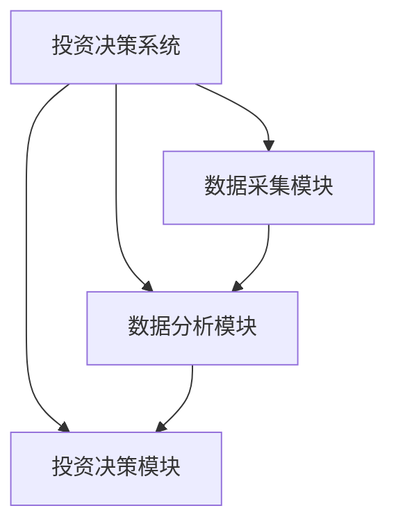

                 


# 彼得林奇与价值投资的关系

> 关键词：彼得林奇，价值投资，投资策略，系统架构，数学模型

> 摘要：本文深入探讨了彼得·林奇的价值投资理念及其与价值投资的关系，从背景介绍、核心概念、数学模型、系统架构设计、项目实战等多方面进行详细分析，结合实际案例和系统设计，全面揭示彼得林奇与价值投资的内在联系。

---

## 第1章: 彼得林奇与价值投资的背景介绍

### 1.1 彼得林奇的背景与投资理念

#### 1.1.1 彼得林奇的生平简介

- 彼得·林奇的生平与职业历程
- 作为基金经理的卓越表现
- 彼得林奇的投资哲学

#### 1.1.2 彼得林奇的投资哲学

- 长期投资与价值发现的核心理念
- 高质量公司与安全边际的重要性
- 风险控制与投资组合管理的原则

#### 1.1.3 彼得林奇的投资策略

- 买入并持有策略
- 高质量公司的定义与筛选标准
- 风险分散与投资组合的动态调整

### 1.2 价值投资的核心概念

#### 1.2.1 价值投资的定义

- 价值投资的基本定义
- 价值投资的核心原则
- 价值投资与投机的区别

#### 1.2.2 价值投资的核心原则

- 市场先生理论
- 安全边际的概念
- 长期投资与复利效应

#### 1.2.3 价值投资与其它投资策略的区别

- 与成长投资的区别
- 与趋势投资的区别
- 与股息投资的区别

### 1.3 彼得林奇与价值投资的关系

#### 1.3.1 彼得林奇与价值投资的联系

- 彼得林奇的投资理念与价值投资的契合点
- 两者在选股标准上的相似性
- 两者在风险控制上的共通性

#### 1.3.2 彼得林奇对价值投资的贡献

- 彼得林奇对价值投资理论的创新
- 彼得林奇在实践中的价值投资应用
- 彼得林奇对投资者的启发

#### 1.3.3 彼得林奇与价值投资的差异

- 投资风格的差异
- 风险承受能力的差异
- 投资策略的具体差异

---

## 第2章: 彼得林奇投资策略的核心要素

### 2.1 彼得林奇的投资风格

#### 2.1.1 高质量公司的定义

- 高质量公司的标准
- 高质量公司的财务特征
- 高质量公司的行业地位

#### 2.1.2 长期投资的逻辑

- 长期投资的优势
- 长期投资的风险
- 长期投资与短期投资的对比

#### 2.1.3 风险控制的方法

- 风险控制的原则
- 风险分散的策略
- 风险评估的方法

### 2.2 彼得林奇的投资组合管理

#### 2.2.1 投资组合的构建原则

- 投资组合的多样化
- 投资组合的集中化
- 投资组合的动态调整

#### 2.2.2 投资组合的调整策略

- 调整的时机与频率
- 调整的原则与方法
- 调整的案例分析

#### 2.2.3 投资组合的风险评估

- 风险评估的指标
- 风险评估的方法
- 风险评估的工具

### 2.3 彼得林奇的选股标准

#### 2.3.1 公司基本面分析

- 公司盈利能力的分析
- 公司财务状况的分析
- 公司管理团队的分析

#### 2.3.2 财务指标的筛选

- 市盈率（P/E）的计算与应用
- 市净率（P/B）的计算与应用
- 净资产收益率（ROE）的计算与应用

#### 2.3.3 行业选择的策略

- 行业分析的基本原则
- 行业选择的标准
- 行业趋势的判断

---

## 第3章: 价值投资的核心原理与数学模型

### 3.1 价值投资的数学模型

#### 3.1.1 现金流折现模型（DCF）

- 现金流折现模型的定义
- 现金流折现模型的公式
- 现金流折现模型的应用

#### 3.1.2 市盈率与市净率分析

- 市盈率的计算与应用
- 市净率的计算与应用
- 市盈率与市净率的对比

#### 3.1.3 内在价值的计算公式

- 内在价值的定义
- 内在价值的计算公式
- 内在价值的评估方法

### 3.2 彼得林奇投资策略的数学分析

#### 3.2.1 投资组合的期望收益计算

- 投资组合的期望收益公式
- 投资组合的期望收益的影响因素
- 投资组合的期望收益的案例分析

#### 3.2.2 风险与收益的平衡

- 风险与收益的定义
- 风险与收益的关系
- 风险与收益的平衡方法

#### 3.2.3 投资策略的统计分析

- 投资策略的统计指标
- 投资策略的统计分析方法
- 投资策略的统计分析案例

---

## 第4章: 彼得林奇与价值投资的系统架构设计

### 4.1 系统架构概述

#### 4.1.1 投资决策系统的构成

- 投资决策系统的定义
- 投资决策系统的组成部分
- 投资决策系统的功能模块

#### 4.1.2 数据流的处理流程

- 数据采集的流程
- 数据分析的流程
- 投资决策的流程

#### 4.1.3 系统功能模块划分

- 数据采集模块
- 数据分析模块
- 投资决策模块

### 4.2 系统功能设计

#### 4.2.1 数据采集模块

- 数据采集的来源
- 数据采集的工具
- 数据采集的流程

#### 4.2.2 数据分析模块

- 数据分析的方法
- 数据分析的工具
- 数据分析的流程

#### 4.2.3 投资决策模块

- 投资决策的逻辑
- 投资决策的工具
- 投资决策的流程

### 4.3 系统架构图

#### 4.3.1 系统架构的Mermaid图



#### 4.3.2 模块之间的交互关系

- 数据采集模块与数据分析模块的交互
- 数据分析模块与投资决策模块的交互
- 投资决策模块与系统的其他部分的交互

---

## 第5章: 彼得林奇投资策略的项目实战

### 5.1 项目环境安装

#### 5.1.1 数据分析工具的安装

- Python的安装与配置
- 数据分析库（如Pandas、NumPy）的安装
- 数据可视化工具（如Matplotlib、Seaborn）的安装

#### 5.1.2 投资决策系统的搭建

- 系统搭建的步骤
- 系统搭建的工具
- 系统搭建的注意事项

### 5.2 核心代码实现

#### 5.2.1 数据采集的Python代码

```python
import pandas as pd
import requests

url = "https://example.com/data"
response = requests.get(url)
data = response.json()
df = pd.DataFrame(data)
```

#### 5.2.2 数据分析的算法实现

```python
def calculate_intrinsic_value(company_data):
    # 计算内在价值的函数
    # 参数：公司数据
    # 返回：内在价值
    pass

# 示例代码
company_data = {"revenue": 1000000, "net_income": 200000}
intrinsic_value = calculate_intrinsic_value(company_data)
print(intrinsic_value)
```

#### 5.2.3 投资决策的逻辑代码

```python
def investment_decision(portfolio, market_conditions):
    # 投资决策的逻辑函数
    # 参数：投资组合，市场条件
    # 返回：决策结果
    pass

# 示例代码
portfolio = {"stocks": ["AAPL", "MSFT"], "weights": [0.5, 0.5]}
market_conditions = {"valuation": "undervalued", "risk": "low"}
decision = investment_decision(portfolio, market_conditions)
print(decision)
```

### 5.3 实际案例分析

#### 5.3.1 彼得林奇的经典投资案例

- 彼得林奇的经典投资案例介绍
- 案例分析的详细解读
- 案例分析的启示与借鉴

#### 5.3.2 案例分析的详细解读

- 案例中的投资策略
- 案例中的风险管理
- 案例中的投资决策

#### 5.3.3 投资策略的实战应用

- 投资策略的实际应用
- 投资策略的优化
- 投资策略的推广

---

## 第6章: 价值投资的系统分析与架构设计方案

### 6.1 系统分析

#### 6.1.1 问题场景介绍

- 问题场景的定义
- 问题场景的背景
- 问题场景的分析

#### 6.1.2 系统功能设计

- 系统功能的定义
- 系统功能的模块划分
- 系统功能的实现

#### 6.1.3 系统架构设计

- 系统架构的定义
- 系统架构的组成部分
- 系统架构的设计原则

### 6.2 系统架构图

#### 6.2.1 系统架构的Mermaid图


#### 6.2.2 模块之间的交互关系

- 数据采集模块与数据分析模块的交互
- 数据分析模块与投资决策模块的交互
- 投资决策模块与系统的其他部分的交互

### 6.3 系统接口设计

#### 6.3.1 数据接口的设计

- 数据接口的定义
- 数据接口的实现
- 数据接口的测试

#### 6.3.2 用户接口的设计

- 用户接口的定义
- 用户接口的实现
- 用户接口的测试

#### 6.3.3 系统监控接口的设计

- 系统监控接口的定义
- 系统监控接口的实现
- 系统监控接口的测试

---

## 第7章: 总结与展望

### 7.1 本书内容总结

#### 7.1.1 彼得林奇的投资理念

- 彼得林奇的核心投资理念
- 彼得林奇的投资策略
- 彼得林奇的风险管理

#### 7.1.2 价值投资的核心原理

- 价值投资的基本原理
- 价值投资的数学模型
- 价值投资的系统架构

#### 7.1.3 彼得林奇与价值投资的关系

- 两者的核心联系
- 两者的具体差异
- 两者的相互影响

### 7.2 未来研究方向

#### 7.2.1 价值投资的进一步研究

- 价值投资的未来发展方向
- 价值投资的新应用领域
- 价值投资的创新策略

#### 7.2.2 彼得林奇投资策略的深入分析

- 彼得林奇投资策略的优化
- 彼得林奇投资策略的推广
- 彼得林奇投资策略的案例研究

#### 7.2.3 价值投资与技术的结合

- 人工智能在价值投资中的应用
- 大数据在价值投资中的应用
- 量化投资与价值投资的结合

---

## 作者：AI天才研究院/AI Genius Institute & 禅与计算机程序设计艺术 /Zen And The Art of Computer Programming

---

### 总结

本文通过详细分析彼得林奇与价值投资的关系，从背景介绍、核心概念、数学模型、系统架构设计、项目实战等多方面进行了深入探讨，结合实际案例和系统设计，全面揭示了彼得林奇与价值投资的内在联系。未来的研究可以进一步探索价值投资与技术的结合，以及彼得林奇投资策略的优化与创新。

