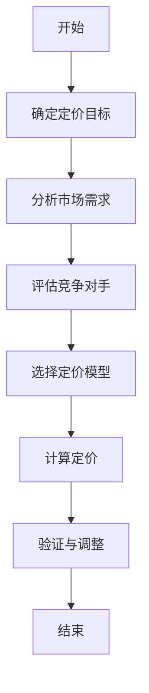

                 


# 彼得林奇如何分析公司的产品定价策略

## 关键词
- 彼得林奇
- 定价策略
- 投资分析
- 市场需求
- 产品定价

## 摘要
本文深入分析彼得·林奇如何从基本面角度评估公司的产品定价策略。通过介绍定价策略的核心概念、分析框架、数学模型和实际案例，揭示如何通过定价策略评估企业的市场地位和盈利能力。

---

## 第一部分: 定价策略概述

### 第1章: 定价策略的基本概念

#### 1.1 定价策略的定义与重要性

##### 1.1.1 定价策略的定义
定价策略是企业在市场中确定产品或服务价格的一套规则和方法。它不仅是企业盈利的关键因素，也是企业市场竞争力的重要体现。

##### 1.1.2 定价策略在企业中的重要性
- 影响企业的利润水平
- 影响市场需求和销售量
- 影响企业的市场地位
- 影响客户对企业产品或服务的感知价值

##### 1.1.3 彼得林奇对定价策略的重视
彼得·林奇在其投资分析中，非常重视企业定价策略的合理性。他认为，一个合理的定价策略能够反映企业的市场地位、成本控制能力和盈利能力。

#### 1.2 定价策略的核心要素

##### 1.2.1 产品成本
定价策略的基础是产品成本，包括生产成本、运营成本和研发投入。彼得林奇会仔细分析企业的成本结构，确保定价能够覆盖成本并带来利润。

##### 1.2.2 市场需求
市场需求是定价的核心因素。彼得林奇会研究市场的需求弹性、消费者偏好和价格敏感度，以确定最优价格。

##### 1.2.3 竞争对手分析
了解竞争对手的定价策略是制定自身定价策略的重要部分。彼得林奇会分析竞争对手的成本结构和定价策略，寻找差异化的定价机会。

##### 1.2.4 利润目标
企业需要设定合理的利润目标。彼得林奇会评估企业定价策略是否能够实现预期利润，同时保持价格的竞争力。

### 第2章: 彼得林奇分析定价策略的方法

#### 2.1 彼得林奇的分析框架

##### 2.1.1 从基本面分析入手
彼得林奇会从企业的基本面入手，包括收入、利润、成本、市场份额等，分析企业的定价能力。

##### 2.1.2 关注企业的定价能力
定价能力是企业竞争力的体现。彼得林奇会评估企业是否能够在保证利润的前提下，通过定价策略吸引和留住客户。

##### 2.1.3 评估定价策略的可持续性
彼得林奇会分析定价策略的长期可行性，确保企业在不同市场环境下能够维持合理的定价。

#### 2.2 彼得林奇的定价策略分析工具

##### 2.2.1 财务指标分析
- 销售收入
- 毛利率
- 净利率
- 成本结构

##### 2.2.2 市场地位分析
- 市场份额
- 市场定位
- 品牌影响力

##### 2.2.3 竞争环境分析
- 竞争对手的定价策略
- 竞争态势
- 行业发展趋势

#### 2.3 彼得林奇案例分析

##### 2.3.1 某公司定价策略的成功案例
彼得林奇曾分析过一家公司，该公司通过精准的需求预测和成本控制，制定了合理的定价策略，实现了利润和市场份额的双重增长。

##### 2.3.2 某公司定价策略的失败案例
彼得林奇也指出过一些公司定价策略的不足，例如未能及时调整价格以应对市场变化，导致市场份额流失。

---

## 第二部分: 定价策略的核心概念与联系

### 第3章: 定价策略的核心原理

#### 3.1 定价模型的原理

##### 3.1.1 成本加成定价模型
成本加成定价是一种简单且常用的定价方法，公式如下：
$$ 成本加成价格 = 成本 \times (1 + 成本加成率) $$

##### 3.1.2 市场需求定价模型
市场需求定价模型基于价格弹性，公式如下：
$$ Q = a - bP $$
其中，Q是需求量，P是价格，a和b是参数。

##### 3.1.3 价值定价模型
价值定价以客户感知价值为核心，通过分析客户愿意支付的价格来制定定价策略。

#### 3.2 定价模型的属性对比

##### 3.2.1 不同定价模型的优缺点对比
| 定价模型 | 优点 | 缺点 |
|----------|------|------|
| 成本加成定价 | 简单易行 | 忽视市场需求 |
| 市场需求定价 | 精准反映需求 | 需要准确的需求弹性数据 |
| 价值定价 | 提高客户满意度 | 需要深入了解客户价值 |

#### 3.3 定价策略的决策流程


### 第4章: 定价策略的数学模型与公式

#### 4.1 成本加成定价模型

##### 4.1.1 成本加成定价公式
$$ 成本加成价格 = 成本 \times (1 + 成本加成率) $$

例如，假设成本为100，成本加成率为20%，则定价为：
$$ 100 \times 1.2 = 120 $$

#### 4.2 市场需求定价模型

##### 4.2.1 需求函数
$$ Q = a - bP $$
其中，Q是需求量，P是价格，a和b是参数。

假设a=1000，b=20，则当价格P=50时，需求量Q=1000 - 20*50=400。

---

## 第三部分: 项目实战与案例分析

### 第5章: 项目实战

#### 5.1 环境安装

##### 5.1.1 安装Python环境
使用Python进行定价策略的数学建模和数据分析。

##### 5.1.2 安装必要的库
安装Pandas、NumPy、Matplotlib等库，用于数据处理和可视化。

#### 5.2 系统核心实现源代码

##### 5.2.1 成本加成定价模型的实现
```python
def cost_plus_pricing(cost, markup):
    return cost * (1 + markup)
```

##### 5.2.2 市场需求定价模型的实现
```python
def demand_function(a, b, price):
    return a - b * price
```

#### 5.3 代码应用解读与分析

##### 5.3.1 成本加成定价模型的应用
假设成本为100，成本加成为20%，则定价为：
$$ 100 \times 1.2 = 120 $$

##### 5.3.2 市场需求定价模型的应用
假设a=1000，b=20，价格P=50，则需求量Q=400。

#### 5.4 实际案例分析和详细讲解

##### 5.4.1 案例分析
以某公司为例，分析其定价策略的合理性，包括成本、市场需求、竞争对手等因素。

##### 5.4.2 详细讲解
通过分析定价策略的各个因素，揭示企业如何通过合理的定价策略实现利润和市场份额的双重目标。

#### 5.5 项目小结
本项目通过实际案例分析，展示了如何使用数学模型和数据分析工具来评估和制定定价策略，帮助企业在竞争激烈的市场中制定合理的定价策略。

---

## 第四部分: 最佳实践、小结与注意事项

### 第6章: 最佳实践

#### 6.1 小结
定价策略是企业盈利能力的重要组成部分。彼得林奇通过基本面分析、市场需求分析和竞争对手分析，制定合理的定价策略，确保企业的长期盈利能力。

#### 6.2 注意事项
- 定价策略需要根据市场环境的变化进行调整。
- 定价策略需要结合企业的实际情况，避免一刀切。
- 定价策略需要考虑客户感知价值，避免价格战。

#### 6.3 拓展阅读
建议读者进一步阅读彼得·林奇的著作，深入了解他的投资哲学和定价策略分析方法。

---

## 作者

作者：AI天才研究院/AI Genius Institute & 禅与计算机程序设计艺术 /Zen And The Art of Computer Programming

---

通过以上内容，读者可以系统地学习彼得·林奇的定价策略分析方法，并将其应用到实际的企业分析中，提升自身的投资分析能力。

