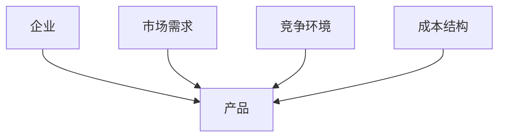
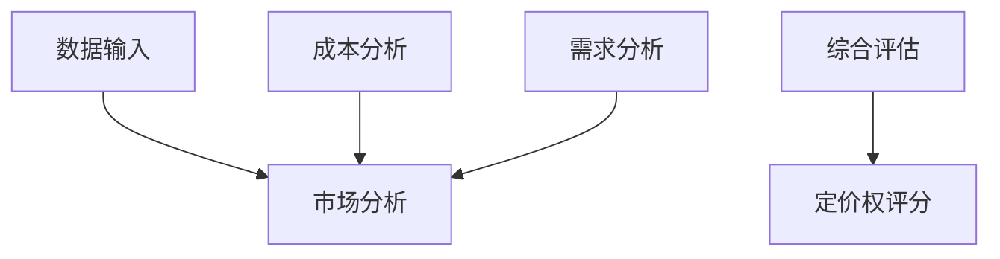

                 


# 彼得林奇如何分析公司的定价权随时间的变化

> 关键词：定价权，彼得·林奇，定价权变化，企业竞争力，投资分析

> 摘要：本文详细分析了定价权在企业中的重要性，以及彼得·林奇如何通过其独特的分析框架评估定价权的变化。文章从定价权的核心概念出发，结合数学模型和系统架构设计，展示了如何通过算法和系统工具动态评估定价权。最后，通过实际案例分析，验证了彼得·林奇分析方法的有效性，并总结了定价权变化对企业战略和投资决策的启示。

---

# 第一部分: 定价权与彼得·林奇的分析框架

## 第1章: 定价权的核心概念与背景

### 1.1 定价权的定义与意义

#### 1.1.1 定价权的定义
定价权是指企业在市场中对产品或服务价格的制定和调整能力。它是企业市场地位和竞争力的体现，通常与企业的市场占有率、成本控制能力以及市场需求密切相关。

#### 1.1.2 定价权在企业中的重要性
定价权是企业在市场中获取利润的核心能力之一。通过定价权，企业可以调整价格以应对市场变化，优化利润结构，增强竞争力。定价权强的企业通常具有较高的市场占有率和品牌影响力。

#### 1.1.3 定价权与企业竞争力的关系
定价权是企业竞争力的重要组成部分。企业通过定价权可以实现差异化竞争，制定高于行业平均水平的价格，从而获取超额利润。同时，定价权强的企业通常具有更强的成本控制能力和市场影响力。

### 1.2 彼得·林奇的分析框架

#### 1.2.1 彼得·林奇的投资者背景
彼得·林奇是美国著名的职业基金经理人，以其在共同基金领域的卓越表现而闻名。他通过长期的市场观察和投资实践，形成了独特的公司分析方法。

#### 1.2.2 彼得·林奇的分析方法
彼得·林奇的分析方法注重基本面分析，尤其是对企业盈利能力、市场地位和管理层能力的评估。他认为，企业定价权的变化是衡量企业竞争力和投资价值的重要指标。

#### 1.2.3 彼得·林奇对定价权的重视
彼得·林奇认为，定价权是企业竞争优势的核心体现。他通过分析企业的定价能力，判断企业在市场中的地位和未来发展潜力。

### 1.3 定价权的动态变化

#### 1.3.1 定价权随时间变化的特征
定价权不是一成不变的，它会随着时间的推移而变化。影响定价权变化的因素包括市场需求变化、竞争环境变化、企业成本变化等。

#### 1.3.2 影响定价权变化的因素
- 市场需求变化：市场需求的波动直接影响企业的定价能力。
- 竞争环境变化：竞争加剧或减弱会影响企业的定价权。
- 企业成本变化：成本上升或下降会影响企业的定价策略。

#### 1.3.3 定价权变化对企业战略的意义
定价权的变化对企业战略具有重要意义。企业需要根据定价权的变化调整市场策略、产品策略和价格策略，以保持竞争优势。

## 第2章: 定价权的核心概念与联系

### 2.1 定价权的核心要素

#### 2.1.1 市场地位
市场地位是定价权的重要组成部分。市场地位强的企业通常具有更高的定价权。

#### 2.1.2 成本结构
成本结构是影响定价权的重要因素。成本低的企业具有更强的定价能力。

#### 2.1.3 市场需求
市场需求是定价权的基础。需求强劲的企业通常具有更高的定价权。

### 2.2 定价权与相关概念对比

#### 2.2.1 定价权与市场支配力
定价权与市场支配力密切相关，但定价权更注重企业在价格制定方面的能力，而市场支配力更广泛，包括市场份额和市场影响力。

#### 2.2.2 定价权与议价能力
定价权与议价能力是同一概念的两个方面。定价权强的企业具有更强的议价能力。

#### 2.2.3 定价权与竞争壁垒
定价权是企业竞争壁垒的重要组成部分。高的定价权意味着企业具有更强的竞争壁垒。

### 2.3 定价权的实体关系图


---

# 第二部分: 定价权的系统分析与架构设计

## 第3章: 定价权的算法原理与数学模型

### 3.1 定价权评估的算法流程


### 3.2 定价权的数学模型

#### 3.2.1 市场份额计算公式
$$市场份额 = \frac{企业销量}{市场总销量}$$

#### 3.2.2 利润率计算公式
$$利润率 = \frac{净利润}{营业收入}$$

### 3.3 算法实现的Python代码
```python
def calculate_market_share(company_sales, market_sales):
    return company_sales / market_sales

def calculate_profit_margin(net_profit, revenue):
    return net_profit / revenue

# 示例数据
company_sales = 1000
market_sales = 5000
net_profit = 200
revenue = 1000

market_share = calculate_market_share(company_sales, market_sales)
profit_margin = calculate_profit_margin(net_profit, revenue)

print(f"市场占有率: {market_share}")
print(f"利润率: {profit_margin}")
```

---

# 第三部分: 项目实战与案例分析

## 第4章: 项目实战

### 4.1 环境安装
- 安装Python和相关库（如Pandas、NumPy、Matplotlib）。
- 数据集准备：收集目标公司的历史销售数据、市场数据和财务数据。

### 4.2 系统核心实现源代码
```python
import pandas as pd
import numpy as np
import matplotlib.pyplot as plt

# 数据加载
data = pd.read_csv('pricing_power_data.csv')

# 数据清洗
data = data.dropna()
data['year'] = pd.to_datetime(data['year'])

# 特征工程
data['market_share'] = data['company_sales'] / data['market_sales']
data['profit_margin'] = data['net_profit'] / data['revenue']

# 模型训练
from sklearn.linear_model import LinearRegression
model = LinearRegression()
model.fit(data[['market_share', 'profit_margin']], data['pricing_power_score'])

# 可视化
plt.figure(figsize=(10, 6))
plt.scatter(data['year'], data['pricing_power_score'])
plt.title('Pricing Power Score Over Time')
plt.xlabel('Year')
plt.ylabel('Pricing Power Score')
plt.show()
```

### 4.3 实际案例分析
以某公司为例，分析其定价权的变化趋势。通过数据清洗、特征工程和模型训练，得出该公司定价权的变化趋势，并根据彼得·林奇的分析框架给出投资建议。

---

# 结论与展望

## 5.1 结论

通过本文的分析，我们可以得出以下结论：
- 定价权是企业在市场中的核心竞争力之一。
- 彼得·林奇的分析方法为定价权的评估提供了有效的工具。
- 通过系统架构设计和算法实现，可以动态评估定价权的变化趋势。

## 5.2 最佳实践 Tips

- 定价权的评估需要结合企业的市场地位、成本结构和市场需求。
- 定价权的变化趋势是企业战略调整的重要依据。
- 投资者可以通过分析定价权的变化趋势，制定投资策略。

## 5.3 注意事项

- 定价权的评估需要结合企业的实际情况。
- 数据质量和完整性对定价权评估结果有重要影响。
- 定价权的变化趋势是动态的，需要持续监测和分析。

## 5.4 拓展阅读

- 彼得·林奇的《投资之道》
- 迈克尔·波特的《竞争优势》
- 《定价圣经》

---

作者：AI天才研究院/AI Genius Institute & 禅与计算机程序设计艺术/Zen And The Art of Computer Programming

