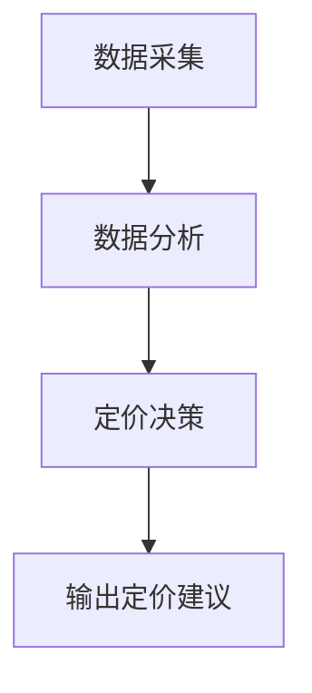
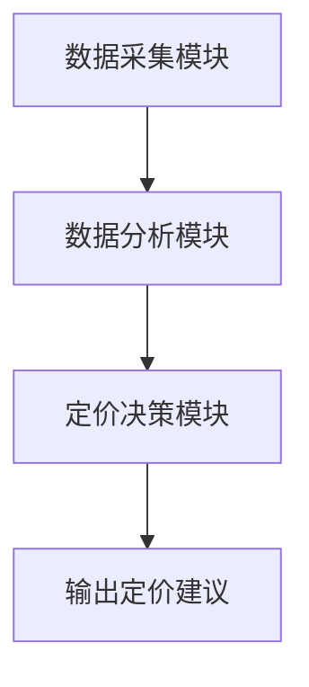

                 


# 彼得林奇如何分析公司的定价策略演变

> 关键词：彼得林奇，定价策略，定价模型，投资分析，定价弹性，成本控制，市场需求

> 摘要：本文将深入探讨彼得林奇如何分析公司的定价策略演变，从定价策略的核心概念到定价策略的系统分析，再到定价策略的实战案例，全面解析定价策略对企业投资价值的影响。通过本文，读者将掌握定价策略的分类、定价模型的建立、定价策略的数学分析、定价策略的系统架构设计以及定价策略在实际投资中的应用。

---

## 第一部分: 定价策略演变的背景与核心概念

### 第1章: 定价策略的基本概念

#### 1.1 定价策略的定义与作用

##### 1.1.1 定价策略的定义
定价策略是指企业在制定产品或服务价格时所采用的方法和规则。价格是企业与市场互动的核心要素之一，直接影响企业的利润、市场份额和客户满意度。

##### 1.1.2 定价策略在企业中的作用
定价策略不仅是企业的核心决策之一，还直接影响企业的财务表现和市场地位。合理的定价策略可以帮助企业实现利润最大化，同时吸引和保留客户。

##### 1.1.3 定价策略的核心要素
定价策略的核心要素包括成本、市场需求、竞争环境和定价弹性。这些要素共同决定了价格的制定和调整。

#### 1.2 定价策略的演变过程

##### 1.2.1 传统定价策略的局限性
传统定价策略通常基于成本加成定价法，这种方法忽略了市场需求的变化和竞争环境的动态。

##### 1.2.2 现代定价策略的特征
现代定价策略更加注重市场需求和客户价值，采用灵活的定价方法，如价值定价、动态定价和差异化定价。

##### 1.2.3 定价策略演变的驱动力
定价策略的演变主要由技术进步、市场竞争加剧和消费者需求多样化驱动。

### 第2章: 定价策略对公司的影响

#### 2.1 定价策略与企业利润的关系

##### 2.1.1 定价策略对利润率的影响
合理的定价策略可以提高企业的利润率，而过低或过高的价格则可能导致利润下降或市场流失。

##### 2.1.2 定价策略与成本控制
定价策略需要考虑成本结构，同时通过优化成本和价格来实现利润最大化。

##### 2.1.3 定价策略与市场需求的平衡
定价策略需要在吸引客户和实现利润之间找到平衡点，避免因价格过高或过低而导致市场需求下降或成本浪费。

#### 2.2 定价策略与市场竞争

##### 2.2.1 定价策略在竞争中的作用
定价策略是企业在市场竞争中的重要工具，可以帮助企业获得市场份额或提高利润率。

##### 2.2.2 不同市场环境下的定价策略
在不同的市场环境下，企业需要采用不同的定价策略。例如，在垄断市场中，企业可以采用高价策略；在竞争激烈的市场中，企业可能需要采用价格战策略。

##### 2.2.3 定价策略对市场份额的影响
定价策略直接影响企业的市场份额。合理的定价策略可以帮助企业扩大市场份额，而错误的定价策略可能导致市场份额流失。

---

## 第二部分: 定价策略的核心概念与分析方法

### 第3章: 定价策略的核心概念

#### 3.1 定价策略的分类

##### 3.1.1 成本导向定价法
成本导向定价法是以成本为基础的定价方法，包括成本加成定价法和目标利润定价法。

##### 3.1.2 需求导向定价法
需求导向定价法是以市场需求为基础的定价方法，包括价值定价法和需求弹性定价法。

##### 3.1.3 竞争导向定价法
竞争导向定价法是以竞争对手的价格为基础的定价方法，包括跟随定价法和领导者定价法。

#### 3.2 定价策略的关键要素

##### 3.2.1 成本因素
成本是定价策略的核心要素之一，直接影响价格的制定和调整。

##### 3.2.2 市场需求
市场需求是定价策略的另一个核心要素，决定了价格的上限和下限。

##### 3.2.3 竞争环境
竞争环境影响定价策略的制定和实施，企业需要根据竞争对手的价格和市场反应调整自身的定价策略。

### 第4章: 定价策略的分析方法

#### 4.1 定价策略分析的步骤

##### 4.1.1 确定目标市场
企业需要明确目标市场的需求、竞争环境和客户特征，以便制定有效的定价策略。

##### 4.1.2 分析竞争对手
企业需要分析竞争对手的定价策略、市场份额和市场反应，以便制定具有竞争力的定价策略。

##### 4.1.3 评估成本结构
企业需要评估自身的成本结构，包括固定成本和可变成本，以便制定合理的定价策略。

##### 4.1.4 确定价格弹性
企业需要确定价格弹性，即价格变动对需求量的影响程度，以便制定具有弹性的定价策略。

#### 4.2 定价策略的数学模型

##### 4.2.1 需求函数的建立
需求函数描述价格与需求量之间的关系，通常可以用线性回归模型表示：
$$ Q = aP + b $$

##### 4.2.2 利润最大化模型
利润最大化模型描述价格与利润之间的关系，通常可以用以下公式表示：
$$ \text{利润} = (P - C) \times Q $$

##### 4.2.3 价格弹性的计算公式
价格弹性是价格变动对需求量的影响程度，可以用以下公式计算：
$$ \text{弹性} = \frac{\% \Delta Q}{\% \Delta P} $$

#### 4.3 定价策略的优劣势对比

##### 4.3.1 成本导向定价法的优劣势
成本导向定价法的优点是简单易行，缺点是忽略了市场需求和竞争环境的变化。

##### 4.3.2 需求导向定价法的优劣势
需求导向定价法的优点是能够满足市场需求，缺点是难以预测市场需求的变化。

##### 4.3.3 竞争导向定价法的优劣势
竞争导向定价法的优点是能够适应竞争环境，缺点是容易受到竞争对手价格策略的影响。

---

## 第三部分: 定价策略的系统分析与架构设计

### 第5章: 定价策略的系统分析

#### 5.1 定价策略的系统架构
定价策略的系统架构包括数据采集模块、数据分析模块和定价决策模块。

##### 5.1.1 数据采集模块
数据采集模块负责收集市场数据、竞争对手数据和客户需求数据。

##### 5.1.2 数据分析模块
数据分析模块负责分析数据，包括需求分析、成本分析和竞争分析。

##### 5.1.3 定价决策模块
定价决策模块负责根据分析结果制定定价策略，并输出定价建议。

#### 5.2 定价策略的系统流程图


### 第6章: 定价策略的系统架构设计

#### 6.1 系统功能设计

##### 6.1.1 数据采集功能
数据采集功能包括市场数据采集、竞争对手数据采集和客户需求数据采集。

##### 6.1.2 数据分析功能
数据分析功能包括需求分析、成本分析和竞争分析。

##### 6.1.3 定价决策功能
定价决策功能包括定价策略制定和定价建议输出。

#### 6.2 系统架构图


---

## 第四部分: 定价策略的项目实战

### 第7章: 定价策略的项目实战

#### 7.1 项目介绍
本项目旨在通过实际案例分析，展示如何应用定价策略分析方法来制定合理的定价策略。

#### 7.2 项目核心实现

##### 7.2.1 定价模型的建立
定价模型基于需求函数和利润最大化模型，用Python代码实现。

##### 7.2.2 定价模型的实现代码
```python
import numpy as np
import matplotlib.pyplot as plt

# 假设需求函数为 Q = 1000 - 5P
P = np.arange(0, 200, 1)
Q = 1000 - 5 * P

# 利润函数为 利润 = (P - C) * Q，假设C=20
C = 20
利润 = (P - C) * Q

# 绘制需求曲线和利润曲线
plt.figure(figsize=(10, 6))
plt.plot(P, Q, label='需求曲线')
plt.plot(P, 利润, label='利润曲线')
plt.xlabel('价格')
plt.ylabel('数量或利润')
plt.legend()
plt.show()
```

##### 7.2.3 定价模型的应用解读
通过上述代码，我们可以看到价格和需求之间的关系，以及价格和利润之间的关系。需求曲线显示，随着价格的提高，需求量逐渐下降。利润曲线显示，存在一个最优价格点，使得利润最大化。

#### 7.3 实际案例分析

##### 7.3.1 案例一：苹果的定价策略
苹果采用价值定价法，通过提供高质量的产品和优质的服务，制定较高的价格。

##### 7.3.2 案例二：亚马逊的定价策略
亚马逊采用成本加成定价法，通过大规模采购和高效物流降低成本，制定较低的价格。

#### 7.4 项目小结
通过实际案例分析，我们可以看到不同的定价策略在实际应用中的效果。企业需要根据自身的成本结构、市场需求和竞争环境选择合适的定价策略。

---

## 第五部分: 定价策略的最佳实践与总结

### 第8章: 定价策略的最佳实践

#### 8.1 投资分析与定价策略
定价策略是企业投资分析的重要组成部分，投资者需要关注企业的定价策略对企业利润和市场份额的影响。

#### 8.2 定价策略的注意事项
定价策略的制定需要考虑成本、市场需求和竞争环境的变化，避免因价格过高或过低而导致市场流失或利润下降。

#### 8.3 定价策略的未来趋势
随着技术的进步和市场环境的变化，定价策略将更加注重客户价值和动态调整，企业需要采用更加灵活和智能的定价策略。

### 第9章: 总结与展望

#### 9.1 总结
通过本文的分析，我们可以看到定价策略是企业经营和投资分析的重要内容。合理的定价策略可以帮助企业实现利润最大化，同时满足市场需求和客户需求。

#### 9.2 展望
未来，随着技术的进步和市场环境的变化，定价策略将更加注重客户价值和动态调整。企业需要采用更加灵活和智能的定价策略，以应对复杂多变的市场环境。

---

## 作者信息

作者：AI天才研究院/AI Genius Institute & 禅与计算机程序设计艺术 /Zen And The Art of Computer Programming

---

通过本文的详细分析，我们深入探讨了彼得林奇如何分析公司的定价策略演变，从定价策略的核心概念到定价策略的系统分析，再到定价策略的实战案例，全面解析了定价策略对企业投资价值的影响。希望本文能够帮助读者掌握定价策略的分类、定价模型的建立、定价策略的数学分析、定价策略的系统架构设计以及定价策略在实际投资中的应用。

