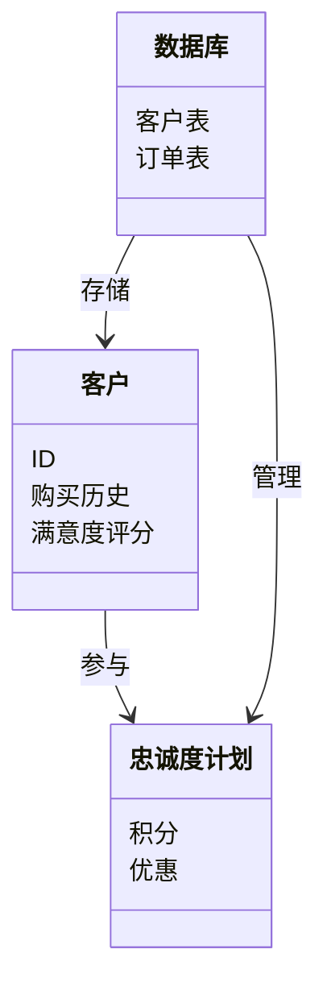
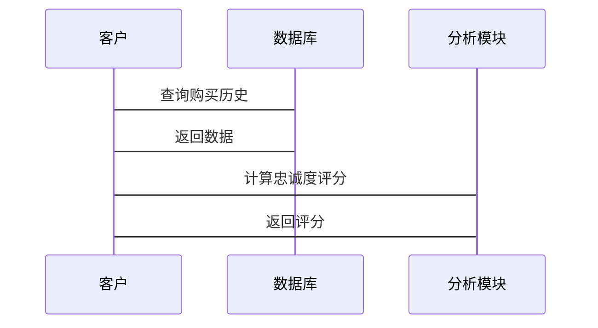

                 


# 彼得林奇如何分析公司的客户忠诚度程序

## 关键词：客户忠诚度，彼得林奇，客户满意度，客户保留率，客户生命周期价值，投资分析

## 摘要：客户忠诚度是企业长期成功的关键因素，本文通过分析彼得·林奇如何评估客户忠诚度程序，探讨其对投资决策的影响。文章详细阐述了客户忠诚度的核心概念、分析方法、数学模型以及实际案例分析，为投资者提供深入的见解和策略。

---

# 第一部分：客户忠诚度程序的背景与概念

## 第1章：客户忠诚度程序的定义与重要性

### 1.1 客户忠诚度的基本概念

#### 1.1.1 客户忠诚度的定义
客户忠诚度是指客户对企业产品或服务的持续购买意愿和行为，通常表现为重复购买、推荐新客户以及对价格敏感度的降低。忠诚的客户不仅为企业带来持续收入，还能通过口碑效应吸引新客户。

#### 1.1.2 客户忠诚度的核心要素
- **满意度**：客户对产品或服务的总体满意程度。
- **保留率**：客户在一定时间内继续购买的比例。
- **忠诚度计划**：企业通过积分、优惠等方式激励客户忠诚的策略。

#### 1.1.3 客户忠诚度与客户满意度的区别
- **客户满意度**关注客户对服务或产品的直接感受。
- **客户忠诚度**则更关注客户长期购买的行为和意愿。

### 1.2 客户忠诚度程序的分析方法

#### 1.2.1 什么是客户忠诚度程序
客户忠诚度程序是企业通过一系列策略和措施，如会员计划、忠诚度积分等，来提高客户忠诚度的系统。

#### 1.2.2 客户忠诚度程序的核心目标
- 提高客户保留率。
- 增加客户的生命周期价值（CLV）。
- 通过数据分析优化忠诚度计划。

#### 1.2.3 客户忠诚度程序的实施步骤
1. **数据收集**：收集客户行为数据。
2. **分析评估**：评估现有忠诚度计划的效果。
3. **策略优化**：根据分析结果优化忠诚度策略。

### 1.3 客户忠诚度程序对投资的影响

#### 1.3.1 客户忠诚度程序与企业盈利能力的关系
高客户忠诚度意味着客户更可能持续购买，从而提高企业的盈利能力。

#### 1.3.2 客户忠诚度程序对股价的潜在影响
客户忠诚度高的企业通常具有更强的市场竞争力，这会反映在其股价上。

#### 1.3.3 彼得·林奇的投资策略与客户忠诚度程序的关联
彼得·林奇通过分析客户忠诚度程序，识别出那些能够持续吸引客户的公司，从而做出投资决策。

### 1.4 本章小结
本章介绍了客户忠诚度的基本概念、分析方法以及其对投资的影响，为后续分析奠定了基础。

---

## 第2章：客户忠诚度程序的分析框架

### 2.1 客户忠诚度程序的分析维度

#### 2.1.1 客户满意度分析
通过客户反馈、评分等数据，评估客户对产品或服务的满意度。

#### 2.1.2 客户保留率分析
计算客户在一定时间内继续购买的比例，评估忠诚度计划的有效性。

#### 2.1.3 客户忠诚度计划的有效性
分析积分、优惠等忠诚度计划对客户行为的影响。

### 2.2 客户忠诚度程序的核心指标

#### 2.2.1 客户生命周期价值（CLV）的计算
CLV = (平均收入 per 客户) × (客户平均生命周期) - (获取客户的成本)

#### 2.2.2 客户净推荐值（NPS）的应用
NPS = (推荐客户的比例) - (批评客户的比例)

#### 2.2.3 客户保留率的计算公式
保留率 = (老客户数量) / (初始客户数量)

### 2.3 客户忠诚度程序的分析工具

#### 2.3.1 数据分析工具的选择
常用工具：Python（Pandas, NumPy）、R、Excel。

#### 2.3.2 数据可视化工具的应用
工具：Matplotlib、Tableau。

#### 2.3.3 机器学习模型的使用
模型：随机森林、逻辑回归。

### 2.4 本章小结
本章详细讲解了客户忠诚度程序的分析维度、核心指标和工具，为后续分析提供了方法论支持。

---

## 第3章：客户忠诚度程序的数学模型与算法

### 3.1 客户忠诚度评分模型

#### 3.1.1 客户忠诚度评分模型的构建
公式：
$$忠诚度评分 = \alpha \times 满意度 + \beta \times 保留率 + \gamma \times 反购率$$

其中，$\alpha$、$\beta$、$\gamma$为权重系数。

#### 3.1.2 客户忠诚度评分的数学公式
通过加权评分法，量化客户的忠诚度水平。

#### 3.1.3 示例：某公司客户忠诚度评分计算
假设$\alpha=0.4$，$\beta=0.3$，$\gamma=0.3$，满意度=80%，保留率=70%，反购率=60%。
忠诚度评分 = 0.4×80 + 0.3×70 + 0.3×60 = 32 + 21 + 18 = 71分。

### 3.2 客户保留率预测模型

#### 3.2.1 客户保留率的预测方法
使用逻辑回归模型预测客户流失概率。

#### 3.2.2 示例：逻辑回归模型
$$P(保留) = \frac{1}{1 + e^{-(\beta_0 + \beta_1x_1 + \beta_2x_2)}}$$
其中，$x_1$为满意度，$x_2$为价格敏感度，$\beta$为系数。

---

## 第4章：客户忠诚度程序的系统分析与架构设计

### 4.1 问题场景介绍
分析一家公司的客户忠诚度程序，识别改进点。

### 4.2 系统功能设计

#### 4.2.1 领域模型设计


### 4.3 系统架构设计


### 4.4 系统接口设计
- API接口：获取客户数据、计算忠诚度评分。

### 4.5 系统交互设计


---

## 第5章：客户忠诚度程序的项目实战

### 5.1 环境安装
安装Python、Pandas、Matplotlib。

### 5.2 核心实现源代码
```python
import pandas as pd
import matplotlib.pyplot as plt

# 数据加载
data = pd.read_csv('客户数据.csv')

# 忠诚度评分计算
def 计算忠诚度评分(row):
    return row['满意度'] * 0.4 + row['保留率'] * 0.3 + row['反购率'] * 0.3

data['忠诚度评分'] = data.apply(计算忠诚度评分, axis=1)

# 可视化
plt.hist(data['忠诚度评分'], bins=10)
plt.xlabel('忠诚度评分')
plt.ylabel('客户数')
plt.show()
```

### 5.3 案例分析
分析航空公司的忠诚度计划，计算客户保留率和CLV，优化积分规则。

---

## 第6章：最佳实践与小结

### 6.1 最佳实践
- 定期评估忠诚度计划效果。
- 结合数据分析优化策略。

### 6.2 注意事项
- 数据准确性是关键。
- 避免过度依赖单一指标。

### 6.3 拓展阅读
推荐书籍：《客户的忠告：如何建立长期客户关系》。

---

## 作者：AI天才研究院 & 禅与计算机程序设计艺术

---

这篇博客文章详细分析了彼得·林奇如何通过客户忠诚度程序进行投资分析，从概念到实践，为读者提供了全面的指导和实用的工具。

