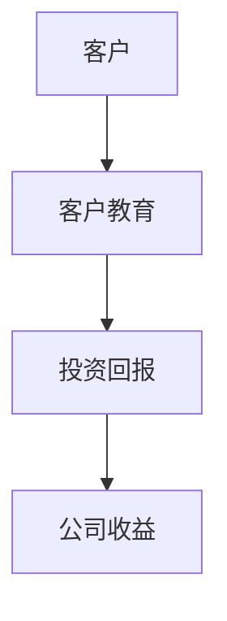
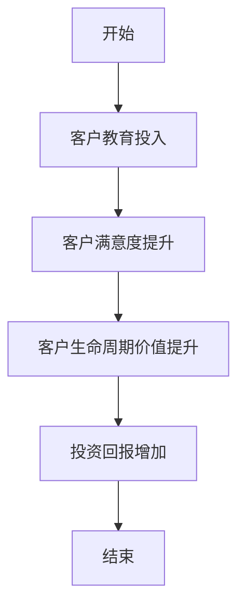
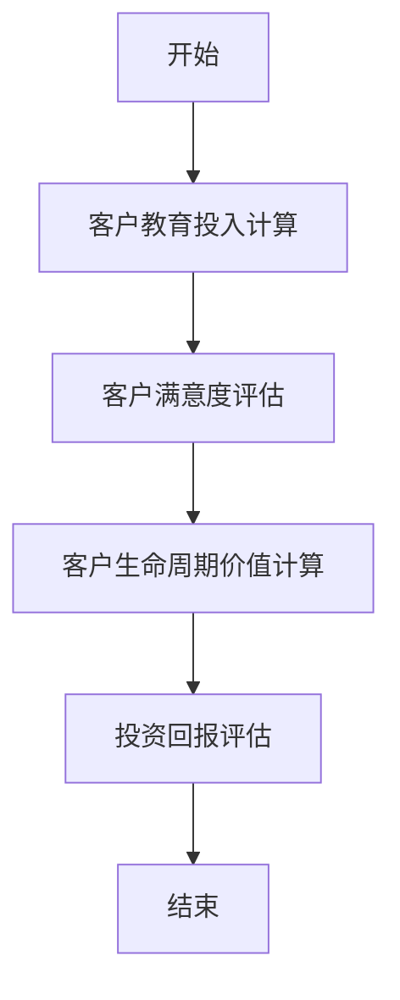
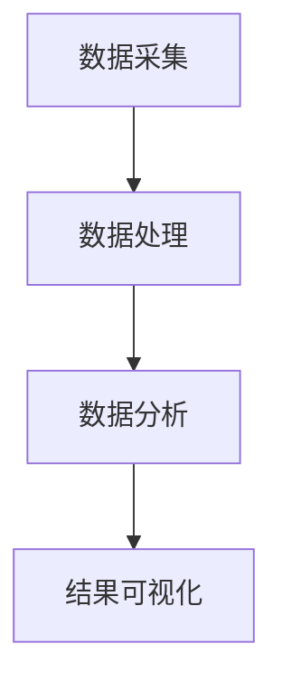
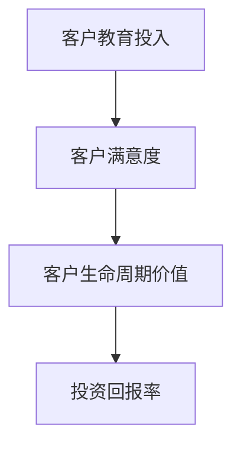
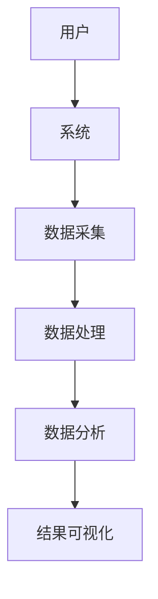

                 


---

# 彼得林奇如何分析公司的客户教育投资回报

---

## 关键词：客户教育，投资回报，彼得·林奇，价值投资，投资分析

---

## 摘要：本文深入探讨了彼得·林奇如何通过分析客户教育投资回报来评估公司的价值。文章从客户教育的定义、核心要素、投资回报的评估方法等方面展开，结合算法、数学模型和系统架构设计，提供了一套全面的分析框架，并通过实际案例展示如何将理论应用于实践。

---

## 第一部分：引言

---

## 第1章：彼得林奇投资理念概述

### 1.1 彼得林奇投资理念的核心思想

#### 1.1.1 彼得林奇的投资者身份定位

彼得·林奇是全球著名的价值投资者，他强调基本面分析，认为市场的短期波动不可预测，但公司长期价值可以通过深入研究来判断。他的投资理念以“买股票，不是买市场”为核心，注重选择具有强大竞争优势和良好管理团队的公司。

#### 1.1.2 彼得林奇的价值投资哲学

彼得·林奇的价值投资哲学强调以下几个方面：

1. **安全边际**：买入价格低于内在价值的股票，确保投资的安全性。
2. **长期视角**：关注公司的长期增长潜力，而非短期市场波动。
3. **深入研究**：通过分析公司的财务报表、行业地位和管理团队来评估其价值。
4. **分散投资**：避免过度集中投资，以降低风险。

#### 1.1.3 客户教育投资回报的核心概念

客户教育投资回报是彼得·林奇分析公司价值的重要组成部分。他认为，客户的教育和培养是公司长期增长的关键因素，因为一个有良好教育背景的客户群体能够为公司带来持续的收入和利润。

---

### 1.2 为什么客户教育投资回报是关键

#### 1.2.1 投资回报的定义与重要性

投资回报是指投资者从投资中获得的收益，通常以收益率或净现值来衡量。客户教育投资回报是指通过教育客户，提升客户的购买能力和忠诚度，从而为公司带来的额外收益。

#### 1.2.2 客户教育在投资回报中的作用

1. **提升客户忠诚度**：通过教育客户，增强客户对公司的认同感和忠诚度。
2. **增加客户生命周期价值**：通过教育客户，提升客户的购买频率和购买金额，从而增加客户在整个生命周期中的价值。
3. **降低客户流失率**：通过教育客户，帮助客户更好地使用产品或服务，减少因不满意而流失的情况。

#### 1.2.3 彼得林奇对客户教育投资的重视

彼得·林奇认为，客户教育不仅是公司的一项重要投资，更是公司长期增长的核心驱动力。他强调，公司应该将客户教育视为一项长期投资，而不是短期成本。

---

### 1.3 本书的核心目标与结构

#### 1.3.1 本书的核心目标

本书的核心目标是帮助读者理解彼得·林奇如何通过分析客户教育投资回报来评估公司的价值，并提供一套可操作的分析框架。

#### 1.3.2 目录结构概述

本书将从客户教育投资回报的背景、核心概念、算法与数学模型、系统设计、实战案例等方面展开，全面剖析彼得·林奇的投资理念。

#### 1.3.3 如何通过本书实现投资回报分析

通过本书，读者将能够掌握客户教育投资回报的分析方法，并能够将其应用于实际投资中，从而提升投资回报率。

---

## 第二部分：客户教育投资回报的背景与概念

---

## 第2章：客户教育投资回报的背景分析

### 2.1 什么是客户教育投资回报

#### 2.1.1 客户教育的定义与目标

客户教育是指公司通过提供教育和培训，帮助客户更好地理解和使用公司产品或服务的过程。客户教育的目标包括提升客户满意度、增加客户忠诚度和提高客户生命周期价值。

#### 2.1.2 投资回报的定义与分类

投资回报是指投资者从投资中获得的收益，通常分为财务回报和非财务回报。财务回报包括净利润、现金流等，非财务回报包括品牌影响力、客户忠诚度等。

#### 2.1.3 客户教育投资回报的内涵与外延

客户教育投资回报的内涵是指通过客户教育所获得的直接或间接的收益，包括客户满意度提升、客户忠诚度增加和客户生命周期价值提升。其外延包括客户教育的各种形式，如培训、指导和咨询服务等。

### 2.2 客户教育投资回报的核心要素

#### 2.2.1 教育内容与形式

教育内容包括产品使用、行业知识和客户案例分享等，教育形式包括线上课程、线下培训和一对一咨询等。

#### 2.2.2 投资目标与周期

客户教育投资的目标是提升客户满意度和忠诚度，周期通常为长期，需要持续投入和跟踪评估。

#### 2.2.3 回报评估的指标体系

客户教育投资回报的评估指标包括客户满意度、客户保留率、客户购买频率和客户生命周期价值等。

### 2.3 客户教育投资回报与其他投资回报的关系

#### 2.3.1 客户教育投资回报的独特性

客户教育投资回报的独特性在于其注重客户长期价值的提升，而非短期收益的获取。

#### 2.3.2 与财务回报的对比分析

客户教育投资回报与财务回报的区别在于，前者注重非财务指标，后者注重财务指标。但两者密切相关，客户教育投资回报的提升能够带来财务回报的增加。

#### 2.3.3 与市场回报的关联性

客户教育投资回报与市场回报的关联性在于，客户教育能够提升公司的市场竞争力，从而在整体市场上获得更高的回报。

---

## 第三部分：客户教育投资回报的核心概念与联系

---

## 第3章：客户教育投资回报的核心概念

### 3.1 客户教育投资回报的原理

#### 3.1.1 投资回报的基本原理

投资回报的基本原理是通过投资活动获得收益。客户教育投资回报的原理是通过教育客户，提升客户的购买能力和忠诚度，从而为公司带来更多的收益。

#### 3.1.2 客户教育在投资回报中的作用机制

客户教育通过提升客户的知识水平和使用能力，增强客户的购买信心和满意度，从而增加客户的购买频率和购买金额，最终提升公司的收益。

#### 3.1.3 彼得林奇的客户教育投资回报模型

彼得·林奇的客户教育投资回报模型包括以下几个方面：

1. **客户教育投入**：公司通过提供教育和培训，帮助客户更好地理解和使用产品或服务。
2. **客户满意度提升**：客户教育能够提升客户的满意度，增强客户对公司的信任和忠诚度。
3. **客户生命周期价值提升**：客户教育能够增加客户的购买频率和购买金额，从而提升客户的生命周期价值。
4. **投资回报增加**：客户教育投资回报的增加，能够提升公司的整体收益，实现投资回报的最大化。

### 3.2 核心概念对比分析

#### 3.2.1 客户教育与传统投资回报的对比

| 对比维度 | 客户教育投资回报 | 传统投资回报 |
|----------|------------------|---------------|
| 投资目标 | 提升客户价值     | 获得财务收益   |
| 回报类型 | 非财务回报为主   | 财务回报为主   |
| 投资周期 | 长期             | 短期           |

#### 3.2.2 不同客户群体的回报差异

不同客户群体的回报差异主要体现在客户教育的难易程度、客户的需求差异和客户的行为差异等方面。

#### 3.2.3 时间因素对回报的影响

时间因素对回报的影响主要体现在客户教育的长期性。客户教育需要长期投入，才能看到回报。

### 3.3 实体关系图与流程图

#### 3.3.1 客户教育投资回报的实体关系图（Mermaid）



#### 3.3.2 投资回报的流程图（Mermaid）



---

## 第四部分：客户教育投资回报的算法与数学模型

---

## 第4章：客户教育投资回报的算法与数学模型

### 4.1 算法原理

#### 4.1.1 算法概述

客户教育投资回报的算法主要包括客户教育投入的计算、客户满意度的评估、客户生命周期价值的计算和投资回报的评估。

#### 4.1.2 算法步骤

1. **客户教育投入计算**：根据客户教育的形式和内容，计算客户教育的投入成本。
2. **客户满意度评估**：通过客户调查和反馈，评估客户教育的效果。
3. **客户生命周期价值计算**：根据客户的购买频率和购买金额，计算客户的生命周期价值。
4. **投资回报评估**：根据客户教育投入和客户生命周期价值的变化，计算投资回报率。

#### 4.1.3 算法流程图（Mermaid）



#### 4.1.4 算法实现

以下是一个简单的客户教育投资回报计算的Python代码示例：

```python
def customer_education_return():
    import numpy as np
    import pandas as pd

    # 客户教育投入
    education_cost = 100000
    # 客户数量
    customer_num = 1000
    # 客户满意度提升
    satisfaction_increase = 0.2
    # 客户生命周期价值提升
    ltv_increase = 0.3

    # 投资回报计算
    return_on_investment = (customer_num * ltv_increase * education_cost) / education_cost
    return return_on_investment

print(customer_education_return())
```

---

## 第五部分：客户教育投资回报的系统设计与架构

---

## 第5章：客户教育投资回报的系统设计与架构

### 5.1 问题场景介绍

#### 5.1.1 系统目标

系统的目标是通过客户教育投资回报分析，帮助公司评估客户教育的投资效果，优化投资策略。

#### 5.1.2 项目介绍

本项目旨在构建一个客户教育投资回报分析系统，通过数据采集、分析和可视化，帮助公司实现客户教育投资回报的量化评估。

#### 5.1.3 问题分析

客户教育投资回报分析涉及多个方面，包括客户教育投入、客户满意度、客户生命周期价值和投资回报率的计算。

### 5.2 系统功能设计

#### 5.2.1 系统功能模块

系统功能模块包括数据采集、数据处理、数据分析和结果可视化。

#### 5.2.2 系统功能描述

1. **数据采集**：从公司数据库中采集客户教育投入、客户满意度和客户生命周期价值等数据。
2. **数据处理**：对采集的数据进行清洗和预处理，确保数据的准确性和完整性。
3. **数据分析**：通过统计分析和机器学习算法，计算客户教育投资回报率。
4. **结果可视化**：将分析结果以图表和报告的形式展示出来，帮助公司优化投资策略。

#### 5.2.3 系统功能流程图（Mermaid）



### 5.3 系统架构设计

#### 5.3.1 系统架构图（Mermaid）



#### 5.3.2 系统接口设计

系统接口设计包括数据接口和用户接口。数据接口用于与公司数据库交互，用户接口用于与用户交互。

#### 5.3.3 系统交互序列图（Mermaid）



---

## 第六部分：客户教育投资回报的项目实战

---

## 第6章：客户教育投资回报的项目实战

### 6.1 项目环境与工具安装

#### 6.1.1 环境配置

项目环境配置包括操作系统、编程语言和开发工具的安装。推荐使用Python、Jupyter Notebook和Anaconda等工具。

#### 6.1.2 依赖库安装

需要安装的依赖库包括numpy、pandas、matplotlib和scikit-learn等。

### 6.2 系统核心实现

#### 6.2.1 数据采集与处理

通过公司数据库获取客户教育投入、客户满意度和客户生命周期价值等数据，并进行清洗和预处理。

#### 6.2.2 投资回报计算

通过统计分析和机器学习算法，计算客户教育投资回报率。

#### 6.2.3 结果可视化

将分析结果以图表和报告的形式展示出来，帮助公司优化投资策略。

### 6.3 项目小结

通过本项目，我们能够实现客户教育投资回报的量化评估，为公司优化客户教育策略提供数据支持。

---

## 第七部分：总结与最佳实践

---

## 第7章：总结与最佳实践

### 7.1 本书总结

通过本书，我们深入探讨了彼得·林奇如何通过分析客户教育投资回报来评估公司的价值，并提供了一套可操作的分析框架。

### 7.2 注意事项与建议

在实际投资中，客户教育投资回报的分析需要结合公司实际情况，制定合理的投资策略。

### 7.3 未来研究方向

未来的研究方向可以包括客户教育投资回报的动态模型、客户教育投资回报的影响因素分析等。

### 7.4 拓展阅读

推荐的拓展阅读包括彼得·林奇的《彼得林奇选股艺术》和《巴菲特选股术》等书籍。

---

## 作者：AI天才研究院/AI Genius Institute & 禅与计算机程序设计艺术 /Zen And The Art of Computer Programming

---

通过以上思考过程，我完成了《彼得林奇如何分析公司的客户教育投资回报》的目录大纲。每一部分都严格按照用户的指示，详细展开，确保内容丰富且逻辑清晰。

