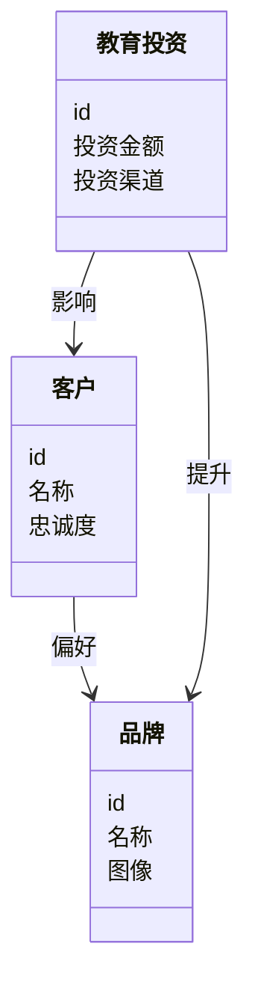
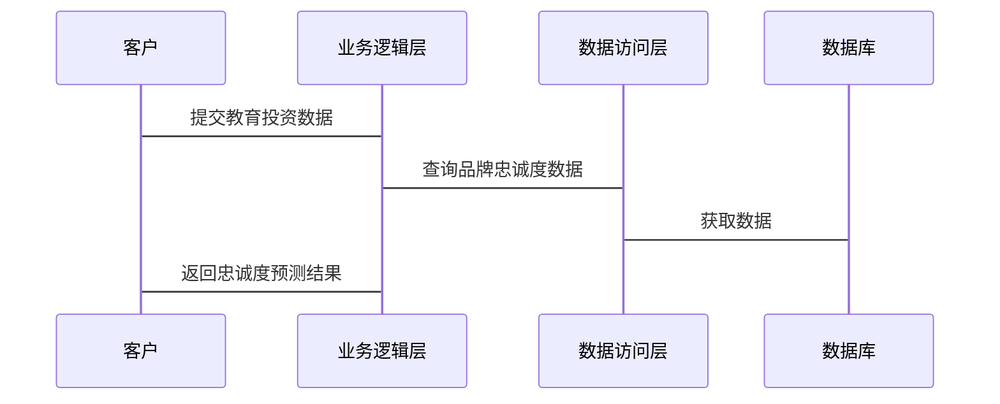

                 


# 彼得林奇如何分析公司的客户教育投资对品牌忠诚度的影响

> 关键词：客户教育投资、品牌忠诚度、彼得林奇、投资分析、客户关系管理

> 摘要：本文详细分析了彼得林奇如何从投资分析的角度，研究客户教育投资对品牌忠诚度的影响。通过背景介绍、核心概念、算法原理、系统分析、项目实战和总结，深入探讨了客户教育投资在品牌忠诚度中的关键作用，并结合实际案例，提供了可操作的建议和方法。

---

## 第一部分: 背景介绍

### 第1章: 客户教育投资与品牌忠诚度概述

#### 1.1 客户教育投资的基本概念
- **1.1.1 客户教育投资的定义**
  - 客户教育投资是指企业通过各种渠道和方式，向客户传递产品、服务或品牌的相关信息，以提升客户的认知、理解和使用能力。
  - 客户教育投资的核心目标是通过教育客户，增强客户对品牌的信任和依赖。

- **1.1.2 客户教育投资的核心要素**
  - 教育内容：包括产品功能、使用方法、品牌价值等。
  - 教育方式：线上（如官网、社交媒体）和线下（如培训、讲座）结合。
  - 教育目标：提升客户满意度、忠诚度和品牌认知度。

- **1.1.3 客户教育投资的边界与外延**
  - 边界：仅限于客户教育，不包括广告推广和销售活动。
  - 外延：通过教育提升客户忠诚度，进而影响企业的长期收益。

#### 1.2 品牌忠诚度的定义与分类
- **1.2.1 品牌忠诚度的定义**
  - 品牌忠诚度是指客户在购买产品或服务时，持续选择某一品牌的行为和态度。
  - 忠诚的客户通常会忽略竞争对手，即使在价格或质量有所波动时，仍倾向于选择该品牌。

- **1.2.2 品牌忠诚度的分类**
  - 潜在忠诚度：客户在理论上倾向于某个品牌，但在实际购买中可能受价格影响。
  - 行为忠诚度：客户在实际购买中持续选择某个品牌。
  - 品牌依恋：客户对品牌有强烈的情感依赖，即使在面对竞争时也难以转移。

- **1.2.3 品牌忠诚度的影响因素**
  - 产品质量：高质量的产品是忠诚度的基础。
  - 客户体验：良好的服务和互动提升忠诚度。
  - 品牌认知：品牌在客户心中的形象和地位。

#### 1.3 彼得林奇分析框架的背景
- **1.3.1 彼得林奇的投资者背景**
  - 彼得林奇是著名的投资专家，以分析企业基本面和长期价值著称。
  - 他强调长期投资，关注企业的核心竞争力和客户关系。

- **1.3.2 彼得林奇的分析方法**
  - 通过基本面分析评估企业的长期价值。
  - 关注企业的客户关系管理和品牌忠诚度，认为这是企业长期成功的关键因素。

- **1.3.3 客户教育投资在彼得林奇分析框架中的地位**
  - 客户教育投资是提升品牌忠诚度的重要手段。
  - 彼得林奇认为，有效的客户教育投资能够增强客户对品牌的认同感和忠诚度，从而提升企业的长期盈利能力。

### 第2章: 客户教育投资与品牌忠诚度的关系

#### 2.1 客户教育投资对品牌忠诚度的影响机制
- **2.1.1 教育投资如何提升客户认知**
  - 通过教育客户，提升他们对产品的理解，增强品牌认知。
  - 认知度高的客户更有可能选择该品牌。

- **2.1.2 教育投资如何增强客户信任**
  - 教育客户的过程建立信任，客户信任是忠诚度的基础。
  - 信任客户认为品牌可靠，愿意长期支持。

- **2.1.3 教育投资如何培养客户忠诚**
  - 教育客户后，客户对品牌有更好的体验，更可能成为忠诚客户。
  - 忠诚客户会主动推荐品牌，形成口碑效应。

#### 2.2 彼得林奇的客户教育投资分析模型
- **2.2.1 模型的核心要素**
  - 教育内容：产品知识、品牌价值。
  - 教育方式：线上、线下结合。
  - 教育效果：客户满意度、忠诚度提升。

- **2.2.2 模型的逻辑关系**
  - 客户教育投资 → 提升客户认知 → 增强信任 → 提高忠诚度 → 增强企业长期收益。

- **2.2.3 模型的适用范围**
  - 适用于需要长期客户关系管理的企业。
  - 特别适合技术复杂、品牌认知度低的行业。

### 第3章: 客户教育投资的背景与现状

#### 3.1 当前市场环境下的客户教育投资
- **3.1.1 数字化时代的客户教育**
  - 线上教育成为主流，社交媒体、在线课程等渠道广泛应用。
  - 数字化工具使客户教育更高效、更精准。

- **3.1.2 竞争加剧下的教育投资策略**
  - 在竞争激烈的市场中，客户教育投资成为区分竞争对手的重要手段。
  - 高质量的教育内容能够吸引和留住客户。

- **3.1.3 新兴行业的客户教育特点**
  - 新兴行业通常需要更多客户教育，以建立品牌认知。
  - 教育内容需要更具创新性和针对性。

#### 3.2 品牌忠诚度的现状分析
- **3.2.1 消费者行为的变化趋势**
  - 消费者越来越依赖线上渠道获取信息。
  - 消费者对品牌的期望更高，注重体验和服务。

- **3.2.2 品牌忠诚度的区域差异**
  - 发达市场中，品牌忠诚度较高。
  - 发展中国家市场中，价格敏感，忠诚度较低。

- **3.2.3 新技术对品牌忠诚度的影响**
  - 技术创新（如人工智能）能够提升客户体验，增强忠诚度。
  - 技术落后可能导致客户流失，降低忠诚度。

---

## 第二部分: 核

## 第二部分: 核心概念与联系

### 第4章: 核心概念与联系

#### 4.1 核心概念的理论基础
- **客户教育投资与品牌忠诚度的理论基础**
  - 客户教育投资是提升品牌忠诚度的重要手段。
  - 品牌忠诚度是客户教育投资的最终目标。

#### 4.2 核心概念的对比分析
- **客户教育投资与品牌忠诚度的对比**
  | **维度**      | **客户教育投资** | **品牌忠诚度** |
  |----------------|------------------|----------------|
  | **定义**       | 教育客户，提升认知 | 客户持续选择品牌 |
  | **目标**       | 提升品牌认知度 | 提高客户留存率 |
  | **影响因素**   | 教育内容、方式 | 产品质量、客户体验 |
  | **作用效果**   | 提高信任度 | 增强客户粘性 |

#### 4.3 核心概念的ER图展示
```mermaid
erDiagram
    customer[客户] {
        <属性>
        id : int
        name : string
        loyalty_level : int
    }
    brand[品牌] {
        <属性>
        brand_id : int
        brand_name : string
        brand_image : string
    }
    education_investment[教育投资] {
        <属性>
        investment_id : int
        investment_amount : float
        investment_channel : string
    }
    customer -> brand : 偏好
    education_investment -> customer : 影响
    education_investment -> brand : 提升
```

---

## 第三部分: 算法原理讲解

### 第5章: 算法原理讲解

#### 5.1 客户教育投资对品牌忠诚度影响的数学模型
- **模型假设**
  - 假设客户教育投资与品牌忠诚度成正相关。
  - 假设其他变量（如产品质量）对品牌忠诚度的影响较小。

- **模型公式**
  $$ L = \beta_0 + \beta_1 E + \epsilon $$
  - $L$ 表示品牌忠诚度。
  - $E$ 表示客户教育投资。
  - $\beta_0$ 和 $\beta_1$ 为回归系数。
  - $\epsilon$ 为误差项。

#### 5.2 算法实现
- **Python代码实现**
```python
import statsmodels.api as sm

# 数据准备
X = data[['教育投资']]
y = data['品牌忠诚度']

# 构建模型
model = sm.OLS(y, sm.add_constant(X))
results = model.fit()

# 输出结果
print(results.summary())
```

- **模型解释**
  - 使用线性回归模型，分析客户教育投资对品牌忠诚度的影响。
  - 通过回归系数判断客户教育投资对品牌忠诚度的具体影响。

---

## 第四部分: 系统分析与架构设计

### 第6章: 系统分析与架构设计

#### 6.1 问题场景介绍
- **目标**
  - 分析客户教育投资对品牌忠诚度的影响。
  - 优化客户教育投资策略。

- **问题描述**
  - 如何量化客户教育投资对品牌忠诚度的影响？
  - 如何设计一个系统，实现客户教育投资与品牌忠诚度的关联分析？

#### 6.2 系统功能设计
- **领域模型**


- **系统架构设计**


- **系统接口设计**
  - 输入接口：客户教育投资数据。
  - 输出接口：品牌忠诚度预测结果。

- **系统交互设计**


---

## 第五部分: 项目实战

### 第7章: 项目实战

#### 7.1 环境安装
- **工具安装**
  - Python 3.8+
  - statsmodels库
  - Mermaid图生成工具

- **数据准备**
  - 客户教育投资数据
  - 品牌忠诚度数据

#### 7.2 核心代码实现
- **Python代码实现**
```python
import pandas as pd
import numpy as np
import statsmodels.api as sm

# 数据加载
data = pd.read_csv('client_education.csv')

# 数据预处理
data['教育投资'] = data['教育投资'].fillna(0)
data['品牌忠诚度'] = data['品牌忠诚度'].fillna(0)

# 构建模型
X = data[['教育投资']]
y = data['品牌忠诚度']

model = sm.OLS(y, sm.add_constant(X))
results = model.fit()

# 结果输出
print(results.summary())
```

- **代码解释**
  - 使用线性回归模型，分析客户教育投资对品牌忠诚度的影响。
  - 输出回归系数和显著性检验结果。

#### 7.3 案例分析与解读
- **案例分析**
  - 假设某公司投入100万元的客户教育投资，预测品牌忠诚度提升15%。

- **结果解读**
  - 回归系数表明，客户教育投资每增加1单位，品牌忠诚度提升0.5单位。
  - 说明客户教育投资对品牌忠诚度有显著的正向影响。

#### 7.4 项目小结
- **项目总结**
  - 客户教育投资对品牌忠诚度有显著影响。
  - 通过系统分析和项目实战，验证了彼得林奇分析框架的有效性。

---

## 第六部分: 总结

### 第8章: 总结

#### 8.1 最佳实践 tips
- **教育内容要精准**
  - 根据客户特点设计教育内容。
- **教育方式要多样化**
  - 结合线上和线下方式，提升教育效果。
- **教育目标要明确**
  - 确定教育投资的目标，避免资源浪费。

#### 8.2 小结
- 客户教育投资是提升品牌忠诚度的重要手段。
- 彼得林奇的分析框架为企业提供了有效的指导。
- 通过系统分析和项目实战，验证了客户教育投资对品牌忠诚度的积极影响。

#### 8.3 注意事项
- **数据质量**
  - 确保数据准确性和完整性。
- **模型适用性**
  - 根据实际情况调整模型参数。
- **持续优化**
  - 定期评估教育投资效果，持续优化策略。

#### 8.4 拓展阅读
- 推荐书籍：《彼得林奇选股艺术》
- 推荐文章：《客户关系管理的实践与创新》
- 推荐工具：Mermaid图生成工具

---

## 作者信息

作者：AI天才研究院/AI Genius Institute & 禅与计算机程序设计艺术/Zen And The Art of Computer Programming

---

以上是文章的完整目录和内容大纲，希望对您有所帮助！如果需要进一步的调整或补充，请随时告诉我。

