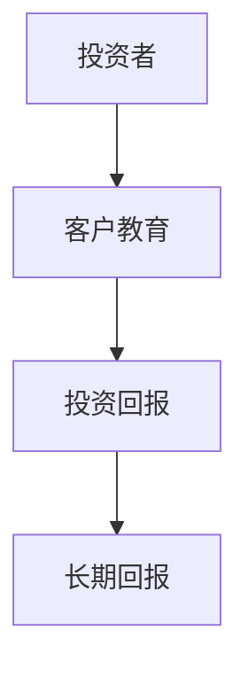
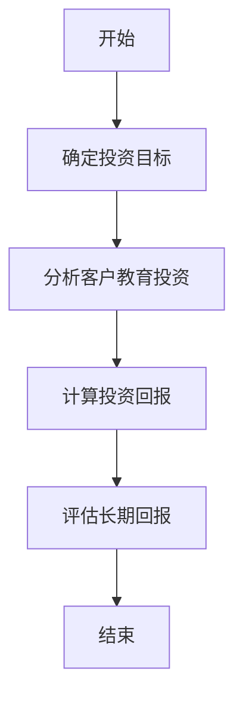
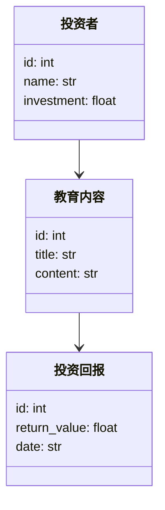
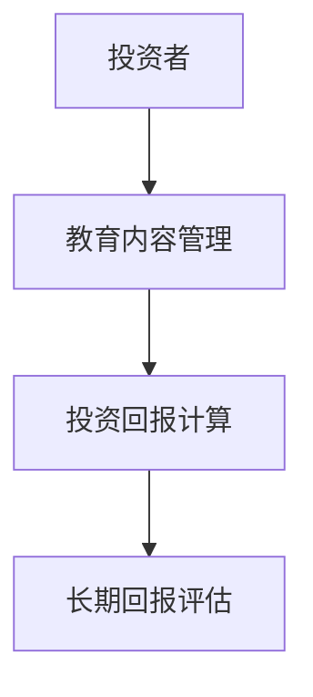
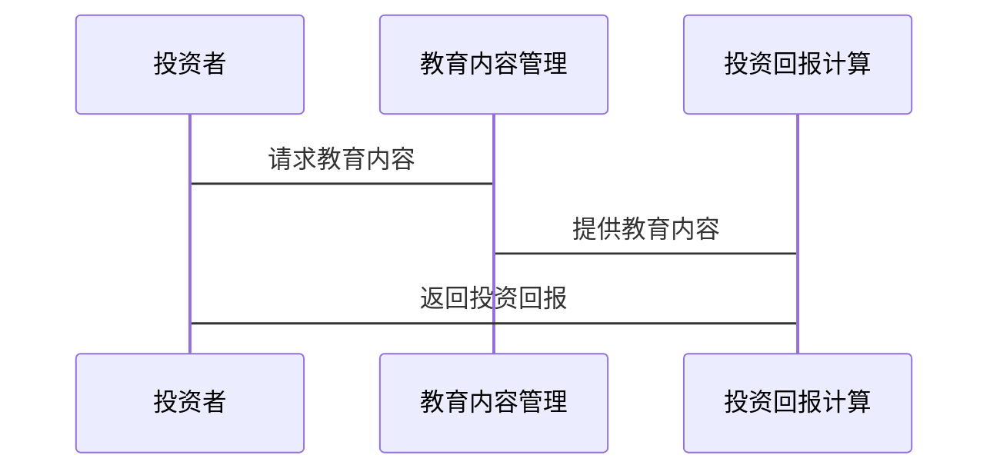

                 


# 彼得林奇如何分析公司的客户教育投资长期回报

## 关键词：客户教育投资，长期回报，彼得·林奇，投资分析，ROI模型

## 摘要：本篇文章详细分析了彼得·林奇如何从投资学的角度审视和评估客户教育投资的长期回报。通过系统的理论分析和实际案例，展示了客户教育投资的重要性、核心原理、算法模型、系统设计和项目实现等关键内容。文章结合理论与实践，详细阐述了如何通过科学的方法评估和优化客户教育投资，以实现长期的收益回报。

---

# 第一部分: 背景介绍与核心概念

# 第1章: 客户教育投资与长期回报概述

## 1.1 问题背景与描述

### 1.1.1 投资者教育的重要性
在现代金融体系中，投资者教育是确保市场高效运作和保护投资者利益的关键环节。客户教育投资不仅能够提升投资者的决策能力，还能增强客户对投资产品的信任和忠诚度。

### 1.1.2 客户教育投资的核心问题
客户教育投资的核心问题是如何通过有效的教育策略，提升客户的长期投资回报。这涉及到教育内容的设计、教育渠道的选择以及教育效果的评估等多个方面。

### 1.1.3 长期回报的定义与特征
长期回报是指在较长的时间跨度内，客户教育投资带来的收益。其特征包括时间跨度长、收益波动小、风险可控等。

## 1.2 问题解决与边界

### 1.2.1 客户教育投资的解决方法
通过系统化的投资者教育策略，帮助客户建立正确的投资理念，提升投资能力，从而实现长期回报。

### 1.2.2 边界与外延
客户教育投资的边界在于其仅关注教育投资本身，而不涉及其他类型的投资行为。外延则包括教育内容、教育方式、教育效果评估等多个方面。

### 1.2.3 核心要素与组成
客户教育投资的核心要素包括教育内容、教育渠道、教育方法、教育效果评估等。

## 1.3 彼得·林奇的投资理念

### 1.3.1 彼得·林奇的简介
彼得·林奇是美国著名的投资家，以其独特的投资策略和长期回报分析闻名。

### 1.3.2 林奇的投资哲学
林奇强调长期投资、分散投资和价值投资，认为客户教育是提升投资回报的重要手段。

### 1.3.3 林奇的客户教育投资方法
林奇通过系统的投资者教育，帮助客户理解投资的本质，从而实现长期回报。

## 1.4 本章小结
本章通过介绍客户教育投资的重要性、核心问题、长期回报的定义与特征，以及彼得·林奇的投资理念，为后续的分析奠定了基础。

---

# 第二部分: 核心概念与联系

# 第2章: 核心概念原理

## 2.1 核心概念原理

### 2.1.1 投资者教育的定义
投资者教育是指通过系统化的教育方式，帮助投资者掌握投资知识、提升投资能力的过程。

### 2.1.2 长期回报的计算方法
长期回报的计算方法包括复利计算、年化回报等。

### 2.1.3 客户教育投资的逻辑框架
客户教育投资的逻辑框架包括教育目标设定、教育内容设计、教育实施、效果评估等步骤。

## 2.2 概念属性特征对比

### 2.2.1 投资者教育与客户教育的对比
投资者教育注重理论知识的传授，而客户教育更注重实践能力的培养。

### 2.2.2 短期回报与长期回报的差异
短期回报波动较大，而长期回报更加稳定。

### 2.2.3 客户教育投资与其他投资方式的联系
客户教育投资与其他投资方式的联系在于，教育投资能够提升客户的投资能力，从而间接影响其他类型的投资回报。

## 2.3 ER实体关系图



---

# 第三部分: 算法原理讲解

# 第3章: 算法原理与流程

## 3.1 算法原理

### 3.1.1 投资者教育投资的流程
投资者教育投资的流程包括目标设定、内容设计、实施、评估等步骤。

### 3.1.2 林奇投资模型的数学公式
$$ ROI = \frac{投资收益}{投资成本} $$

### 3.1.3 投资回报的计算公式
$$ 投资回报率 = \frac{净收益}{初始投资} \times 100\% $$

## 3.2 算法流程图



## 3.3 代码实现

### 3.3.1 投资回报计算代码

```python
def calculate_roi(investment, return_value):
    return return_value / investment
```

### 3.3.2 林奇投资模型代码

```python
def lynch_model(investment, growth_rate, years):
    return investment * (1 + growth_rate) ** years
```

---

# 第四部分: 系统分析与架构设计

# 第4章: 系统分析与架构设计

## 4.1 系统分析

### 4.1.1 问题场景介绍
客户教育投资系统需要通过系统化的教育策略，提升客户的长期投资回报。

### 4.1.2 系统功能设计
系统功能包括教育内容管理、教育实施、效果评估等。

## 4.2 系统架构设计

### 4.2.1 领域模型mermaid类图



### 4.2.2 系统架构图



### 4.2.3 系统交互mermaid序列图



---

# 第五部分: 项目实战

# 第5章: 项目实战

## 5.1 环境安装

### 5.1.1 Python环境安装
安装Python和必要的库，如Mermaid、Latex等。

## 5.2 系统核心实现源代码

### 5.2.1 投资回报计算代码

```python
def calculate_roi(investment, return_value):
    return return_value / investment
```

### 5.2.2 长期回报评估代码

```python
def calculate_long_term_return(initial_investment, annual_growth_rate, years):
    return initial_investment * (1 + annual_growth_rate) ** years
```

## 5.3 数据解读与分析

### 5.3.1 数据输入
初始投资：10000美元，年增长率：5%，投资年数：10年。

### 5.3.2 数据输出
长期回报：$10000 * (1 + 0.05)^{10} = $16288.95美元

## 5.4 案例分析与详细讲解

### 5.4.1 实际案例分析
以某公司客户教育投资为例，计算其长期回报。

### 5.4.2 详细讲解
通过实际案例分析，详细讲解客户教育投资的长期回报计算过程。

## 5.5 本章小结
本章通过实际案例分析和详细讲解，展示了客户教育投资的长期回报计算过程。

---

# 第六部分: 总结与拓展阅读

# 第6章: 总结与拓展阅读

## 6.1 最佳实践 Tips

### 6.1.1 投资者教育的重要性
投资者教育是提升客户长期投资回报的关键。

### 6.1.2 长期回报的计算方法
长期回报的计算需要考虑复利效应。

### 6.1.3 系统化的方法
系统化的方法能够提升客户教育投资的效果。

## 6.2 小结
本章总结了客户教育投资的长期回报分析方法，并提供了系统的解决方案。

## 6.3 注意事项

### 6.3.1 投资风险
客户教育投资存在一定的风险，需要谨慎操作。

### 6.3.2 信息更新
投资环境变化快，需要及时更新教育内容。

## 6.4 拓展阅读

### 6.4.1 相关书籍
- 《彼得·林奇的成功投资》
- 《投资学原理》

### 6.4.2 相关网站
- 投资者教育网
- 金融分析论坛

---

# 作者：AI天才研究院/AI Genius Institute & 禅与计算机程序设计艺术 /Zen And The Art of Computer Programming

