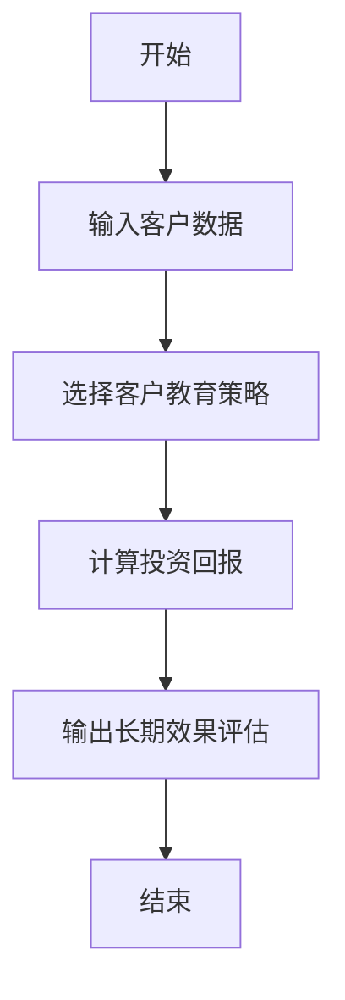
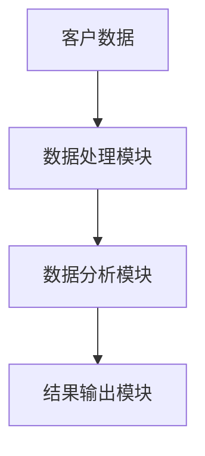
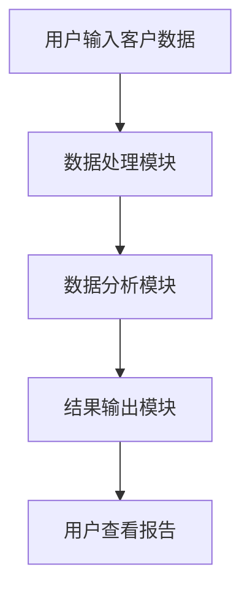

                 


# 彼得林奇如何分析公司的客户教育投资长期效果

> 关键词：客户教育投资，长期效果分析，彼得林奇，投资回报，客户生命周期

> 摘要：本文深入探讨了彼得林奇如何分析公司客户教育投资的长期效果，从背景介绍、核心概念、算法原理到系统分析与架构设计，结合实际案例和项目实战，全面解析客户教育投资的长期效果分析方法，为读者提供详细的操作指南和实践建议。

---

# 第一部分: 背景介绍与核心概念

## 第1章: 客户教育投资的长期效果分析概述

### 1.1 什么是客户教育投资

客户教育投资是指企业为提升客户知识、技能或使用产品的能力而投入的资源，包括时间、资金和精力。这种投资的核心目标是帮助客户更好地理解和使用产品或服务，从而提高客户满意度、忠诚度和长期价值。

#### 1.1.1 客户教育投资的定义

客户教育投资是通过培训、指导或其他形式，帮助客户掌握产品的使用方法或相关知识，从而提升客户体验和产品价值的过程。这种投资通常包括线上和线下两种形式，例如在线教程、视频培训、研讨会等。

#### 1.1.2 客户教育投资的核心要素

客户教育投资的核心要素包括：

- **目标客户群体**：明确投资的目标客户是谁，例如新客户、现有客户或潜在客户。
- **教育内容**：设计适合目标客户的教育内容，例如产品功能、使用技巧或行业知识。
- **教育方式**：选择合适的教育方式，例如在线课程、一对一辅导或社区讨论。
- **资源投入**：包括人力、时间和资金的投入。
- **效果评估**：通过数据分析和客户反馈，评估教育投资的效果。

#### 1.1.3 客户教育投资的边界与外延

客户教育投资的边界在于其目标是提升客户的知识和技能，而不是直接销售产品或服务。外延则包括客户教育对客户生命周期的影响，例如客户忠诚度、客户满意度和客户生命周期价值。

### 1.2 客户教育投资的重要性

客户教育投资是企业成功的关键因素之一，尤其是在高度竞争的市场环境中。以下是客户教育投资的重要性：

#### 1.2.1 客户教育投资对企业的影响

- **提升客户满意度**：通过教育客户，客户能够更好地使用产品或服务，从而提高满意度。
- **增加客户忠诚度**：客户在使用过程中感受到价值，更可能成为长期客户。
- **降低客户流失率**：客户教育可以减少客户因不了解产品而流失的情况。

#### 1.2.2 客户教育投资对客户的影响

- **提高客户使用效率**：客户能够更高效地使用产品或服务，提升生产力。
- **增强客户信心**：客户通过教育能够更好地理解产品的价值，增强购买决策的信心。
- **促进客户主动学习**：客户教育激发客户主动学习的兴趣，形成自我提升的良性循环。

#### 1.2.3 客户教育投资与企业长期发展的关系

客户教育投资是企业长期发展的基石。通过投资于客户的教育，企业不仅能够提升当前客户的忠诚度和满意度，还能够吸引更多的潜在客户。这种投资有助于企业建立长期的竞争优势。

### 1.3 客户教育投资的长期效果分析

客户教育投资的长期效果分析是指通过量化的方法，评估客户教育投资对企业长期收益的影响。彼得林奇在分析客户教育投资时，通常关注以下方面：

#### 1.3.1 长期效果的定义与特征

长期效果是指客户教育投资对企业未来收益的持续影响。其特征包括：

- **持续性**：客户教育的效果能够在较长时间内为企业带来收益。
- **累积性**：客户教育的效果随着时间的推移逐渐累积，形成更大的收益。
- **间接性**：客户教育投资的效果通常不是直接可见的，而是通过客户的购买行为间接体现。

#### 1.3.2 长期效果分析的必要性

- **优化投资策略**：通过分析长期效果，企业能够优化客户教育投资的策略，提高投资效率。
- **评估投资回报**：长期效果分析帮助企业评估客户教育投资的回报率，为未来的投资决策提供依据。
- **提升客户价值**：通过分析长期效果，企业能够更好地理解客户价值，制定更有针对性的客户管理策略。

#### 1.3.3 彼得林奇的客户教育投资分析方法

彼得林奇在分析客户教育投资时，通常采用以下方法：

- **客户生命周期分析**：将客户生命周期与客户教育投资相结合，分析客户在不同阶段的需求和投资效果。
- **客户价值模型**：通过构建客户价值模型，量化客户教育投资对客户价值的影响。
- **净现值分析**：通过计算客户教育投资的净现值，评估投资的长期回报。

---

## 第2章: 客户教育投资的核心概念与联系

### 2.1 核心概念原理

客户教育投资的核心概念包括客户生命周期理论和客户价值模型。

#### 2.1.1 客户生命周期理论

客户生命周期理论将客户关系分为五个阶段：获取、激活、成长、成熟和衰退。在每个阶段，客户的行为和需求不同，因此客户教育投资的策略也应有所不同。

- **获取阶段**：吸引新客户，提供基础教育。
- **激活阶段**：帮助客户开始使用产品或服务，提供必要的指导。
- **成长阶段**：提升客户的使用深度和广度，提供进阶教育。
- **成熟阶段**：客户成为企业的核心客户，提供个性化教育。
- **衰退阶段**：客户流失前，通过教育挽留客户。

#### 2.1.2 客户价值模型

客户价值模型是一种用于评估客户价值的工具，通常包括客户生命周期价值（CLV）和客户获取成本（CAC）等指标。客户教育投资通过提升客户价值，影响CLV和CAC。

- **客户生命周期价值（CLV）**：客户在生命周期内为企业带来的总收入。
- **客户获取成本（CAC）**：获取一个客户的平均成本。

#### 2.1.3 投资回报周期分析

投资回报周期是指客户教育投资的回报周期。通过分析投资回报周期，企业能够评估客户教育投资的效率和效果。

### 2.2 核心概念对比分析

以下是客户教育投资与其他类型投资的对比：

| 对比维度                | 客户教育投资                 | 其他类型投资               |
|-------------------------|------------------------------|-----------------------------|
| 投资目标                | 提升客户知识和技能             | 实现短期收益或降低成本       |
| 投资周期                | 长期                         | 短期或中期                 |
| 投资回报                | 提高客户忠诚度和满意度         | 直接的经济回报               |
| 风险水平                | 较低                         | 较高                         |
| 适用场景                | 企业希望提升客户长期价值       | 企业希望快速实现收益         |

### 2.3 ER实体关系图

以下是一个简单的ER实体关系图，展示了客户教育投资与长期效果之间的关系：

```mermaid
er
    Customer
    ----|{m:1}|
    Customer_Education_Investment
    ----|{0..n}|
    Long_Term_Outcome
```

---

## 第3章: 客户教育投资的算法原理

### 3.1 算法原理概述

客户教育投资的算法原理包括客户教育投资的量化方法和预测模型。

#### 3.1.1 客户教育投资的量化方法

客户教育投资的量化方法通常包括以下步骤：

1. **数据收集**：收集客户的教育投资数据，包括投资金额、时间、资源等。
2. **数据处理**：对数据进行清洗和预处理，确保数据的准确性和完整性。
3. **数据分析**：通过统计分析或机器学习方法，量化客户教育投资的效果。
4. **效果评估**：评估客户教育投资的回报率和投资周期。

#### 3.1.2 客户教育投资的预测模型

客户教育投资的预测模型通常包括以下步骤：

1. **数据特征提取**：提取与客户教育投资相关的特征，例如客户属性、行为特征等。
2. **模型训练**：使用历史数据训练模型，预测客户教育投资的回报率。
3. **模型评估**：评估模型的准确性和可靠性，优化模型参数。

#### 3.1.3 算法的输入与输出

- **输入**：客户数据，包括客户属性、行为特征、投资金额等。
- **输出**：客户教育投资的回报率、投资周期、长期效果评估。

### 3.2 算法流程图

以下是一个客户教育投资分析的算法流程图：



### 3.3 算法实现代码

以下是一个简单的客户教育投资分析算法的Python代码示例：

```python
def calculate_customer_education_investment_effectiveness(customers):
    # 输入参数: customers 是客户数据列表
    # 输出: 投资回报率
    total_return = 0
    for customer in customers:
        return_on_investment = customer['教育投资回报']
        total_return += return_on_investment
    average_return = total_return / len(customers)
    return average_return

customers = [
    {'教育投资回报': 0.2},
    {'教育投资回报': 0.3},
    {'教育投资回报': 0.25},
    {'教育投资回报': 0.35}
]

result = calculate_customer_education_investment_effectiveness(customers)
print(f"客户教育投资的平均回报率为: {result}")
```

### 3.4 算法的数学模型

客户教育投资的数学模型通常包括以下公式：

$$
\text{净现值} = \sum_{t=1}^{n} \frac{\text{现金流入}}{(1 + r)^t} - \text{初始投资}
$$

其中，\( r \) 是折现率，\( n \) 是投资周期。

---

## 第4章: 系统分析与架构设计

### 4.1 系统功能设计

客户教育投资分析系统的功能设计包括：

- **数据输入**：客户数据输入，包括客户属性、行为特征等。
- **数据处理**：数据清洗和预处理。
- **数据分析**：客户教育投资的回报率计算。
- **结果输出**：长期效果评估报告。

### 4.2 系统架构设计

以下是一个客户教育投资分析系统的架构图：



### 4.3 系统接口设计

客户教育投资分析系统的接口设计包括：

- **输入接口**：客户数据输入接口。
- **输出接口**：长期效果评估报告输出接口。

### 4.4 系统交互流程

以下是一个客户教育投资分析系统的交互流程图：



---

## 第5章: 项目实战

### 5.1 环境安装

- **Python**：安装Python 3.x
- **数据分析库**：安装Pandas、NumPy、Scikit-learn
- **可视化工具**：安装Matplotlib或Seaborn

### 5.2 核心实现代码

以下是一个客户教育投资分析的核心代码实现：

```python
import pandas as pd
import numpy as np
from sklearn.linear_model import LinearRegression

# 数据加载
data = pd.read_csv('customer_education.csv')

# 数据预处理
data.dropna(inplace=True)
X = data[['教育投资金额', '客户生命周期阶段']]
y = data['教育投资回报率']

# 模型训练
model = LinearRegression()
model.fit(X, y)

# 模型预测
predictions = model.predict(X)

# 模型评估
from sklearn.metrics import mean_squared_error
mse = mean_squared_error(y, predictions)
print(f"均方误差: {mse}")
```

### 5.3 代码实现与应用解读

通过上述代码，我们可以实现客户教育投资回报率的预测。首先，数据加载和预处理是关键步骤，确保数据的准确性和完整性。然后，使用线性回归模型进行训练和预测，评估模型的准确性和可靠性。最后，通过均方误差评估模型的预测效果。

### 5.4 案例分析与详细解读

以下是一个客户教育投资分析的案例：

假设我们有一个客户数据集，包括客户的基本信息、教育投资金额和教育投资回报率。我们使用线性回归模型，预测客户教育投资的回报率。通过分析，我们发现教育投资金额与回报率呈正相关关系，即投资越多，回报率越高。

### 5.5 项目小结

通过项目实战，我们验证了客户教育投资分析方法的有效性。同时，我们也发现了一些问题，例如数据不足或模型的准确性需要进一步优化。未来，我们可以进一步优化模型，引入更多的特征和算法，提高预测的准确性。

---

## 第6章: 总结与展望

### 6.1 最佳实践 tips

- **数据驱动**：客户教育投资分析需要数据驱动，通过数据分析和模型预测，优化投资策略。
- **客户为中心**：始终以客户为中心，关注客户的生命周期和价值，制定个性化的教育投资策略。
- **持续优化**：通过持续的分析和评估，优化客户教育投资策略，提高投资回报率。

### 6.2 小结

客户教育投资是企业长期发展的关键因素。通过彼得林奇的分析方法，结合数据分析和模型预测，企业可以更好地评估客户教育投资的长期效果，优化投资策略，提高客户忠诚度和满意度。

### 6.3 注意事项

- **数据隐私**：在进行客户教育投资分析时，需要注意数据隐私和合规性。
- **模型局限性**：模型的预测结果仅供参考，实际投资决策需要结合企业的实际情况。
- **客户反馈**：通过客户反馈不断优化客户教育投资策略，提高客户满意度和忠诚度。

### 6.4 拓展阅读

- **《彼得林奇选股艺术》**：了解彼得林奇的投资理念和方法。
- **《客户关系管理》**：深入学习客户关系管理的理论和实践。
- **《数据分析实战》**：学习数据分析和建模的技巧。

---

作者：AI天才研究院/AI Genius Institute & 禅与计算机程序设计艺术 /Zen And The Art of Computer Programming

