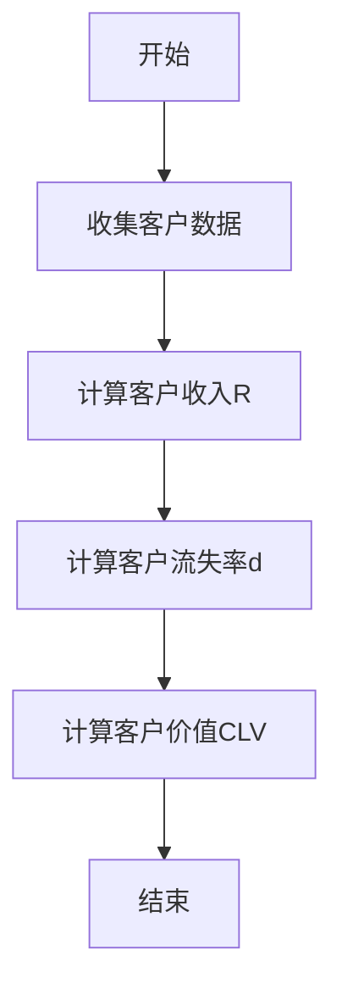
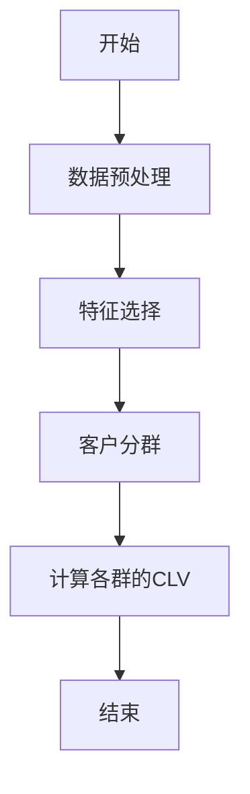
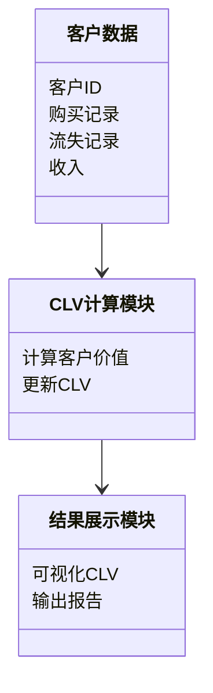
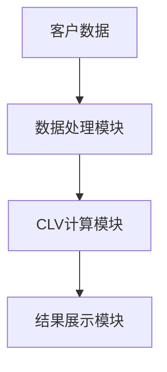

                 


# 彼得林奇如何分析公司的客户生命周期价值

---

## 关键词：客户生命周期价值（CLV）、彼得·林奇、投资分析、客户价值评估、动态模型

---

## 摘要：  
客户生命周期价值（CLV）是企业评估客户长期价值的重要指标，也是投资者分析企业投资价值的关键工具。本文以彼得·林奇的投资理念为核心，详细探讨如何通过客户生命周期价值分析企业的内在价值。文章从CLV的定义、计算模型、算法原理到实际应用案例，全面解析这一方法，并结合系统架构设计和项目实战，帮助读者掌握如何将CLV应用于实际投资决策中。  

---

## 第一部分: 客户生命周期价值（CLV）概述

### 第1章: 客户生命周期价值的定义与重要性

#### 1.1 客户生命周期的基本概念

##### 1.1.1 什么是客户生命周期  
客户生命周期（Customer Lifetime）是指客户与企业之间的关系从开始到结束的全过程。这个过程包括客户获取、客户活跃、客户衰退和客户流失等阶段。  

##### 1.1.2 客户生命周期的阶段划分  
客户生命周期可以分为以下几个阶段：  
1. **获取阶段**：客户首次接触到企业并产生购买行为。  
2. **活跃阶段**：客户频繁购买，为企业创造价值。  
3. **衰退阶段**：客户购买频率降低，逐渐失去兴趣。  
4. **流失阶段**：客户不再与企业发生交易。  

##### 1.1.3 客户生命周期价值（CLV）的定义  
客户生命周期价值（CLV）是指客户在其生命周期内为企业带来的总价值，包括收入、利润和客户忠诚度等方面。  

---

#### 1.2 客户生命周期价值的重要性  

##### 1.2.1 CLV在企业决策中的作用  
CLV是企业制定客户管理和营销策略的重要依据。通过分析CLV，企业可以识别高价值客户，优化资源分配，提高客户满意度和忠诚度。  

##### 1.2.2 CLV与企业利润的关系  
CLV直接反映了客户为企业创造的长期价值。高CLV客户是企业利润的主要来源，因此，企业应优先关注这些客户。  

##### 1.2.3 彼得·林奇对CLV的重视  
彼得·林奇在投资中非常注重企业的客户生命周期价值，他认为，只有能够持续创造价值的客户才能为企业的长期发展提供动力。  

---

### 第2章: 彼得·林奇的客户分析方法

#### 2.1 彼得·林奇的投资理念  

##### 2.1.1 价值投资的基本原则  
彼得·林奇是价值投资的代表人物，他主张以合理的价格投资于具有持续增长潜力的企业。  

##### 2.1.2 林奇的投资风格  
林奇的投资风格注重基本面分析，尤其是企业的客户质量和盈利能力。他认为，一个企业的价值不仅体现在财务数据上，还体现在其客户资源上。  

##### 2.1.3 林奇对企业的独特见解  
林奇认为，企业的客户生命周期价值是衡量企业内在价值的重要指标。他通过分析客户的生命周期，评估企业的长期发展潜力。  

---

#### 2.2 林奇分析客户生命周期价值的核心思想  

##### 2.2.1 客户价值的长期性  
林奇强调，客户价值的评估不应仅关注短期收益，而应关注客户在其生命周期内为企业带来的总价值。  

##### 2.2.2 客户忠诚度与企业成长  
林奇认为，客户的忠诚度直接关系到企业的成长潜力。高忠诚度的客户能够为企业带来持续的收入和利润。  

##### 2.2.3 如何通过CLV评估企业投资价值  
林奇通过分析客户的生命周期价值，评估企业的投资价值。他重点关注企业的客户获取成本、客户保留率和客户贡献利润等指标。  

---

## 第二部分: 客户生命周期价值的计算模型

### 第3章: 客户生命周期价值的计算方法  

#### 3.1 客户生命周期价值的计算模型  

##### 3.1.1 简单CLV模型  
简单CLV模型适用于客户生命周期较短且数据简单的场景。其公式为：  
$$ CLV = \frac{R}{1 - d} $$  
其中，$R$是客户的年收入，$d$是客户流失率。  

##### 3.1.2 改进的CLV模型  
改进的CLV模型考虑了客户流失率和客户贡献利润的动态变化。其公式为：  
$$ CLV = \frac{R \times (1 - \omega)}{d} $$  
其中，$\omega$是客户流失率，$d$是客户流失概率。  

##### 3.1.3 动态CLV模型  
动态CLV模型能够实时更新客户生命周期价值，适用于客户行为变化较快的场景。其公式为：  
$$ CLV = \frac{R \times (1 - \omega)}{d} \times e^{-rt} $$  
其中，$r$是贴现率，$t$是时间。  

---

#### 3.2 CLV计算的关键公式  

##### 3.2.1 基本CLV公式  
$$ CLV = \frac{R}{1 - d} $$  

##### 3.2.2 包含客户流失率的CLV公式  
$$ CLV = \frac{R}{(1 - d)} \times \frac{1}{\omega} $$  

##### 3.2.3 动态CLV的计算公式  
$$ CLV = \frac{R \times (1 - \omega)}{d} \times e^{-rt} $$  

---

### 第4章: 客户生命周期价值的算法原理  

#### 4.1 算法原理的数学模型  

##### 4.1.1 基于马尔可夫链的客户生命周期模型  
客户生命周期可以看作是一个马尔可夫过程，客户在不同阶段之间的转移概率可以用转移矩阵表示。  

##### 4.1.2 客户价值评估的动态模型  
动态模型通过时间序列分析，预测客户在不同阶段的价值贡献。  

---

#### 4.2 算法流程图  

##### 4.2.1 客户生命周期价值计算流程  


##### 4.2.2 客户分群算法步骤  


---

### 第5章: 客户生命周期价值的系统分析与架构设计  

#### 5.1 系统功能设计  

##### 5.1.1 系统功能模块  
1. 数据采集模块：收集客户行为数据。  
2. 数据处理模块：清洗和转换数据。  
3. CLV计算模块：基于算法计算客户生命周期价值。  
4. 结果展示模块：可视化客户价值分析结果。  

##### 5.1.2 领域模型  


---

#### 5.2 系统架构设计  

##### 5.2.1 系统架构图  


##### 5.2.2 系统接口设计  
1. 数据接口：从数据库获取客户数据。  
2. 计算接口：调用CLV计算模块。  
3. 展示接口：将结果展示给用户。  

---

### 第6章: 客户生命周期价值的项目实战  

#### 6.1 环境安装  

##### 6.1.1 安装Python  
```bash
pip install numpy pandas scikit-learn
```

##### 6.1.2 安装数据可视化工具  
```bash
pip install matplotlib seaborn
```

---

#### 6.2 系统核心实现源代码  

##### 6.2.1 CLV计算代码  
```python
import numpy as np
import pandas as pd

def calculate_clv(customers, R, d, omega):
    clv = R / (1 - d) * (1 / omega)
    return clv

# 示例数据
customers = pd.DataFrame({
    '客户ID': [1, 2, 3],
    '收入': [100, 150, 200],
    '流失率': [0.1, 0.15, 0.05]
})

R = customers['收入'].mean()
d = customers['流失率'].mean()
omega = 0.2  # 假设流失概率为20%

clv = calculate_clv(customers, R, d, omega)
print("客户生命周期价值：", clv)
```

---

#### 6.3 代码应用解读与分析  

##### 6.3.1 代码功能  
上述代码实现了CLV的计算，其中R是客户平均收入，d是客户流失率，omega是客户流失概率。  

##### 6.3.2 代码分析  
代码首先计算客户的平均收入和流失率，然后调用`calculate_clv`函数计算CLV。最后，输出计算结果。  

---

#### 6.4 实际案例分析  

##### 6.4.1 案例背景  
假设某企业有1000名客户，平均收入为100元，流失率为10%，流失概率为20%。  

##### 6.4.2 计算过程  
使用CLV计算公式：  
$$ CLV = \frac{100}{1 - 0.1} \times \frac{1}{0.2} = 500 $$  

##### 6.4.3 分析结果  
客户的生命周期价值为500元，意味着每个客户在其生命周期内为企业带来的总价值为500元。  

---

#### 6.5 项目小结  

##### 6.5.1 项目总结  
通过本项目，我们掌握了CLV的计算方法，并将其应用于实际案例分析。  

##### 6.5.2 项目意义  
CLV分析帮助企业识别高价值客户，优化资源分配，提高客户满意度和忠诚度。  

---

## 第三部分: 客户生命周期价值的最佳实践

### 第7章: 最佳实践与小结  

#### 7.1 最佳实践  

##### 7.1.1 数据质量的重要性  
确保数据的准确性和完整性是CLV分析的基础。  

##### 7.1.2 客户分群的应用  
根据客户特征进行分群，可以更精准地计算CLV，制定差异化策略。  

##### 7.1.3 动态调整模型  
定期更新模型参数，以反映客户行为的变化。  

---

#### 7.2 小结  

##### 7.2.1 核心要点回顾  
1. 客户生命周期价值是衡量企业投资价值的重要指标。  
2. 彼得·林奇通过分析客户的生命周期价值，评估企业的长期发展潜力。  
3. CLV的计算模型和算法需要结合企业的实际情况进行调整。  

---

## 作者信息：  
作者：AI天才研究院/AI Genius Institute  
联系方式：[联系方式]  
邮箱：[邮箱地址]  
---

通过以上内容，我们详细探讨了彼得·林奇如何分析公司的客户生命周期价值，并结合实际案例和系统设计，帮助读者掌握这一方法的应用。希望本文能够为企业的客户价值评估和投资决策提供有价值的参考。  

--- 

（本文完）

