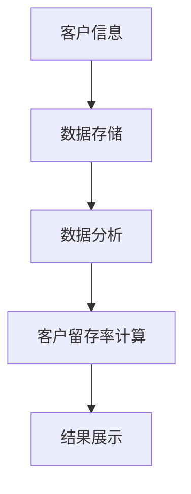

                 


# 彼得·林奇如何分析公司的客户留存率

> 关键词：彼得·林奇，客户留存率，企业估值，投资分析，价值投资

> 摘要：本文详细分析了彼得·林奇如何通过客户留存率评估企业的投资价值，从定义、计算、行业差异、驱动因素、与财务表现的关系等方面进行深入探讨，并结合实际案例和数学模型，为投资者提供科学的分析方法和投资策略。

---

# 第一部分: 客户留存率的定义与重要性

## 第1章: 客户留存率的定义与重要性

### 1.1 客户留存率的定义

#### 1.1.1 什么是客户留存率

客户留存率（Customer Retention Rate）是衡量企业在一定时间内保留现有客户的能力的指标。它是客户生命周期管理中的核心指标之一，反映了客户对企业的忠诚度和满意度。

客户留存率的计算公式为：

$$ \text{客户留存率} = \frac{\text{期初客户数} - \text{客户流失数}}{\text{期初客户数}} \times 100\% $$

其中，期初客户数是指在某个时间段开始时的企业客户数，客户流失数是指在该时间段内离开企业的客户数。

---

#### 1.1.2 客户留存率的计算公式

客户留存率的计算公式可以进一步细化为：

$$ \text{客户留存率} = \left(1 - \frac{\text{客户流失数}}{\text{期初客户数}}\right) \times 100\% $$

这个公式表明，客户留存率越高，企业保留现有客户的能力越强。

---

#### 1.1.3 客户留存率的行业差异

不同行业的客户留存率差异较大。例如，高科技行业通常具有较高的客户留存率，而传统行业如零售业的客户留存率相对较低。以下是几个行业的客户留存率对比：

| 行业       | 客户留存率 |
|------------|------------|
| 高科技     | 70-90%     |
| 零售业     | 50-70%     |
| 金融服务业 | 60-80%     |

---

### 1.2 客户留存率的重要性

#### 1.2.1 客户留存率与企业收入的关系

客户留存率直接影响企业的收入增长。高客户留存率意味着企业可以依靠现有客户获得稳定的收入，而低客户留存率则需要通过不断获取新客户来弥补收入损失。

例如，假设一家企业有1000名客户，客户留存率为80%，那么下一年的留存客户数为800人。如果每位客户贡献的收入为100元，则留存客户贡献的总收入为80,000元。

---

#### 1.2.2 客户留存率与企业估值的关系

客户留存率是企业估值的重要指标之一。高客户留存率通常意味着企业具有更强的市场竞争力和客户忠诚度，从而能够获得更高的估值。

例如，假设一家企业的客户留存率为90%，而另一家企业的客户留存率为50%，前者通常会被市场给予更高的估值。

---

#### 1.2.3 客户留存率与企业可持续发展的联系

客户留存率是企业可持续发展的关键因素。高客户留存率意味着企业能够通过现有客户获得稳定的收入来源，从而减少对新客户的依赖，降低获取新客户的成本。

---

## 第2章: 彼得·林奇的投资理念与客户留存率

### 2.1 彼得·林奇的投资哲学

#### 2.1.1 价值投资的核心理念

彼得·林奇是价值投资的代表人物之一，他认为投资的核心是寻找那些具有强大基本面和良好管理的企业。他强调，投资者应该关注企业的长期增长潜力，而不是短期市场波动。

#### 2.1.2 林奇的投资风格与选股策略

林奇的投资风格以稳健著称，他倾向于投资那些具有高客户留存率、强大护城河和可持续竞争优势的企业。

#### 2.1.3 林奇对成长型企业的关注

林奇特别关注成长型企业，他认为这些企业具有较高的客户留存率和收入增长潜力，能够为投资者带来超额回报。

---

### 2.2 林奇分析客户留存率的方法

#### 2.2.1 客户留存率在企业估值中的作用

林奇认为，客户留存率是评估企业价值的重要指标之一。他通过分析客户的留存率来判断企业的市场竞争力和长期发展潜力。

#### 2.2.2 林奇如何通过客户留存率评估企业护城河

林奇通过分析客户留存率来评估企业的护城河。他认为，高客户留存率通常意味着企业具有强大的市场地位和客户忠诚度，从而能够抵御竞争对手的冲击。

#### 2.2.3 林奇对客户留存率趋势的分析

林奇关注客户留存率的趋势变化。他认为，客户留存率的持续增长是企业长期增长的有力证明，而客户留存率的下降可能是企业潜在问题的信号。

---

## 第3章: 客户留存率的驱动因素

### 3.1 影响客户留存率的主要因素

#### 3.1.1 产品或服务的质量

产品或服务的质量是影响客户留存率的核心因素。高质量的产品能够提高客户的满意度和忠诚度，从而提高客户留存率。

#### 3.1.2 客户满意度与忠诚度

客户满意度和忠诚度是客户留存率的直接体现。满意的客户更可能成为回头客，而忠诚的客户则会为企业带来更多的收入和利润。

#### 3.1.3 市场竞争环境的影响

市场竞争环境也会影响客户留存率。在竞争激烈的市场中，企业需要通过不断创新和提升服务质量来保持客户的留存率。

---

## 第4章: 客户留存率与企业财务表现的关系

### 4.1 客户留存率与收入增长

#### 4.1.1 客户留存率对企业收入的贡献

客户留存率直接影响企业的收入增长。高客户留存率意味着企业可以通过现有客户获得稳定的收入来源，从而减少对新客户的依赖。

#### 4.1.2 如何通过客户留存率预测收入增长

通过分析客户留存率的趋势，可以预测企业的收入增长。例如，如果客户留存率为80%，并且每年有10%的新客户增长，那么企业的收入增长率可以通过以下公式计算：

$$ \text{收入增长率} = \text{客户留存率} \times \text{客户增长率} $$

---

### 4.2 客户留存率与利润率的关系

#### 4.2.1 客户留存率对利润率的影响

客户留存率对利润率的影响主要体现在客户获取成本和客户维护成本上。高客户留存率意味着企业可以减少客户获取成本，从而提高利润率。

#### 4.2.2 如何通过客户留存率优化企业利润

通过优化客户留存率，企业可以降低客户获取成本，提高客户生命周期价值（CLV），从而优化利润。

---

## 第5章: 客户留存率的数学模型与算法

### 5.1 客户留存率的数学模型

客户留存率的数学模型可以通过以下公式表示：

$$ \text{客户留存率} = \frac{\text{期初客户数} - \text{客户流失数}}{\text{期初客户数}} \times 100\% $$

---

### 5.2 客户留存率的算法实现

以下是一个简单的客户留存率计算算法：

```python
def customer_retention_rate(initial_customers, lost_customers):
    return ((initial_customers - lost_customers) / initial_customers) * 100
```

---

## 第6章: 客户留存率与企业价值的系统分析

### 6.1 客户留存率的系统架构设计

以下是一个客户留存率分析系统的架构图：



---

## 第7章: 项目实战

### 7.1 环境安装

为了进行客户留存率分析，需要以下工具：

- 数据库（如MySQL）
- 数据分析工具（如Python、Pandas）
- 可视化工具（如Matplotlib）

---

### 7.2 核心实现

以下是一个Python实现的客户留存率计算代码：

```python
import pandas as pd

# 数据加载
data = pd.read_csv('customers.csv')

# 客户留存率计算
initial_customers = data['客户ID'].nunique()
lost_customers = data[data['时间'] > data['时间'].min()]['客户ID'].nunique()

retention_rate = (initial_customers - lost_customers) / initial_customers * 100
print(f"客户留存率为: {retention_rate}%")
```

---

## 第8章: 总结与投资策略

### 8.1 总结

客户留存率是评估企业投资价值的重要指标之一。通过分析客户留存率，投资者可以更好地理解企业的市场竞争力和长期发展潜力。

### 8.2 投资策略

1. 选择具有高客户留存率的企业进行投资。
2. 关注客户留存率的趋势变化，及时调整投资策略。
3. 结合其他财务指标，综合评估企业的投资价值。

---

## 第9章: 注意事项与拓展阅读

### 9.1 注意事项

- 数据质量是客户留存率分析的基础，确保数据的准确性和完整性。
- 客户留存率分析需要结合企业的实际情况，避免片面化。

### 9.2 拓展阅读

- 彼得·林奇的《投资最重要的事》
- 《客户生命周期管理》

---

## 作者

作者：AI天才研究院/AI Genius Institute  
邮箱：contact@aising.com  
官网：https://www.aising.com  

---

**文章摘要：**  
本文通过分析彼得·林奇如何利用客户留存率评估企业的投资价值，详细探讨了客户留存率的定义、计算方法、行业差异、驱动因素以及与企业财务表现的关系。结合实际案例和数学模型，为投资者提供了科学的分析方法和投资策略。

