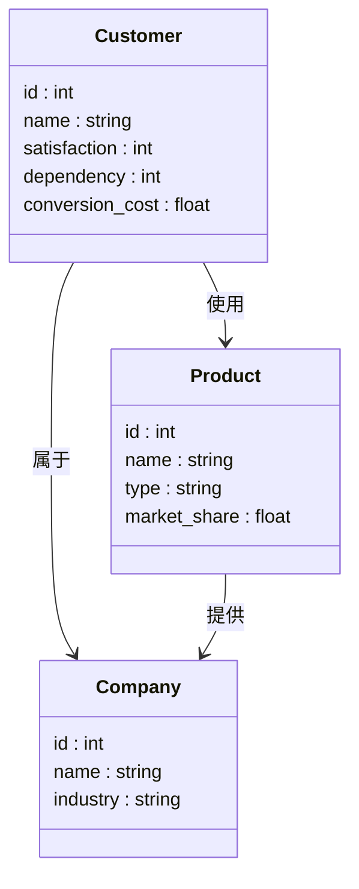
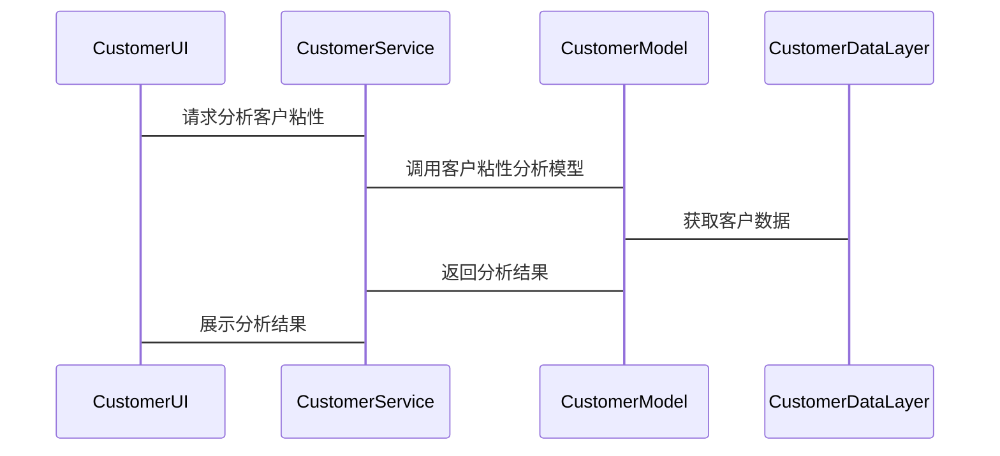

                 


# 彼得林奇如何分析公司的客户粘性

## 关键词：客户粘性、彼得·林奇、投资分析、客户忠诚度、客户满意度

## 摘要：  
客户粘性是衡量客户对企业产品或服务依赖程度的重要指标，是企业核心竞争力的关键体现。本文将深入探讨彼得·林奇如何通过客户粘性分析来评估公司的投资价值。通过详细分析客户粘性的定义、衡量指标、分析方法以及实际案例，本文将揭示客户粘性在投资决策中的重要性，并提供实用的分析工具和方法。

---

# 第1章: 客户粘性的定义与重要性

## 1.1 客户粘性的定义
### 1.1.1 什么是客户粘性
客户粘性（Customer Stickiness）是指客户对企业产品或服务的依赖程度，客户粘性越高，客户越不容易被竞争对手吸引，越倾向于长期使用该企业的产品或服务。

### 1.1.2 客户粘性与客户忠诚度的区别
- **客户忠诚度**：客户对品牌的信任和偏好，通常反映在重复购买行为上。  
- **客户粘性**：客户在使用产品或服务后，难以轻易转换到其他替代品的心理和行为特征。

### 1.1.3 客户粘性在投资分析中的作用
客户粘性是企业竞争优势的核心体现，高客户粘性的公司通常具有更强的定价权和市场支配力，从而在投资中具有更高的价值。

---

## 1.2 客户粘性的核心要素
### 1.2.1 产品依赖性
客户对产品功能的依赖程度越高，客户粘性越强。例如，软件服务类企业通常具有较高的客户粘性，因为客户需要依赖这些软件完成日常业务。

### 1.2.2 服务满意度
客户对企业的服务质量越满意，越不容易被竞争对手吸引。高满意度的客户更倾向于长期使用该企业的产品或服务。

### 1.2.3 替代品的可获得性
如果市场上存在大量的替代品，客户粘性可能会降低。相反，如果替代品较少或难以获得，客户粘性会更强。

### 1.2.4 客户转换成本
客户转换成本是指客户从一家企业转向另一家企业所需的时间、金钱或精力。转换成本越高，客户粘性越强。

---

## 1.3 客户粘性的衡量指标
### 1.3.1 客户保留率
客户保留率是衡量客户粘性的重要指标，通常通过计算一定时期内客户留存的比例来衡量。

### 1.3.2 客户生命周期价值（CLV）
客户生命周期价值是客户在与企业合作的整个生命周期内为企业带来的总收入。

### 1.3.3 客户净推荐值（NPS）
客户净推荐值是客户对企业产品或服务的满意度和忠诚度的综合指标，通常通过调查问卷的方式获取。

### 1.3.4 客户满意度指数
客户满意度指数是衡量客户对产品或服务的总体满意度的指标，通常通过调查问卷或数据分析得出。

---

## 1.4 客户粘性与企业竞争力的关系
### 1.4.1 客户粘性对企业市场地位的影响
高客户粘性的企业通常在市场中具有更强的竞争力，能够更好地抵御竞争对手的冲击。

### 1.4.2 客户粘性与企业盈利能力的关联
客户粘性高的企业通常具有更高的客户留存率和复购率，从而为企业带来更高的利润。

### 1.4.3 客户粘性在行业竞争中的作用
在同质化竞争激烈的市场中，客户粘性是企业差异化竞争的核心要素之一。

---

## 1.5 本章小结
客户粘性是衡量企业竞争力的重要指标，高客户粘性的企业通常具有更强的市场地位和盈利能力。彼得·林奇在投资分析中非常重视客户粘性，认为这是企业长期成功的关键因素之一。

---

# 第2章: 彼得·林奇的投资理念与客户粘性分析

## 2.1 彼得·林奇的投资者背景
### 2.1.1 彼得·林奇的生平简介
彼得·林奇是美国著名投资经理人，曾管理富达麦哲伦基金，创造了辉煌的投资业绩。

### 2.1.2 彼得·林奇的投资风格
彼得·林奇以深入的基本面分析和对公司管理层的考察闻名，注重企业基本面和长期竞争优势。

### 2.1.3 彼得·林奇的经典投资案例
彼得·林奇成功投资了包括微软、可口可乐在内的多家知名企业，这些案例中，他特别关注企业的客户粘性和市场地位。

---

## 2.2 彼得·林奇的客户粘性分析方法
### 2.2.1 客户粘性分析的核心思想
彼得·林奇认为，客户粘性是企业长期竞争优势的核心，高客户粘性的企业能够持续获得市场份额和利润。

### 2.2.2 彼得·林奇的客户粘性评估标准
- **产品依赖性**：客户是否依赖企业的核心产品或服务？  
- **客户满意度**：客户对企业的服务和产品是否满意？  
- **替代品可获得性**：市场上是否存在容易获得的替代品？  
- **客户转换成本**：客户转换到其他企业需要付出多少成本？

### 2.2.3 彼得·林奇客户粘性分析的步骤
1. **分析客户依赖性**：评估客户对企业产品或服务的依赖程度。  
2. **考察客户满意度**：通过客户调查或数据分析，衡量客户对企业的满意度。  
3. **评估替代品风险**：分析市场上替代品的可获得性和竞争力。  
4. **计算客户转换成本**：估算客户转换到其他企业的成本和难度。  

---

## 2.3 彼得·林奇客户粘性分析的实践应用
### 2.3.1 通过客户粘性分析筛选投资标的
彼得·林奇在选择投资标的时，特别关注那些具有高客户粘性和强大市场地位的企业。

### 2.3.2 客户粘性分析在企业估值中的应用
客户粘性高的企业通常具有较高的估值，因为它们能够持续创造稳定的现金流。

### 2.3.3 客户粘性分析的局限性与改进方向
客户粘性分析虽然重要，但需要结合其他因素进行综合评估，例如企业的财务状况和行业竞争环境。

---

## 2.4 本章小结
彼得·林奇的投资理念强调客户粘性的重要性，他通过深入分析客户的依赖性、满意度和转换成本，筛选出具有长期竞争优势的企业进行投资。

---

# 第3章: 客户粘性分析的核心概念与联系

## 3.1 客户粘性分析的核心概念
### 3.1.1 客户粘性与客户满意度的关系
客户满意度是客户粘性的基础，但高满意度并不一定意味着高客户粘性，因为客户可能因为其他原因选择离开。

### 3.1.2 客户粘性与客户忠诚度的差异
客户忠诚度是客户对企业的情感依赖，而客户粘性是客户对企业产品或服务的依赖程度。

### 3.1.3 客户粘性与市场占有率的联系
高客户粘性的企业通常能够保持较高的市场占有率，因为客户更倾向于长期使用其产品或服务。

---

## 3.2 客户粘性分析的属性特征对比表
| 属性 | 客户粘性 | 客户满意度 | 客户忠诚度 |
|----|----|----|----|
| 定义 | 客户对企业产品或服务的依赖程度 | 客户对产品或服务的满意程度 | 客户对品牌的情感依赖 |
| 评估方法 | 分析客户依赖性、转换成本等 | 通过调查问卷衡量 | 通过情感指标（如品牌忠诚度）衡量 |
| 重要性 | 高客户粘性意味着客户不易流失 | 高满意度是客户粘性的基础 | 高忠诚度是客户粘性的结果 |

---

## 3.3 客户粘性分析的ER实体关系图

```mermaid
erDiagram
    customer_notebook [客户] {
        id : int
        name : string
        satisfaction : int
        dependency : int
    }
    product_service [产品/服务] {
        id : int
        type : string
        market_share : float
    }
    company [公司] {
        id : int
        name : string
        industry : string
    }
    customer_notebook --> product_service : 使用
    customer_notebook --> company : 属于
    product_service --> company : 提供
```

---

## 3.4 本章小结
客户粘性分析需要综合考虑客户依赖性、满意度、转换成本等多种因素，与其他相关概念如客户忠诚度和市场占有率密切相关。

---

# 第4章: 客户粘性分析的算法与数学模型

## 4.1 客户粘性分析的算法选择
### 4.1.1 逻辑回归
逻辑回归是一种常用的分类算法，适用于二分类问题，如客户是否流失。

### 4.1.2 随机森林
随机森林是一种基于决策树的集成算法，适用于高维数据的分类和回归问题。

---

## 4.2 逻辑回归模型的实现
### 4.2.1 模型原理
逻辑回归通过sigmoid函数将线性回归的输出映射到概率空间，公式如下：

$$ P(y=1) = \frac{e^{(\beta_0 + \beta_1 x)}}{1 + e^{(\beta_0 + \beta_1 x)}} $$

### 4.2.2 模型实现
```python
import pandas as pd
from sklearn.linear_model import LogisticRegression
from sklearn.metrics import accuracy_score

# 数据加载
data = pd.read_csv('customer_sticky.csv')

# 特征工程
X = data[['satisfaction', 'dependency', 'conversion_cost']]
y = data['churn']

# 模型训练
model = LogisticRegression()
model.fit(X, y)

# 模型预测
y_pred = model.predict(X)

# 模型评估
print(accuracy_score(y, y_pred))
```

---

## 4.3 随机森林模型的实现
### 4.3.1 模型原理
随机森林通过构建多个决策树并进行投票或平均，提高模型的准确性和鲁棒性。

### 4.3.2 模型实现
```python
from sklearn.ensemble import RandomForestClassifier

# 数据加载
data = pd.read_csv('customer_sticky.csv')

# 特征工程
X = data[['satisfaction', 'dependency', 'conversion_cost']]
y = data['churn']

# 模型训练
model = RandomForestClassifier(n_estimators=100)
model.fit(X, y)

# 模型预测
y_pred = model.predict(X)

# 模型评估
print(accuracy_score(y, y_pred))
```

---

## 4.4 本章小结
通过逻辑回归和随机森林等算法，可以量化客户粘性的影响因素，为投资决策提供数据支持。

---

# 第5章: 客户粘性分析的系统架构与实现

## 5.1 系统架构设计
### 5.1.1 项目介绍
本项目旨在通过客户粘性分析模型，帮助企业评估客户粘性，优化客户管理策略。

### 5.1.2 领域模型


### 5.1.3 系统架构


### 5.1.4 接口设计
- **数据接口**：提供客户数据的读取和存储功能。  
- **模型接口**：提供客户粘性分析模型的调用接口。  
- **用户界面**：提供客户粘性分析结果的可视化展示。

### 5.1.5 交互流程


---

## 5.2 本章小结
通过系统架构设计，可以实现客户粘性分析的自动化和可视化，为企业提供高效的客户管理工具。

---

# 第6章: 客户粘性分析的项目实战

## 6.1 项目背景与目标
### 6.1.1 项目背景
本项目旨在通过客户粘性分析，帮助企业优化客户管理策略，提升客户保留率和市场占有率。

### 6.1.2 项目目标
- 建立客户粘性分析模型，量化客户粘性影响因素。  
- 提供客户粘性分析的可视化工具，帮助企业进行数据驱动的决策。

---

## 6.2 项目实现
### 6.2.1 环境安装
```bash
pip install pandas scikit-learn matplotlib
```

### 6.2.2 数据收集
```python
import pandas as pd

data = pd.read_csv('customer_sticky.csv')
print(data.head())
```

### 6.2.3 特征工程
```python
from sklearn.preprocessing import StandardScaler

scaler = StandardScaler()
X_scaled = scaler.fit_transform(data[['satisfaction', 'dependency', 'conversion_cost']])
```

### 6.2.4 模型训练
```python
from sklearn.ensemble import RandomForestClassifier

model = RandomForestClassifier(n_estimators=100)
model.fit(X_scaled, data['churn'])
```

### 6.2.5 模型评估
```python
from sklearn.metrics import classification_report

y_pred = model.predict(X_scaled)
print(classification_report(data['churn'], y_pred))
```

### 6.2.6 可视化展示
```python
import matplotlib.pyplot
importances = model.feature_importances_
indices = np.argsort(importances)[::-1]

plt.title('Feature Importances')
plt.barh(range(len(importances)), importances[indices])
plt.yticks(range(len(importances)), [data.columns[i] for i in indices])
plt.xlabel('Feature Importance')
plt.show()
```

---

## 6.3 项目小结
通过项目实战，可以将客户粘性分析的理论应用于实际，帮助企业优化客户管理策略。

---

# 第7章: 客户粘性分析的最佳实践与总结

## 7.1 本章小结
客户粘性是衡量企业竞争力的重要指标，高客户粘性的企业通常具有更强的市场地位和盈利能力。通过本文的分析，我们可以看出彼得·林奇在投资分析中非常重视客户粘性，认为这是企业长期成功的关键因素之一。

---

## 7.2 投资注意事项
- **关注客户粘性**：在投资前，必须深入分析企业的客户粘性。  
- **结合其他因素**：客户粘性分析需要结合企业的财务状况和行业竞争环境。  
- **持续关注**：客户粘性是动态变化的，需要持续关注和分析。

---

## 7.3 拓展阅读
- 彼得·林奇的《投资最重要的事情》  
- 克里斯托弗·鲍恩的《客户忠诚度管理》  
- 《数据分析与投资决策》

---

## 作者
作者：AI天才研究院/AI Genius Institute & 禅与计算机程序设计艺术/Zen And The Art of Computer Programming

---

通过以上内容，我们系统地探讨了彼得·林奇如何分析公司的客户粘性，从理论到实践，从算法到系统架构，全面解析了客户粘性分析的核心方法和应用。

