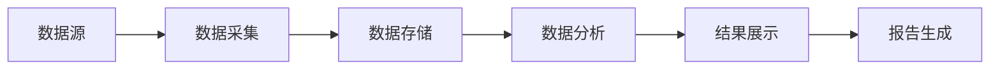

                 


# 彼得林奇如何分析公司的客户细分策略演变

## 关键词：客户细分，彼得林奇，数据分析，策略演变，投资分析

## 摘要：  
彼得·林奇是全球著名投资专家，他通过深入分析公司的客户细分策略，为投资者提供了独特的见解。本文将详细探讨客户细分策略的演变过程，分析彼得·林奇的分析方法，结合数学模型和系统架构，提供实际案例和投资策略建议，帮助读者更好地理解如何通过客户细分策略进行投资决策。

---

# 第一部分：客户细分策略演变的背景与基础

## 第1章：客户细分的基本概念

### 1.1 客户细分的定义与重要性

#### 1.1.1 客户细分的定义  
客户细分是指将客户群体按照某些特征（如年龄、性别、收入、地理位置等）进行划分，以更好地理解客户行为、需求和偏好。通过客户细分，企业可以制定更有针对性的市场策略。

#### 1.1.2 客户细分在企业中的重要性  
客户细分帮助企业精准定位目标市场，优化资源配置，提高客户满意度和忠诚度。通过细分客户，企业可以更好地满足不同客户群体的需求，提升市场竞争力。

#### 1.1.3 彼得·林奇的客户细分分析框架  
彼得·林奇在分析公司客户细分策略时，重点关注客户的行为、需求和市场变化。他通过分析客户细分数据，识别市场趋势和潜在机会，为企业制定投资策略提供依据。

### 1.2 客户细分策略的演变历程

#### 1.2.1 传统客户细分方法  
传统客户细分主要基于地理位置、人口统计和消费习惯。例如，将客户按地理位置分为城市和农村客户。

#### 1.2.2 数据驱动的客户细分演变  
随着大数据技术的发展，客户细分逐渐从经验驱动转向数据驱动。企业通过收集和分析客户数据，利用数据挖掘和机器学习技术进行客户细分。

#### 1.2.3 当前客户细分的趋势  
当前，客户细分更加注重客户行为和体验的动态变化。企业通过实时数据分析，快速调整客户细分策略，以适应市场变化。

### 1.3 彼得·林奇的客户细分分析方法

#### 1.3.1 数据收集与处理  
彼得·林奇通过收集客户的交易数据、行为数据和市场数据，进行数据清洗和预处理。

#### 1.3.2 分析框架的核心要素  
林奇的分析框架包括客户特征分析、市场趋势分析和竞争对手分析。

#### 1.3.3 客户画像构建方法  
通过分析客户的年龄、性别、收入、地理位置等特征，构建详细的客户画像，识别不同客户群体的需求和偏好。

---

## 第2章：客户细分的数学模型与算法

### 2.1 数据分析工具与方法

#### 2.1.1 数据挖掘工具  
常用的数据挖掘工具包括Python的scikit-learn库和R语言。

#### 2.1.2 统计分析方法  
包括聚类分析、回归分析等方法。

#### 2.1.3 数据可视化工具  
使用Matplotlib、Seaborn等工具进行数据可视化。

### 2.2 聚类分析算法

#### 2.2.1 K-means算法  
K-means是一种常用的无监督学习算法，用于将客户分为不同的群组。

**K-means算法步骤：**
1. 随机选择K个初始质心。
2. 计算每个客户到质心的距离，将客户分配到最近的质心组。
3. 重新计算各组的质心。
4. 重复步骤2和3，直到质心不再变化。

**代码示例：**
```python
from sklearn.cluster import KMeans
import numpy as np

X = np.array([[1, 2], [5, 8], [1, 1], [10, 3]])
kmeans = KMeans(n_clusters=2, random_state=0)
kmeans.fit(X)
print(kmeans.labels_)
```

### 2.3 分类分析算法

#### 2.3.1 逻辑回归  
逻辑回归用于预测客户属于某个类别的概率。

**逻辑回归公式：**
$$ P(y=1|x) = \frac{e^{\beta x}}{1 + e^{\beta x}} $$

**代码示例：**
```python
from sklearn.linear_model import LogisticRegression
from sklearn.datasets import make_classification

X, y = make_classification(n_samples=100, n_features=2, n_classes=2)
lr = LogisticRegression()
lr.fit(X, y)
print(lr.predict(X))
```

### 2.4 客户细分的特征对比表格

| 特征 | 类别1 | 类别2 | 类别3 |
|------|-------|-------|-------|
| 年龄 | 18-25 | 26-35 | 36-50 |
| 收入 | 低     | 中     | 高     |
| 性别 | 男     | 女     | 无     |

---

## 第3章：客户细分的系统架构设计

### 3.1 系统设计概述

#### 3.1.1 系统目标与范围  
系统目标：支持客户细分策略的分析和优化。范围包括数据收集、分析和结果展示。

#### 3.1.2 系统功能模块  
模块包括数据采集、数据分析、结果展示和报告生成。

#### 3.1.3 系统架构图  


### 3.2 数据流分析

#### 3.2.1 数据输入与处理流程  
数据从数据库输入，经过清洗和预处理后，进行特征提取。

#### 3.2.2 数据分析与处理流程  
使用聚类和分类算法对数据进行分析，生成客户细分结果。

#### 3.2.3 结果输出与展示  
将分析结果以图表形式展示，帮助用户理解客户细分情况。

---

## 第4章：客户细分的实战案例

### 4.1 零售行业的客户细分

#### 4.1.1 零售行业的客户特征  
客户特征包括消费频率、客单价和购买偏好。

#### 4.1.2 客户细分的策略演变  
从传统的人工分类到数据驱动的自动化分类，零售行业的客户细分策略不断优化。

#### 4.1.3 案例分析  
以某零售企业为例，分析其客户细分策略，并提出优化建议。

### 4.2 投资策略与客户细分

#### 4.2.1 投资策略的制定  
基于客户细分结果，制定相应的投资策略，重点关注高潜力客户群体。

#### 4.2.2 投资策略的演变  
随着客户细分策略的优化，投资策略也需要不断调整，以适应市场变化。

### 4.3 客户细分的系统实现

#### 4.3.1 系统实现的关键步骤  
包括数据收集、分析和结果展示。

#### 4.3.2 系统实现的代码示例  
```python
import pandas as pd
from sklearn.cluster import KMeans

data = pd.read_csv('customer.csv')
model = KMeans(n_clusters=3, random_state=0)
model.fit(data)
print(model.labels_)
```

---

## 第5章：客户细分策略的总结与展望

### 5.1 客户细分策略的总结

#### 5.1.1 客户细分策略的核心要素  
包括数据收集、分析方法和结果应用。

#### 5.1.2 客户细分策略的最佳实践  
建议企业结合自身特点，选择合适的客户细分方法，并持续优化策略。

### 5.2 客户细分策略的未来展望

#### 5.2.1 数据分析技术的发展  
随着人工智能和大数据技术的进步，客户细分策略将更加精准和动态。

#### 5.2.2 客户细分策略的创新应用  
未来，客户细分策略将更多地应用于个性化营销和精准投资决策。

---

## 作者：AI天才研究院/AI Genius Institute & 禅与计算机程序设计艺术 /Zen And The Art of Computer Programming

---

这篇文章通过详细探讨彼得·林奇的客户细分分析方法，结合数学模型和系统架构，为读者提供了全面的客户细分策略演变的分析。通过实际案例和投资策略建议，帮助读者更好地理解和应用客户细分策略。

