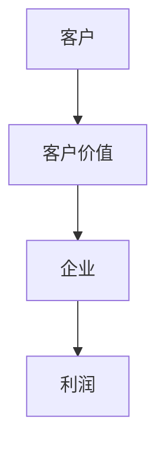
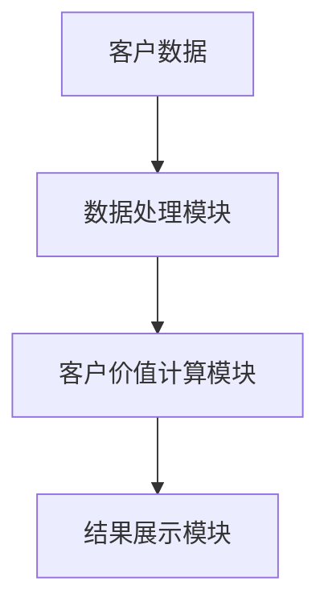

                 


# 彼得林奇如何分析公司的客户终身价值

## 关键词：客户终身价值，彼得·林奇，投资分析，企业价值，客户生命周期

## 摘要：  
本文深入探讨了彼得·林奇如何通过分析客户终身价值来评估企业投资价值的方法。文章首先介绍了客户终身价值的核心概念，然后详细分析了其计算方法，并结合彼得·林奇的投资理念，揭示了如何通过客户终身价值评估企业潜力。最后，文章通过系统架构设计和实战案例，展示了如何在实际投资中应用客户终身价值分析。

---

## 第一部分: 客户终身价值的背景与概念

### 第1章: 客户终身价值的定义与重要性

#### 1.1 客户终身价值的定义
##### 1.1.1 什么是客户终身价值
客户终身价值（Customer Lifetime Value，简称CLV或LTV）是指一个客户在其生命周期内为企业带来的总收入减去相关的成本。它是衡量客户对企业贡献的重要指标，也是投资者评估企业潜在价值的重要依据。

##### 1.1.2 客户终身价值的核心要素
- **客户生命周期**：客户从初次接触企业到最终流失的时间段。
- **客户收入贡献**：客户在生命周期内为企业带来的收入。
- **客户成本**：企业在获取和维护客户过程中产生的成本。
- **贴现率**：用于调整未来现金流现值的折现率。

##### 1.1.3 客户终身价值与企业可持续发展的关系
客户终身价值不仅反映了客户的经济价值，还体现了企业的客户维护能力和市场竞争力。通过优化客户终身价值，企业可以实现可持续发展，同时为投资者创造更大的价值。

---

#### 1.2 客户终身价值与投资分析
##### 1.2.1 客户终身价值在投资中的作用
客户终身价值是投资者评估企业盈利能力的重要指标。通过分析客户的终身价值，投资者可以判断企业的客户质量、市场潜力和未来的增长能力。

##### 1.2.2 投资者如何通过客户终身价值评估企业价值
投资者可以通过以下步骤评估企业的客户终身价值：
1. 了解企业的客户获取和维护成本。
2. 估算客户生命周期内的收入贡献。
3. 计算客户终身价值并将其与行业平均水平进行比较。
4. 结合企业的财务状况和市场前景做出投资决策。

##### 1.2.3 客户终身价值与企业成长的关联
客户终身价值的增长往往与企业的市场扩展和客户满意度密切相关。通过优化客户体验和提高客户忠诚度，企业可以显著提升客户终身价值，从而实现可持续增长。

---

#### 1.3 彼得·林奇的客户价值分析方法
##### 1.3.1 彼得·林奇的投资理念概述
彼得·林奇是美国著名投资经理人，以其独特的投资策略和基本面分析闻名。他认为，企业的长期价值取决于其客户质量和盈利能力。

##### 1.3.2 客户终身价值在彼得·林奇分析体系中的地位
在彼得·林奇的分析体系中，客户终身价值是评估企业潜力的核心指标。他认为，只有那些能够持续吸引高质量客户的的企业才能实现长期增长。

##### 1.3.3 彼得·林奇如何通过客户价值评估企业潜力
彼得·林奇通过以下步骤分析企业的客户价值：
1. 了解企业的客户获取策略和成本。
2. 评估客户的生命周期价值。
3. 比较企业的客户价值与行业平均水平。
4. 结合企业的财务状况和市场前景做出投资决策。

---

### 第2章: 客户终身价值的核心概念与联系

#### 2.1 核心概念原理
##### 2.1.1 客户终身价值的数学模型
客户终身价值的计算公式如下：
$$ CV = \frac{ARPU \times (1 + r)}{1 - (1 + r)^{-n}} $$
其中，ARPU是每用户平均收入，r是贴现率，n是客户生命周期长度。

##### 2.1.2 客户价值与企业利润的关系
客户价值与企业利润密切相关。通过提高客户价值，企业可以增加收入并降低成本，从而提高利润。

##### 2.1.3 客户生命周期与价值的动态变化
客户生命周期分为几个阶段，包括获取阶段、成熟阶段和衰退阶段。在每个阶段，客户的价值贡献不同，企业需要根据客户需求制定相应的策略。

---

#### 2.2 核心概念属性对比表格
##### 表2-1: 不同客户阶段的价值对比
| 客户阶段       | 价值特征         |
|----------------|------------------|
| 获取阶段       | 价值较低，成本较高 |
| 成熟阶段       | 价值较高，成本稳定 |
| 衰退阶段       | 价值下降，成本增加 |

##### 表2-2: 客户价值与企业成本的对比
| 指标         | 价值特征         |
|--------------|------------------|
| 客户价值     | 高               |
| 客户成本     | 低               |

---

#### 2.3 ER实体关系图


---

### 第3章: 客户终身价值的计算方法

#### 3.1 客户终身价值的计算模型
##### 3.1.1 客户终身价值的公式
$$ CV = \frac{ARPU \times (1 + r)}{1 - (1 + r)^{-n}} $$
其中，ARPU是每用户平均收入，r是贴现率，n是客户生命周期长度。

##### 3.1.2 计算步骤与注意事项
1. 确定客户的生命周期长度。
2. 估算每用户平均收入（ARPU）。
3. 估算贴现率（r）。
4. 应用公式计算客户终身价值。

##### 3.1.3 客户价值与企业利润的对比分析
客户价值与企业利润密切相关。通过提高客户价值，企业可以增加收入并降低成本，从而提高利润。

---

#### 3.2 彼得·林奇的客户价值分析方法论
##### 3.2.1 彼得·林奇的客户价值分析框架
彼得·林奇通过以下步骤分析企业的客户价值：
1. 了解企业的客户获取策略和成本。
2. 评估客户的生命周期价值。
3. 比较企业的客户价值与行业平均水平。
4. 结合企业的财务状况和市场前景做出投资决策。

##### 3.2.2 客户价值与企业成长的动态关系
客户价值的增长往往与企业的市场扩展和客户满意度密切相关。通过优化客户体验和提高客户忠诚度，企业可以显著提升客户终身价值，从而实现可持续增长。

##### 3.2.3 实际案例分析
以某互联网企业为例，假设其ARPU为$50，贴现率为5%，客户生命周期长度为5年。则客户终身价值为：
$$ CV = \frac{50 \times (1 + 0.05)}{1 - (1 + 0.05)^{-5}} \approx 275.55 $$
通过比较行业平均水平，可以判断该企业的客户价值是否具有投资价值。

---

## 第4章: 系统分析与架构设计方案

### 4.1 系统架构设计


### 4.2 系统功能设计
#### 4.2.1 数据处理模块
- 数据清洗
- 数据转换
- 数据存储

#### 4.2.2 客户价值计算模块
- ARPU计算
- 贴现率计算
- 客户生命周期计算
- 终身价值计算

#### 4.2.3 结果展示模块
- 图表展示
- 数据导出
- 报告生成

---

## 第5章: 项目实战

### 5.1 环境安装
- 安装Python
- 安装Pandas和NumPy库
- 安装Matplotlib或Seaborn库

### 5.2 核心实现源代码
```python
import numpy as np
import pandas as pd

def calculate_customer_lifetime_value(ARPU, discount_rate, lifecycle_length):
    numerator = ARPU * (1 + discount_rate)
    denominator = 1 - (1 + discount_rate) ** (-lifecycle_length)
    return numerator / denominator

# 示例数据
ARPU = 50
discount_rate = 0.05
lifecycle_length = 5

# 计算客户终身价值
cv = calculate_customer_lifetime_value(ARPU, discount_rate, lifecycle_length)
print(f"客户终身价值: {cv:.2f}")
```

### 5.3 实际案例分析
以某互联网企业为例，假设其ARPU为$50，贴现率为5%，客户生命周期长度为5年。则客户终身价值为：
$$ CV = \frac{50 \times (1 + 0.05)}{1 - (1 + 0.05)^{-5}} \approx 275.55 $$
通过比较行业平均水平，可以判断该企业的客户价值是否具有投资价值。

---

## 第6章: 最佳实践与小结

### 6.1 投资建议
- 选择具有高客户终身价值的企业进行投资。
- 关注企业的客户获取和维护成本。
- 定期评估企业的客户价值变化。

### 6.2 未来展望
随着大数据和人工智能技术的发展，客户终身价值的计算将更加精准和高效。投资者可以利用这些技术优势，进一步提升投资决策的准确性。

---

## 作者：AI天才研究院/AI Genius Institute & 禅与计算机程序设计艺术 /Zen And The Art of Computer Programming

