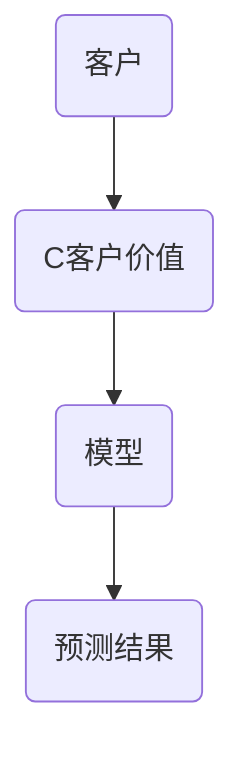
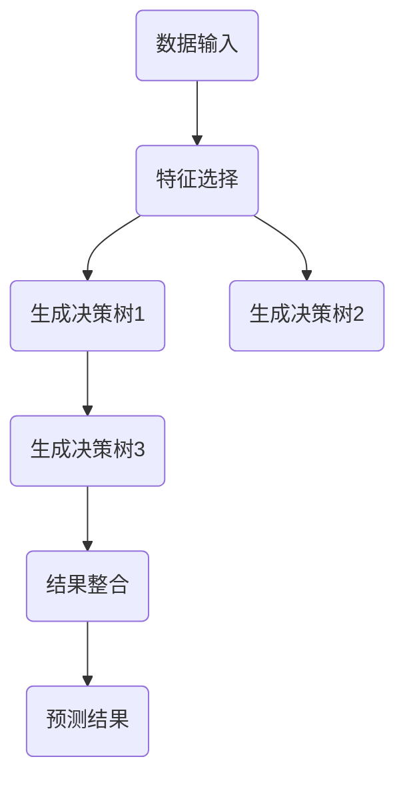
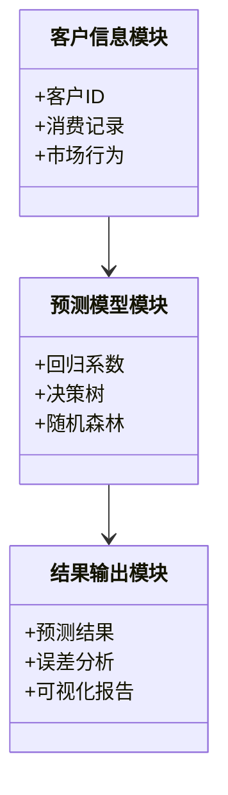
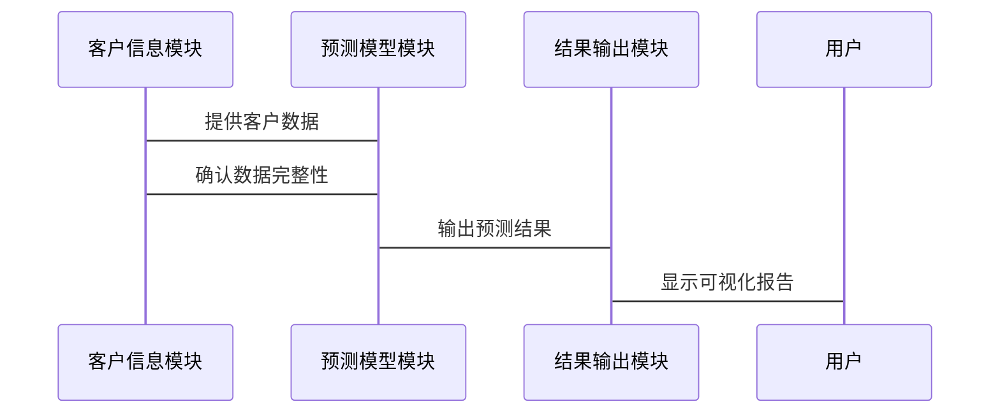

                 


# 彼得林奇如何分析公司的客户终身价值预测模型准确性

> 关键词：客户终身价值（CLV）、预测模型、彼得·林奇、投资分析、模型准确性

> 摘要：本文详细探讨了如何运用彼得·林奇的投资分析方法来评估客户终身价值（CLV）预测模型的准确性。通过分析CLV模型的核心概念、算法原理、系统架构和实际案例，本文为读者提供了从理论到实践的全面指导，帮助企业在复杂市场环境中提升客户价值预测的准确性。

---

## 第一部分: 客户终身价值预测模型概述

### 第1章: 客户终身价值（CLV）的基本概念

#### 1.1 CLV的定义与重要性
客户终身价值（Customer Lifetime Value，简称CLV或CLTV）是企业在客户生命周期内从该客户那里获得的总收入。它是企业制定定价策略、促销策略和客户维护策略的重要依据。  
CLV的核心在于预测客户在未来一段时间内的消费行为和价值，从而帮助企业优化资源分配和客户关系管理。

#### 1.2 彼得·林奇的分析方法
彼得·林奇是全球著名投资专家，他通过基本面分析和对公司管理层的考察来评估企业的投资价值。在分析CLV模型时，我们可以借鉴他的方法：  
1. **基本面分析**：研究客户的历史消费数据和市场行为，挖掘潜在的价值驱动因素。  
2. **管理层质量**：评估模型的设计者和开发者是否具备专业能力。  
3. **长期价值**：关注模型在长期预测中的稳定性和准确性。

#### 1.3 CLV预测模型的背景与现状
随着大数据和人工智能技术的快速发展，CLV预测模型在企业中的应用越来越广泛。然而，模型的准确性受到数据质量、算法选择和市场环境等多种因素的影响。本文将结合彼得·林奇的分析方法，探讨如何提升CLV预测模型的准确性。

---

## 第二部分: 客户终身价值预测模型的核心概念与联系

### 第2章: CLV预测模型的核心概念与联系

#### 2.1 CLV预测模型的定义与属性
CLV预测模型是一种基于历史数据和机器学习算法的预测模型，旨在估算客户在未来一段时间内的消费价值。其核心属性包括：  
- **输入**：客户的基本信息、消费记录、市场行为等。  
- **输出**：客户在未来一定时间内的预计消费价值。  
- **目标**：帮助企业优化客户关系管理，提升客户满意度和忠诚度。

#### 2.2 CLV预测模型的ER实体关系图


#### 2.3 CLV预测模型与传统模型的对比
以下是CLV预测模型与传统模型的核心属性对比：

| 属性               | CLV预测模型                     | 传统模型                       |
|--------------------|---------------------------------|--------------------------------|
| 输入数据           | 客户行为数据、交易记录         | 简单统计数据分析               |
| 输出结果           | 客户终身价值预测               | 当前价值或短期预测             |
| 算法复杂度         | 高（机器学习、深度学习）       | 低（线性回归、简单统计）       |
| 应用场景           | 客户关系管理、精准营销         | 财务分析、市场研究             |
| 数据要求           | 高（需要详细客户行为数据）     | 较低（需要基础统计数据）       |

---

## 第三部分: 客户终身价值预测模型的算法原理

### 第3章: CLV预测模型的算法原理

#### 3.1 线性回归算法
线性回归是一种简单而强大的预测模型，常用于CLV预测的初步分析。其数学模型如下：

$$ y = \beta_0 + \beta_1x_1 + \beta_2x_2 + \cdots + \beta_nx_n + \epsilon $$

其中：  
- $y$ 表示客户价值（目标变量）  
- $x_i$ 表示自变量（如消费频率、客单价等）  
- $\beta_i$ 表示回归系数  
- $\epsilon$ 表示误差项  

#### 3.2 随机森林算法
随机森林是一种基于树的集成算法，适用于高维数据和复杂场景的CLV预测。以下是随机森林的算法步骤：



#### 3.3 支持向量机（SVM）算法
支持向量机适用于小样本数据的CLV预测。其数学模型如下：

$$ y = \text{sign}(\sum_{i=1}^n \alpha_i y_i x_i \cdot x + b) $$

其中：  
- $x$ 表示输入特征  
- $\alpha_i$ 表示拉格朗日乘子  
- $y_i$ 表示目标变量  
- $b$ 表示偏置项  

---

## 第四部分: 客户终身价值预测模型的系统架构设计

### 第4章: 系统架构与实现

#### 4.1 系统功能设计
以下是CLV预测系统的功能模块设计：



#### 4.2 系统交互设计
以下是系统交互的序列图：



---

## 第五部分: 项目实战与案例分析

### 第5章: 项目实战

#### 5.1 环境搭建
- **工具安装**：安装Python、Jupyter Notebook、Scikit-learn等工具。  
- **数据准备**：收集客户信息、消费记录和市场行为数据。

#### 5.2 核心代码实现
以下是CLV预测模型的Python代码实现：

```python
import pandas as pd
from sklearn.model_selection import train_test_split
from sklearn.linear_model import LinearRegression
from sklearn.metrics import mean_squared_error

# 数据加载
data = pd.read_csv('customer_data.csv')

# 特征选择
features = ['age', 'income', 'purchase_frequency']
target = 'customer_value'

# 数据分割
X_train, X_test, y_train, y_test = train_test_split(data[features], data[target], test_size=0.2, random_state=42)

# 模型训练
model = LinearRegression()
model.fit(X_train, y_train)

# 模型预测
y_pred = model.predict(X_test)

# 模型评估
mse = mean_squared_error(y_test, y_pred)
print(f'Mean Squared Error: {mse}')
```

#### 5.3 实际案例分析
假设我们有一个零售企业的客户数据，以下是部分数据和分析结果：

| 客户ID | 年龄 | 收入 | 购买频率 | 预测CLV | 实际CLV |
|--------|------|------|----------|---------|---------|
| C001    | 30   | 50000| 5        | 2500    | 2400    |
| C002    | 45   | 70000| 3        | 3000    | 2800    |
| C003    | 25   | 30000| 8        | 1800    | 1700    |

---

## 第六部分: 总结与展望

### 第6章: 总结与展望

#### 6.1 总结
通过结合彼得·林奇的投资分析方法和现代机器学习技术，我们可以显著提升CLV预测模型的准确性。本文详细探讨了CLV模型的核心概念、算法原理和系统架构，并通过实际案例展示了模型的应用。

#### 6.2 展望
未来，随着人工智能和大数据技术的进一步发展，CLV预测模型将更加精准和智能化。企业可以利用这些技术优化客户关系管理，提升市场竞争力。

---

## 作者信息

作者：AI天才研究院/AI Genius Institute & 禅与计算机程序设计艺术/Zen And The Art of Computer Programming

---

本文通过结合彼得·林奇的投资理念和现代技术，为读者提供了从理论到实践的全面指导，帮助企业提升客户终身价值预测的准确性。

