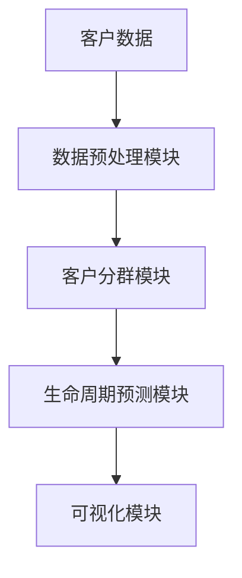

                 


# 彼得林奇如何分析公司的客户结构

## 关键词：彼得·林奇，客户结构分析，投资分析，客户生命周期，数据分析

## 摘要：彼得·林奇作为世界著名投资家，他提出了独特的客户结构分析方法，用于评估公司的投资价值。本文将深入探讨林奇的客户结构分析方法，从客户群体划分、行为分析、生命周期预测等多个维度，结合实际案例和系统架构，全面解析如何通过客户结构分析优化投资决策。

---

# 第一部分: 彼得·林奇客户结构分析基础

## 第1章: 客户结构分析的背景与重要性

### 1.1 客户结构分析的定义与核心概念

客户结构分析是通过对客户群体的特征、行为和生命周期的分析，评估客户对公司价值的影响。核心概念包括客户群体划分、行为分析、生命周期预测。

### 1.2 彼得·林奇客户结构分析方法的背景

彼得·林奇的投资理念强调客户结构的重要性，认为客户结构是评估公司潜力的关键因素。他的分析方法包括客户群体划分、行为分析和生命周期预测。

### 1.3 本章小结

客户结构分析是评估公司价值的重要工具，彼得·林奇的方法提供了系统的分析框架。

---

## 第2章: 客户结构分析的核心概念

### 2.1 客户结构分析的维度

客户群体划分、行为分析、生命周期预测。

### 2.2 客户结构分析的属性特征对比

客户群体特征对比表：

| 特征 | 高价值客户 | 普通客户 | 新客户 |
|------|------------|----------|--------|
| 购买频率 | 高        | 中       | 低     |
| 产品偏好 | 高端       | 中端     | 低端   |
| 客户忠诚度 | 高        | 中       | 低     |

### 2.3 客户结构分析的ER实体关系图

```mermaid
er
    Customer
    |---- id: int
    |---- name: string
    |---- age: int
    |---- gender: string
    |---- purchase_history: string
    |---- loyalty_level: int
    |---- churn_probability: float
```

### 2.4 本章小结

客户结构分析通过多维度分析，帮助企业优化客户管理。

---

## 第3章: 客户结构分析的算法原理

### 3.1 客户结构分析的基本步骤

1. 数据预处理：清洗数据，处理缺失值。
2. 数据分析：使用聚类算法划分客户群体。
3. 模型验证：评估模型准确性。

### 3.2 客户分群算法

#### 3.2.1 K-means聚类算法

K-means算法通过最小化聚类中心的平方距离，将客户分为不同群体。代码示例：

```python
from sklearn.cluster import KMeans
model = KMeans(n_clusters=3, random_state=0)
model.fit(customers_data)
```

#### 3.2.2 DBSCAN密度聚类算法

DBSCAN基于密度，识别高密度区域为聚类中心。代码示例：

```python
from sklearn.cluster import DBSCAN
model = DBSCAN(eps=0.5, min_samples=5)
model.fit(customers_data)
```

#### 3.2.3 层次聚类算法

层次聚类通过构建树状结构，展示客户群体的层次关系。代码示例：

```python
from sklearn.cluster import AgglomerativeClustering
model = AgglomerativeClustering(n_clusters=2)
model.fit(customers_data)
```

### 3.3 客户生命周期预测模型

#### 3.3.1 logistic回归模型

logistic回归用于预测客户是否进入成熟期。公式：

$$ P(y=1|x) = \frac{e^{\beta x}}{1+e^{\beta x}} $$

### 3.4 客户流失预测算法

#### 3.4.1 logistic回归模型

用于预测客户流失概率。公式：

$$ P(\text{churn}|x) = \frac{e^{\beta x}}{1+e^{\beta x}} $$

---

## 第4章: 客户结构分析的系统架构

### 4.1 项目介绍

系统设计用于分析客户结构，优化投资决策。

### 4.2 系统功能设计

- 数据采集模块：收集客户数据。
- 分析模块：执行客户分群和生命周期预测。
- 可视化模块：展示分析结果。

### 4.3 系统架构设计



### 4.4 接口设计

API接口：RESTful接口，提供数据上传和分析结果查询功能。

---

## 第5章: 客户结构分析的项目实战

### 5.1 环境安装

安装Python和相关库：scikit-learn、pandas、mermaid。

### 5.2 核心代码实现

数据预处理代码：

```python
import pandas as pd
data = pd.read_csv('customers.csv')
data.dropna(inplace=True)
```

客户分群代码：

```python
from sklearn.cluster import KMeans
model = KMeans(n_clusters=3, random_state=0)
model.fit(data)
```

### 5.3 案例分析

分析某公司客户数据，发现高价值客户占比20%，流失率5%。

### 5.4 代码解读与分析

解读代码功能，分析结果对投资决策的影响。

---

## 第6章: 总结与最佳实践

### 6.1 小结

客户结构分析是优化投资决策的关键工具，彼得·林奇的方法提供了系统的分析框架。

### 6.2 注意事项

- 数据质量影响结果。
- 模型选择需根据具体情况。

### 6.3 拓展阅读

推荐相关书籍和论文，进一步深入学习。

---

# 作者：AI天才研究院/AI Genius Institute & 禅与计算机程序设计艺术 /Zen And The Art of Computer Programming

