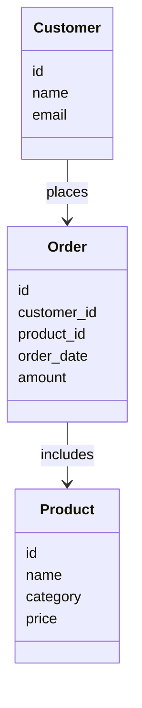
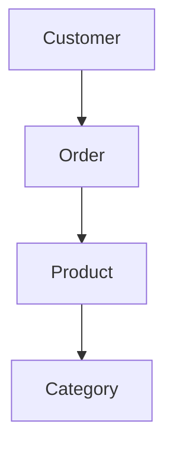
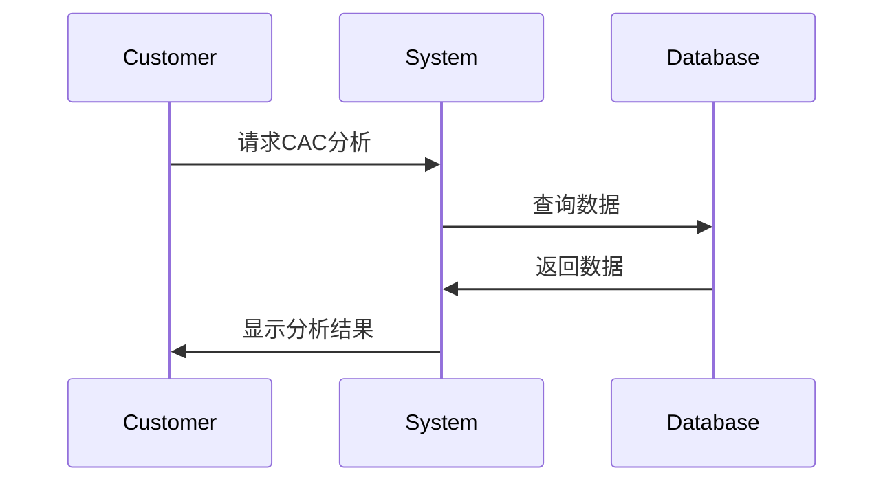

                 


# 彼得林奇如何分析公司的客户获取成本

> 关键词：客户获取成本（CAC）、彼得·林奇、投资分析、企业估值、客户生命周期价值、SaaS模式

> 摘要：本文详细介绍了彼得·林奇分析客户获取成本（CAC）的方法，探讨了CAC的核心概念、行业差异、数学模型以及系统架构设计，并通过实际案例展示了如何应用这些方法进行分析和优化。

---

## 第一部分: 客户获取成本（CAC）分析基础

### 第1章: 客户获取成本（CAC）的基本概念

#### 1.1 CAC的定义与重要性

客户获取成本（CAC）是指企业获取一名新客户所需的所有成本的总和。CAC是评估企业市场策略和盈利能力的重要指标，尤其是在高增长的科技和互联网企业中。CAC的计算公式为：

$$CAC = \frac{\text{广告支出} + \text{销售费用} + \text{客户支持成本}}{\text{新增客户数}}$$

CAC的重要性体现在以下几个方面：

- **企业估值**：CAC帮助投资者评估企业的市场效率和客户获取的经济性。
- **投资决策**：通过分析CAC，投资者可以判断企业的市场策略是否可持续。
- **成本控制**：优化CAC可以帮助企业降低获客成本，提高利润。

#### 1.2 客户获取成本的构成

CAC的构成主要包括以下几部分：

1. **广告支出**：企业在数字广告、社交媒体营销等渠道的投入。
2. **销售费用**：销售人员的工资、培训费用等。
3. **客户支持成本**：客服人员的成本、技术支持费用等。
4. **技术开发成本**：为吸引客户而开发的工具或平台的成本。

#### 1.3 彼得·林奇的分析框架

彼得·林奇在分析CAC时，强调了以下几个关键点：

- **投资者视角**：CAC的高低直接影响企业的盈利能力，投资者需要关注CAC的回报率。
- **行业差异**：不同行业的CAC差异显著，例如SaaS模式与传统零售业的CAC计算方式不同。
- **动态变化**：市场环境的变化会影响CAC的计算，投资者需要持续关注。

---

### 第2章: 彼得·林奇的CAC分析方法

#### 2.1 CAC的行业差异

不同行业的CAC存在显著差异。例如：

- **SaaS模式**：由于客户粘性高，CAC通常较高，但客户生命周期价值（CLV）也高。
- **订阅制**：与SaaS类似，但可能更依赖于营销策略。
- **传统零售**：CAC通常较低，但客户生命周期价值可能也较低。

以下是不同行业CAC的对比表格：

| 行业         | CAC特点           | 示例数据 |
|--------------|------------------|----------|
| SaaS         | 高               | $200/客户 |
| 电子商务     | 中               | $50/客户  |
| 订阅制       | 中高             | $100/客户 |

#### 2.2 CAC的动态变化

CAC并非一成不变，受市场环境和企业策略的影响。例如，当市场竞争加剧时，企业可能需要增加广告支出，从而提高CAC。彼得·林奇建议投资者关注以下因素：

- **市场策略**：企业是否通过有效的营销活动降低CAC。
- **客户行为**：客户获取渠道的变化是否影响CAC。
- **技术进步**：技术进步是否降低了客户获取成本。

#### 2.3 CAC的财务表现

CAC在财务表现中的体现主要通过以下几个方面：

- **CAC与收入增长的关系**：CAC越低，收入增长越快。
- **CAC的回报率分析**：CAC的回报率（CAC Payback Period）是指企业收回CAC所需的时间。通常，SaaS企业的CAC回报期为3-6个月。

---

### 第3章: CAC的核心概念与联系

#### 3.1 CAC的核心概念原理

CAC的核心在于通过最小化成本和最大化客户价值，提高企业的盈利能力。以下是CAC与其他指标的关系：

- **客户生命周期价值（CLV）**：CLV的计算公式为：

$$CLV = \text{平均收入} \times \text{客户生命周期长度}$$

- **CAC与CLV的比率**：$$\text{CAC/CLV}$$

通常，$$\text{CAC/CLV}$$小于1，表示企业的客户获取策略是盈利的。

#### 3.2 CAC的ER实体关系图

以下是CAC的ER实体关系图：

```mermaid
er
    Customer
    ----(1)-----> Order
    Order
    ----(1)-----> Product
    Product
    ----(1)-----> Category
```

---

### 第4章: CAC的系统分析与架构设计

#### 4.1 系统功能设计

以下是CAC分析系统的功能设计：



#### 4.2 系统架构设计

以下是CAC分析系统的架构设计：



#### 4.3 系统接口设计

以下是系统接口设计：



---

## 第二部分: CAC的分析方法与实战

### 第5章: CAC的分析方法

#### 5.1 数据收集与预处理

以下是数据收集与预处理的步骤：

1. 收集广告支出、销售费用、客户支持成本等数据。
2. 整理数据，确保数据的准确性和完整性。
3. 数据清洗，处理缺失值和异常值。

#### 5.2 分析模型构建

以下是CAC分析模型的构建步骤：

1. 计算CAC：
   $$CAC = \frac{\text{广告支出} + \text{销售费用} + \text{客户支持成本}}{\text{新增客户数}}$$

2. 计算CLV：
   $$CLV = \text{平均收入} \times \text{客户生命周期长度}$$

3. 计算CAC/CLV比率：
   $$\text{CAC/CLV}$$

---

### 第6章: 项目实战

#### 6.1 案例分析

以下是某SaaS公司的CAC分析：

1. 数据收集：
   - 广告支出：$10,000
   - 销售费用：$5,000
   - 客户支持成本：$2,000
   - 新增客户数：100

2. 计算CAC：
   $$CAC = \frac{10,000 + 5,000 + 2,000}{100} = 170$$

3. 计算CLV：
   - 平均收入：$200/月
   - 客户生命周期长度：24个月
   $$CLV = 200 \times 24 = 4,800$$

4. 计算CAC/CLV比率：
   $$\text{CAC/CLV} = 170 / 4,800 \approx 0.0354$$

---

### 第7章: 总结与最佳实践

#### 7.1 总结

彼得·林奇的CAC分析方法为我们提供了以下关键启示：

- CAC是评估企业市场策略和盈利能力的重要指标。
- 不同行业的CAC差异显著，投资者需要关注行业特点。
- 优化CAC可以通过降低获取成本和提高客户价值实现。

#### 7.2 最佳实践

- **数据驱动**：通过数据分析优化CAC。
- **持续关注**：市场环境变化会影响CAC，需要持续关注。
- **客户价值**：优化客户体验可以提高CLV，从而降低CAC/CLV比率。

#### 7.3 小结

通过本文的分析，我们了解了彼得·林奇的CAC分析方法，并通过实际案例展示了如何应用这些方法进行分析和优化。希望本文能为投资者和企业提供有价值的参考。

---

## 作者信息

作者：AI天才研究院/AI Genius Institute & 禅与计算机程序设计艺术 /Zen And The Art of Computer Programming

---

