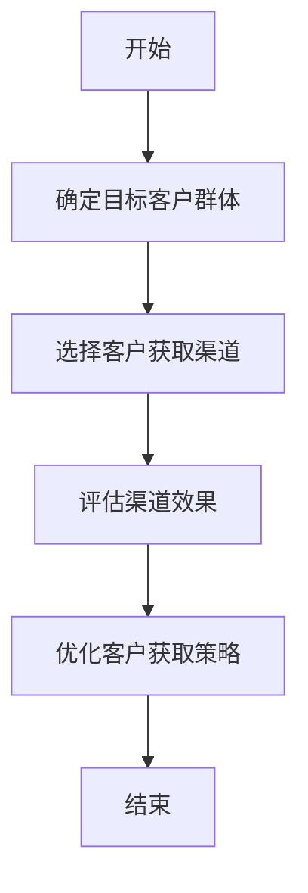
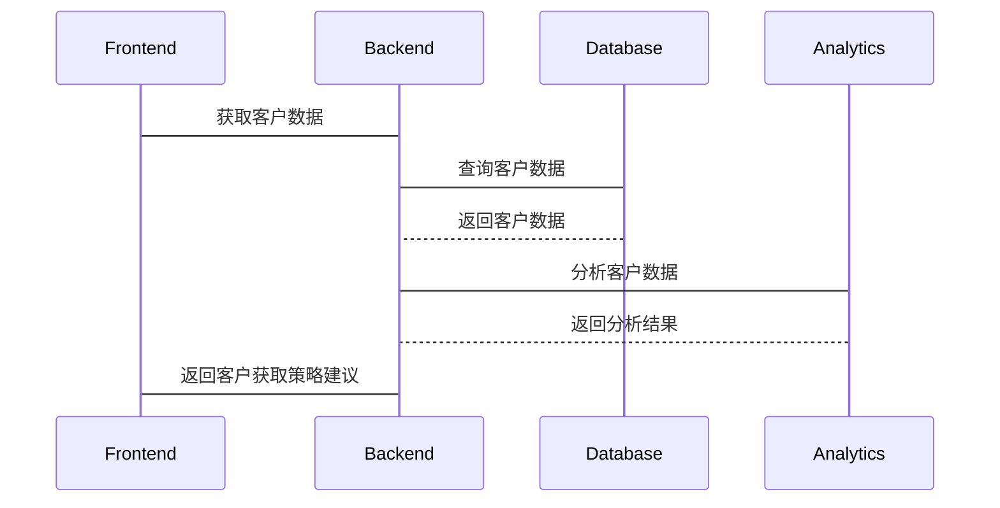

                 


```markdown
# 彼得林奇如何分析公司的客户获取策略

> 关键词：客户获取策略，彼得·林奇，市场分析，客户管理，投资策略

> 摘要：本文将深入探讨彼得·林奇分析公司客户获取策略的方法，从背景介绍、核心概念、算法原理到系统架构设计，全面解析如何有效分析和优化客户获取策略。

---

## 第一部分: 客户获取策略的背景与重要性

### 第1章: 客户获取策略的基本概念

#### 1.1 什么是客户获取策略
- **客户获取的定义**：客户获取是指企业通过各种渠道和方法吸引新客户的过程。
- **客户获取策略的核心要素**：
  - **目标客户群体**：明确的目标市场和客户细分。
  - **市场定位**：企业如何在市场中定位自己以吸引目标客户。
  - **客户获取渠道**：通过哪些渠道（线上/线下）获取客户。
  - **客户获取成本**：获取客户的成本及其优化。
- **客户获取策略的重要性**：
  - **市场竞争的核心**：客户获取是企业生存和发展的关键。
  - **客户忠诚度的基础**：有效的客户获取策略能够提高客户忠诚度。
  - **企业增长的驱动力**：客户获取是企业增长的核心动力。

#### 1.2 彼得·林奇的客户获取策略分析框架
- **林奇分析法的基本原理**：通过分析客户的获取渠道、成本和效果，优化客户获取策略。
- **林奇分析法的核心步骤**：
  1. 确定目标客户群体。
  2. 评估现有客户获取渠道的效率。
  3. 分析客户获取成本与收益的关系。
  4. 优化客户获取策略。
- **林奇分析法与其他分析方法的对比**：
  - **传统方法**：基于经验的客户获取策略。
  - **数据驱动方法**：基于数据分析的客户获取优化。
  - **林奇分析法**：结合经验与数据，注重策略的系统性和可操作性。

### 第2章: 客户获取策略的背景与问题背景

#### 2.1 当前市场环境下的客户获取挑战
- **数字化时代客户获取的新特点**：
  - 线上渠道的崛起（如社交媒体、搜索引擎）。
  - 数据驱动的精准营销。
  - 客户行为的多样化。
- **市场竞争加剧对企业客户获取的影响**：
  - 竞争对手的客户获取策略对企业的影响。
  - 市场推广成本的上升。
  - 客户获取渠道的多样化。
- **客户获取成本上升的现状**：
  - 数字化渠道的高成本。
  - 客户注意力的分散化。
  - 客户获取效率的下降。

#### 2.2 客户获取策略的核心问题
- **客户获取的效率问题**：
  - 如何降低客户获取成本。
  - 如何提高客户获取的效率。
- **客户获取的质量问题**：
  - 如何获取高质量的客户。
  - 如何提高客户转化率。
- **客户获取的可持续性问题**：
  - 如何确保客户获取的长期性。
  - 如何建立可持续的客户获取渠道。

#### 2.3 客户获取策略的边界与外延
- **客户获取与客户保留的关系**：
  - 客户保留是客户获取的重要补充。
  - 有效的客户保留策略能够降低客户获取成本。
- **客户获取与市场推广的界限**：
  - 客户获取是市场推广的一部分。
  - 市场推广的目的是为了客户获取。
- **客户获取与企业战略的关系**：
  - 客户获取是企业战略的重要组成部分。
  - 客户获取策略需要与企业整体战略一致。

---

## 第二部分: 客户获取策略的核心概念与联系

### 第3章: 客户获取策略的核心要素

#### 3.1 目标客户群体的定义与特征
- **目标客户的定义**：企业希望通过客户获取策略吸引的客户群体。
- **目标客户的特征分析**：
  - 客户的需求与企业产品/服务的匹配度。
  - 客户的购买能力。
  - 客户的地理位置、年龄、性别等因素。
- **目标客户的选择标准**：
  - 与企业产品/服务匹配度高。
  - 具有购买能力。
  - 具有较高的转化潜力。

#### 3.2 客户获取渠道的分析
- **各种客户获取渠道的优劣势对比**：
  - **线上渠道**：社交媒体、搜索引擎、电子邮件营销等。
    - 优势：覆盖面广、成本低、精准性强。
    - 劣势：竞争激烈、转化率低。
  - **线下渠道**：传统广告、门店营销、口碑传播等。
    - 优势：信任度高、覆盖面广。
    - 劣势：成本高、效率低。
  - **混合渠道**：线上+线下结合。
    - 优势：整合线上线下资源，提高客户获取效率。
    - 劣势：需要较高的协调成本。
- **渠道选择的策略性分析**：
  - 根据目标客户的特征选择合适的渠道。
  - 根据预算和资源选择合适的渠道。
- **渠道整合的必要性**：
  - 统筹线上线下资源，提高客户获取效率。
  - 提供一致的客户体验。

#### 3.3 客户获取成本的构成与优化
- **客户获取成本的构成要素**：
  - 渠道成本：广告费用、推广费用等。
  - 客户获取时间成本：获取客户的周期。
  - 客户获取的其他成本：如客服成本、技术支持成本等。
- **成本优化的关键点**：
  - 提高渠道的转化率。
  - 优化广告投放策略。
  - 提高客户获取的效率。
- **成本与收益的平衡点分析**：
  - 确定客户获取的边际成本与边际收益。
  - 通过数据分析优化成本与收益的平衡点。

### 第4章: 客户获取策略的核心概念对比

#### 4.1 不同客户获取策略的对比分析
- **基于渠道的策略对比**：
  - 线上渠道策略 vs. 线下渠道策略。
  - 社交媒体营销 vs. 搜索引擎营销。
- **基于客户群体的策略对比**：
  - 针对不同年龄段的客户群体策略。
  - 针对不同收入水平的客户群体策略。
- **基于成本的策略对比**：
  - 高成本高收益策略 vs. 低成本低收益策略。
  - 成本优化策略 vs. 收益最大化策略。

#### 4.2 客户获取策略的ER实体关系图

```mermaid
erDiagram
    customer {
        id
        name
        age
        gender
        income
        purchase_history
        }
    channel {
        id
        name
        type
        cost
        conversion_rate
        }
    campaign {
        id
        name
        start_date
        end_date
        budget
        }
    customer
        --> campaign : 参与
    campaign
        --> channel : 使用
    customer
        --> channel : 使用
    customer
        --> campaign : 参与
    customer
        --> channel : 使用
```

---

## 第三部分: 客户获取策略的算法与数学模型

### 第5章: 客户获取策略的算法原理

#### 5.1 客户获取策略的算法流程图



#### 5.2 客户获取策略的Python实现

```python
import pandas as pd
import numpy as np

# 示例数据：客户获取成本与收益
data = {
    'channel': ['社交媒体', '搜索引擎', '电子邮件', '线下广告'],
    'cost': [1000, 1500, 800, 2000],
    'conversion_rate': [0.05, 0.07, 0.03, 0.04],
    'revenue': [500, 700, 300, 400]
}

df = pd.DataFrame(data)

# 计算客户获取成本与收益的比率
df['roi'] = (df['revenue'] / df['cost']) * 100

print(df)
```

#### 5.3 客户获取策略的数学模型

- **客户获取成本与收益的关系**：
  - 客户获取成本 \( C \)
  - 客户获取收益 \( R \)
  - 投资回报率 \( ROI = \frac{R}{C} \)
- **客户获取的边际成本与边际收益**：
  - 边际成本 \( MC = \frac{dC}{dq} \)
  - 边际收益 \( MR = \frac{dR}{dq} \)
  - 优化点：\( MC = MR \)

---

## 第四部分: 客户获取策略的系统分析与架构设计

### 第6章: 客户获取策略的系统分析

#### 6.1 系统功能设计

```mermaid
classDiagram
    class Customer {
        id
        name
        age
        gender
        income
        purchase_history
        }
    class Channel {
        id
        name
        type
        cost
        conversion_rate
        }
    class Campaign {
        id
        name
        start_date
        end_date
        budget
        }
    class Customer_Channel_Relationship {
        customer_id
        channel_id
        }
    class Customer_Campaign_Relationship {
        customer_id
        campaign_id
        }
    Customer
        --> Customer_Channel_Relationship
    Channel
        --> Customer_Channel_Relationship
    Customer
        --> Customer_Campaign_Relationship
    Campaign
        --> Customer_Campaign_Relationship
    Customer
        --> Campaign : 参与
    Campaign
        --> Channel : 使用
```

#### 6.2 系统架构设计


#### 6.3 系统接口设计

- **API接口**：
  - 获取客户数据接口。
  - 获取渠道数据接口。
  - 获取活动数据接口。
  - 更新客户获取策略接口。

#### 6.4 系统交互设计



---

## 第五部分: 客户获取策略的项目实战

### 第7章: 客户获取策略的项目实战

#### 7.1 环境安装

```bash
pip install pandas numpy matplotlib
```

#### 7.2 系统核心实现源代码

```python
import pandas as pd
import numpy as np
import matplotlib.pyplot as plt

# 示例数据：客户获取成本与收益
data = {
    'channel': ['社交媒体', '搜索引擎', '电子邮件', '线下广告'],
    'cost': [1000, 1500, 800, 2000],
    'conversion_rate': [0.05, 0.07, 0.03, 0.04],
    'revenue': [500, 700, 300, 400]
}

df = pd.DataFrame(data)

# 可视化分析
plt.bar(df['channel'], df['roi'])
plt.title('客户获取策略 ROI 分析')
plt.xlabel('渠道')
plt.ylabel('ROI (%)')
plt.show()
```

#### 7.3 代码应用解读与分析
- **数据可视化**：通过柱状图展示不同渠道的客户获取 ROI，帮助选择最优渠道。
- **数据分析**：通过计算 ROI，优化客户获取策略。

#### 7.4 案例分析和详细讲解剖析
- **案例背景**：某企业希望通过优化客户获取策略提高 ROI。
- **数据收集**：收集不同渠道的客户获取成本和收益数据。
- **数据分析**：计算 ROI，选择 ROI 最高的渠道进行推广。
- **策略优化**：根据 ROI 分析结果，优化客户获取策略。

#### 7.5 项目小结
- **项目总结**：通过数据分析优化客户获取策略，提高 ROI。
- **项目成果**：建立了一套基于数据的客户获取策略优化方法。

---

## 第六部分: 客户获取策略的最佳实践与总结

### 第8章: 客户获取策略的最佳实践

#### 8.1 最佳实践 tips
- **数据驱动**：通过数据分析优化客户获取策略。
- **渠道整合**：整合线上线下资源，提高客户获取效率。
- **客户细分**：根据目标客户群体的特征，制定个性化策略。
- **持续优化**：定期评估客户获取策略的效果，持续优化。

#### 8.2 小结
- 通过彼得·林奇的客户获取策略分析框架，企业可以系统性地优化客户获取策略。
- 数据分析和渠道整合是优化客户获取策略的关键。

#### 8.3 注意事项
- 客户获取策略的优化需要结合企业的实际情况。
- 数据分析是优化客户获取策略的重要工具，但不能完全依赖数据。
- 客户获取策略的优化需要长期持续的努力。

#### 8.4 拓展阅读
- 彼得·林奇的其他投资策略。
- 数据驱动的客户管理方法。
- 客户生命周期管理。

---

## 作者信息

作者：AI天才研究院/AI Genius Institute & 禅与计算机程序设计艺术 /Zen And The Art of Computer Programming
```

