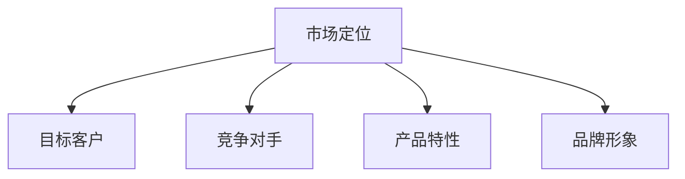
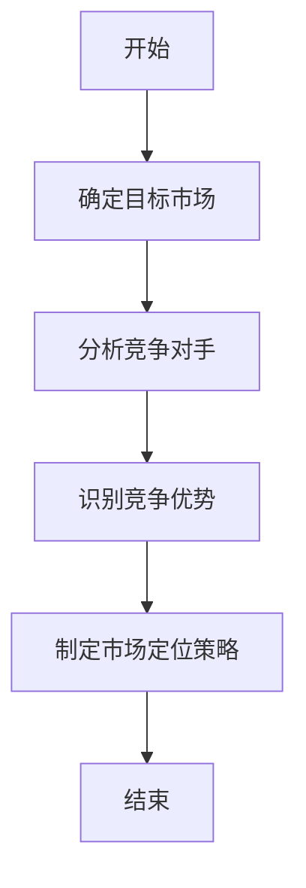
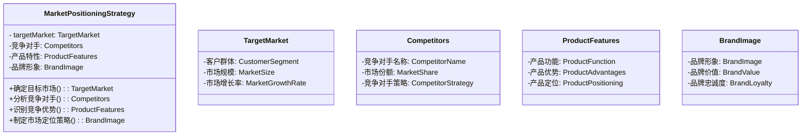
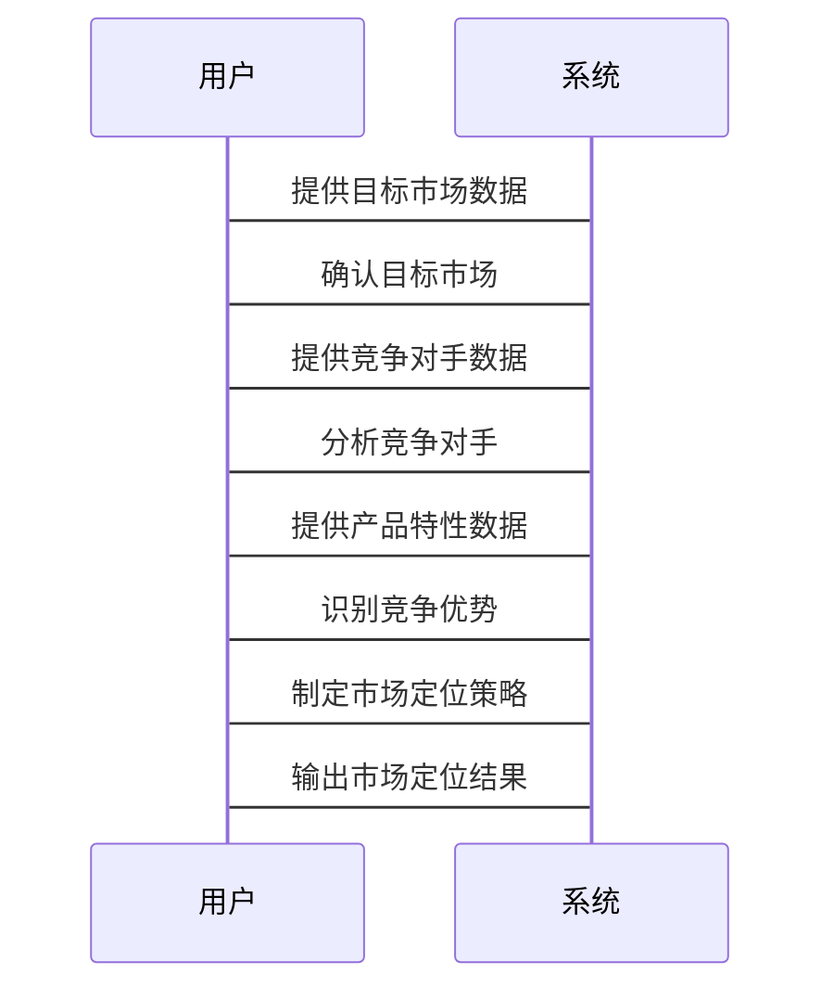

                 


# 彼得林奇如何分析公司的市场定位策略

---

## 关键词：
彼得·林奇，市场定位策略，投资哲学，竞争优势分析，行业分析，财务分析

---

## 摘要：
本文深入探讨了彼得·林奇在分析公司市场定位策略时所采用的方法和技巧。通过分析林奇的投资哲学、市场定位的核心概念、分析框架、实际案例以及动态调整策略，本文为读者提供了全面的视角来理解市场定位在企业战略中的重要性。文章结合理论与实践，帮助读者掌握如何运用林奇的方法来评估和制定有效的市场定位策略。

---

## 第一部分：市场定位策略的背景与概念

### 第1章：市场定位策略的背景介绍

#### 1.1 市场定位的定义与重要性
##### 1.1.1 什么是市场定位
市场定位是指企业通过产品、价格、渠道和促销等手段，将自身品牌或产品定位在目标客户心中的特定位置。其目的是在竞争激烈的市场中，明确企业的独特价值主张（Unique Value Proposition, UVP）。

##### 1.1.2 市场定位的重要性
市场定位是企业战略的核心之一。成功的市场定位可以帮助企业：
- 突出竞争优势。
- 吸引目标客户。
- 建立品牌忠诚度。
- 在市场中占据有利位置。

##### 1.1.3 市场定位的核心要素
市场定位的核心要素包括：
1. **目标市场**：明确企业服务的目标客户群体。
2. **竞争对手**：分析竞争对手的市场定位和策略。
3. **产品特性**：识别产品的核心功能和独特优势。
4. **品牌形象**：塑造与目标市场相符的品牌形象。

#### 1.2 彼得·林奇的背景与投资哲学
##### 1.2.1 彼得·林奇的生平简介
彼得·林奇（Peter Lynch）是美国著名投资经理人，被誉为“股神”。他在富达投资集团管理麦哲伦基金期间，创造了令人瞩目的投资业绩。林奇的投资哲学以基本面分析和深入研究为基础，强调寻找具有持续竞争优势的企业。

##### 1.2.2 林奇的投资哲学与方法
林奇的投资哲学主要包括以下几点：
1. **深入研究**：林奇强调对企业的基本面进行深入研究，包括财务数据、行业地位和竞争优势。
2. **长期视角**：林奇关注企业的长期增长潜力，而非短期市场波动。
3. **价值投资**：林奇寻找那些被市场低估的企业，尤其是那些具有强大竞争优势的企业。

##### 1.2.3 林奇与市场定位策略的关联
林奇在分析企业时，非常注重企业的市场定位。他认为，企业的市场定位决定了其在行业中的地位和竞争优势。只有通过准确的市场定位，企业才能在激烈的市场竞争中占据优势。

---

### 第2章：市场定位策略的核心概念与联系

#### 2.1 核心概念原理
##### 2.1.1 市场定位的基本原理
市场定位的基本原理是通过分析目标市场的需求和竞争对手的策略，找到企业的独特优势，并将其传递给目标客户。

##### 2.1.2 市场定位的核心要素分析
市场定位的核心要素包括：
1. **目标市场**：明确企业的目标客户群体。
2. **竞争优势**：识别企业的核心竞争力。
3. **品牌定位**：塑造与目标市场相符的品牌形象。

##### 2.1.3 市场定位与企业竞争优势的关系
市场定位是企业竞争优势的外在表现。通过市场定位，企业可以将自身的核心竞争力传递给目标客户，从而在市场中占据有利位置。

#### 2.2 概念属性特征对比表格
以下是一个概念属性特征对比表格，用于比较市场定位与目标市场、品牌定位和产品定位的区别与联系：

| 概念         | 定义                                                                 | 关注点             | 目的               |
|--------------|----------------------------------------------------------------------|--------------------|--------------------|
| 市场定位      | 将企业的产品或服务定位在目标客户心中的特定位置                   | 目标客户的需求和竞争对手的策略 | 在市场中占据有利位置 |
| 目标市场      | 明确的企业服务的客户群体                                               | 客户的需求和特征   | 确定客户群体       |
| 品牌定位      | 塑造与目标市场相符的品牌形象                                           | 品牌的核心价值     | 提升品牌知名度     |
| 产品定位      | 确定产品的核心功能和独特优势                                         | 产品的功能和特点   | 满足客户需求       |

#### 2.3 ER实体关系图架构（Mermaid流程图）
以下是市场定位策略的ER实体关系图架构：



---

### 第3章：市场定位策略的算法原理讲解

#### 3.1 市场定位的算法原理
##### 3.1.1 市场定位的数学模型
市场定位的数学模型可以表示为：

$$
\text{市场定位} = \text{目标市场} \times \text{竞争优势} \times \text{品牌形象}
$$

其中，目标市场、竞争优势和品牌形象是影响市场定位的关键因素。

##### 3.1.2 市场定位的流程图（Mermaid）
以下是市场定位的流程图：



##### 3.1.3 市场定位的Python源代码实现
以下是一个简单的市场定位分析的Python代码示例：

```python
def market_positioning_analysis(customers, competitors, product_features):
    target_market = identify_target(customers)
    competitor_analysis = analyze_competitors(competitors)
    competitive_advantages = find_competitive_advantages(product_features)
    return target_market, competitor_analysis, competitive_advantages

def identify_target(customers):
    # 简单的客户分群算法
    return customers[customers['age'] > 30]

def analyze_competitors(competitors):
    # 竞争对手分析
    return competitors[competitors['market_share'] > 0.2]

def find_competitive_advantages(product_features):
    # 识别竞争优势
    return product_features[product_features['unique_features'] == True]
```

---

## 第四部分：市场定位策略的系统分析与架构设计方案

### 第4章：系统分析与架构设计方案

#### 4.1 问题场景介绍
假设我们正在分析一家科技公司的市场定位策略。该公司面临来自多个竞争对手的压力，需要通过市场定位来提升其在市场中的地位。

#### 4.2 系统功能设计（领域模型Mermaid类图）
以下是系统的领域模型类图：



#### 4.3 系统架构设计（Mermaid架构图）
以下是系统的架构设计图：


#### 4.4 系统接口设计
系统接口设计包括以下部分：
1. 输入接口：目标市场数据、竞争对手数据、产品特性数据。
2. 输出接口：市场定位策略报告、品牌形象报告。

#### 4.5 系统交互设计（Mermaid序列图）
以下是系统的交互设计图：



---

## 第五部分：市场定位策略的项目实战

### 第5章：项目实战

#### 5.1 环境安装
为了进行市场定位分析，需要安装以下工具和库：
1. Python编程语言
2. Pandas库（数据处理）
3. Matplotlib库（数据可视化）
4. Mermaid工具（流程图绘制）

#### 5.2 系统核心实现源代码
以下是一个完整的市场定位分析的Python代码示例：

```python
import pandas as pd
import matplotlib.pyplot as plt

def identify_target(customers):
    return customers[customers['age'] > 30]

def analyze_competitors(competitors):
    return competitors[competitors['market_share'] > 0.2]

def find_competitive_advantages(product_features):
    return product_features[product_features['unique_features'] == True]

def plot_market_positioning(customers, competitors, product_features):
    target_market = identify_target(customers)
    competitor_analysis = analyze_competitors(competitors)
    competitive_advantages = find_competitive_advantages(product_features)
    
    plt.figure(figsize=(10, 6))
    plt.bar(target_market['customer_segment'], target_market['market_size'])
    plt.title('Target Market Analysis')
    plt.xlabel('Customer Segment')
    plt.ylabel('Market Size')
    plt.show()

# 示例数据
customers = pd.DataFrame({
    'customer_id': [1, 2, 3, 4, 5],
    'age': [25, 30, 35, 40, 45],
    'income': [50000, 60000, 70000, 80000, 90000]
})

competitors = pd.DataFrame({
    'competitor_id': [1, 2, 3, 4, 5],
    'competitor_name': ['A', 'B', 'C', 'D', 'E'],
    'market_share': [0.1, 0.2, 0.15, 0.25, 0.1]
})

product_features = pd.DataFrame({
    'feature_id': [1, 2, 3, 4, 5],
    'feature_name': ['Feature 1', 'Feature 2', 'Feature 3', 'Feature 4', 'Feature 5'],
    'unique_features': [True, False, True, False, True]
})

# 调用函数
plot_market_positioning(customers, competitors, product_features)
```

#### 5.3 代码应用解读与分析
上述代码示例展示了如何通过Python进行市场定位分析。代码的主要功能包括：
1. **目标市场识别**：筛选出年龄大于30岁的客户。
2. **竞争对手分析**：筛选出市场份额大于20%的竞争对手。
3. **竞争优势识别**：识别具有独特优势的产品特性。
4. **数据可视化**：绘制目标市场分析图，展示目标市场的规模和客户分布。

#### 5.4 实际案例分析和详细讲解剖析
假设我们正在分析一家科技公司的市场定位策略。该公司面临来自多个竞争对手的压力，需要通过市场定位来提升其在市场中的地位。通过上述代码，我们可以得出以下结论：
1. **目标市场**：年龄大于30岁的客户群体。
2. **竞争对手**：市场份额大于20%的竞争对手。
3. **竞争优势**：具有独特优势的产品特性。

通过这些分析，公司可以制定有效的市场定位策略，从而在市场中占据有利位置。

#### 5.5 项目小结
通过实际案例分析，我们可以看到市场定位策略在企业战略中的重要性。只有通过深入的市场分析和竞争对手分析，企业才能制定出有效的市场定位策略。

---

## 第六部分：市场定位策略的动态调整与最佳实践

### 第6章：市场定位策略的动态调整

#### 6.1 动态调整的必要性
市场环境是不断变化的，企业需要根据市场变化及时调整市场定位策略。

#### 6.2 动态调整的步骤
1. **重新评估目标市场**：根据市场变化重新评估目标市场。
2. **分析竞争对手的新策略**：关注竞争对手的新策略和市场动态。
3. **识别新的竞争优势**：寻找新的竞争优势。
4. **调整市场定位策略**：根据新的分析结果调整市场定位策略。

#### 6.3 动态调整的注意事项
1. **持续监控市场变化**：企业需要持续监控市场变化，及时调整市场定位策略。
2. **灵活应对竞争变化**：企业需要根据竞争环境的变化灵活应对。
3. **保持竞争优势**：企业需要不断寻找新的竞争优势，以保持市场定位的稳定性。

### 第7章：最佳实践与小结

#### 7.1 最佳实践
1. **深入研究市场**：企业需要深入研究市场，了解目标客户的需求和竞争对手的策略。
2. **识别竞争优势**：企业需要识别自身的竞争优势，并将其传递给目标客户。
3. **制定长期市场定位策略**：企业需要制定长期的市场定位策略，而非仅仅关注短期市场波动。

#### 7.2 小结
市场定位策略是企业战略的核心之一。通过深入分析目标市场、竞争对手和自身竞争优势，企业可以制定出有效的市场定位策略，从而在市场中占据有利位置。

---

## 作者：AI天才研究院/AI Genius Institute & 禅与计算机程序设计艺术 /Zen And The Art of Computer Programming

---

以上是《彼得林奇如何分析公司的市场定位策略》的技术博客文章的完整内容，涵盖市场定位策略的背景、核心概念、算法原理、系统分析、项目实战以及动态调整等方面。

