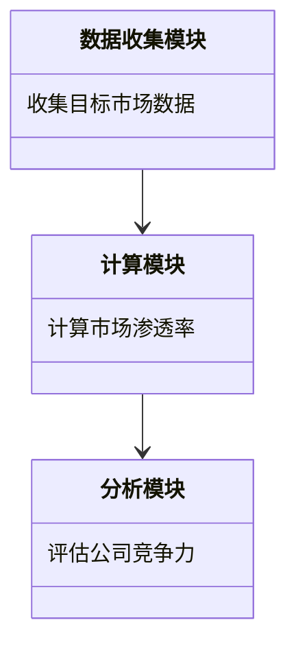

                 


# 彼得林奇如何分析公司的市场渗透率

> 关键词：彼得·林奇，市场渗透率，投资分析，市场占有率，数据分析

> 摘要：本文深入探讨了彼得·林奇如何分析公司的市场渗透率。通过分析市场渗透率的定义、计算方法、影响因素以及彼得·林奇的分析方法和策略，本文为投资者提供了全面的指导。结合实际案例和系统设计，帮助读者掌握如何利用市场渗透率评估公司的投资价值。

---

# 第一部分: 市场渗透率分析的背景与基础

## 第1章: 市场渗透率的基本概念

### 1.1 市场渗透率的定义与重要性

#### 1.1.1 市场渗透率的定义
市场渗透率是指一家公司的产品或服务在目标市场中的占有率。它是衡量公司市场竞争力的重要指标，反映了公司在市场中的影响力和客户接受度。

$$\text{市场渗透率} = \frac{\text{公司销售量}}{\text{目标市场总销售量}} \times 100\%$$

#### 1.1.2 市场渗透率的重要性
- 帮助投资者评估公司的市场地位。
- 识别公司的增长潜力。
- 作为投资决策的重要依据。

#### 1.1.3 彼得·林奇对市场渗透率的关注
彼得·林奇认为，市场渗透率是评估公司投资价值的关键指标之一。他强调通过分析市场渗透率来判断公司的竞争优势和市场地位。

---

## 第2章: 彼得·林奇的背景与投资理念

### 2.1 彼得·林奇的生平简介
彼得·林奇是美国著名的投资专家，曾管理富达麦哲伦基金，取得了卓越的投资业绩。他的投资哲学以基本面分析和长期持有为主。

### 2.2 彼得·林奇的投资哲学
- 重视公司基本面研究。
- 偏好具有强大竞争优势的公司。
- 强调市场渗透率和市场份额的分析。

### 2.3 彼得·林奇的市场渗透率分析方法
彼得·林奇通过分析市场渗透率，评估公司的市场地位和增长潜力。他关注公司是否能够在目标市场中占据领先地位。

---

# 第二部分: 市场渗透率分析的核心概念与联系

## 第3章: 市场渗透率的计算与影响因素

### 3.1 市场渗透率的计算公式
$$\text{市场渗透率} = \frac{\text{公司销售量}}{\text{目标市场总销售量}} \times 100\%$$

### 3.2 影响市场渗透率的主要因素
- 公司产品竞争力。
- 市场需求。
- 竞争对手的市场份额。

### 3.3 市场渗透率与公司竞争力的关系
市场渗透率越高，通常意味着公司在市场中具有更强的竞争力和品牌影响力。

---

## 第4章: 市场渗透率与相关指标的对比分析

### 4.1 市场占有率与市场渗透率的区别与联系
- 市场占有率：公司销售量占整个市场的比例。
- 市场渗透率：公司销售量占目标市场的比例。

### 4.2 市场渗透率与市场份额的对比分析
市场渗透率更关注目标市场，而市场份额关注整个市场。

### 4.3 市场渗透率与市场增长潜力的关系
高市场渗透率可能意味着市场饱和，而低市场渗透率可能意味着增长潜力。

---

# 第三部分: 市场渗透率分析的算法原理

## 第5章: 彼得·林奇的市场渗透率分析方法

### 5.1 彼得·林奇的市场渗透率分析流程


### 5.2 彼得·林奇的市场渗透率筛选标准
- 市场渗透率高且稳定增长。
- 公司在目标市场中有明显的竞争优势。
- 行业前景良好。

### 5.3 彼得·林奇的市场渗透率分析模型
$$\text{投资价值} = \text{市场渗透率} \times \text{公司竞争力} \times \text{行业前景}$$

---

## 第6章: 市场渗透率分析的数学模型与公式

### 6.1 市场渗透率计算公式
$$\text{市场渗透率} = \frac{\text{公司销售量}}{\text{目标市场总销售量}} \times 100\%$$

### 6.2 彼得·林奇的市场渗透率筛选标准
$$\text{投资价值} = \text{市场渗透率} \times \text{公司竞争力} \times \text{行业前景}$$

---

# 第四部分: 系统分析与架构设计方案

## 第7章: 系统功能设计

### 7.1 系统功能模块
- 数据收集模块：收集目标市场数据。
- 计算模块：计算市场渗透率。
- 分析模块：评估公司竞争力。

### 7.2 系统功能设计的类图



---

## 第8章: 系统架构设计

### 8.1 系统架构设计的架构图


---

## 第9章: 系统接口设计

### 9.1 接口设计
- 数据接口：数据收集模块与计算模块之间的接口。
- 分析接口：计算模块与分析模块之间的接口。

### 9.2 接口设计的序列图


---

# 第五部分: 项目实战

## 第10章: 项目实战

### 10.1 环境安装
- 安装Python和相关库（如Pandas、Matplotlib）。
- 安装Jupyter Notebook。

### 10.2 核心实现源代码

```python
import pandas as pd
import matplotlib.pyplot as plt

# 数据收集
data = {
    '公司': ['公司A', '公司B', '公司C'],
    '销售量': [100, 200, 150],
    '目标市场总销售量': [500, 600, 550]
}

df = pd.DataFrame(data)

# 计算市场渗透率
df['市场渗透率'] = (df['销售量'] / df['目标市场总销售量']) * 100

# 可视化
plt.figure(figsize=(10,6))
plt.bar(df['公司'], df['市场渗透率'])
plt.title('市场渗透率分析')
plt.xlabel('公司')
plt.ylabel('市场渗透率 (%)')
plt.show()
```

### 10.3 代码应用解读与分析
上述代码展示了如何使用Python计算和可视化市场渗透率。数据收集模块收集了公司销售量和目标市场总销售量，计算模块计算了市场渗透率，分析模块通过可视化展示了结果。

### 10.4 实际案例分析
以公司A为例，计算其市场渗透率为：

$$\text{市场渗透率} = \frac{100}{500} \times 100\% = 20\%$$

### 10.5 项目小结
通过实际案例分析，展示了如何应用彼得·林奇的市场渗透率分析方法来评估公司的投资价值。

---

# 第六部分: 最佳实践 tips

## 第11章: 最佳实践 tips

### 11.1 小结
- 市场渗透率是评估公司投资价值的重要指标。
- 彼得·林奇的分析方法提供了系统的框架。

### 11.2 注意事项
- 数据的准确性和完整性。
- 分析模型的适用性和限制。

### 11.3 拓展阅读
- 《彼得·林奇的投资哲学》
- 《市场分析与投资策略》

---

# 结语

通过本文的深入分析，读者可以掌握彼得·林奇的市场渗透率分析方法，并在实际投资中应用。希望本文能够为投资者提供有价值的指导和启示。

---

作者：AI天才研究院/AI Genius Institute & 禅与计算机程序设计艺术 /Zen And The Art of Computer Programming

