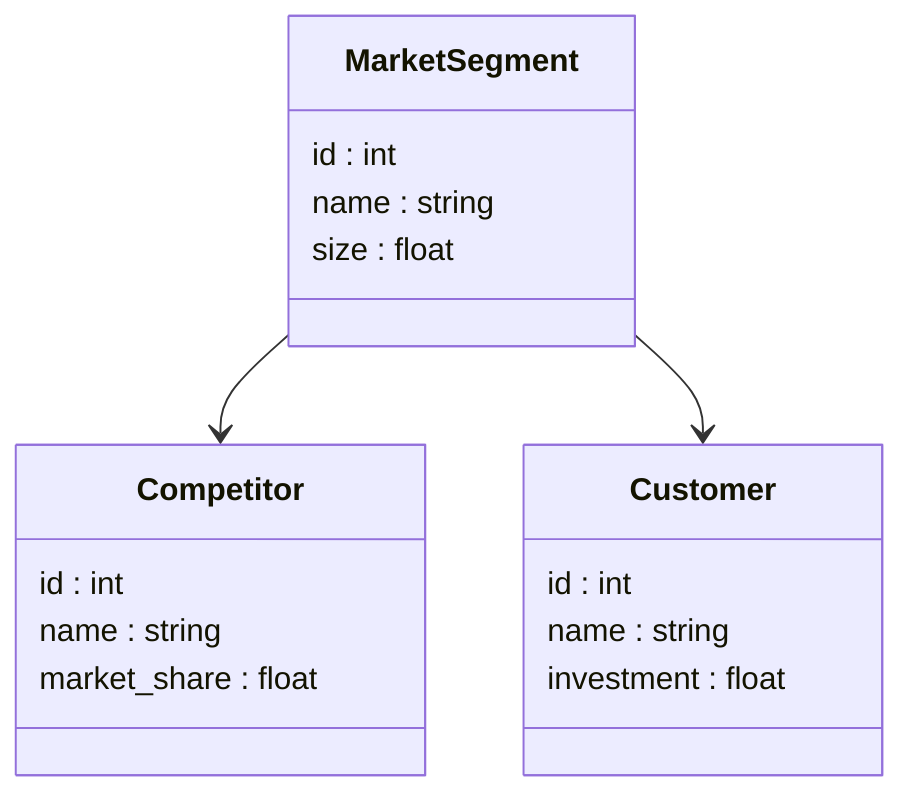
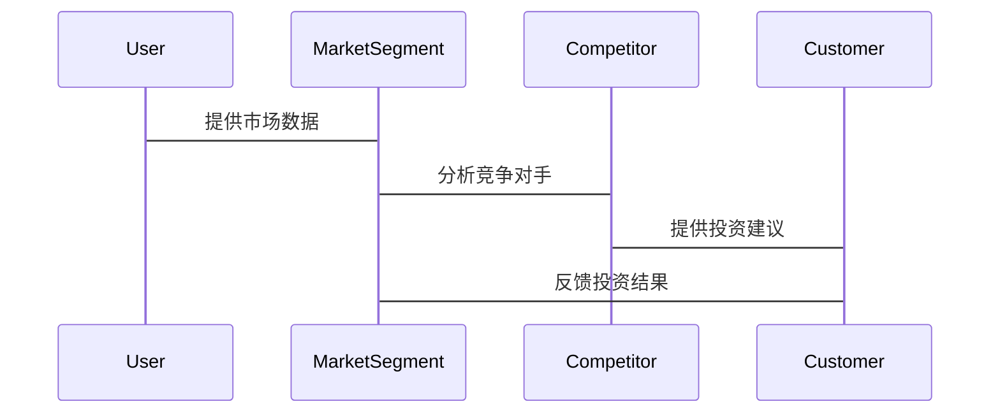

                 


# 彼得林奇如何分析公司的市场细分策略

> 关键词：彼得林奇，市场细分，投资策略，企业分析，竞争分析，投资回报

> 摘要：本文详细分析了彼得林奇如何运用市场细分策略来评估公司的投资价值。通过探讨市场细分的核心概念、分析方法和实际案例，本文揭示了彼得林奇在投资决策中的独特见解和策略。文章结合理论与实践，为投资者提供了深入的指导和实用的建议。

---

# 第一部分：彼得林奇投资理念与市场细分策略概述

## 第1章：彼得林奇与市场细分策略概述

### 1.1 彼得林奇投资理念的核心思想

#### 1.1.1 彼得林奇的投资者背景与成就
- 彼得林奇的投资者背景：作为富达投资集团的传奇基金经理，彼得林奇以独特的投资策略闻名。
- 成就：管理麦哲伦基金期间，创造了年均29%的复合回报率，为投资者创造了巨大价值。

#### 1.1.2 投资中的市场细分策略概念
- 市场细分策略的定义：将市场划分为多个子市场，针对每个子市场制定具体的投资策略。
- 市场细分策略在投资中的重要性：通过细分市场，投资者可以更精准地评估公司的市场定位和竞争优势。

#### 1.1.3 市场细分策略的核心要素
- 企业基本面分析：包括财务状况、盈利能力、管理团队等。
- 行业竞争结构分析：分析行业内的主要竞争对手和市场格局。
- 市场需求与供给分析：评估市场的总需求和供给情况，判断公司的市场潜力。

### 1.2 市场细分策略的核心概念

#### 1.2.1 市场细分的定义与分类
- 市场细分的定义：将整体市场划分为多个具有相似特征的子市场。
- 分类：基于地理位置、消费者需求、产品类型等进行细分。

#### 1.2.2 市场细分策略与投资决策的关系
- 市场细分策略是投资决策的重要工具，帮助投资者发现潜在的投资机会。
- 通过市场细分，投资者可以更准确地评估公司的市场定位和竞争优势。

#### 1.2.3 市场细分策略的边界与外延
- 边界：市场细分的范围和限制，避免过度细分导致资源浪费。
- 外延：市场细分策略的应用范围，包括不同行业和市场环境。

## 第2章：市场细分策略的背景与问题分析

### 2.1 市场细分策略的背景介绍

#### 2.1.1 当前市场环境的复杂性
- 全球化和数字化带来的市场变化：新兴技术和商业模式的出现，使得市场环境更加复杂。
- 投资者面临的挑战：如何在复杂的市场环境中找到投资机会。

#### 2.1.2 市场细分策略的必要性
- 帮助投资者更精准地分析公司市场定位。
- 通过市场细分，发现潜在的投资机会。

#### 2.1.3 投资者面临的挑战与机遇
- 挑战：市场环境的不确定性，竞争对手的激烈竞争。
- 机遇：通过市场细分策略，发现 niche 市场，获得超额回报。

### 2.2 市场细分策略的核心问题

#### 2.2.1 企业市场定位的准确性
- 如何通过市场细分策略准确评估企业的市场定位。
- 分析企业是否在目标市场中占据竞争优势。

#### 2.2.2 市场需求的预测与评估
- 如何预测目标市场的未来需求。
- 通过市场细分策略，评估市场需求的变化趋势。

#### 2.2.3 竞争对手的分析与应对
- 分析竞争对手的核心优势和劣势。
- 制定应对策略，提升自身的竞争优势。

## 第3章：市场细分策略的核心概念与联系

### 3.1 核心概念原理

#### 3.1.1 市场细分的理论基础
- 市场细分的理论基础：消费者行为学、市场营销学。
- 通过市场细分，企业可以更好地满足消费者需求。

#### 3.1.2 彼得林奇投资模型的构建逻辑
- 彼得林奇投资模型的核心逻辑：通过市场细分策略，分析公司的市场定位和竞争优势。
- 投资决策的关键因素：市场需求、公司基本面、竞争环境。

#### 3.1.3 市场细分与投资回报的关系
- 市场细分策略对投资回报的影响：通过精准的市场细分，投资者可以发现具有潜力的公司，获得超额回报。
- 市场细分策略的长期回报：通过长期持有优质公司，获得稳定的投资回报。

### 3.2 核心概念属性特征对比表

| 概念          | 特征               | 描述                                                                 |
|---------------|--------------------|-----------------------------------------------------------------------|
| 市场细分      | 针对性             | 针对特定市场或客户群体，制定具体的投资策略。                             |
| 投资策略      | 风险性             | 投资策略的高风险与高回报并存，需要投资者具备风险承受能力。               |
| 市场竞争      | 竞争性             | 分析竞争对手的核心优势与劣势，制定应对策略。                             |

### 3.3 实体关系图（ER图）

```mermaid
erDiagram
    customer[客户] {
        id : int
        name : string
        investment : float
    }
    market_segment[市场细分] {
        id : int
        name : string
        size : float
    }
    competitor[竞争对手] {
        id : int
        name : string
        market_share : float
    }
    customer -[投资]-> investment
    market_segment -[覆盖]-> customer
    competitor -[竞争]-> market_segment
```

---

# 第二部分：市场细分策略的实施与应用

## 第4章：市场细分策略的实施步骤

### 4.1 市场细分策略的实施步骤

#### 4.1.1 确定市场细分的标准
- 确定市场细分的标准：地理位置、消费者需求、产品类型等。
- 通过市场细分标准，划分不同的市场子区域。

#### 4.1.2 收集市场数据
- 数据来源：行业报告、公司财报、消费者调查等。
- 数据分析：使用统计方法，分析市场数据，识别潜在的投资机会。

#### 4.1.3 评估细分市场的潜力
- 市场容量：评估细分市场的规模和增长潜力。
- 竞争情况：分析细分市场内的竞争状况，判断公司的竞争优势。

## 第5章：市场细分策略的系统架构设计

### 5.1 系统功能设计

#### 5.1.1 领域模型（mermaid 类图）



#### 5.1.2 系统架构设计（mermaid 架构图）


#### 5.1.3 系统接口设计
- 输入接口：市场数据输入、市场细分标准设定。
- 输出接口：市场细分报告、投资建议。

#### 5.1.4 系统交互设计（mermaid 序列图）



## 第6章：市场细分策略的实战案例

### 6.1 实战案例分析

#### 6.1.1 案例背景介绍
- 公司概况：介绍公司的基本情况，包括行业、产品、市场定位等。
- 投资背景：分析投资的背景和目标。

#### 6.1.2 数据收集与分析
- 数据来源：行业报告、公司财报、消费者调查等。
- 数据分析：使用统计方法，分析市场数据，识别潜在的投资机会。

#### 6.1.3 投资决策与结果
- 投资决策：基于市场细分策略，制定投资计划。
- 投资结果：评估投资效果，总结经验教训。

## 第7章：市场细分策略的最佳实践与总结

### 7.1 最佳实践 tips

#### 7.1.1 数据分析的重要性
- 强调数据在市场细分策略中的重要性，建议投资者重视数据的收集和分析。

#### 7.1.2 竞争对手分析的技巧
- 分析竞争对手的核心优势和劣势，制定应对策略。

#### 7.1.3 投资策略的灵活性
- 根据市场变化，灵活调整投资策略，保持竞争优势。

### 7.2 总结与展望

#### 7.2.1 本文总结
- 本文详细分析了彼得林奇如何运用市场细分策略来评估公司的投资价值。
- 结合理论与实践，为投资者提供了深入的指导和实用的建议。

#### 7.2.2 未来展望
- 随着市场环境的变化，市场细分策略将变得更加重要。
- 未来的投资决策中，市场细分策略将发挥更大的作用。

---

# 作者：AI天才研究院/AI Genius Institute & 禅与计算机程序设计艺术 /Zen And The Art of Computer Programming

---

**注：由于篇幅限制，本文仅为目录大纲和部分内容展示，完整文章需根据实际需求进行扩展和补充。**

