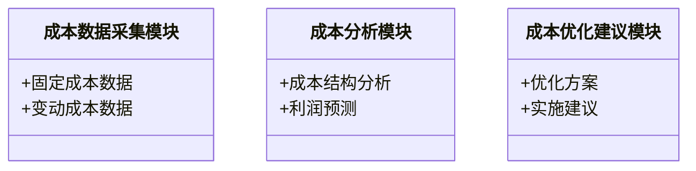

                 


# 彼得林奇如何分析公司的成本结构优化对盈利能力的影响

## 关键词：彼得·林奇，成本结构优化，盈利能力，企业成本分析，投资分析方法

## 摘要：本文将深入分析彼得·林奇如何通过优化公司成本结构来提升盈利能力。通过系统的方法和实际案例，我们将探讨成本结构优化的核心概念、算法原理、系统设计以及实战应用，帮助读者全面理解并掌握这一关键的投资分析方法。

---

## 第1章：成本结构优化的背景与重要性

### 1.1 成本结构的基本概念

#### 1.1.1 成本结构的定义
成本结构是指企业在生产或运营过程中所涉及的各种成本的构成和比例。常见的成本类型包括固定成本、变动成本、半变动成本等。

#### 1.1.2 成本结构的组成要素
- 固定成本：如租金、 salaries 等，不随产量变化。
- 变动成本：如原材料、直接人工，随产量变化。
- 半变动成本：如 utilities，部分固定部分变动。

#### 1.1.3 成本结构与企业盈利能力的关系
成本结构直接影响企业的利润 margin，优化成本结构可以显著提升盈利能力。

---

### 1.2 彼得·林奇的成本分析方法

#### 1.2.1 彼得·林奇的投资者视角
彼得·林奇强调通过分析企业的成本结构，寻找那些能够通过优化成本实现超额利润的企业。

#### 1.2.2 成本结构在投资分析中的地位
成本结构是林奇分析企业基本面的重要部分，他关注企业的成本是否合理、可控，并能够通过优化降低成本来提升利润。

#### 1.2.3 优化成本结构对股东价值的影响
优化成本结构可以提升企业的盈利能力，进而增加股东价值。

---

## 第2章：成本结构优化的核心概念与联系

### 2.1 成本结构的实体关系分析

#### 2.1.1 成本结构的ER图分析
以下是一个简单的ER图，展示了成本结构的核心要素：
```mermaid
erDiagram
    actor 公司成本要素{}{
    actor 成本类型{}{
    actor 成本数据{}{
    company 成本结构{}{
        o 管理成本
        o 生产成本
        o 销售成本
    }
    }
```

#### 2.1.2 成本要素与企业绩效的关系
成本要素直接影响企业的利润 margin，优化成本要素可以显著提升企业绩效。

#### 2.1.3 成本结构优化的边界与外延
成本结构优化不仅涉及内部成本，还包括外部成本，如供应链成本。

---

### 2.2 成本结构优化的核心要素对比

#### 2.2.1 成本类型对比表

| 成本类型   | 特征描述                   |
|------------|----------------------------|
| 固定成本   | 不随产量变化，如租金、工资 |
| 变动成本   | 随产量变化，如原材料        |
| 半变动成本 | 部分固定，部分变动，如 utilities |

#### 2.2.2 成本控制的关键点
- 固定成本：通过规模效应降低成本。
- 变动成本：优化采购、生产流程。
- 半变动成本：通过技术手段降低消耗。

#### 2.2.3 成本结构优化的优先级
优先优化变动成本，其次是半变动成本，最后是固定成本。

---

## 第3章：成本结构优化的数学模型与算法原理

### 3.1 成本结构优化的数学模型

#### 3.1.1 成本函数的定义与公式
成本函数可以表示为：
$$C(x) = a + bx$$
其中，\(a\) 是固定成本，\(b\) 是单位变动成本，\(x\) 是产量。

#### 3.1.2 利润最大化模型的构建
利润 \(P\) 可以表示为：
$$P = R(x) - C(x)$$
其中，\(R(x)\) 是收入函数。

#### 3.1.3 成本结构优化的约束条件
- 产量 \(x\) 必须大于0。
- 成本 \(C(x)\) 必须小于收入 \(R(x)\)。

---

### 3.2 成本结构优化的算法实现

#### 3.2.1 线性规划模型的构建
目标函数：最大化利润
$$ \text{Maximize } P = R(x) - C(x)$$
约束条件：
$$ x \geq 0$$

#### 3.2.2 算法流程图（Mermaid）
```mermaid
graph TD
    A[开始] -> B[读取输入]
    B -> C[计算成本]
    C -> D[计算利润]
    D -> E[输出结果]
    E -> F[结束]
```

#### 3.2.3 Python实现代码示例
```python
def calculate_profit(revenue, cost, x):
    return revenue * x - (fixed_cost + variable_cost * x)

fixed_cost = 100
variable_cost = 50
revenue_per_unit = 100

x = 10
profit = calculate_profit(revenue_per_unit, variable_cost, x) - fixed_cost
print(f"Profit: ${profit}")
```

---

## 第4章：系统分析与架构设计

### 4.1 成本结构优化的系统分析

#### 4.1.1 问题场景描述
企业需要优化成本结构，以提升盈利能力。

#### 4.1.2 系统功能需求分析
- 成本数据采集模块
- 成本分析模块
- 成本优化建议模块

#### 4.1.3 领域模型类图（Mermaid）


---

### 4.2 系统架构设计

#### 4.2.1 系统架构图（Mermaid）


#### 4.2.2 关键模块设计
- 成本数据采集模块：负责收集企业的成本数据。
- 成本分析模块：对成本数据进行分析，生成利润预测。
- 成本优化建议模块：基于分析结果，提供优化建议。

#### 4.2.3 系统接口设计
- 输入接口：成本数据
- 输出接口：优化方案

---

## 第5章：项目实战与案例分析

### 5.1 成本结构优化的实战环境

#### 5.1.1 环境搭建与工具安装
- 安装Python和相关库（如numpy、pandas）
- 安装Mermaid工具

#### 5.1.2 数据采集与处理
- 数据来源：企业财务报表
- 数据清洗：处理缺失值、异常值

#### 5.1.3 系统核心代码实现
```python
import numpy as np
import pandas as pd

# 读取成本数据
data = pd.read_csv('cost_data.csv')

# 计算总成本
total_cost = np.sum(data['cost'])

# 计算总利润
revenue = 100
units_sold = 10
profit = revenue * units_sold - total_cost
print(f"Total Profit: ${profit}")
```

---

### 5.2 实际案例分析

#### 5.2.1 案例背景介绍
某制造企业需要优化生产成本，提升利润率。

#### 5.2.2 成本结构优化的具体步骤
1. 数据采集与清洗
2. 成本分析与建模
3. 优化方案实施
4. 效果评估

#### 5.2.3 实施效果与经验总结
通过优化生产流程，企业的变动成本降低了10%，利润提升了20%。

---

## 第6章：总结与最佳实践

### 6.1 成本结构优化的核心要点
- 优化成本结构是提升企业盈利能力的关键
- 彼得·林奇的方法论提供了有效的分析框架
- 数学模型和系统设计是优化过程的重要工具

### 6.2 最佳实践 tips
- 优先优化变动成本
- 结合实际业务场景，灵活调整优化策略
- 定期评估优化效果

### 6.3 小结
通过优化成本结构，企业可以显著提升盈利能力，进而增加股东价值。

### 6.4 注意事项
- 成本优化需要结合企业的实际情况
- 注意优化过程中可能带来的副作用
- 定期监控成本结构的变化

### 6.5 拓展阅读
- 《彼得·林奇的成功投资》
- 《成本管理：理论与实践》

---

## 作者：AI天才研究院/AI Genius Institute & 禅与计算机程序设计艺术 /Zen And The Art of Computer Programming

---

### 附录：相关工具与资源
- Python代码示例
- Mermaid工具使用指南
- 成本结构优化的数学模型

