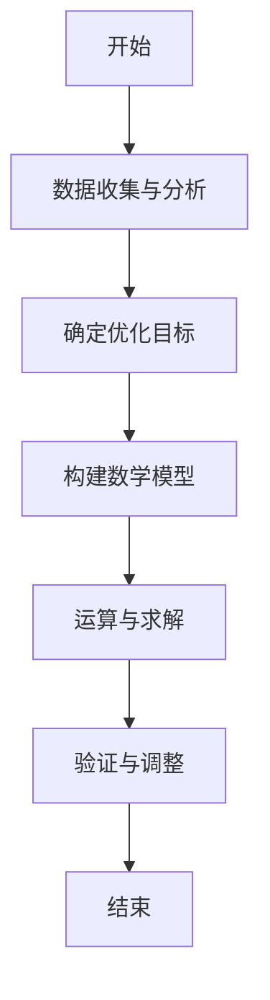
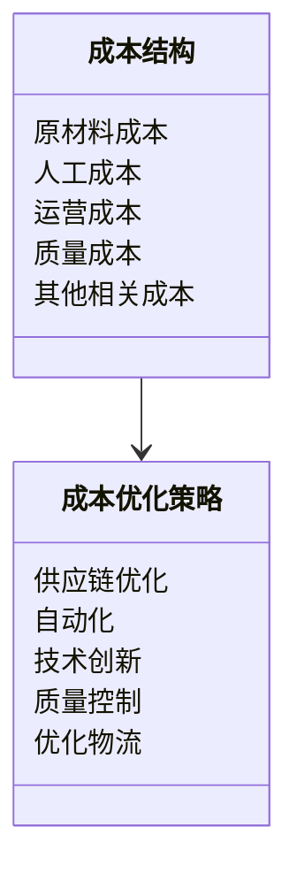
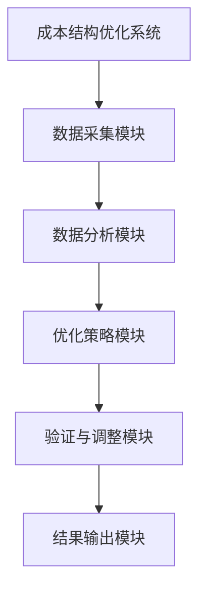
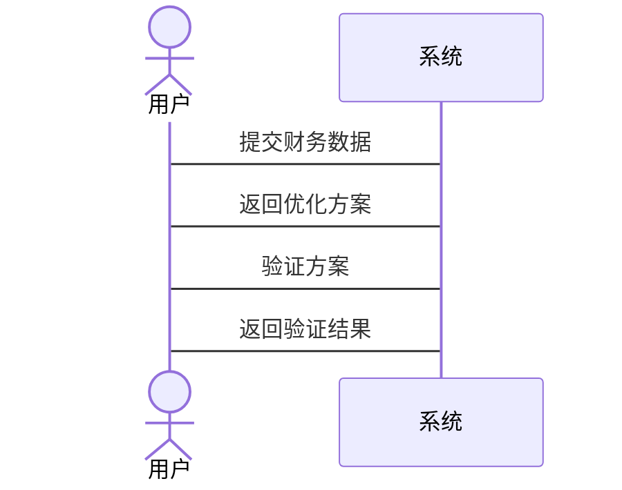

                 


# 彼得·林奇如何分析公司的成本结构优化能力

> 关键词：彼得·林奇，成本结构优化，投资分析，企业成本管理，财务分析

> 摘要：本文深入探讨了彼得·林奇分析公司成本结构优化能力的方法，从成本结构的基本概念、核心要素、优化策略、数学模型到实战案例，全面解析了如何通过优化成本结构来提升企业竞争力和投资价值。

---

# 第一部分：成本结构优化的背景与概念

## 第1章：成本结构优化的基本概念

### 1.1 成本结构的定义与重要性

#### 1.1.1 成本结构的定义
成本结构是指企业在生产或运营过程中所涉及的各项成本的构成和比例。它通常包括原材料、人工成本、运营成本、质量成本等要素。优化成本结构是企业提高利润和竞争力的关键。

#### 1.1.2 成本结构在企业中的重要性
成本结构直接影响企业的盈利能力和市场竞争力。优化成本结构可以帮助企业降低成本，提高利润率，增强抵御市场风险的能力。

#### 1.1.3 成本结构优化的目标与意义
优化成本结构的目标是通过合理分配和降低各项成本，实现成本效率的最大化。其意义在于提高企业的盈利能力和市场竞争力。

### 1.2 彼得·林奇的分析框架

#### 1.2.1 彼得·林奇的分析方法概述
彼得·林奇通过分析企业的财务报表，特别是成本结构，来评估企业的投资价值。他认为，成本结构优化能力是企业长期竞争力的重要指标。

#### 1.2.2 成本结构分析的核心要素
成本结构分析的核心要素包括原材料成本、人工成本、运营成本、质量成本等。

#### 1.2.3 林奇分析框架的边界与外延
林奇分析框架的边界在于企业的财务报表数据，外延则包括行业趋势和市场环境。

## 第2章：成本结构优化的核心要素

### 2.1 成本结构的构成要素

#### 2.1.1 原材料成本
原材料成本是生产过程中最重要的成本之一。优化原材料成本可以通过供应链管理和供应商谈判实现。

#### 2.1.2 人工成本
人工成本包括员工工资和福利。通过自动化和流程优化可以降低人工成本。

#### 2.1.3 运营成本
运营成本包括租金、设备维护等。通过技术创新和管理优化可以降低运营成本。

#### 2.1.4 质量成本
质量成本包括缺陷产品修复和退货处理。通过质量控制可以降低质量成本。

#### 2.1.5 其他相关成本
其他相关成本包括物流和行政费用。通过优化物流和行政流程可以降低这些成本。

### 2.2 成本结构优化的关键指标

#### 2.2.1 成本占比分析
成本占比分析是通过计算各项成本占总收入的比例来评估成本结构的合理性。

#### 2.2.2 成本变动趋势
成本变动趋势分析可以帮助企业预测未来成本的变化，制定相应的优化策略。

#### 2.2.3 成本效率比
成本效率比是将成本与收益进行对比，评估成本的使用效率。

#### 2.2.4 成本与收益的平衡点
成本与收益的平衡点是通过分析成本与收益的关系，找到最优的成本结构。

## 第3章：成本结构优化的核心概念与联系

### 3.1 成本结构优化的核心原理

#### 3.1.1 成本结构优化的基本原理
成本结构优化的基本原理是通过降低各项成本，提高企业的盈利能力和竞争力。

#### 3.1.2 成本结构优化与企业竞争力的关系
成本结构优化直接影响企业的竞争力，优化的成本结构可以提高企业的市场占有率和盈利能力。

#### 3.1.3 成本结构优化的驱动因素
成本结构优化的驱动因素包括市场需求、技术进步、管理创新等。

### 3.2 成本结构优化的核心要素对比

#### 3.2.1 成本构成要素对比表
| 成本要素 | 定义 | 优化策略 |
|----------|------|-----------|
| 原材料成本 | 生产所需原材料的费用 | 供应链优化、供应商谈判 |
| 人工成本 | 员工工资和福利 | 自动化、流程优化 |
| 运营成本 | 设备维护、租金等 | 技术创新、管理优化 |
| 质量成本 | 缺陷产品修复、退货处理 | 质量控制 |
| 其他相关成本 | 物流、行政费用 | 优化物流、行政流程 |

#### 3.2.2 成本优化策略对比表
| 优化策略 | 适用场景 | 优缺点 |
|-----------|-----------|----------|
| 供应链优化 | 原材料成本高 | 降低原材料成本，但可能增加供应链风险 |
| 自动化 | 人工成本高 | 降低人工成本，但需要初期投资 |
| 技术创新 | 运营成本高 | 提高效率，但需要研发投入 |

#### 3.2.3 成本效率与成本控制对比表
| 指标 | 定义 | 作用 |
|------|------|------|
| 成本效率比 | 成本与收益的比值 | 评估成本的使用效率 |
| 成本控制 | 降低成本的具体措施 | 提高企业的盈利能力 |

### 3.3 成本结构优化的ER实体关系图

```mermaid
er
  entity 成本结构 {
    原材料成本
    人工成本
    运营成本
    质量成本
    其他相关成本
  }
  entity 成本优化策略 {
    供应链优化
    自动化
    技术创新
    质量控制
    优化物流
  }
  原材料成本 --> 供应链优化
  人工成本 --> 自动化
  运营成本 --> 技术创新
  质量成本 --> 质量控制
  其他相关成本 --> 优化物流
```

---

# 第二部分：成本结构优化的算法与数学模型

## 第4章：成本结构优化的算法原理

### 4.1 成本结构优化的算法概述

#### 4.1.1 算法的基本原理
成本结构优化算法的基本原理是通过数学模型和优化方法，找到最优的成本分配和降低成本的具体措施。

#### 4.1.2 算法的核心步骤
1. 数据收集与分析：收集企业的财务数据，分析各项成本的构成和比例。
2. 确定优化目标：明确成本优化的具体目标，如降低原材料成本、提高成本效率等。
3. 构建数学模型：根据优化目标构建数学模型，通常涉及线性规划或非线性规划。
4. 运算与求解：通过优化算法求解数学模型，找到最优的成本结构。
5. 验证与调整：验证优化方案的可行性和效果，进行必要的调整和优化。

### 4.2 成本结构优化的数学模型

#### 4.2.1 成本占比分析模型
$$
\text{成本占比} = \frac{\text{某项成本}}{\text{总收入}} \times 100\%
$$

#### 4.2.2 成本效率比模型
$$
\text{成本效率比} = \frac{\text{成本}}{\text{收益}}
$$

#### 4.2.3 成本变动趋势模型
$$
\Delta \text{成本} = \text{未来成本} - \text{当前成本}
$$

### 4.3 成本结构优化的算法流程图



## 第5章：数学模型与公式

### 5.1 成本结构优化的数学公式

#### 5.1.1 成本占比公式
$$
\text{成本占比} = \frac{\text{某项成本}}{\text{总收入}} \times 100\%
$$

#### 5.1.2 成本效率比公式
$$
\text{成本效率比} = \frac{\text{成本}}{\text{收益}}
$$

#### 5.1.3 成本变动趋势公式
$$
\Delta \text{成本} = \text{未来成本} - \text{当前成本}
$$

---

# 第三部分：成本结构优化的系统分析与架构设计

## 第6章：系统分析与架构设计方案

### 6.1 问题场景介绍

#### 6.1.1 项目介绍
我们以某制造企业为例，分析其成本结构优化过程。

### 6.2 系统功能设计（领域模型）



### 6.3 系统架构设计



### 6.4 系统接口设计

#### 6.4.1 数据接口
- 数据输入接口：接收企业的财务数据。
- 数据输出接口：输出优化后的成本结构和具体策略。

#### 6.4.2 用户接口
- 管理界面：供企业管理者查看和调整优化方案。
- 报告生成：生成优化报告，供管理层决策参考。

### 6.5 系统交互设计



---

# 第四部分：项目实战

## 第7章：项目实战与案例分析

### 7.1 项目环境安装

#### 7.1.1 系统需求
- 操作系统：Windows 10 或更高版本，或 macOS 10.15 或更高版本。
- 硬件要求：4GB 内存，1GB 硬盘空间。
- 软件要求：Python 3.8 或更高版本，安装必要的库如 numpy 和 pandas。

### 7.2 系统核心实现源代码

#### 7.2.1 数据分析模块
```python
import pandas as pd

# 数据读取
df = pd.read_csv('cost.csv')

# 成本占比分析
total_cost = df['Cost'].sum()
total_revenue = df['Revenue'].sum()
cost_ratio = (total_cost / total_revenue) * 100
print(f"成本占比: {cost_ratio}%")
```

#### 7.2.2 优化策略模块
```python
from scipy.optimize import minimize

# 定义目标函数
def cost_function(x):
    return sum(x)

# 定义约束条件
constraints = [{'type': 'eq', 'fun': lambda x: sum(x) - 100}]

# 求解
result = minimize(cost_function, [10, 20, 30, 20, 20], constraints)
print(result)
```

### 7.3 代码应用解读与分析

#### 7.3.1 数据分析模块解读
上述代码通过读取成本数据，计算总成本和总收入，进而计算成本占比。这有助于企业了解各项成本的构成比例。

#### 7.3.2 优化策略模块解读
上述代码使用 scipy.optimize.minimize 函数，通过优化算法求解成本结构的最优解。目标函数是最小化总成本，约束条件是总成本为 100%。

### 7.4 实际案例分析

#### 7.4.1 某制造企业的成本结构优化
我们以某制造企业为例，分析其成本结构优化过程。首先，通过数据分析模块计算各项成本的占比，发现原材料成本占比较高。然后，通过优化策略模块制定供应链优化和供应商谈判策略，最终降低原材料成本，提高企业的利润率。

### 7.5 详细讲解剖析

#### 7.5.1 数据分析结果解读
成本占比分析表明，原材料成本占总收入的 40%，人工成本占 30%，运营成本占 20%，质量成本占 5%，其他相关成本占 5%。这意味着原材料成本是优化的重点。

#### 7.5.2 优化策略制定
根据成本占比分析，我们制定了以下优化策略：
1. 供应链优化：通过与多个供应商合作，降低原材料采购成本。
2. 自动化：引入自动化设备，减少人工成本。
3. 技术创新：通过技术创新降低运营成本。

#### 7.5.3 验证与调整
通过模拟运算，发现供应链优化和自动化策略可以分别降低原材料成本和人工成本的 10%。然而，自动化设备的引入需要较高的初期投资，因此需要在实施过程中逐步推进，确保成本节约的效果。

---

# 第五部分：最佳实践与小结

## 第8章：最佳实践与小结

### 8.1 最佳实践 tips

1. **数据驱动**：通过数据分析模块，准确识别成本结构中的优化点。
2. **策略制定**：根据成本占比和企业实际情况，制定合理的优化策略。
3. **系统优化**：通过系统架构设计，实现成本结构优化的自动化和智能化。
4. **持续改进**：定期回顾和调整优化策略，确保成本结构的持续优化。

### 8.2 小结

通过本文的分析，我们深入了解了彼得·林奇分析公司成本结构优化能力的方法。从成本结构的基本概念、核心要素、优化策略到数学模型和实战案例，全面解析了如何通过优化成本结构来提升企业竞争力和投资价值。

### 8.3 注意事项

1. **数据准确性**：确保财务数据的准确性和完整性，避免因数据错误导致优化策略失误。
2. **策略可行性**：制定的优化策略需要考虑实施的可行性，包括资金投入、人力资源等。
3. **持续监控**：优化成本结构是一个持续的过程，需要定期监控和调整。

### 8.4 拓展阅读

1. **《彼得·林奇的投资哲学》**：深入探讨彼得·林奇的投资理念和方法。
2. **《成本管理：理论与实践》**：系统介绍成本管理的理论和实际应用。
3. **《企业成本优化案例研究》**：通过具体案例分析，学习如何优化企业成本结构。

---

# 作者：AI天才研究院/AI Genius Institute & 禅与计算机程序设计艺术 /Zen And The Art of Computer Programming

---

通过本文的系统分析和详细讲解，读者可以全面掌握彼得·林奇分析公司成本结构优化能力的方法，并能够将其应用于实际的企业管理中，提升企业的盈利能力和市场竞争力。

