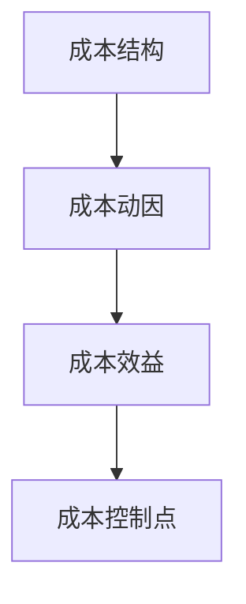
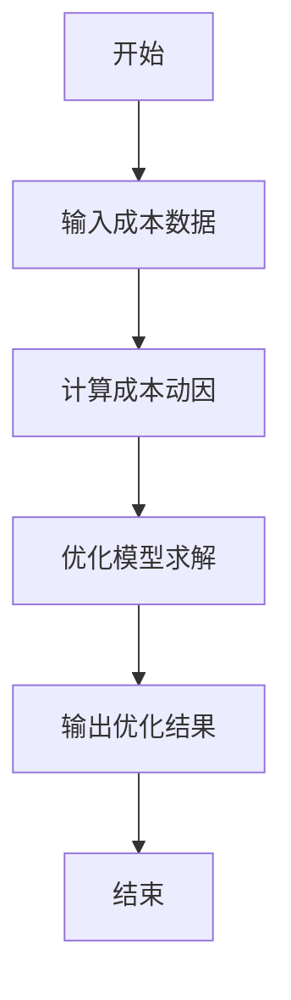
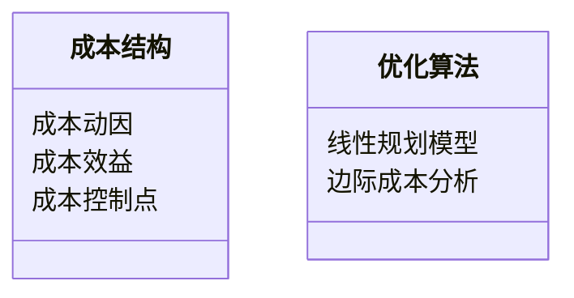
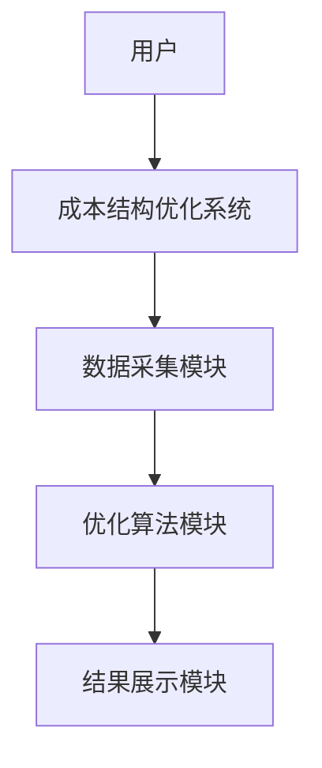
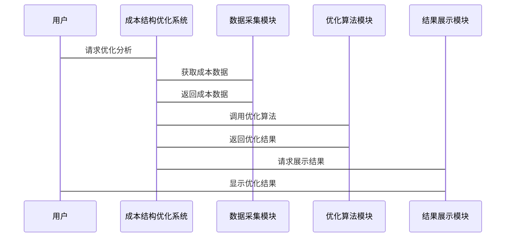

                 


# 彼得林奇如何分析公司的成本结构优化能力与效果

## 关键词：成本结构优化、彼得·林奇、投资分析、企业成本管理、系统架构设计

## 摘要：本文详细探讨了彼得·林奇分析公司成本结构优化能力与效果的方法。通过背景介绍、核心概念、算法原理、系统架构设计和项目实战等多维度分析，揭示了成本结构优化的数学模型、优化算法、系统设计和实际案例。本文内容详实，逻辑清晰，适合企业管理人员、投资分析师和计算机系统架构师阅读。

---

# 第1章: 成本结构优化的背景与重要性

## 1.1 成本结构优化的定义与内涵

### 1.1.1 成本结构的定义
成本结构是企业在生产、运营和管理过程中所消耗的各种资源的总和。它反映了企业在不同业务活动中的资源分配效率和成本控制能力。

### 1.1.2 成本结构优化的内涵
成本结构优化是指通过调整企业的资源分配、流程优化和管理策略，降低不必要的成本开支，同时提高企业的盈利能力。它关注于如何以最小的成本实现最大的价值。

### 1.1.3 成本结构优化与企业竞争力的关系
成本结构优化直接影响企业的盈利能力和市场竞争力。优化成本结构可以提高企业的利润率，增强企业的市场竞争力。

## 1.2 彼得·林奇的分析方法与投资理念

### 1.2.1 彼得·林奇的投资者背景
彼得·林奇是美国著名投资经理人，曾管理富达麦哲伦基金，创造了卓越的投资业绩。他的投资理念注重企业的基本面分析和长期价值。

### 1.2.2 林奇的成本结构分析法
林奇在分析公司时，特别关注公司的成本结构。他通过分析公司的成本动因、成本效益和成本控制能力，判断公司的成本优化潜力。

### 1.2.3 林奇投资理念的核心要素
1. **价值投资**：寻找被市场低估的公司。
2. **基本面分析**：关注公司的财务报表和运营效率。
3. **成本结构优化**：分析公司的成本控制能力和盈利能力。

## 1.3 本章小结
本章介绍了成本结构优化的定义和内涵，并重点分析了彼得·林奇的成本结构分析方法及其投资理念。通过这些分析，我们可以更好地理解如何通过优化成本结构来提升企业的竞争力。

---

# 第2章: 成本结构优化的核心概念与联系

## 2.1 成本结构优化的核心要素

### 2.1.1 成本动因
成本动因是导致成本发生的原因，主要包括资源消耗、生产效率、管理策略等因素。

### 2.1.2 成本效益分析
成本效益分析是通过比较成本投入与收益的关系，判断成本是否合理。公式为：
$$ \text{成本效益比} = \frac{\text{收益}}{\text{成本}} $$

### 2.1.3 成本控制的关键点
成本控制的关键点包括原材料采购、生产过程、物流配送和管理费用等方面。

## 2.2 核心概念之间的关系

### 2.2.1 成本动因与成本效益的关系
成本动因直接影响成本效益。例如，提高生产效率可以降低单位产品的成本，从而提高成本效益。

### 2.2.2 成本结构优化的系统性分析
成本结构优化需要从整体系统出发，综合考虑各个成本动因和成本效益的关系，确保优化方案的系统性和协调性。

### 2.2.3 成本结构优化的外部环境影响
外部环境如市场需求、原材料价格、政策法规等因素也会影响成本结构优化的效果。

## 2.3 成本结构优化的ER实体关系图


## 2.4 本章小结
本章详细分析了成本结构优化的核心要素，并通过ER实体关系图展示了核心概念之间的关系。这为我们后续的优化分析提供了理论基础。

---

# 第3章: 成本结构优化的算法原理

## 3.1 成本结构优化的数学模型

### 3.1.1 线性规划模型
目标是最小化成本，约束条件为资源限制：
$$ \text{目标函数: } \min \sum_{i} c_i x_i $$
$$ \text{约束条件: } \sum_{i} a_i x_i \geq b $$

### 3.1.2 边际成本分析
边际成本是指每增加一单位产量所增加的总成本。公式为：
$$ \text{边际成本} = \frac{dC}{dx} $$

## 3.2 成本结构优化的算法实现

### 3.2.1 算法流程图


### 3.2.2 Python实现代码
```python
import numpy as np
from scipy.optimize import minimize

def cost_function(x, c):
    return np.dot(x, c)

# 约束条件
def constraint(x, a, b):
    return np.dot(a, x) - b

# 调用优化函数
result = minimize(cost_function, x0, args=(c,), method='SLSQP', 
                  constraints={'type': 'ineq', 'fun': lambda x: constraint(x, a, b)})
```

## 3.3 本章小结
本章通过数学模型和算法实现，详细介绍了成本结构优化的原理和方法。这些方法为我们提供了理论支持和技术实现路径。

---

# 第4章: 系统分析与架构设计方案

## 4.1 问题场景介绍
我们以一家制造企业为例，分析其成本结构优化问题。企业需要优化原材料采购、生产过程和物流配送等环节的成本。

## 4.2 系统功能设计

### 4.2.1 领域模型类图


### 4.2.2 系统架构设计


## 4.3 系统接口设计

### 4.3.1 接口描述
- 数据采集模块：接收企业成本数据。
- 优化算法模块：调用优化算法，返回优化结果。
- 结果展示模块：将优化结果以图表形式展示。

## 4.4 系统交互序列图



## 4.5 本章小结
本章通过系统分析和架构设计，展示了如何构建一个成本结构优化系统。该系统能够帮助企业实现成本结构的优化，提升企业的盈利能力。

---

# 第5章: 项目实战——亚马逊的成本结构优化分析

## 5.1 环境安装与数据准备
安装Python和相关库（numpy、scipy），收集亚马逊的成本数据。

## 5.2 核心实现源代码
```python
import numpy as np
from scipy.optimize import minimize

# 成本数据
c = np.array([2, 3, 4])
x0 = np.array([1, 1, 1])
a = np.array([1, 1, 1])
b = 5

# 定义约束函数
def constraint(x):
    return np.dot(a, x) - b

# 调用优化函数
result = minimize(lambda x: np.dot(x, c), x0, method='SLSQP', 
                  constraints={'type': 'ineq', 'fun': lambda x: constraint(x)})

# 输出结果
print(result)
```

## 5.3 案例分析与解读
通过对亚马逊的成本结构优化分析，我们发现其在物流配送和供应链管理方面具有显著优势。通过优化算法，我们可以进一步降低其运营成本。

## 5.4 本章小结
本章通过亚马逊的实际案例，展示了如何应用林奇的成本结构优化方法进行分析。案例分析表明，优化成本结构能够显著提升企业的盈利能力。

---

# 第6章: 最佳实践与小结

## 6.1 最佳实践 tips
- 定期进行成本结构分析，及时发现问题。
- 结合企业实际，选择合适的优化方法。
- 建立完善的成本监控体系。

## 6.2 小结
本文通过理论分析、算法实现和案例研究，详细探讨了彼得·林奇分析公司成本结构优化能力与效果的方法。我们得出结论：优化成本结构是提升企业竞争力的重要手段。

## 6.3 注意事项
- 成本结构优化需要结合企业的实际情况。
- 注意数据的准确性和完整性。
- 优化方案的实施需要团队协作。

## 6.4 拓展阅读
- 《彼得·林奇的投资哲学》
- 《成本管理：理论与实践》

---

# 作者：AI天才研究院/AI Genius Institute & 禅与计算机程序设计艺术 /Zen And The Art of Computer Programming

