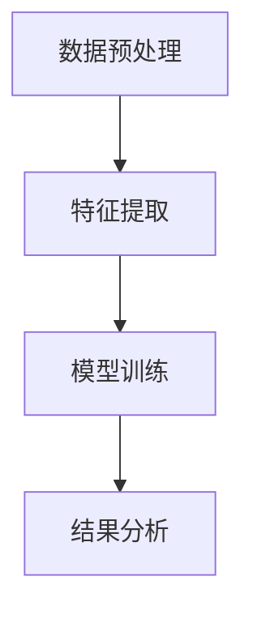
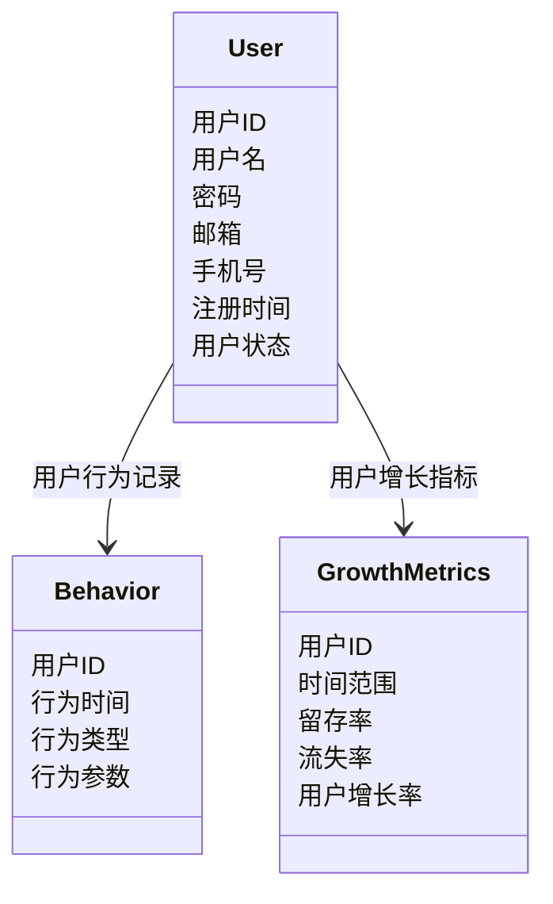
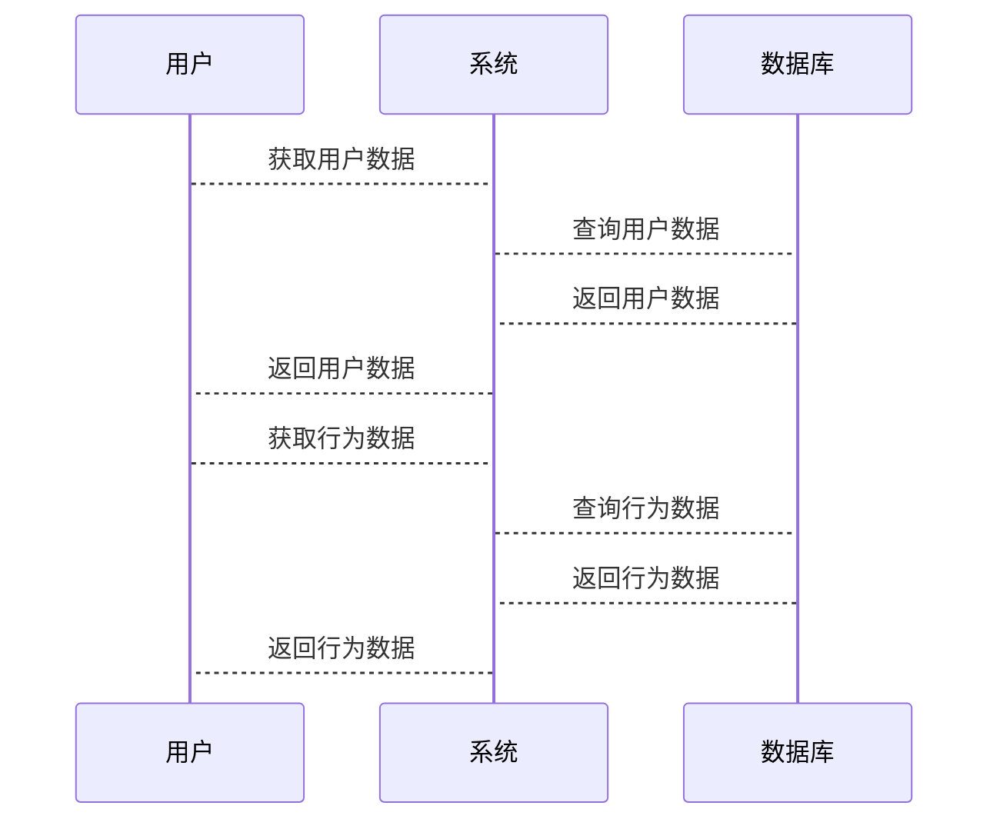

                 


# 彼得林奇如何分析公司的用户增长策略

## 关键词：用户增长策略、彼得·林奇、用户增长模型、用户分群、增长算法、用户留存率

## 摘要：本文将详细介绍彼得·林奇如何分析公司的用户增长策略，从背景介绍、核心概念、算法原理、系统架构到项目实战，全面解析用户增长的分析方法。通过具体案例和数学模型，深入探讨用户增长的关键要素和策略优化。

---

# 第一部分: 用户增长策略的背景与核心概念

## 第1章: 用户增长策略的背景与重要性

### 1.1 用户增长的定义与重要性

#### 1.1.1 什么是用户增长
用户增长是指通过各种手段和策略，吸引新用户并促使现有用户持续使用产品或服务的过程。用户增长不仅仅是数量上的增加，更是质量上的提升，包括用户活跃度、留存率和转化率等指标。

#### 1.1.2 用户增长在企业中的重要性
用户增长是企业持续发展的关键因素之一。通过有效的用户增长策略，企业可以扩大市场份额、提高品牌知名度，并通过用户留存和转化实现更高的收益。

#### 1.1.3 用户增长的核心目标
- 吸引新用户
- 提高用户活跃度
- 提升用户留存率
- 降低用户流失率
- 增加用户生命周期价值

### 1.2 彼得·林奇的背景与分析方法

#### 1.2.1 彼得·林奇的个人简介
彼得·林奇（Peter Lynch）是美国著名投资经理人，被誉为“股票投资的第一人”。他管理的麦哲伦基金创造了辉煌的投资业绩，其投资哲学强调长期视角和对企业的深入分析。

#### 1.2.2 彼得·林奇的投资哲学
- **长期视角**：关注企业的长期增长潜力，而非短期股价波动。
- **深入分析**：通过对企业基本面的深入分析，寻找具有竞争优势的企业。
- **分散投资**：通过分散投资降低风险，同时关注多个增长点。

#### 1.2.3 彼得·林奇的用户增长分析框架
- **用户画像**：分析目标用户的特征、行为和需求。
- **用户生命周期**：关注用户从获取到流失的全过程。
- **增长驱动因素**：识别影响用户增长的关键因素。

### 1.3 用户增长的定义与关键要素

#### 1.3.1 用户生命周期模型
用户生命周期包括以下几个阶段：
1. **获取阶段**：吸引新用户。
2. **激活阶段**：让用户完成关键使用动作。
3. **留存阶段**：提高用户的持续使用率。
4. **转化阶段**：将用户转化为付费用户。
5. **流失阶段**：防止用户流失。

#### 1.3.2 用户增长的关键指标
- **用户获取成本（CAC）**：获取一个新用户的成本。
- **用户生命周期价值（CLV）**：用户在生命周期内为企业带来的总价值。
- **用户留存率**：用户在一定时间内继续使用产品或服务的比例。
- **用户增长率**：用户数量的增加速度。

#### 1.3.3 用户增长的边界与外延
- **边界**：用户增长需要在企业资源和市场条件下进行，不能超出企业的承受能力。
- **外延**：用户增长不仅仅是数量的增加，还包括用户质量的提升和用户体验的优化。

## 1.4 本章小结
本章介绍了用户增长的定义、重要性和关键要素，以及彼得·林奇的背景和分析方法。通过这些内容，我们可以理解用户增长在企业中的重要性，以及如何通过深入分析用户行为和需求来制定有效的增长策略。

---

# 第二部分: 用户增长策略的核心概念与联系

## 第2章: 用户增长的核心概念与联系

### 2.1 用户增长的核心概念

#### 2.1.1 用户分群与画像
用户分群是根据用户的特征、行为和需求将用户划分为不同的群体。通过用户画像，可以更精准地制定增长策略。

#### 2.1.2 用户行为分析
用户行为分析是通过观察用户的行为数据，了解用户的使用习惯和偏好，从而制定更有效的增长策略。

#### 2.1.3 用户留存与流失分析
用户留存分析关注用户在一定时间内是否继续使用产品或服务，而用户流失分析则是识别和防止用户流失的关键步骤。

### 2.2 用户增长模型与数学公式

#### 2.2.1 用户增长的数学模型
用户增长的数学模型可以通过以下公式表示：
$$ 用户增长 = 用户获取 - 用户流失 $$

#### 2.2.2 用户留存率的计算公式
用户留存率可以通过以下公式计算：
$$ 用户留存率 = \frac{保留用户数}{初始用户数} $$

#### 2.2.3 用户增长率的计算公式
用户增长率可以通过以下公式计算：
$$ 用户增长率 = \frac{新用户数}{现有用户数} $$

### 2.3 用户增长的核心要素对比表

| 对比维度 | 用户分群 | 用户行为分析 | 用户留存与流失分析 |
|----------|----------|--------------|--------------------|
| 定义     | 根据特征和行为将用户分组 | 分析用户行为数据 | 分析用户是否继续使用产品或服务 |
| 优缺点   | 优点：精准制定策略；缺点：需要大量数据支持 | 优点：了解用户偏好；缺点：数据收集成本高 | 优点：降低流失率；缺点：需要实时监测 |
| 应用场景 | 用户细分、个性化推荐 | 产品优化、用户体验提升 | 用户召回、流失预防 |

### 2.4 用户增长的ER实体关系图

```mermaid
erd
  User (
    用户ID,
    用户名,
    密码,
    邮箱,
    手机号,
    注册时间,
    用户状态
  )
  Behavior (
    用户ID,
    行为时间,
    行为类型,
    行为参数
  )
  GrowthMetrics (
    用户ID,
    时间范围,
    留存率,
    流失率,
    用户增长率
  )
  User --|> Behavior: 用户行为记录
  User --|> GrowthMetrics: 用户增长指标
```

### 2.5 本章小结
本章详细讲解了用户增长的核心概念，包括用户分群、用户行为分析和用户留存与流失分析，并通过对比表和ER实体关系图展示了这些概念之间的联系。

---

# 第三部分: 用户增长策略的算法原理

## 第3章: 用户增长算法原理

### 3.1 用户分群算法

#### 3.1.1 用户分群的步骤
1. 数据收集：收集用户的基本信息、行为数据和用户反馈。
2. 数据预处理：清洗数据，处理缺失值和异常值。
3. 特征提取：提取用户特征，如年龄、性别、兴趣爱好等。
4. 模型训练：使用聚类算法（如K-Means）对用户进行分群。
5. 结果分析：分析每个用户群体的特征和行为，制定针对性的增长策略。

#### 3.1.2 用户分群的Python实现
以下是用户分群的Python代码示例：
```python
import pandas as pd
from sklearn.cluster import KMeans

# 数据预处理
data = pd.read_csv('user_data.csv')
data.dropna(inplace=True)

# 特征提取
features = data[['age', 'gender', 'interest', 'behavior']]

# 模型训练
kmeans = KMeans(n_clusters=3)
clusters = kmeans.fit_predict(features)

# 结果分析
data['cluster'] = clusters
print(data['cluster'].value_counts())
```

#### 3.1.3 用户分群的Mermaid流程图


### 3.2 用户增长预测算法

#### 3.2.1 用户增长预测的步骤
1. 数据收集：收集用户的历史数据，包括用户行为、用户反馈和市场趋势。
2. 数据预处理：清洗数据，处理缺失值和异常值。
3. 特征工程：提取用户特征，如用户活跃度、用户留存率等。
4. 模型训练：使用回归算法（如线性回归）或时间序列模型（如ARIMA）进行用户增长预测。
5. 结果分析：分析预测结果，制定增长策略。

#### 3.2.2 用户增长预测的Python实现
```python
import pandas as pd
from sklearn.linear_model import LinearRegression

# 数据预处理
data = pd.read_csv('user_growth.csv')
data.dropna(inplace=True)

# 特征工程
features = data[['user_behavior', 'user_revenue']]
target = data['user_growth']

# 模型训练
model = LinearRegression()
model.fit(features, target)

# 预测结果
predicted_growth = model.predict(features)
print(predicted_growth)
```

#### 3.2.3 用户增长预测的数学模型
用户增长预测的数学模型可以通过以下公式表示：
$$ \hat{y} = a + bX $$

其中，$\hat{y}$ 是预测的用户增长，$a$ 是截距，$b$ 是回归系数，$X$ 是自变量。

### 3.3 本章小结
本章详细讲解了用户分群和用户增长预测的算法原理，并通过Python代码和Mermaid流程图展示了具体的实现步骤。通过这些算法，企业可以更精准地制定用户增长策略。

---

# 第四部分: 用户增长策略的系统架构与设计

## 第4章: 用户增长系统的架构设计

### 4.1 问题场景介绍
用户增长系统需要解决以下问题：
- 如何高效地获取新用户？
- 如何提高用户活跃度和留存率？
- 如何降低用户流失率？

### 4.2 系统功能设计

#### 4.2.1 领域模型


#### 4.2.2 系统架构设计


### 4.3 系统接口设计
- **用户接口（API）**：
  - 获取用户数据：`GET /api/users`
  - 获取用户行为数据：`GET /api/behavior`
  - 获取用户增长指标：`GET /api/growth`

- **系统接口（内部）**：
  - 数据访问接口：`GET /data/users`
  - 数据分析接口：`POST /data/analyze`

### 4.4 系统交互设计


### 4.5 本章小结
本章详细讲解了用户增长系统的架构设计，包括领域模型、系统架构、接口设计和交互设计。通过这些设计，企业可以更高效地管理用户增长。

---

# 第五部分: 用户增长策略的项目实战

## 第5章: 用户增长项目的实战

### 5.1 环境安装与配置

#### 5.1.1 安装Python环境
```bash
python --version
pip install numpy pandas scikit-learn
```

#### 5.1.2 安装数据分析工具
```bash
pip install matplotlib seaborn
```

### 5.2 系统核心实现

#### 5.2.1 用户分群实现
```python
import pandas as pd
from sklearn.cluster import KMeans

# 数据预处理
data = pd.read_csv('user_data.csv')
data.dropna(inplace=True)

# 特征提取
features = data[['age', 'gender', 'interest', 'behavior']]

# 模型训练
kmeans = KMeans(n_clusters=3)
clusters = kmeans.fit_predict(features)

# 结果分析
data['cluster'] = clusters
print(data['cluster'].value_counts())
```

#### 5.2.2 用户增长预测实现
```python
import pandas as pd
from sklearn.linear_model import LinearRegression

# 数据预处理
data = pd.read_csv('user_growth.csv')
data.dropna(inplace=True)

# 特征工程
features = data[['user_behavior', 'user_revenue']]
target = data['user_growth']

# 模型训练
model = LinearRegression()
model.fit(features, target)

# 预测结果
predicted_growth = model.predict(features)
print(predicted_growth)
```

### 5.3 项目小结
本章通过具体的项目实战，展示了用户增长策略的实现过程，包括环境安装、数据预处理、模型训练和结果分析。通过这些步骤，读者可以更好地理解用户增长策略的实际应用。

---

# 第六部分: 用户增长策略的最佳实践与总结

## 第6章: 用户增长策略的最佳实践

### 6.1 最佳实践 tips
- **数据驱动**：通过数据分析和用户行为分析，制定精准的增长策略。
- **用户为中心**：关注用户体验和用户需求，制定个性化的增长策略。
- **持续优化**：通过A/B测试和用户反馈，持续优化增长策略。

### 6.2 总结与展望
用户增长是企业持续发展的关键因素之一。通过彼得·林奇的分析方法和现代的用户增长策略，企业可以更精准地制定增长计划，实现用户数量和质量的双提升。

### 6.3 注意事项
- **数据隐私**：在数据收集和分析过程中，需要注意用户隐私和数据安全。
- **模型优化**：在模型训练和优化过程中，需要不断调整参数和模型结构，以提高预测精度。
- **用户反馈**：在制定增长策略时，需要重视用户的反馈和需求，以制定更有效的增长策略。

### 6.4 拓展阅读
- 《增长黑客》：范冰著，详细讲解了用户增长的策略和方法。
- 《数据分析的艺术》：范冰著，深入探讨了数据分析的方法和技巧。

---

# 作者：AI天才研究院/AI Genius Institute & 禅与计算机程序设计艺术/Zen And The Art of Computer Programming

---

通过以上内容，我们可以看到，彼得·林奇的用户增长分析方法结合现代技术手段，为企业制定有效的用户增长策略提供了有力的工具和方法。希望本文能够帮助读者更好地理解用户增长的分析方法，并在实际应用中取得成功。

