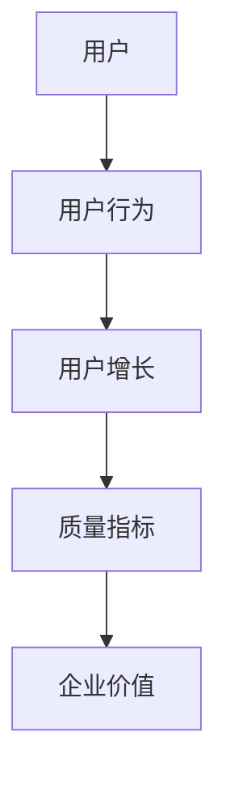
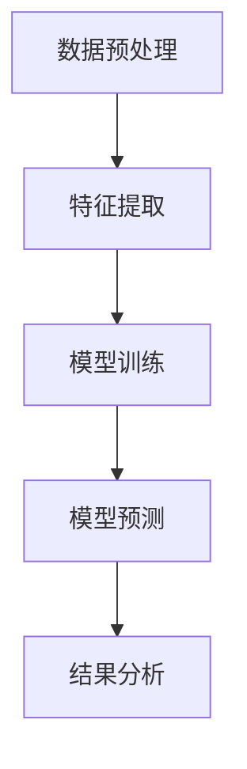
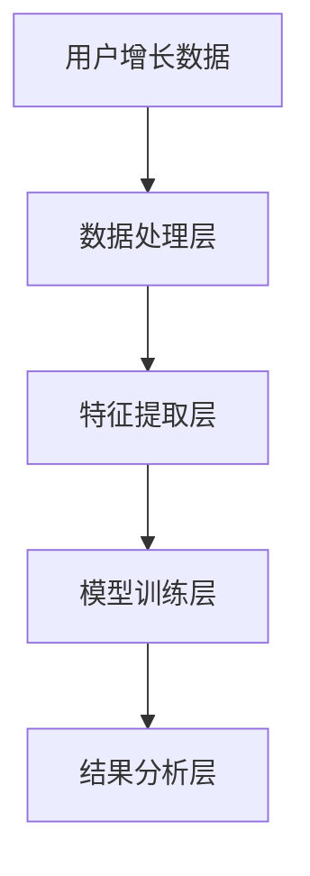

                 


# 彼得林奇如何分析公司的用户增长质量

## 关键词：用户增长质量，彼得·林奇，投资分析，用户留存率，企业价值

## 摘要：本文深入探讨了彼得·林奇分析用户增长质量的方法，结合技术背景和实际案例，分析了用户增长质量对企业价值的影响。通过详细讲解分析框架、算法原理和系统架构，为读者提供了全面的分析工具和实践指导。

---

# 第一部分: 彼得·林奇用户增长质量分析方法概述

## 第1章: 彼得·林奇与用户增长质量分析

### 1.1 彼得·林奇的背景与投资理念

#### 1.1.1 彼得·林奇的生平简介

彼得·林奇（Peter Lynch）是美国著名的投资经理人，以其在富达投资管理公司的卓越表现而闻名。他在任职期间管理的基金取得了高达31.8%的年平均回报率，这使得他成为投资界最具影响力的人物之一。林奇的投资哲学强调长期价值和基本面分析，他认为投资者应关注企业的内在价值，而非市场的短期波动。

#### 1.1.2 彼得·林奇的投资哲学

林奇的投资哲学可以概括为“买便宜的，然后持有”，他强调长期投资和深入的基本面分析。他认为，投资者应关注企业的财务健康状况、管理团队、市场地位和竞争优势。他的成功部分归功于他对公司基本面的深入研究，尤其是对公司增长潜力的关注。

#### 1.1.3 彼得·林奇对用户增长质量的重视

在企业的基本面分析中，用户增长质量是一个关键指标。林奇认识到，用户增长不仅是企业发展的驱动力，更是企业长期价值的体现。他通过分析用户增长的质量，识别出那些能够持续增长并创造长期价值的企业。

---

### 1.2 用户增长质量分析的重要性

#### 1.2.1 用户增长质量的定义

用户增长质量是指用户增长的可持续性和有效性。高质量的用户增长不仅意味着用户数量的增加，更意味着这些用户能够为企业的长期发展带来价值。这包括用户的行为、留存率和转化率等方面。

#### 1.2.2 用户增长质量对企业的意义

- **企业价值**：高质量的用户增长能够提升企业的市场地位和盈利能力。
- **可持续发展**：通过分析用户增长质量，企业可以识别出潜在的问题，优化产品和服务，确保持续增长。
- **投资决策**：投资者可以通过分析用户增长质量，评估企业的长期发展潜力。

#### 1.2.3 彼得·林奇视角下的用户增长质量分析

林奇认为，用户增长质量是企业长期价值的核心驱动力。他强调通过分析用户行为和留存率，识别出那些能够持续增长的优质企业。

---

### 1.3 本书的核心内容与结构

#### 1.3.1 本书的主要分析框架

- **用户增长质量的定义与测量**：介绍用户增长质量的核心指标和测量方法。
- **彼得·林奇分析框架**：详细讲解林奇的分析方法和步骤。
- **技术实现与优化**：结合技术背景，探讨如何通过算法和系统优化提升用户增长质量分析的准确性。

#### 1.3.2 本书的章节安排

- 第一部分：彼得·林奇用户增长质量分析方法概述。
- 第二部分：用户增长质量分析的核心概念与联系。
- 第三部分：用户增长质量分析的算法原理。
- 第四部分：用户增长质量分析的系统架构设计。
- 第五部分：用户增长质量分析的项目实战。
- 第六部分：用户增长质量分析的最佳实践。

#### 1.3.3 本书的学习方法

建议读者从基础概念入手，逐步深入学习分析方法和技术实现，结合实际案例进行实践，以全面掌握用户增长质量分析的核心思想和应用技巧。

---

## 第2章: 用户增长质量分析的核心概念与联系

### 2.1 核心概念原理

#### 2.1.1 用户增长质量的定义与属性

用户增长质量可以从以下几个方面进行评估：
- **用户数量**：增长的速度和规模。
- **用户质量**：用户的活跃度、留存率和转化率。
- **用户行为**：用户的使用频率和深度。

#### 2.1.2 用户增长质量与企业价值的关系

高质量的用户增长能够提升企业的市场竞争力和盈利能力。通过分析用户增长质量，投资者可以识别出那些具有持续增长潜力的企业。

#### 2.1.3 彼得·林奇分析方法的独特性

林奇的独特之处在于他将用户增长质量与企业长期价值相结合，通过深入分析用户的留存率和活跃度，识别出那些能够持续增长的优质企业。

---

### 2.2 核心概念对比表

#### 2.2.1 用户增长质量与用户增长速度的对比

| 指标 | 用户增长质量 | 用户增长速度 |
|------|-------------|--------------|
| 定义 | 用户增长的可持续性和有效性 | 用户数量的增加速度 |
| 重点 | 用户的留存率和活跃度 | 用户数量的增长速度 |

#### 2.2.2 用户留存率与用户活跃度的对比

| 指标 | 用户留存率 | 用户活跃度 |
|------|-----------|------------|
| 定义 | 用户在一定时间内继续使用产品的比例 | 用户使用产品的频率和深度 |
| 重点 | 用户的忠诚度 | 用户的使用强度 |

#### 2.2.3 用户增长质量与企业长期发展的对比

| 指标 | 用户增长质量 | 企业长期发展 |
|------|-------------|--------------|
| 关系 | 用户增长质量是企业长期发展的基础 | 企业长期发展依赖于持续的高质量用户增长 |

---

### 2.3 ER实体关系图



---

## 第3章: 用户增长质量分析的算法原理

### 3.1 用户增长质量预测模型

#### 3.1.1 ARIMA模型简介

ARIMA（自回归积分滑动平均模型）是一种常用的时间序列预测模型。它通过分析历史数据，预测未来的用户增长趋势。

#### 3.1.2 用户增长质量的数学模型

用户增长质量可以通过以下公式进行预测：

$$
\hat{y}_t = \alpha y_{t-1} + \beta d + \epsilon_t
$$

其中，$\hat{y}_t$ 是预测的用户增长质量，$y_{t-1}$ 是上一期的用户增长质量，$d$ 是常数项，$\epsilon_t$ 是误差项。

#### 3.1.3 模型的实现与优化

以下是ARIMA模型的Python实现示例：

```python
from statsmodels.tsa.arima_model import ARIMA
import pandas as pd

# 加载数据
data = pd.read_csv('user_growth.csv')

# 拟合ARIMA模型
model = ARIMA(data['user_growth'], order=(1, 1, 1))
model_fit = model.fit()

# 预测未来用户增长质量
forecast = model_fit.forecast(steps=5)
print(forecast)
```

---

### 3.2 机器学习模型的应用

#### 3.2.1 用户增长质量的分类模型

使用随机森林分类器对用户增长质量进行分类：

```python
from sklearn.ensemble import RandomForestClassifier
from sklearn.model_selection import train_test_split
import pandas as pd

# 加载数据
data = pd.read_csv('user_growth.csv')

# 分割数据
X = data.drop('user_growth', axis=1)
y = data['user_growth']

X_train, X_test, y_train, y_test = train_test_split(X, y, test_size=0.2, random_state=42)

# 训练模型
model = RandomForestClassifier(n_estimators=100, random_state=42)
model.fit(X_train, y_train)

# 预测结果
y_pred = model.predict(X_test)
print(y_pred)
```

---

### 3.3 算法流程图



---

## 第4章: 用户增长质量分析的系统架构设计

### 4.1 系统功能设计

#### 4.1.1 数据采集模块

负责收集用户行为数据，包括用户注册、登录、浏览和购买等行为。

#### 4.1.2 数据分析模块

对收集到的数据进行清洗、转换和建模分析，生成用户增长质量的评估结果。

#### 4.1.3 结果展示模块

以图表和报告的形式展示分析结果，帮助用户直观理解用户增长质量的状况。

---

### 4.2 系统架构图



---

## 第5章: 用户增长质量分析的项目实战

### 5.1 环境安装

安装所需的Python库：

```bash
pip install pandas numpy scikit-learn statsmodels
```

---

### 5.2 系统核心实现源代码

以下是用户增长质量分析系统的Python实现示例：

```python
import pandas as pd
from statsmodels.tsa.arima_model import ARIMA
from sklearn.ensemble import RandomForestClassifier

# 加载数据
data = pd.read_csv('user_growth.csv')

# 时间序列预测
model = ARIMA(data['user_growth'], order=(1, 1, 1))
model_fit = model.fit()

# 机器学习分类
X = data.drop('user_growth', axis=1)
y = data['user_growth']

X_train, X_test, y_train, y_test = train_test_split(X, y, test_size=0.2, random_state=42)

model = RandomForestClassifier(n_estimators=100, random_state=42)
model.fit(X_train, y_train)

# 预测结果
y_pred = model.predict(X_test)
print(y_pred)
```

---

### 5.3 实际案例分析

以一家互联网公司为例，分析其用户增长质量：

1. **数据收集**：收集过去一年的用户增长数据。
2. **数据预处理**：清洗数据，处理缺失值和异常值。
3. **模型训练**：使用ARIMA模型和随机森林分类器进行预测。
4. **结果分析**：评估模型的准确性，调整参数优化预测效果。

---

## 第6章: 用户增长质量分析的最佳实践

### 6.1 总结

彼得·林奇通过深入分析用户增长质量，识别出那些具有长期增长潜力的企业。本文结合技术背景，详细讲解了用户增长质量分析的核心概念、算法原理和系统架构设计，并通过实际案例展示了如何在实践中应用这些方法。

---

### 6.2 小结

用户增长质量是企业长期价值的核心驱动力。通过本文的学习，读者可以掌握如何从技术和投资的角度分析用户增长质量，为企业的可持续发展提供有力支持。

---

### 6.3 注意事项

- 数据质量：确保数据的准确性和完整性。
- 模型选择：根据实际情况选择合适的分析模型。
- 持续优化：定期更新数据和模型，确保分析结果的准确性。

---

### 6.4 拓展阅读

- 《彼得·林奇的投资哲学》
- 《时间序列分析与应用》
- 《机器学习实战》

---

## 作者：AI天才研究院/AI Genius Institute & 禅与计算机程序设计艺术 /Zen And The Art of Computer Programming

