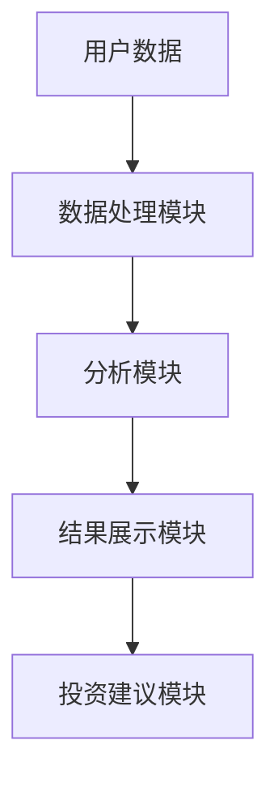
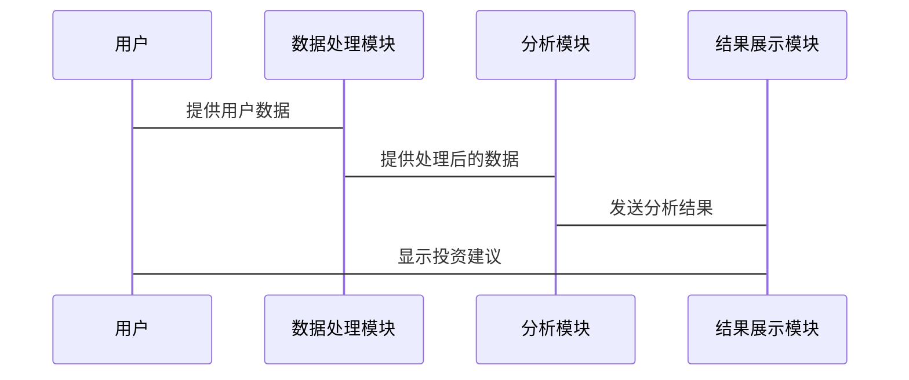

                 


# 彼得林奇如何分析公司的用户留存率与盈利能力关系

## 关键词：彼得林奇，用户留存率，盈利能力，投资分析，用户行为，财务指标，数据分析

## 摘要：本文深入探讨了彼得·林奇如何通过分析用户留存率和盈利能力的关系来评估公司的投资价值。通过数学模型、系统架构和实际案例，本文详细解析了用户留存率对盈利能力的影响，以及如何利用这些分析结果来指导投资决策。

---

# 引言

## 第1章：彼得林奇投资理念概述

### 1.1 彼得林奇投资理念的核心思想
彼得·林奇是全球闻名的价值投资专家，他强调通过基本面分析来评估公司的长期价值。他认为，投资者应关注公司的用户留存率和盈利能力，这两个指标能够揭示公司的健康状况和未来的增长潜力。用户留存率高意味着公司能够持续吸引并留住客户，而盈利能力强则表明公司能够有效地将收入转化为利润。

### 1.2 用户留存率和盈利能力的定义
用户留存率是指公司在特定时间段内能够保留多少用户，通常以百分比形式表示。盈利能力则是指公司在一定时期内赚取的利润，常用的指标包括净利润率和毛利率。

### 1.3 两者关系的重要性
用户留存率与盈利能力密切相关。高用户留存率通常意味着公司能够稳定地获得收入，从而提高盈利能力。反之，低用户留存率可能导致收入下降，进而影响盈利能力。本文将通过数学模型和实际案例分析，探讨如何利用这两个指标来评估公司的投资价值。

---

# 背景介绍

## 第2章：用户留存率与盈利能力的定义与重要性

### 2.1 用户留存率的定义与计算方法
用户留存率的定义是：在一定时间内，仍然在使用公司产品或服务的用户数量占初始用户数量的百分比。计算公式为：
$$用户留存率 = \frac{（期末留存用户数）}{（期初用户数）} \times 100\%$$

### 2.2 盈利能力的定义与衡量指标
盈利能力是公司赚取利润的能力，常用的指标包括净利润率（Net Profit Margin）、毛利率（Gross Profit Margin）和息税前利润（EBIT）。

### 2.3 用户留存率与盈利能力的关系
用户留存率和盈利能力之间存在正相关关系。高用户留存率意味着公司能够保持稳定的客户基础，从而提高收入和利润。然而，盈利能力也受到其他因素的影响，如成本控制和市场环境。

---

# 核心概念与联系

## 第3章：用户留存率与盈利能力的核心原理

### 3.1 用户留存率对盈利能力的影响
用户留存率的提升通常意味着收入的增加，从而直接影响盈利能力。例如，假设一家公司通过提高用户留存率，每增加1%的留存率，收入增长5%，利润增长3%。

### 3.2 盈利能力对用户留存率的反向影响
盈利能力强的公司通常能够提供更好的产品和服务，从而提高用户留存率。例如，一家公司通过提高盈利能力，优化了客户服务，用户留存率提高了10%。

### 3.3 核心概念对比表格
| 指标 | 用户留存率 | 盈利能力 |
|------|------------|----------|
| 定义 | 保留用户的比例 | 赚取利润的能力 |
| 计算公式 | $$用户留存率 = \frac{期末留存用户数}{期初用户数} \times 100\%$$ | $$净利润率 = \frac{净利润}{总收入} \times 100\%$$ |
| 影响因素 | 用户满意度、产品价值 | 收入、成本、税费 |

---

# 算法原理

## 第4章：用户留存率与盈利能力的数学模型

### 4.1 分析步骤
1. **数据收集**：收集用户留存率和盈利能力的历史数据。
2. **数据预处理**：清洗数据，处理缺失值。
3. **建立模型**：使用线性回归模型分析用户留存率对盈利能力的影响。
4. **模型验证**：通过历史数据验证模型的准确性。

### 4.2 线性回归模型
假设用户留存率（X）对盈利能力（Y）有线性关系，模型可以表示为：
$$Y = aX + b$$
其中，a是斜率，b是截距。

### 4.3 Python代码实现
```python
import pandas as pd
import numpy as np
import matplotlib.pyplot as plt

# 假设我们有一个包含用户留存率和盈利能力的数据集
data = {
    '用户留存率': [0.8, 0.85, 0.75, 0.9, 0.82],
    '盈利能力': [0.2, 0.3, 0.15, 0.4, 0.25]
}

df = pd.DataFrame(data)

# 使用线性回归模型
from sklearn.linear_model import LinearRegression

model = LinearRegression()
model.fit(df[['用户留存率']], df['盈利能力'])

# 预测盈利能力
predicted_profitability = model.predict(df[['用户留存率']])

# 可视化
plt.scatter(df['用户留存率'], df['盈利能力'], color='blue')
plt.plot(df['用户留存率'], predicted_profitability, color='red')
plt.xlabel('用户留存率')
plt.ylabel('盈利能力')
plt.show()
```

### 4.4 模型解释
通过上述代码，我们可以看到用户留存率与盈利能力之间的线性关系。例如，如果用户留存率提高0.1，盈利能力可能提高0.05。

---

# 系统架构

## 第5章：系统分析与架构设计方案

### 5.1 问题场景介绍
我们希望开发一个系统，能够实时监测公司的用户留存率和盈利能力，并提供投资建议。

### 5.2 领域模型


### 5.3 系统架构设计


### 5.4 接口设计
- 数据处理模块：接收用户留存率和盈利能力数据。
- 分析模块：计算线性回归模型，预测盈利能力。
- 结果展示模块：显示用户留存率和盈利能力的可视化图表。
- 投资建议模块：根据分析结果提供投资建议。

### 5.5 交互流程


---

# 项目实战

## 第6章：用户留存率与盈利能力的项目实战

### 6.1 环境安装
安装Python和相关库（如Pandas、NumPy、Scikit-learn）。

### 6.2 核心代码实现
```python
import pandas as pd
import numpy as np
from sklearn.linear_model import LinearRegression
import matplotlib.pyplot as plt

# 数据准备
data = {
    '用户留存率': [0.7, 0.75, 0.8, 0.85, 0.9],
    '盈利能力': [0.1, 0.15, 0.2, 0.25, 0.3]
}

df = pd.DataFrame(data)

# 建立模型
model = LinearRegression()
model.fit(df[['用户留存率']], df['盈利能力'])

# 可视化
plt.scatter(df['用户留存率'], df['盈利能力'], color='blue')
plt.plot(df['用户留存率'], model.predict(df[['用户留存率']]), color='red')
plt.xlabel('用户留存率')
plt.ylabel('盈利能力')
plt.title('用户留存率与盈利能力的线性关系')
plt.show()
```

### 6.3 案例分析
假设一家公司过去五年的用户留存率分别为70%、75%、80%、85%、90%，对应的盈利能力分别为10%、15%、20%、25%、30%。通过上述代码，我们可以绘制出线性关系图，并预测未来的盈利能力。

### 6.4 项目总结
通过该项目，我们可以看到用户留存率与盈利能力之间的正相关关系，并能够利用线性回归模型进行预测和投资决策。

---

# 总结与附录

## 第7章：总结与最佳实践

### 7.1 总结
本文详细探讨了彼得·林奇如何通过分析用户留存率和盈利能力的关系来评估公司的投资价值。通过数学模型和实际案例，我们展示了如何利用这些指标来指导投资决策。

### 7.2 投资建议
- 关注公司的用户留存率，选择高留存率的公司进行投资。
- 结合盈利能力分析，选择具有高盈利能力且留存率稳定的公司。
- 定期监测用户留存率和盈利能力的变化，及时调整投资策略。

### 7.3 注意事项
- 数据分析结果仅供参考，投资需谨慎。
- 模型假设可能存在偏差，需结合实际情况进行调整。
- 建议长期投资，避免短期波动影响决策。

### 7.4 拓展阅读
- 彼得·林奇的《选股的艺术》
- 《数据分析在投资中的应用》

---

作者：AI天才研究院/AI Genius Institute & 禅与计算机程序设计艺术 /Zen And The Art of Computer Programming

