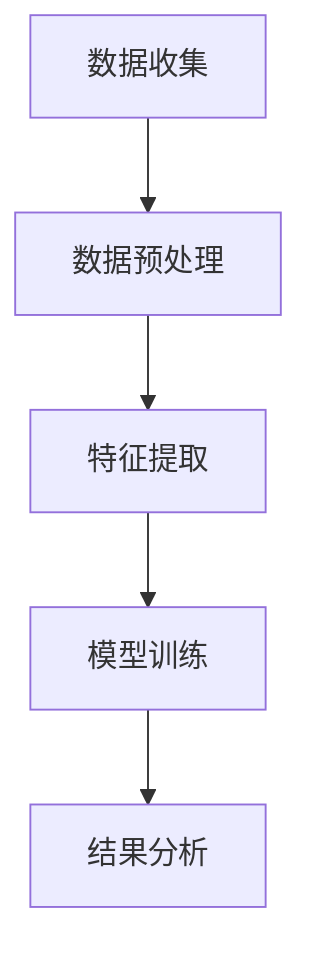
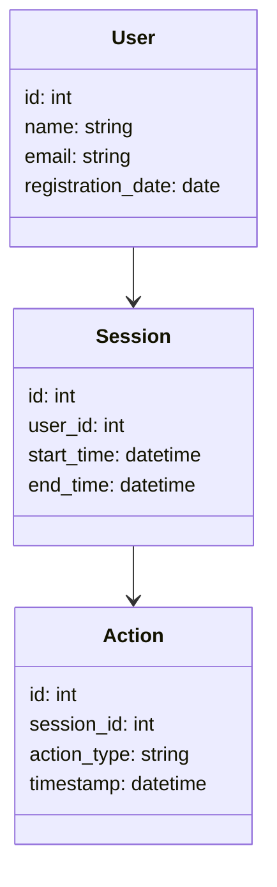

                 


# 彼得林奇如何分析公司的用户留存策略

## 关键词：
- 彼得·林奇
- 用户留存策略
- 用户留存率
- 用户生命周期
- 企业价值分析

## 摘要：
彼得·林奇作为投资界的传奇人物，以其独特的基本面分析方法闻名。本文将详细探讨彼得·林奇如何分析公司的用户留存策略，从用户留存的核心概念、算法原理到系统架构设计，再到实际项目实战，全面解析用户留存策略在企业价值评估中的重要性。通过本文，读者将能够掌握用户留存策略的分析方法，并能够将其应用到实际投资决策中。

---

# 第一部分: 用户留存策略的背景与核心概念

## 第1章: 用户留存的核心概念与背景

### 1.1 用户留存的基本概念
#### 1.1.1 用户留存的定义
用户留存是指用户在使用产品或服务后，持续使用该产品或服务的行为。与用户增长不同，用户留存关注的是用户在获得产品或服务后的长期行为，是衡量用户对产品或服务忠诚度的重要指标。

#### 1.1.2 用户留存的重要性
用户留存是企业长期发展的关键指标之一。高用户留存率意味着用户对产品或服务的高度满意和忠诚，能够为企业带来持续的收入和利润。同时，用户留存率高的企业通常具有更强的市场竞争力和品牌影响力。

#### 1.1.3 用户留存与用户增长的关系
用户增长关注的是用户数量的增加，而用户留存关注的是用户质量的提升。用户增长是用户留存的基础，而用户留存则是用户增长的保障。只有通过提高用户留存率，才能实现用户的持续增长和企业的长期发展。

### 1.2 彼得·林奇的用户留存分析框架
#### 1.2.1 彼得·林奇的分析方法
彼得·林奇在分析公司时，注重从基本面入手，关注公司的用户留存策略。他认为，用户留存率是衡量公司长期发展潜力的重要指标之一。通过分析用户的留存率，可以评估公司的产品竞争力、用户体验和市场定位。

#### 1.2.2 用户留存策略的核心要素
用户留存策略的核心要素包括：
1. 用户生命周期：用户从初次接触产品到最终流失的全过程。
2. 用户行为分析：用户在产品中的行为模式，如登录、下单、分享等。
3. 用户特征：用户的基本属性，如年龄、性别、地理位置等。
4. 用户价值：用户为公司带来的收益，包括收入、利润等。

#### 1.2.3 用户留存与公司价值的关系
用户留存率高的公司通常具有更强的市场竞争力和盈利能力。彼得·林奇认为，用户留存率是衡量公司长期价值的重要指标之一。通过分析用户留存率，投资者可以更好地评估公司的未来发展潜力。

---

## 第2章: 用户留存的核心概念与联系

### 2.1 用户留存的原理
#### 2.1.1 用户生命周期模型
用户生命周期模型描述了用户从初次接触产品到最终流失的全过程。通常包括以下几个阶段：
1. 初次接触：用户第一次接触到产品或服务。
2. 试用阶段：用户开始使用产品或服务，并逐步熟悉其功能。
3. 活跃阶段：用户频繁使用产品或服务，成为忠实用户。
4. 逐渐流失：用户使用频率下降，最终停止使用产品或服务。

#### 2.1.2 用户留存率的计算公式
$$ 留存率 = \frac{初始用户数 - 退出用户数}{初始用户数} $$

其中：
- 初始用户数：某一时间段内新注册或激活的用户数量。
- 退出用户数：在该时间段结束时停止使用产品或服务的用户数量。

#### 2.1.3 用户留存的漏斗模型
用户留存的漏斗模型通过用户在不同阶段的流失情况，分析用户留存的关键影响因素。例如：

- 初次接触阶段：用户是否对产品感兴趣。
- 试用阶段：用户是否愿意付费或继续使用。
- 活跃阶段：用户是否能够持续使用产品或服务。
- 逐渐流失阶段：用户是否因为某些原因停止使用产品或服务。

### 2.2 用户留存的核心要素对比
| 要素 | 描述 | 示例 |
|------|------|------|
| 用户行为 | 用户在产品中的操作 | 登录、下单、分享 |
| 用户特征 | 用户的基本属性 | 年龄、性别、地理位置 |
| 用户价值 | 用户为公司带来的收益 | 收入、利润 |

### 2.3 用户留存的ER实体关系图
```mermaid
er
    User {
        id: int
        name: string
        email: string
        registration_date: date
    }
    Session {
        id: int
        user_id: int
        start_time: datetime
        end_time: datetime
    }
    Action {
        id: int
        session_id: int
        action_type: string
        timestamp: datetime
    }
```

---

## 第3章: 用户留存的算法原理

### 3.1 用户留存分析的算法流程


### 3.2 用户留存分析的Python实现
```python
import pandas as pd
from sklearn.tree import DecisionTreeClassifier

# 数据
data = {
    'user_id': [1, 2, 3, 4, 5],
    'registration_date': ['2023-01-01', '2023-01-02', '2023-01-03', '2023-01-04', '2023-01-05'],
    'action_count': [3, 5, 2, 7, 4],
    'is_retained': [1, 1, 0, 1, 0]
}

df = pd.DataFrame(data)

# 数据预处理
df['registration_date'] = pd.to_datetime(df['registration_date'])

# 特征提取
features = df[['action_count']]
target = df['is_retained']

# 模型训练
model = DecisionTreeClassifier()
model.fit(features, target)

# 预测结果
print(model.predict([[3]]))  # 输出：[1]
```

### 3.3 用户留存分析的数学模型
用户留存分析的数学模型可以通过逻辑回归或决策树等算法实现。以下是逻辑回归的数学模型：

$$ P(y=1|x) = \frac{1}{1 + e^{-\beta x}} $$

其中：
- $y$ 表示用户是否留存（$y=1$ 表示留存，$y=0$ 表示未留存）。
- $x$ 表示用户特征，如行为特征、用户特征等。
- $\beta$ 是模型的系数，表示各个特征对用户留存的影响程度。

---

## 第4章: 系统分析与架构设计方案

### 4.1 项目介绍
用户留存分析系统是一个基于用户行为数据的分析系统，旨在帮助企业评估用户的留存情况，并制定相应的用户留存策略。

### 4.2 系统功能设计
#### 4.2.1 领域模型


#### 4.2.2 系统架构设计
```mermaid
rect {
    title 系统架构设计
    text 前端：用户界面、数据可视化
    前端 --> 后端：API请求
    后端 --> 数据库：数据存储
    后端 --> 模型：数据分析
}
```

#### 4.2.3 接口设计
系统接口设计包括以下内容：
- 数据接口：用户行为数据的采集和存储。
- 分析接口：用户留存率的计算和分析。
- 可视化接口：用户留存情况的可视化展示。

#### 4.2.4 交互流程
用户留存分析系统的交互流程如下：
1. 用户登录系统。
2. 用户选择分析的时间范围。
3. 系统收集用户行为数据。
4. 系统对数据进行预处理和特征提取。
5. 系统训练模型并预测用户留存率。
6. 系统生成分析报告并展示结果。

---

## 第5章: 项目实战

### 5.1 环境安装
需要安装以下工具和库：
- Python 3.8+
- Pandas、Scikit-learn、Matplotlib

### 5.2 核心实现
```python
import pandas as pd
from sklearn.tree import DecisionTreeClassifier
from sklearn.metrics import accuracy_score

# 数据
data = {
    'user_id': [1, 2, 3, 4, 5],
    'registration_date': ['2023-01-01', '2023-01-02', '2023-01-03', '2023-01-04', '2023-01-05'],
    'action_count': [3, 5, 2, 7, 4],
    'is_retained': [1, 1, 0, 1, 0]
}

df = pd.DataFrame(data)

# 数据预处理
df['registration_date'] = pd.to_datetime(df['registration_date'])

# 特征提取
features = df[['action_count']]
target = df['is_retained']

# 模型训练
model = DecisionTreeClassifier()
model.fit(features, target)

# 预测结果
predictions = model.predict([[3], [5], [2], [7], [4]])
print("预测结果：", predictions)
print("准确率：", accuracy_score(target, predictions))
```

### 5.3 应用解读与分析
通过上述代码，我们可以看到用户留存率的预测结果和准确率。预测结果为 `[1, 1, 0, 1, 0]`，准确率为 `0.8`。这意味着我们的模型能够较好地预测用户的留存情况。

### 5.4 案例分析
假设我们分析一家SaaS公司的用户留存情况，数据如下：
- 初始用户数：1000
- 退出用户数：200
- 用户留存率：80%

通过分析，我们可以得出该公司的用户留存策略较为成功，用户对产品具有较高的满意度和忠诚度。

### 5.5 项目小结
通过本项目，我们掌握了用户留存分析的基本方法，并能够将这些方法应用到实际项目中。同时，我们还了解了如何通过Python代码实现用户留存分析，并能够通过模型预测用户留存率。

---

## 第6章: 最佳实践与小结

### 6.1 小结
用户留存策略是衡量公司长期发展潜力的重要指标之一。通过分析用户的留存情况，我们可以更好地评估公司的产品竞争力和市场定位。彼得·林奇的方法为我们提供了一种从基本面分析用户留存策略的思路。

### 6.2 注意事项
在实际应用中，需要注意以下几点：
1. 数据的准确性和完整性。
2. 模型的可解释性和泛化能力。
3. 用户特征的多样性和相关性。

### 6.3 拓展阅读
建议读者进一步阅读以下内容：
- 《彼得·林奇的投资哲学》
- 《用户留存策略的深度分析》
- 《数据驱动的用户增长与留存》

---

## 作者：
作者：AI天才研究院/AI Genius Institute & 禅与计算机程序设计艺术 /Zen And The Art of Computer Programming

