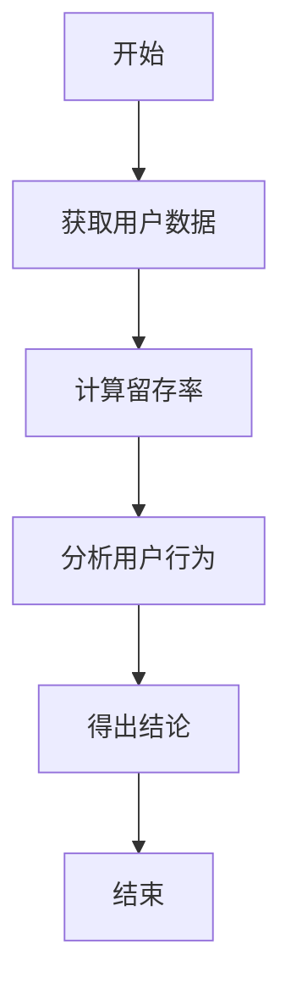
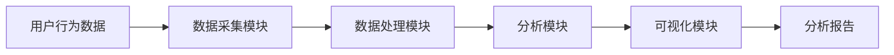

                 


# 彼得林奇如何分析公司的用户粘性指标

> 关键词：彼得·林奇，用户粘性，用户留存率，净推荐值，用户行为分析，企业投资分析

> 摘要：本文深入探讨了彼得·林奇如何分析公司的用户粘性指标，从用户粘性的定义、核心概念、驱动因素、算法原理、系统架构设计、项目实战案例到总结与展望，全面解析了用户粘性指标在企业投资分析中的重要性及实际应用。通过彼得·林奇的经典投资理念和实际案例分析，本文为产品经理、市场营销人员和投资者提供了实用的分析方法和工具。

---

## 第一部分: 用户粘性指标的背景与重要性

### 第1章: 用户粘性指标的背景与重要性

#### 1.1 用户粘性指标的定义与核心概念

##### 1.1.1 用户粘性的定义
用户粘性是指用户对某个产品、服务或品牌形成持续使用或消费习惯的程度。它是衡量用户对产品或服务依赖性的重要指标，通常通过用户留存率、复购率、净推荐值（NPS）等指标进行量化。

##### 1.1.2 用户粘性指标的核心要素
- **用户留存率**：用户在某一时间段内继续使用产品或服务的比例。
- **复购率**：用户在一定时间内重复购买产品或服务的比例。
- **净推荐值（NPS）**：用户推荐产品或服务给他人的好感程度。
- **用户生命周期价值（CLV）**：用户在生命周期内为公司带来的总收入。

##### 1.1.3 用户粘性与用户满意度的区别
用户粘性强调用户的行为依赖性，而用户满意度关注用户的主观感受。用户粘性是用户满意度的结果，但用户满意度高并不一定意味着用户粘性高。

##### 1.1.4 用户粘性在企业中的战略意义
用户粘性是企业核心竞争力的重要体现，直接影响企业的市场份额、客户忠诚度和长期盈利能力。高用户粘性意味着企业具有更强的抗风险能力和市场竞争力。

#### 1.2 彼得·林奇与用户粘性分析

##### 1.2.1 彼得·林奇的投资理念
彼得·林奇是美国著名投资家，以其在富达投资集团管理麦哲伦基金的卓越表现而闻名。他认为，企业的长期成功取决于其产品的市场地位、用户粘性和盈利能力。

##### 1.2.2 用户粘性在投资分析中的应用
彼得·林奇在其投资分析中，非常注重企业的用户粘性。他认为，用户粘性高的企业往往具有更强的市场定价能力和竞争优势。

##### 1.2.3 彼得·林奇的经典案例分析
以可口可乐公司为例，彼得·林奇认为可口可乐的用户粘性极高，消费者对其品牌和产品的依赖性强，从而为企业带来了稳定的市场份额和长期的盈利能力。

---

### 第2章: 用户粘性指标的核心概念与联系

#### 2.1 核心概念原理

##### 2.1.1 用户粘性的驱动因素
- **产品价值**：产品的核心功能和用户体验直接影响用户的使用频率和满意度。
- **服务质量**：优质的售后服务和客户支持可以提升用户的信任感和忠诚度。
- **替代品竞争**：市场上是否存在替代品以及替代品的竞争力强弱。
- **用户习惯**：用户对产品的使用习惯和依赖程度。

##### 2.1.2 用户粘性与企业生命周期的关系
用户粘性在企业生命周期的不同阶段表现不同。在初创期，企业需要通过提升产品价值和服务质量来建立用户粘性；在成熟期，用户粘性是企业维持市场份额和盈利能力的关键。

##### 2.1.3 用户粘性与企业竞争力的关联
高用户粘性意味着企业在市场竞争中具有更强的定价权和品牌影响力，能够更好地抵御竞争对手的冲击。

#### 2.2 概念属性特征对比表格
以下是用户粘性与其他相关概念的对比：

| 概念 | 属性 | 特征 |
|------|------|------|
| 用户粘性 | 定义 | 用户对产品或服务的依赖程度 |
|        | 度量 | 通过留存率、复购率等指标衡量 |
|        | 影响因素 | 产品价值、用户体验、替代品竞争 |
| 用户满意度 | 定义 | 用户对产品或服务的主观满意程度 |
|        | 度量 | 通过调查问卷、评分系统衡量 |
|        | 影响因素 | 用户期望、产品性能、服务质量 |

#### 2.3 ER实体关系图
以下是用户粘性分析的ER实体关系图：

```mermaid
erd
    customer(CustomerID, Name, Email, Phone, Address)
    product(ProductID, ProductName, Category, Price, Description)
    order(OrderID, OrderDate, TotalAmount, Status)
    customer_order(CustomerID, OrderID, Quantity, PurchaseDate)
```

---

### 第3章: 用户粘性指标的算法原理

#### 3.1 算法原理

用户粘性可以通过多种指标进行量化，其中最常见的包括用户留存率和净推荐值（NPS）。以下是这些指标的计算公式和应用方法。

##### 3.1.1 用户留存率
用户留存率是衡量用户粘性的重要指标，计算公式如下：

$$ \text{留存率} = \frac{\text{某段时间内仍活跃的用户数}}{\text{初始用户总数}} $$

##### 3.1.2 净推荐值（NPS）
净推荐值是通过用户调查问卷获得，计算公式如下：

$$ \text{NPS} = \text{（推荐者比例）} - \text{（贬损者比例）} $$

##### 3.1.3 用户生命周期价值（CLV）
用户生命周期价值是预测用户在生命周期内为企业带来的总收入，计算公式如下：

$$ \text{CLV} = \text{平均收入} \times \text{用户生命周期长度} - \text{获取成本} $$

#### 3.2 算法流程图
以下是用户粘性分析的算法流程图：



#### 3.3 代码实现

以下是计算用户留存率的Python代码示例：

```python
import pandas as pd

def calculate_retention_rate(users, start_date, end_date):
    # 滤出时间段内的用户数据
    active_users = users[(users['date'] >= start_date) & (users['date'] <= end_date)]
    # 计算留存率
    retention_rate = len(active_users) / len(users)
    return retention_rate

# 示例数据
data = {
    'user_id': [1, 2, 3, 4, 5],
    'date': ['2023-01-01', '2023-01-02', '2023-01-03', '2023-01-04', '2023-01-05']
}
users = pd.DataFrame(data)
print(calculate_retention_rate(users, '2023-01-03', '2023-01-05'))  # 输出：1.0
```

---

### 第4章: 用户粘性分析的系统架构设计

#### 4.1 系统功能设计

##### 4.1.1 系统功能模块
- **数据采集模块**：负责收集用户行为数据、交易数据等。
- **数据处理模块**：对数据进行清洗、转换和预处理。
- **分析模块**：计算用户留存率、净推荐值等指标，并生成分析报告。
- **可视化模块**：将分析结果以图表形式展示，便于用户理解和决策。

##### 4.1.2 系统架构设计

以下是用户粘性分析系统的架构设计图：



---

### 第5章: 项目实战分析

#### 5.1 项目背景与需求分析

##### 5.1.1 项目背景
假设我们是一家互联网公司，主要提供在线教育服务。我们需要分析用户粘性，以优化产品和服务，提高用户留存率和复购率。

##### 5.1.2 项目需求
- 计算用户留存率。
- 分析用户行为数据，找出用户流失的原因。
- 提出优化产品和服务的具体建议。

#### 5.2 系统核心实现

##### 5.2.1 环境安装
- **Python**：安装Python 3.8及以上版本。
- **数据处理库**：安装`pandas`、`numpy`等库。
- **可视化库**：安装`matplotlib`或`seaborn`。

##### 5.2.2 核心代码实现
以下是用户留存率计算的代码示例：

```python
import pandas as pd

# 示例数据
data = {
    'user_id': [1, 2, 3, 4, 5],
    'signup_date': pd.date_range('2023-01-01', periods=5),
    'last_login_date': pd.date_range('2023-01-03', periods=5)
}
df = pd.DataFrame(data)

# 计算用户留存率
def calculate_retention_rate(df, date_col, target_col):
    df['retained'] = df[date_col].notna() & (df[target_col] >= df[date_col])
    retention_rate = df['retained'].mean()
    return retention_rate

retention_rate = calculate_retention_rate(df, 'signup_date', 'last_login_date')
print(f"用户留存率为：{retention_rate:.2f}")
```

#### 5.3 案例分析与结果解读

##### 5.3.1 案例分析
以某在线教育平台为例，计算用户的留存率和净推荐值（NPS）。通过分析用户行为数据，找出用户流失的主要原因，并提出优化建议。

##### 5.3.2 结果解读
- **留存率低**：可能是因为产品功能不够完善或用户体验不佳。
- **NPS低**：可能是因为用户对产品或服务的满意度不高。

---

### 第6章: 总结与展望

#### 6.1 最佳实践 tips

- **持续监测**：定期监测用户粘性指标，及时发现并解决问题。
- **用户反馈**：通过用户调查问卷和反馈收集用户意见，优化产品和服务。
- **数据分析**：利用数据分析工具和技术，深入挖掘用户行为数据，找出潜在问题。

#### 6.2 小结
用户粘性是企业核心竞争力的重要体现，通过彼得·林奇的分析方法和实际案例分析，我们可以更好地理解和应用用户粘性指标，从而提升企业的市场竞争力和长期盈利能力。

#### 6.3 注意事项

- **数据质量**：确保数据的准确性和完整性，避免因数据问题导致分析结果偏差。
- **用户隐私**：在数据采集和分析过程中，严格遵守用户隐私保护的相关法律法规。

#### 6.4 拓展阅读

- **《彼得·林奇的成功投资法则》**：深入学习彼得·林奇的投资理念和方法。
- **《用户粘性：如何打造让用户离不开你的产品》**：进一步了解用户粘性的具体应用和优化方法。

---

# 作者：AI天才研究院/AI Genius Institute & 禅与计算机程序设计艺术 /Zen And The Art of Computer Programming

