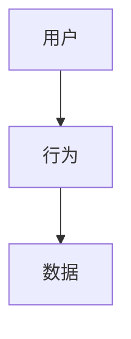
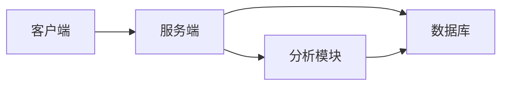
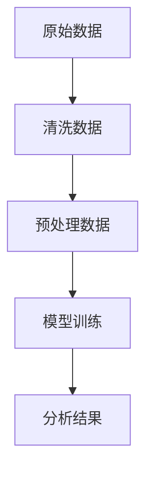
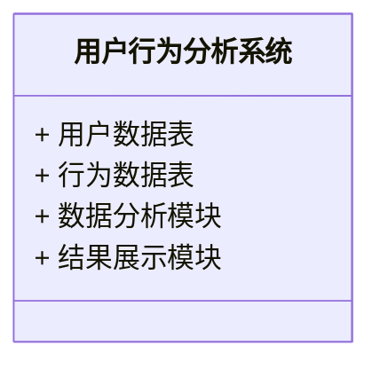

                 


# 彼得林奇如何分析公司的用户行为数据价值

> 关键词：用户行为数据价值，数据分析，数据挖掘，算法原理，系统架构设计，项目实战

> 摘要：本文将深入探讨如何分析公司的用户行为数据价值。通过彼得林奇的视角，结合技术与商业的双重维度，系统地分析用户行为数据的核心价值，详细讲解数据分析的方法与算法原理，设计合理的系统架构，并通过实际项目案例展示数据分析的具体实现过程，最后总结最佳实践和注意事项。

---

## 第一章：用户行为数据价值的背景与概念

### 1.1 问题背景与数据定义

#### 1.1.1 用户行为数据的定义与分类

用户行为数据是指用户在使用产品或服务时产生的所有数据，包括用户的操作记录、时间戳、设备信息等。这些数据可以分为以下几类：

- **操作数据**：如点击、注册、登录等具体操作。
- **属性数据**：如用户ID、性别、年龄等用户属性。
- **场景数据**：如用户所在的位置、时间等场景信息。

#### 1.1.2 数据价值的背景与意义

在数字化时代，用户行为数据是企业的重要资产。通过分析这些数据，企业可以了解用户需求、优化产品体验、提升营销策略等。例如，通过分析用户的点击流数据，企业可以发现用户在使用产品时的痛点，从而改进产品设计。

#### 1.1.3 数据分析的目标与边界

数据分析的目标是挖掘数据中的潜在价值，帮助企业在市场竞争中占据优势。具体目标包括：

1. **用户画像构建**：通过分析用户的行为数据，构建精准的用户画像。
2. **行为模式识别**：识别用户的行为模式，预测用户行为趋势。
3. **决策支持**：为企业的市场、产品、运营等决策提供支持。

需要注意的是，数据分析的边界应尊重用户隐私，避免过度收集和滥用数据。

---

### 1.2 问题描述与解决思路

#### 1.2.1 用户行为分析的核心问题

用户行为分析的核心问题在于如何从海量数据中提取有价值的信息。具体问题包括：

- 如何清洗和预处理数据？
- 如何选择和构建有效的特征？
- 如何选择合适的数据挖掘算法？

#### 1.2.2 数据价值挖掘的关键点

数据价值的挖掘需要关注以下几个关键点：

1. **数据的完整性**：确保数据的完整性和准确性。
2. **特征的可解释性**：选择具有可解释性的特征，以便更好地理解数据背后的意义。
3. **算法的适用性**：选择适合数据特点的算法，并进行参数调优。

#### 1.2.3 问题解决的思路与方法

解决问题的思路可以分为以下几个步骤：

1. **数据清洗与预处理**：去除噪声数据，处理缺失值。
2. **特征工程**：提取有用的特征，构建特征向量。
3. **模型训练与优化**：选择合适的算法，进行模型训练和优化。
4. **结果分析与应用**：分析模型结果，应用于实际业务场景。

---

## 第二章：用户行为数据价值的核心概念

### 2.1 核心概念与属性特征

#### 2.1.1 数据特征的属性分析

用户行为数据的特征可以从以下几个维度进行分析：

- **时间序列性**：用户行为往往具有时间依赖性。
- **类别多样性**：用户行为涉及多种类别，如点击、注册等。
- **关联性**：不同行为之间可能存在关联关系。

#### 2.1.2 行为模式的特征对比

通过对比不同行为的特征，可以更好地理解用户行为模式。例如：

- **活跃用户**：高频率、多样化的行为。
- **沉睡用户**：低频率、单一化的行为。

#### 2.1.3 数据价值的评估维度

数据价值的评估可以从以下几个维度进行：

- **用户留存率**：用户行为是否能带来更高的留存。
- **用户转化率**：用户行为是否能带来更高的转化。
- **用户满意度**：用户行为是否能提升用户的满意度。

---

### 2.2 实体关系与架构设计

#### 2.2.1 ER实体关系图

以下是用户行为数据的ER实体关系图：



#### 2.2.2 系统架构设计

以下是用户行为分析系统的架构设计图：



---

## 第三章：用户行为数据分析的核心算法

### 3.1 算法原理与流程

#### 3.1.1 数据预处理流程

以下是数据预处理的流程图：



#### 3.1.2 特征工程方法

以下是特征工程的示例代码：

```python
# 示例代码：特征选择与处理
def feature_engineering(data):
    # 数据清洗
    data = data.dropna()
    # 标准化处理
    from sklearn.preprocessing import StandardScaler
    scaler = StandardScaler()
    data_scaled = scaler.fit_transform(data)
    return data_scaled
```

---

## 第四章：用户行为数据价值的系统分析与架构设计

### 4.1 系统功能设计

以下是用户行为分析系统的功能模块设计：



### 4.2 系统架构设计

以下是用户行为分析系统的架构设计图：


---

## 第五章：用户行为数据分析的项目实战

### 5.1 环境配置与数据准备

以下是项目实战的环境配置：

- **工具安装**：安装Python、Pandas、Scikit-learn等工具。
- **数据准备**：收集用户行为数据，清洗数据。

### 5.2 系统核心实现

以下是核心代码实现：

```python
# 示例代码：用户行为分析实现
import pandas as pd
from sklearn.tree import DecisionTreeClassifier

# 加载数据
data = pd.read_csv('user_behavior.csv')

# 特征工程
features = data[['user_id', 'time_stamp', 'action_type']]
labels = data['is_churn']

# 模型训练
model = DecisionTreeClassifier()
model.fit(features, labels)

# 预测结果
predictions = model.predict(features)
```

---

## 第六章：总结与最佳实践

### 6.1 小结

通过本文的分析，我们可以看到用户行为数据价值的核心在于如何有效地提取和利用数据中的信息。从数据预处理到特征工程，再到模型训练，每一步都需要精心设计和优化。

### 6.2 注意事项

- 数据分析需要结合业务场景，避免过于技术化。
- 数据隐私保护是重中之重，必须遵守相关法律法规。
- 模型的可解释性也很重要，便于业务人员理解和应用。

### 6.3 拓展阅读

- 推荐阅读《数据挖掘导论》（Introduction to Data Mining）。
- 参加数据分析相关的在线课程和社区活动。

---

## 作者信息

作者：AI天才研究院/AI Genius Institute & 禅与计算机程序设计艺术/Zen And The Art of Computer Programming

---

通过本文的详细分析，我们不仅了解了用户行为数据价值的核心概念，还通过实际案例展示了如何利用数据分析技术提取数据中的潜在价值。希望本文能为读者在用户行为数据分析领域提供有价值的参考和指导。

