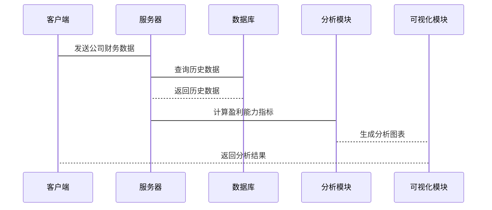

                 


# 彼得林奇如何分析公司的盈利能力

## 关键词：彼得·林奇, 盈利能力分析, 股东权益回报率, 投资分析, 财务指标

## 摘要：本文将详细探讨彼得·林奇分析公司盈利能力的核心方法，从基本概念到具体指标的计算，再到实际案例的分析，系统地解析盈利能力分析的关键步骤和实际应用。通过本文，读者将能够掌握如何运用盈利能力分析来评估公司的投资价值。

---

## 第1章: 投资基础与盈利能力分析概述

### 1.1 投资的基本概念与重要性

#### 1.1.1 投资的定义与分类
投资是指将资金投入某个项目或企业，以期获得未来收益的行为。根据投资对象的不同，可以分为股票投资、债券投资、房地产投资等多种形式。在股票投资中，盈利能力分析是评估公司价值的核心指标。

#### 1.1.2 投资的重要性与风险
投资能够为个人或机构创造财富，但同时也伴随着风险。市场的波动、公司的经营状况以及宏观经济的变化都可能影响投资的收益。因此，科学的投资分析方法是降低风险、提高收益的关键。

#### 1.1.3 投资与财务分析的关系
财务分析是投资决策的重要依据，通过对公司的财务报表进行分析，可以评估公司的财务健康状况、盈利能力以及未来发展潜力。彼得·林奇正是通过深入分析公司的财务数据，挖掘出具有长期投资价值的企业。

---

### 1.2 盈利能力分析的核心地位

#### 1.2.1 盈利能力分析的定义
盈利能力分析是通过对公司财务报表中的收入和利润进行分析，评估公司在一定时期内的赚钱能力。它是衡量公司经营效率和财务健康的重要指标。

#### 1.2.2 盈利能力分析在投资中的作用
盈利能力分析能够帮助投资者判断公司的盈利质量、盈利能力和未来增长潜力。通过分析公司的净利润、毛利率、资产回报率等指标，投资者可以更好地评估公司的投资价值。

#### 1.2.3 彼得·林奇的分析方法简介
彼得·林奇是美国著名的投资经理人，他通过长期的市场观察和实践，总结出一套独特的盈利能力分析方法。他强调通过分析公司的财务数据，尤其是盈利能力指标，来判断公司的投资价值。

---

## 第2章: 彼得·林奇的分析方法与核心理念

### 2.1 彼得·林奇的分析框架

#### 2.1.1 林奇的三步分析法
1. **第一步：筛选公司**  
   林奇通过筛选财务报表中的关键指标，如ROE（股东权益回报率）、ROA（资产回报率）等，来筛选出盈利能力强的公司。
   
2. **第二步：深入分析**  
   对筛选出的公司进行进一步分析，包括对公司的收入、利润、成本等指标进行详细计算和对比。

3. **第三步：长期观察**  
   林奇注重长期观察，通过持续跟踪公司的财务数据，评估公司的盈利能力是否具有持续性。

#### 2.1.2 林奇的“过滤器”法则
林奇提出，通过设置一系列财务指标的筛选条件，可以将大部分表现不佳的公司过滤掉，从而缩小投资范围。

#### 2.1.3 林奇的长期投资理念
林奇主张长期持有优质股票，他认为短期市场波动不会影响公司的长期价值。通过长期持有优质公司的股票，投资者可以实现财富的稳定增长。

---

### 2.2 林奇分析的核心指标

#### 2.2.1 净利润与净利润率
净利润是公司营业收入减去各项成本和费用后的最终利润，净利润率是净利润与营业收入的比率，用于衡量公司每单位收入的盈利能力。

#### 2.2.2 营业收入与毛利率
营业收入是公司销售商品或提供服务所获得的收入，毛利率是毛利润与营业收入的比率，用于衡量公司的定价策略和成本控制能力。

#### 2.2.3 资产回报率（ROA）与股东权益回报率（ROE）
资产回报率是净利润与平均资产总额的比率，用于衡量公司每单位资产的盈利能力。股东权益回报率是净利润与平均股东权益的比率，用于衡量公司对股东资金的利用效率。

---

## 第3章: 盈利能力分析的关键指标与计算方法

### 3.1 盈利能力的核心指标

#### 3.1.1 净利润（Net Income）
$$\text{净利润} = \text{营业收入} - \text{营业成本} - \text{各项费用} - \text{税费}$$

#### 3.1.2 毛利润（Gross Profit）
$$\text{毛利润} = \text{营业收入} - \text{营业成本}$$

#### 3.1.3 营业利润（Operating Income）
$$\text{营业利润} = \text{毛利润} - \text{销售费用} - \text{管理费用} - \text{研发费用}$$

#### 3.1.4 股东权益回报率（ROE）
$$\text{ROE} = \frac{\text{净利润}}{\text{平均股东权益}}$$

#### 3.1.5 资产回报率（ROA）
$$\text{ROA} = \frac{\text{净利润}}{\text{平均资产总额}}$$

---

### 3.2 盈利能力指标的对比与选择

#### 3.2.1 不同盈利能力指标的对比
| 指标名称       | 计算公式                          | 主要用途                     |
|----------------|-----------------------------------|----------------------------|
| 净利润         | $$\text{营业收入} - \text{成本} - \text{费用} - \text{税费}$$ | 衡量公司整体盈利能力           |
| 毛利润         | $$\text{营业收入} - \text{营业成本}$$ | 衡量公司产品或服务的盈利能力   |
| 营业利润       | $$\text{毛利润} - \text{销售费用} - \text{管理费用} - \text{研发费用}$$ | 衡量公司核心业务的盈利能力     |
| 股东权益回报率 | $$\frac{\text{净利润}}{\text{平均股东权益}}$$ | 衡量公司对股东资金的利用效率   |

#### 3.2.2 选择合适的盈利能力指标
不同的盈利能力指标适用于不同的分析场景。例如，ROE适用于评估公司的资本使用效率，而ROA适用于评估公司的资产使用效率。

---

## 第4章: 系统分析与架构设计方案

### 4.1 系统分析与架构设计方案

#### 4.1.1 系统功能设计（领域模型Mermaid类图）


#### 4.1.2 系统架构设计（Mermaid架构图）


#### 4.1.3 系统接口设计（Mermaid序列图）


---

## 第5章: 项目实战

### 5.1 环境安装与依赖管理

#### 5.1.1 安装Python环境
```bash
pip install python
pip install pandas numpy matplotlib
```

#### 5.1.2 数据获取与处理
```python
import pandas as pd

# 假设财务数据存储在Excel文件中
df = pd.read_excel('company_financials.xlsx')
```

### 5.2 核心实现与代码分析

#### 5.2.1 计算ROE
```python
net_income = df['净利润'].values[0]
股东权益 = df['股东权益'].values[0]

roe = net_income / 股东权益
print(f"ROE: {roe:.2f}%")
```

#### 5.2.2 可视化分析
```python
import matplotlib.pyplot as plt

plt.plot(df['年份'], df['ROE'], label='ROE')
plt.xlabel('年份')
plt.ylabel('ROE (%)')
plt.legend()
plt.show()
```

### 5.3 实际案例分析

#### 5.3.1 案例背景
以某公司过去五年的财务数据为例，分析其ROE的趋势。

#### 5.3.2 数据分析
```python
# 假设df包含过去五年的ROE数据
print(df[['年份', 'ROE']])
```

#### 5.3.3 分析结论
通过分析发现，该公司的ROE在过去五年中呈现稳步上升的趋势，表明公司的盈利能力在不断增强。

---

## 第6章: 最佳实践与小结

### 6.1 小结
通过本文的分析，读者可以掌握彼得·林奇的盈利能力分析方法，并能够将其应用于实际的投资分析中。

### 6.2 注意事项
- 投资有风险，分析需谨慎。
- 盈利能力分析只是投资决策的一部分，还需要结合其他因素进行综合判断。

### 6.3 拓展阅读
- 《彼得·林奇的投资心理书》
- 《财务报表分析》

---

## 作者：AI天才研究院/AI Genius Institute & 禅与计算机程序设计艺术 /Zen And The Art of Computer Programming

