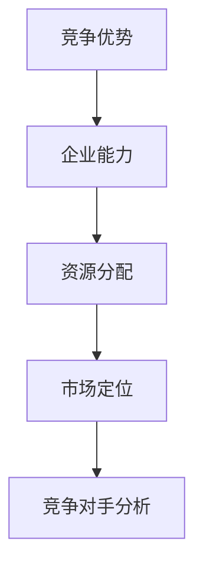
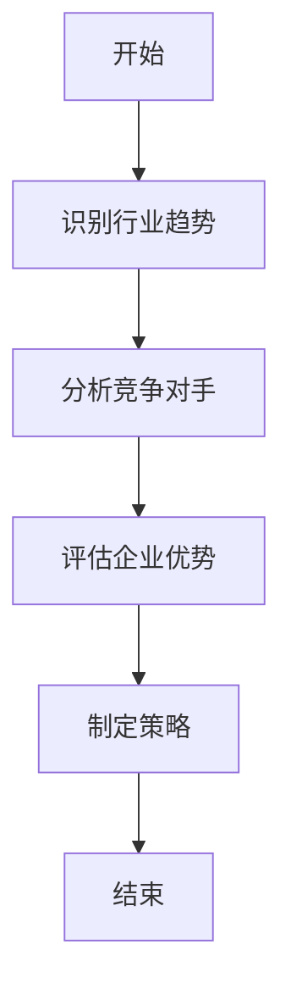
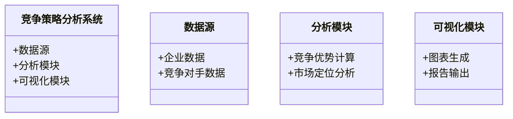
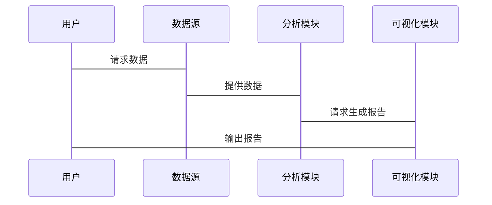

                 


# 彼得林奇如何分析公司的竞争策略

## 关键词：
- 彼得·林奇
- 竞争策略
- 投资分析
- 股票市场
- 企业战略

## 摘要：
彼得·林奇是全球著名投资专家，以其独特的竞争策略分析方法闻名。本文深入探讨了彼得·林奇的竞争策略分析框架，包括其核心概念、算法原理、系统设计以及实际案例分析，帮助读者掌握如何从竞争策略角度进行企业分析。

---

# 第1章: 竞争策略的基本概念

## 1.1 竞争策略的定义与背景

### 1.1.1 竞争策略的核心概念
竞争策略是企业在市场中为获得竞争优势而采取的一系列行动和决策。彼得·林奇认为，竞争策略的核心在于识别和利用企业的独特优势。

### 1.1.2 竞争策略的演进历程
从早期的低成本策略到差异化策略，竞争策略经历了多次演变。彼得·林奇的方法强调对企业内部资源和外部市场的深入分析。

### 1.1.3 彼得·林奇与竞争策略的关系
彼得·林奇通过分析企业竞争策略，识别出那些具有持续竞争优势的企业，从而做出明智的投资决策。

---

## 1.2 彼得·林奇的竞争策略分析框架

### 1.2.1 析构竞争策略的关键要素
竞争策略的关键要素包括市场份额、竞争优势、资源分配和市场定位。彼得·林奇强调这些要素的相互作用。

### 1.2.2 析构竞争策略的逻辑框架
彼得·林奇的竞争策略分析框架包括行业趋势分析、竞争对手分析和企业优势评估。

### 1.2.3 竞争策略的边界与外延
竞争策略的边界在于企业的独特优势，外延则涉及企业文化和市场环境。

---

## 1.3 竞争策略的核心要素对比

### 1.3.1 核心概念原理分析
通过对比SWOT和波特五力模型，分析不同战略工具的优缺点。

### 1.3.2 核心概念属性特征对比表格
| 战略工具 | 定义 | 优缺点 | 适用场景 |
|----------|------|--------|----------|
| SWOT     | 分析优势、劣势、机会与威胁 | 全面但复杂 | 初期战略规划 |
| 波特五力 | 分析行业竞争结构 | 简单直接 | 行业分析 |

### 1.3.3 ER实体关系图


---

# 第2章: 彼得·林奇的竞争策略分析方法

## 2.1 竞争策略分析的逻辑流程

### 2.1.1 逻辑流程


---

## 2.2 竞争策略分析的数学模型

### 2.2.1 竞争优势指数计算
$$ \text{竞争优势指数} = \frac{\text{企业市场份额}}{\text{行业平均市场份额}} $$

### 2.2.2 市场定位模型
$$ \text{市场定位} = f(\text{目标客户}, \text{竞争对手策略}, \text{企业资源}) $$

---

## 2.3 竞争策略分析的算法实现

### 2.3.1 Python代码实现
```python
def competitive_edge_analysis(enterprise, competitors):
    industry_avg = sum(enterprise.share + [c.share for c in competitors]) / (1 + len(competitors))
    edge_index = enterprise.share / industry_avg
    return edge_index
```

---

# 第3章: 系统分析与架构设计

## 3.1 竞争策略分析系统设计

### 3.1.1 功能需求
系统需要具备数据收集、分析和可视化功能。

### 3.1.2 系统架构图


---

## 3.2 系统接口设计

### 3.2.1 竞争优势指数接口
```python
def calculate_edge_index(enterprise_share, industry_avg):
    return enterprise_share / industry_avg
```

---

## 3.3 系统交互流程

### 3.3.1 交互流程图


---

# 第4章: 项目实战

## 4.1 环境安装

### 4.1.1 安装Python和相关库
```bash
pip install numpy pandas matplotlib
```

---

## 4.2 核心实现源代码

### 4.2.1 竞争优势指数计算
```python
import pandas as pd

def calculate_edge_index(enterprise_share, industry_avg):
    return enterprise_share / industry_avg

# 示例数据
data = {
    '企业': ['A', 'B', 'C'],
    '市场份额': [0.25, 0.15, 0.1],
    '行业平均': [0.2, 0.2, 0.2]
}

df = pd.DataFrame(data)

# 计算竞争优势指数
edge_indices = []
for i in range(len(df)):
    edge = calculate_edge_index(df.iloc[i]['市场份额'], df.iloc[i]['行业平均'])
    edge_indices.append(edge)

df['竞争优势指数'] = edge_indices
print(df)
```

---

## 4.3 实际案例分析

### 4.3.1 案例分析：亚马逊的竞争策略
分析亚马逊的市场定位、竞争对手（如沃尔玛、Target）以及其独特优势（如物流、Prime会员）。

---

## 4.4 代码应用解读与分析
通过代码实现竞争优势指数的计算，帮助读者理解如何量化企业竞争策略的优势。

---

## 4.5 项目小结
通过实战项目，读者可以掌握如何使用彼得·林奇的竞争策略分析方法，对企业进行深入分析。

---

# 第5章: 最佳实践与小结

## 5.1 最佳实践 tips

### 5.1.1 小结
彼得·林奇的竞争策略分析方法提供了一种系统化的分析框架，帮助投资者识别具有竞争优势的企业。

### 5.1.2 注意事项
分析时需结合定量和定性方法，关注企业的长期竞争优势。

### 5.1.3 拓展阅读
推荐阅读彼得·林奇的书籍《彼得·林奇的投资策略》和迈克尔·波特的《竞争优势》。

---

# 作者：AI天才研究院/AI Genius Institute & 禅与计算机程序设计艺术 /Zen And The Art of Computer Programming

