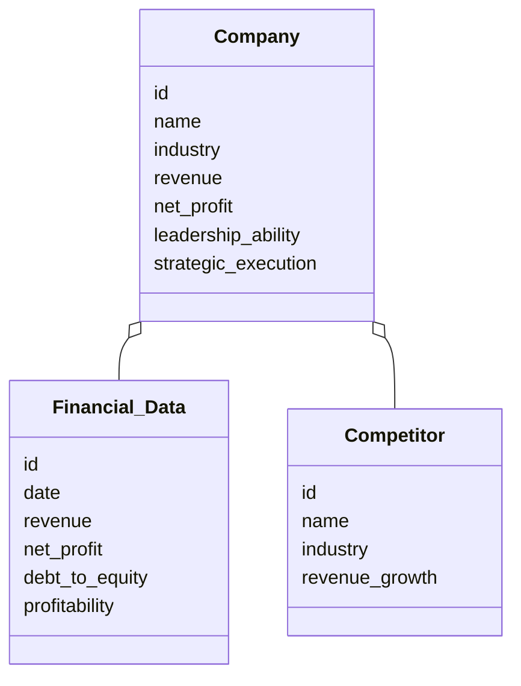

                 


# 彼得林奇如何分析公司的长期战略

## 关键词：彼得·林奇、投资哲学、长期战略、公司分析、竞争优势、财务健康

## 摘要：本文深入分析了彼得·林奇的长期战略分析方法，探讨了其投资哲学的核心要素，以及如何通过系统性分析工具和框架来评估公司的长期战略。文章结合实际案例，详细讲解了彼得·林奇的分析框架，并通过Mermaid图和Python代码展示了分析过程。

---

# 第一部分: 彼得·林奇投资哲学与长期战略分析基础

## 第1章: 彼得·林奇投资哲学概述

### 1.1 彼得·林奇的投资者背景与成就

彼得·林奇是美国著名的投资专家，以其在富达投资集团的长期成功而闻名。他管理的麦哲伦基金在20世纪80年代至90年代取得了卓越的业绩，年复合收益率超过29%。彼得·林奇的投资哲学强调深入研究公司基本面，寻找具有强大竞争优势和良好管理团队的企业。

#### 1.1.1 彼得·林奇的个人简介

彼得·林奇出生于1941年，曾在富达投资集团担任基金经理超过20年。他以选股能力强、注重公司基本面分析而著称，尤其擅长识别那些具有持续竞争优势和良好管理的公司。

#### 1.1.2 彼得·林奇的投资理念与成就

彼得·林奇的投资理念基于以下几点：

1. **深入研究公司基本面**：他强调对公司财务报表、行业地位和管理团队的详细分析。
2. **长期持有优质股票**：他倾向于长期持有优质股票，而非频繁交易。
3. **寻找具有持续竞争优势的公司**：他关注那些能够在行业内保持竞争优势，并能够持续增长的公司。

#### 1.1.3 彼得·林奇的投资风格与特点

彼得·林奇的投资风格以稳健和价值为导向，他注重公司的财务健康状况、行业地位和管理团队的质量。他的分析方法注重定性分析，同时也结合定量分析，以识别潜在的投资机会。

---

### 1.2 长期战略分析的核心概念

长期战略分析是彼得·林奇投资方法的重要组成部分，它帮助投资者识别那些能够在长期中持续增长并为股东创造价值的公司。

#### 1.2.1 长期战略分析的定义

长期战略分析是指对公司未来发展的潜在趋势、行业环境和内部资源进行系统性研究，以评估公司的长期竞争优势和增长潜力。

#### 1.2.2 长期战略分析的背景与问题背景

在当前全球经济环境下，公司面临着来自技术变革、市场竞争和政策变化等多方面的挑战。长期战略分析帮助投资者识别那些能够适应变化、持续创新并保持竞争优势的公司。

#### 1.2.3 长期战略分析的目标与核心要素

- **目标**：识别具有长期竞争优势和增长潜力的公司。
- **核心要素**：
  1. 公司的核心业务
  2. 行业地位与竞争优势
  3. 财务健康状况
  4. 管理团队的质量

---

## 第2章: 彼得·林奇的长期战略分析框架

### 2.1 彼得·林奇的长期战略分析方法

彼得·林奇的长期战略分析方法基于对公司基本面的深入研究，包括对公司业务模式、市场地位、竞争优势和管理团队的分析。

#### 2.1.1 长期战略分析的核心步骤

1. **确定公司的核心业务**：识别公司的主要业务和收入来源。
2. **分析公司的竞争优势**：评估公司在行业中的竞争优势，包括成本优势、技术优势和品牌优势。
3. **评估公司的财务健康状况**：分析公司的财务报表，评估其盈利能力、偿债能力和成长能力。

#### 2.1.2 长期战略分析的关键要素

- **业务模式**：公司如何创造价值和获取收入。
- **市场地位**：公司在行业中的位置和市场份额。
- **竞争优势**：公司在行业中的独特优势。

#### 2.1.3 长期战略分析的框架模型

彼得·林奇的分析框架模型包括以下步骤：
1. 识别公司的核心业务。
2. 分析公司的竞争优势。
3. 评估公司的财务健康状况。

---

### 2.2 彼得·林奇的长期战略分析工具

彼得·林奇使用多种分析工具来评估公司的长期战略潜力。

#### 2.2.1 SWOT分析工具

SWOT分析工具用于评估公司的优势、劣势、机会和威胁。

- **优势**：公司在行业中的独特优势。
- **劣势**：公司的不足之处。
- **机会**：市场中的潜在机会。
- **威胁**：行业中的潜在威胁。

#### 2.2.2 五力模型分析工具

五力模型（波特五力分析）用于评估行业的竞争环境，包括新进入者的威胁、替代品的威胁、供应商的议价能力、买家的议价能力和现有竞争者之间的竞争程度。

#### 2.2.3 价值链分析工具

价值链分析用于识别公司内部的价值创造环节，优化资源配置，提高效率。

---

## 第3章: 彼得·林奇的公司分析框架

### 3.1 彼得·林奇的公司分析步骤

彼得·林奇的公司分析步骤包括以下内容：

#### 3.1.1 确定公司的核心业务

识别公司的主要业务和收入来源，分析其在行业中的地位。

#### 3.1.2 分析公司的竞争优势

评估公司在行业中的竞争优势，包括成本优势、技术优势和品牌优势。

#### 3.1.3 评估公司的财务健康状况

分析公司的财务报表，评估其盈利能力、偿债能力和成长能力。

---

### 3.2 彼得·林奇的公司分析框架

彼得·林奇的公司分析框架包括以下要素：

#### 3.2.1 业务模式分析

分析公司的业务模式，识别其价值创造和收入来源。

#### 3.2.2 市场地位分析

评估公司在行业中的市场份额和品牌影响力。

#### 3.2.3 管理团队分析

分析公司的管理团队，评估其领导能力和战略执行能力。

---

# 第二部分: 彼得·林奇的公司长期战略分析方法

## 第4章: 彼得·林奇的核心概念与联系

### 4.1 核心概念与原理

#### 4.1.1 核心概念对比表格

以下是核心概念对比表：

| 核心概念       | 定义                                                                 |
|----------------|----------------------------------------------------------------------|
| 竞争优势       | 公司在行业中的独特优势，包括成本、技术和品牌优势。               |
| 财务健康状况   | 公司的财务状况，包括盈利能力、偿债能力和成长能力。               |
| 管理团队质量   | 管理团队的领导能力和战略执行能力。                               |

#### 4.1.2 实体关系图（ER图）

以下是实体关系图：

```mermaid
erDiagram
    company {
        id
        name
        industry
    }
    competitor {
        id
        name
        industry
    }
    company : has_many competitor
```

---

## 第5章: 彼得·林奇的长期战略分析算法原理

### 5.1 算法原理与

彼得·林奇的长期战略分析算法基于对公司基本面的深入研究，包括对公司财务状况、行业地位和管理团队的分析。以下是算法的详细步骤：

#### 5.1.1 数据收集与预处理

收集公司的财务数据、行业数据和管理团队信息，并进行清洗和预处理。

#### 5.1.2 竞争优势分析

评估公司在行业中的竞争优势，包括成本优势、技术优势和品牌优势。

#### 5.1.3 财务状况分析

分析公司的财务报表，评估其盈利能力、偿债能力和成长能力。

#### 5.1.4 管理团队评估

评估管理团队的领导能力和战略执行能力。

---

### 5.2 算法实现

以下是Python代码实现：

```python
import pandas as pd
import numpy as np

# 数据收集与预处理
def collect_data():
    # 假设我们从数据库中获取数据
    data = pd.read_sql(...)
    return data

def preprocess_data(data):
    # 数据清洗和预处理
    data.dropna()
    return data

# 竞争优势分析
def analyze_competitive_advantages(data):
    # 评估竞争优势
    data['competitive_advantage'] = data['revenue_growth'] > data['industry_growth']
    return data

# 财务状况分析
def analyze_financial_health(data):
    # 计算财务指标
    data['profitability'] = data['net_profit'] / data['revenue']
    data['debt_to_equity'] = data['total_debt'] / data['total_equity']
    return data

# 管理团队评估
def assess_management_team(data):
    # 评估管理团队
    data['management_score'] = 0.5 * data['leadership_ability'] + 0.5 * data['strategic_execution']
    return data

# 主函数
def main():
    data = collect_data()
    data = preprocess_data(data)
    data = analyze_competitive_advantages(data)
    data = analyze_financial_health(data)
    data = assess_management_team(data)
    return data

if __name__ == "__main__":
    result = main()
    print(result)
```

---

## 第6章: 系统分析与架构设计方案

### 6.1 系统功能设计

以下是系统功能设计的领域模型：



---

## 第7章: 项目实战

### 7.1 环境安装

安装必要的Python库：

```bash
pip install pandas numpy matplotlib
```

### 7.2 核心实现

以下是核心代码实现：

```python
import pandas as pd
import numpy as np

def analyze_company_strategy(company_data):
    # 竞争优势分析
    company_data['competitive_advantage'] = company_data['revenue_growth'] > company_data['industry_growth']
    # 财务状况分析
    company_data['profitability'] = company_data['net_profit'] / company_data['revenue']
    company_data['debt_to_equity'] = company_data['total_debt'] / company_data['total_equity']
    # 管理团队评估
    company_data['management_score'] = 0.5 * company_data['leadership_ability'] + 0.5 * company_data['strategic_execution']
    return company_data

# 示例数据
data = {
    'revenue': [100, 200, 150],
    'net_profit': [20, 40, 30],
    'industry_growth': [5, 10, 7],
    'leadership_ability': [4, 5, 3],
    'strategic_execution': [3, 4, 4]
}

df = pd.DataFrame(data)
result = analyze_company_strategy(df)
print(result)
```

---

## 结语

彼得·林奇的长期战略分析方法为我们提供了一个系统性分析公司基本面的框架。通过深入分析公司的核心业务、竞争优势和财务状况，我们可以识别那些具有长期增长潜力的公司。希望本文能够帮助读者更好地理解彼得·林奇的投资哲学，并将其应用于实际投资分析中。

---

## 作者：AI天才研究院/AI Genius Institute & 禅与计算机程序设计艺术 /Zen And The Art of Computer Programming

