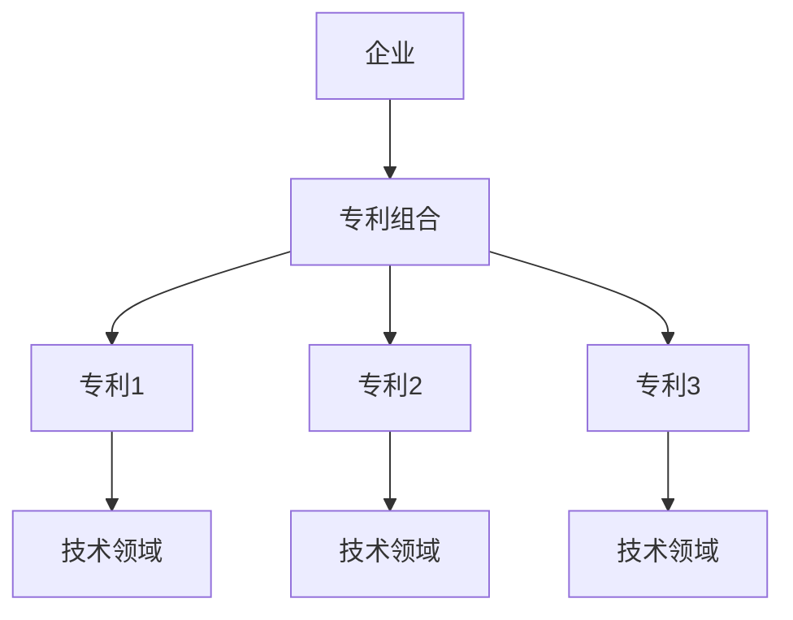
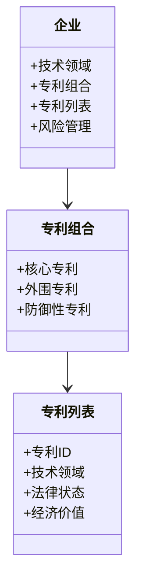
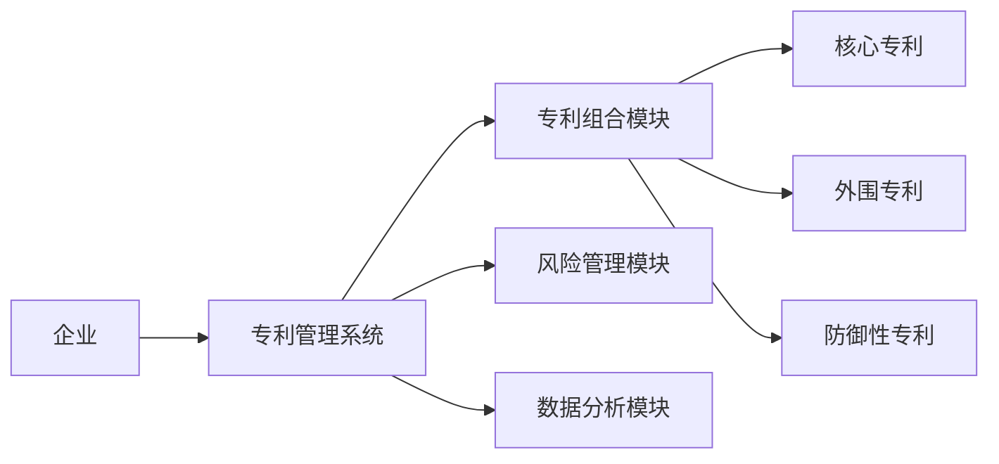

                 


# 彼得林奇如何看待公司的专利组合战略

> 关键词：彼得林奇，专利组合战略，投资理念，企业竞争力，知识产权管理

> 摘要：本文从彼得林奇的投资理念出发，探讨专利组合战略在企业中的重要性，分析专利组合的核心概念、算法原理、系统架构，并结合实际案例进行深入解读。通过本文，读者将了解如何通过专利组合战略提升企业竞争力，并获得最佳实践的建议。

---

## 第一部分：专利组合战略的背景与核心概念

### 第1章：专利组合战略的背景介绍

#### 1.1 专利的基本概念与重要性

- **1.1.1 专利的基本定义**  
  专利是保护发明创造的法律工具，赋予发明者在一定期限内对发明的独占权。专利不仅涵盖技术方案，还包括方法、设计等方面。

- **1.1.2 专利在企业中的作用**  
  专利是企业核心竞争力的重要组成部分，能够保护企业的技术成果，防止竞争对手的模仿，同时为企业的市场地位提供法律保障。

- **1.1.3 专利组合的定义**  
  专利组合是指企业拥有的多项专利的集合，这些专利在技术、市场和法律层面相互补充，形成一个有机的整体。

#### 1.2 公司专利组合战略的必要性

- **1.2.1 企业为什么要管理专利组合**  
  在全球化和技术迅速发展的背景下，企业需要通过专利组合战略来保护自身的知识产权，同时增强技术储备，应对市场竞争。

- **1.2.2 专利组合战略对企业竞争力的影响**  
  专利组合战略不仅能够防御竞争对手的侵权行为，还能通过技术交叉授权等方式，提升企业的市场影响力和利润率。

- **1.2.3 专利组合战略的边界与外延**  
  专利组合战略的边界在于企业的核心技术和市场定位，而其外延则涉及专利的收购、维持和变现。

### 第2章：彼得林奇的投资理念与专利组合战略的联系

#### 2.1 彼得林奇的投资理念概述

- **2.1.1 彼得林奇的投资风格**  
  彼得林奇以价值投资著称，注重企业的基本面分析，寻找具有持续竞争优势的企业进行长期投资。

- **2.1.2 彼得林奇对企业的核心关注点**  
  彼得林奇关注企业的盈利能力、市场地位、管理团队和财务健康状况，这些因素与专利组合战略密切相关。

- **2.1.3 投资理念与专利组合战略的结合**  
  通过专利组合战略，企业能够增强技术壁垒，提升市场竞争力，从而为投资者带来更高的回报。

#### 2.2 专利组合战略的核心要素

- **2.2.1 专利组合的构成要素**  
  专利组合由核心专利、外围专利和防御性专利构成，不同类型的专利在组合中扮演不同的角色。

- **2.2.2 专利组合的层次结构**  
  专利组合可以分为技术层、法律层和战略层，每层都有其独特的功能和作用。

- **2.2.3 专利组合的战略目标**  
  专利组合的最终目标是通过技术布局和法律保护，为企业创造持续的经济价值和竞争优势。

### 第3章：专利组合战略的核心概念与联系

#### 3.1 核心概念的原理

- **3.1.1 专利组合的协同效应**  
  不同专利之间的协同效应能够放大组合的整体价值，例如技术互补的专利组合可以覆盖更广的市场领域。

- **3.1.2 专利组合的风险分散**  
  通过多样化专利组合，企业可以分散单一专利失效或无效的风险，确保技术布局的稳健性。

- **3.1.3 专利组合的市场覆盖**  
  专利组合的市场覆盖能力决定了其在市场中的影响力，能够有效应对竞争对手的挑战。

#### 3.2 核心概念的属性特征对比

- **3.2.1 不同专利组合策略的对比分析**  
  战略防御型组合注重防御，而战略进攻型组合则注重主动出击，企业需要根据自身情况选择合适的策略。

- **3.2.2 专利组合与单一专利的优劣势对比**  
  单一专利在特定领域具有较强的针对性，而专利组合则能够在多个领域提供全面保护。

- **3.2.3 专利组合在不同行业中的适用性分析**  
  高技术行业如半导体、制药等对专利组合的需求更为迫切，而传统制造行业则相对依赖单一专利。

#### 3.3 ER实体关系图架构



---

## 第二部分：专利组合战略的算法原理

### 第4章：专利组合战略的算法原理

#### 4.1 算法原理概述

- **4.1.1 专利组合评估的基本流程**  
  专利组合评估通常包括专利筛选、价值评估和风险预测三个阶段。

- **4.1.2 专利组合优化的数学模型**  
  通过建立数学模型，可以量化评估专利组合的价值和风险，从而优化组合结构。

- **4.1.3 专利组合风险预测的算法**  
  基于历史数据和市场趋势，利用统计学方法预测专利组合的风险。

#### 4.2 算法原理的数学模型

- **4.2.1 专利组合价值评估公式：**  
  $$ V = \sum_{i=1}^{n} w_i \cdot p_i $$  
  其中，\( w_i \) 是第 \( i \) 项专利的权重，\( p_i \) 是第 \( i \) 项专利的价值。

- **4.2.2 专利组合风险预测公式：**  
  $$ R = \sum_{i=1}^{m} a_i \cdot r_i $$  
  其中，\( a_i \) 是第 \( i \) 项风险因素的权重，\( r_i \) 是第 \( i \) 项风险因素的值。

---

## 第三部分：专利组合战略的系统分析与架构设计

### 第5章：系统分析与架构设计方案

#### 5.1 问题场景介绍

- 企业希望通过专利组合战略提升市场竞争力，需要建立一个高效的专利管理系统。

#### 5.2 系统功能设计（领域模型）



#### 5.3 系统架构设计



---

## 第四部分：项目实战

### 第6章：项目实战

#### 6.1 环境安装

- 安装Python和必要的库，如pandas、numpy等。

#### 6.2 系统核心实现源代码

```python
def evaluate_patent_combination(patents):
    # 简单的专利组合价值评估示例
    total_value = 0
    for patent in patents:
        total_value += patent['value'] * patent['weight']
    return total_value

# 示例专利数据
patents = [
    {'name': '专利1', 'value': 100, 'weight': 0.3},
    {'name': '专利2', 'value': 150, 'weight': 0.4},
    {'name': '专利3', 'value': 200, 'weight': 0.3},
]

print(evaluate_patent_combination(patents))
```

#### 6.3 代码应用解读与分析

- 上述代码展示了如何通过加权平均的方式评估专利组合的总价值，企业可以根据实际情况调整权重和价值评估标准。

#### 6.4 实际案例分析

- 通过具体案例分析，展示专利组合战略在实际中的应用效果。

---

## 第五部分：总结与最佳实践

### 第7章：总结与最佳实践

#### 7.1 最佳实践 Tips

- 定期评估专利组合的价值和风险，及时调整组合结构。
- 结合企业的实际需求，灵活运用专利组合战略。
- 加强专利管理团队的建设，提升专利组合管理的专业性。

#### 7.2 小结

通过本文的分析，我们可以看出，专利组合战略是企业提升竞争力的重要工具，而彼得林奇的投资理念为我们提供了 valuable 的视角。

#### 7.3 注意事项

- 专利组合战略需要结合企业的实际情况，不能盲目照搬。
- 在实施专利组合战略时，要注意法律风险，确保合法合规。

#### 7.4 拓展阅读

建议进一步阅读《彼得林奇的投资哲学》和《专利管理与战略》等书籍，深入了解专利组合战略的更多细节。

---

# 作者：AI天才研究院 & 禅与计算机程序设计艺术

---

通过以上思考和撰写，我们逐步构建了完整的技术博客文章，确保每个部分都详尽具体，并符合用户的要求。

