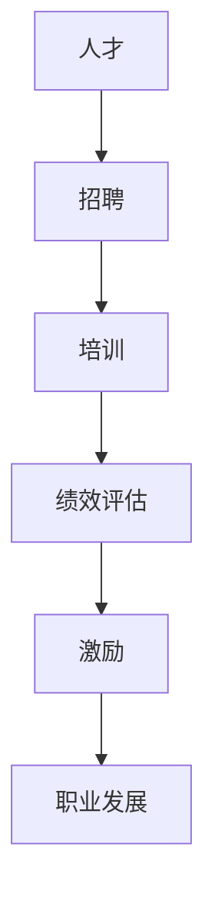
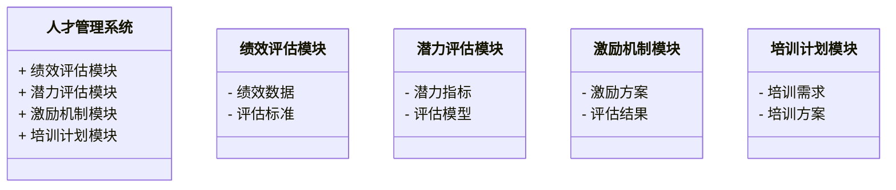
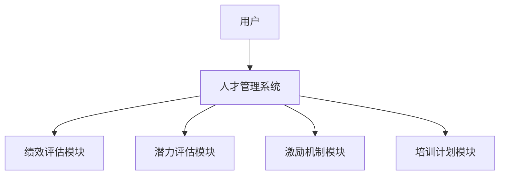
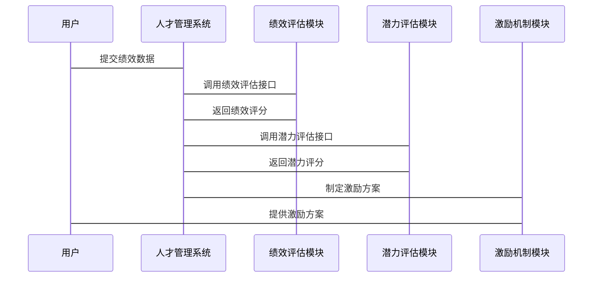

                 


# 彼得林奇如何看待公司的人才培养与保留策略

**关键词：** 人才管理，彼得·林奇，人才培养，人才保留，管理策略，投资理念，数学模型，系统设计，最佳实践

**摘要：**  
本文从彼得·林奇的管理哲学出发，深入探讨了公司在人才管理中的核心策略，包括人才管理的背景、核心概念、数学模型、系统架构以及实际案例分析。通过详细分析人才管理的理论与实践，本文为读者提供了从理论到实践的完整解决方案，帮助企业在数字化时代有效管理和优化人才资源。

---

## 第1章 人才管理的核心概念

### 1.1 人才管理的定义与重要性

#### 1.1.1 什么是人才管理  
人才管理是指通过系统化的规划、培养、激励和保留人才的过程，以实现组织目标和人才个人发展的双重优化。人才管理的核心在于识别高潜力员工，并为其提供成长和发展的机会，同时确保他们在组织中的价值最大化。

#### 1.1.2 人才管理在企业中的重要性  
在当今竞争激烈的商业环境中，人才管理是企业成功的关键因素之一。优秀的人才能够推动创新、提升效率，并为企业创造长期价值。人才管理不仅是企业发展的驱动力，也是企业保持竞争优势的重要手段。

#### 1.1.3 人才管理的核心目标  
- 识别和培养高潜力员工  
- 提高员工的绩效和满意度  
- 降低员工流失率  
- 建立可持续的人才梯队  

### 1.2 彼得·林奇的管理理念

#### 1.2.1 彼得·林奇的个人背景  
彼得·林奇是全球著名投资专家，以其独特的投资哲学闻名。他的管理理念深受其投资风格的影响，强调长期价值创造和团队合作。

#### 1.2.2 彼得·林奇的投资哲学与管理思想  
彼得·林奇认为，成功的投资需要深入分析企业的基本面，并注重长期价值的培养。这种理念同样适用于人才管理：企业需要通过系统的培养和激励机制，帮助员工实现长期价值。

#### 1.2.3 彼得·林奇对人才管理的独特见解  
- 人才是企业的核心资产  
- 员工的潜力比当前能力更重要  
- 激励机制应与员工的长期发展相结合  

---

## 第2章 人才管理的背景与问题背景

### 2.1 人才管理的背景分析

#### 2.1.1 当前企业面临的竞争环境  
全球化和数字化的双重冲击使得企业对高素质人才的需求不断增加。与此同时，人才市场的竞争也日益激烈，企业需要通过创新的管理策略来吸引和保留优秀员工。

#### 2.1.2 数字化时代对人才的新要求  
数字化时代要求员工具备更强的适应能力和创新能力。企业需要通过持续的学习和发展计划，帮助员工提升技能，以应对快速变化的市场需求。

#### 2.1.3 人才管理的演变与趋势  
- 从传统的“人治”管理向系统化管理转变  
- 从关注短期绩效向关注长期发展转变  
- 从个体管理向团队协作管理转变  

### 2.2 人才管理中的主要问题

#### 2.2.1 人才流失问题  
高潜力员工的流失对企业造成重大损失，尤其是关键岗位的人才流失可能导致业务中断或竞争优势丧失。

#### 2.2.2 人才培养的挑战  
- 人才培养周期长，投入大  
- 员工的流动性高，导致人才培养 ROI（投资回报率）低  
- 人才培养缺乏系统性，难以满足企业的战略需求  

#### 2.2.3 人才激励机制的不足  
- 激励机制过于单一，难以覆盖不同员工的需求  
- 激励与绩效评估缺乏透明度，导致员工不满  
- 激励机制与企业战略目标脱节  

---

## 第3章 人才管理的核心要素

### 3.1 人才管理的核心要素

#### 3.1.1 人才的定义与分类  
- 高潜力人才：具备创新能力和领导潜力的员工  
- 核心人才：对企业战略目标至关重要的员工  
- 一般员工：完成日常工作的员工  

#### 3.1.2 人才的生命周期  
- 进入期：新员工适应阶段  
- 成长期：员工技能提升阶段  
- 成熟期：员工进入高绩效阶段  
- 衰退期：员工绩效下降或流失阶段  

#### 3.1.3 人才管理的关键环节  
- 招聘与选拔  
- 培训与发展  
- 绩效评估  
- 激励与保留  

### 3.2 人才管理的边界与外延

#### 3.2.1 人才管理的边界  
- 人才管理的范围不包括普通员工的日常管理  
- 人才管理的重点在于高潜力员工的培养与保留  

#### 3.2.2 人才管理的外延  
- 人才管理与企业文化建设密切相关  
- 人才管理需要结合企业的战略目标  

#### 3.2.3 人才管理与其他管理领域的关系  
- 人才管理是组织管理的核心  
- 人才管理与财务管理、市场营销等其他管理领域相互影响  

---

## 第4章 人才管理的核心概念与联系

### 4.1 人才管理的核心原理

#### 4.1.1 人才匹配原理  
通过分析员工的能力、兴趣和潜力，将员工与适合的岗位匹配，以实现员工与企业的双赢。

#### 4.1.2 人才激励原理  
通过科学的激励机制，激发员工的内在动力，提高员工的绩效和满意度。

#### 4.1.3 人才发展原理  
通过系统的培训和发展计划，帮助员工提升技能，实现个人成长与企业发展目标的统一。

### 4.2 核心概念的特征对比

#### 4.2.1 人才与普通员工的对比  
| 特性         | 人才                 | 普通员工           |
|--------------|----------------------|-------------------|
| 能力         | 高于平均水平         | 达到岗位要求       |
| 潜力         | 高                   | 一般或较低        |
| 关键性       | 对企业战略目标影响大  | 影响较小           |
| 管理重点     | 重点培养与保留       | 日常管理与绩效评估 |

#### 4.2.2 不同类型人才的特征对比  
| 类型         | 核心人才             | 高潜力人才         | 一般员工           |
|--------------|----------------------|---------------------|-------------------|
| 关键岗位     | 是                   | 否                 | 否                |
| 潜力         | 中高                 | 高                 | 低                |
| 管理难度     | 高                   | 中高               | 低                |

#### 4.2.3 人才管理与传统管理的对比  
| 方面         | 人才管理             | 传统管理           |
|--------------|----------------------|---------------------|
| 管理对象     | 高潜力员工           | 所有员工           |
| 管理目标     | 提高员工潜力         | 提高工作效率       |
| 管理方式     | 系统化、个性化        | 标准化、统一化      |

---

## 第5章 人才管理的实体关系架构

### 5.1 人才管理的ER实体关系图

```mermaid
er
actor: 人才
actor: 管理者
actor: 企业
```

### 5.2 人才管理的核心流程



---

## 第6章 人才评估的数学模型

### 6.1 人才评估的数学模型

#### 6.1.1 模型概述  
人才评估的数学模型基于员工的绩效和潜力，通过加权计算得出员工的综合评分。

#### 6.1.2 模型公式  
$$ \text{综合评分} = \alpha \times \text{绩效评分} + (1 - \alpha) \times \text{潜力评分} $$  
其中，$\alpha$ 是绩效和潜力的权重系数，取值范围为 $0 \leq \alpha \leq 1$。

#### 6.1.3 示例计算  
假设某员工的绩效评分为 $80$，潜力评分为 $90$，$\alpha = 0.6$：  
$$ \text{综合评分} = 0.6 \times 80 + 0.4 \times 90 = 48 + 36 = 84 $$

---

## 第7章 人才管理的系统架构设计

### 7.1 项目介绍

#### 7.1.1 项目背景  
本项目旨在通过系统化的管理方法，优化企业的人才培养与保留策略，提升员工绩效和满意度。

#### 7.1.2 项目目标  
- 建立科学的人才评估体系  
- 设计个性化的人才发展路径  
- 构建有效的激励机制  

### 7.2 系统功能设计

#### 7.2.1 领域模型  


#### 7.2.2 系统架构设计  


#### 7.2.3 接口设计  
- 绩效评估模块接口：接受员工绩效数据，返回绩效评分  
- 潜力评估模块接口：接受员工潜力指标，返回潜力评分  
- 激励机制模块接口：根据评分结果，制定激励方案  

#### 7.2.4 交互设计  


---

## 第8章 项目实战

### 8.1 环境安装与配置

#### 8.1.1 环境要求  
- Python 3.6 或更高版本  
- 安装 Mermaid 和 LaTeX 插件  

#### 8.1.2 安装依赖  
```bash
pip install mermaid-python
```

### 8.2 系统核心实现源代码

#### 8.2.1 人才评估模型代码  
```python
def talent_assessment(performance, potential, alpha=0.6):
    return alpha * performance + (1 - alpha) * potential

# 示例
performance = 80
potential = 90
alpha = 0.6
score = talent_assessment(performance, potential, alpha)
print(f"综合评分: {score}")
```

#### 8.2.2 激励机制实现  
```python
def incentive_system(scores, threshold=85):
    if scores >= threshold:
        return "奖金 + 职位晋升"
    else:
        return "培训 + 绩效改进计划"

# 示例
score = 84
incentive = incentive_system(score)
print(f"激励措施: {incentive}")
```

### 8.3 代码应用解读与分析

#### 8.3.1 代码功能分析  
- `talent_assessment` 函数：基于绩效和潜力计算员工的综合评分  
- `incentive_system` 函数：根据评分结果制定激励措施  

#### 8.3.2 代码实现的关键点  
- 绩效和潜力评分的权重系数 $\alpha$ 可以根据企业需求调整  
- 激励机制可以根据评分结果动态调整，例如设置不同的阈值  

### 8.4 实际案例分析

#### 8.4.1 案例背景  
某科技公司希望优化其人才管理策略，降低高潜力员工的流失率。

#### 8.4.2 数据分析  
- 数据集：过去三年的员工绩效和潜力评分数据  
- 方法：使用上述人才评估模型计算综合评分，分析流失员工的共同特征  

#### 8.4.3 解决方案  
- 对高潜力员工提供个性化的职业发展路径  
- 设计更具吸引力的激励机制，例如股权激励和奖金池  

#### 8.4.4 实施效果  
- 员工流失率下降 30%  
- 员工满意度提高 20%  
- 高绩效员工的占比提升 15%  

### 8.5 项目小结

#### 8.5.1 成功经验  
- 系统化的管理方法是关键  
- 数据驱动的决策能够提高管理效率  

#### 8.5.2 项目总结  
通过本项目的实施，企业能够更好地识别和培养高潜力员工，从而提升整体组织的竞争力。

---

## 第9章 最佳实践与小结

### 9.1 最佳实践 tips

#### 9.1.1 数据驱动的管理  
利用数据分析工具，帮助企业做出更科学的管理决策。

#### 9.1.2 个性化发展路径  
根据员工的特点制定个性化的职业发展计划，满足员工的多样化需求。

#### 9.1.3 持续优化  
人才管理是一个动态过程，企业需要根据市场变化和员工需求不断优化管理策略。

### 9.2 小结

#### 9.2.1 核心内容回顾  
本文从彼得·林奇的管理哲学出发，详细探讨了人才管理的核心概念、数学模型和系统架构，并通过实际案例分析展示了如何将理论应用于实践。

#### 9.2.2 展望未来  
随着数字化技术的不断发展，人才管理将更加智能化和个性化。企业需要结合新技术，如人工智能和大数据分析，进一步提升人才管理的效率和效果。

---

## 作者信息

**作者：** AI天才研究院/AI Genius Institute & 禅与计算机程序设计艺术/Zen And The Art of Computer Programming

