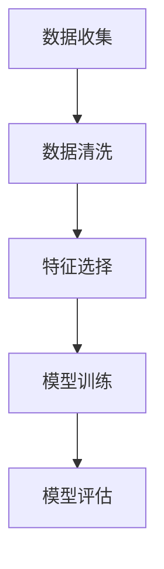
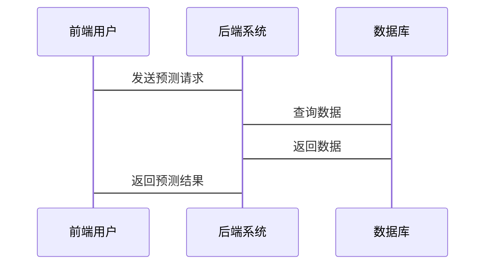

                 


# 彼得林奇如何看待公司的人才流失率

## 关键词：人才流失率，彼得林奇，公司绩效，投资哲学，员工保留策略

## 摘要：本文从彼得林奇的投资哲学出发，分析人才流失率对公司的影响，探讨如何通过数学建模和系统设计来预测和管理人才流失，为公司制定有效的员工保留策略提供参考。

---

# 第一部分: 背景介绍

## 第1章: 人才流失率的定义与背景

### 1.1 人才流失率的定义

#### 1.1.1 人才流失的定义

人才流失是指公司员工因各种原因离开公司的情况。这些原因可能包括职业发展机会不足、薪酬不合理、工作压力过大、公司文化不匹配等。

#### 1.1.2 人才流失率的计算方法

人才流失率 = （流失的员工数 / 初始员工数）× 100%

#### 1.1.3 人才流失率与公司绩效的关系

人才流失率与公司绩效呈负相关关系。高流失率可能导致公司绩效下降，因为人才流失会增加招聘成本、降低团队稳定性，影响公司的创新能力和竞争力。

---

### 1.2 人才流失率的背景与现状

#### 1.2.1 当前人才市场的竞争状况

随着经济全球化和技术进步，人才市场变得更加竞争激烈。员工有更多的机会选择不同的公司，追求更好的职业发展和生活质量。

#### 1.2.2 公司人才流失的普遍现象

许多公司都面临着人才流失的问题，尤其是高科技行业和创新型行业。人才流失率高可能导致公司核心竞争力的下降。

#### 1.2.3 彼得林奇对人才流失的关注点

彼得林奇认为，人才是公司的核心资产，人才流失率的高低直接影响公司的长期价值。他关注如何通过合理的管理策略和薪酬体系来降低人才流失率。

---

## 第2章: 彼得林奇的视角与分析框架

### 2.1 彼得林奇的投资哲学

#### 2.1.1 彼得林奇的投资理念

彼得林奇强调长期投资和基本面分析。他认为，投资的本质是关注公司的内在价值，而不是短期市场波动。

#### 2.1.2 彼得林奇对公司的分析方法

彼得林奇在分析公司时，注重公司的财务状况、管理层能力和市场竞争力。他强调，一个公司只有在管理层优秀、财务健康、市场地位稳固的情况下，才能为投资者创造长期价值。

#### 2.1.3 彼得林奇对人才流失的看法

彼得林奇认为，人才流失是公司管理中的一个重要问题。高人才流失率意味着公司管理层无法有效管理员工，导致公司价值的流失。

---

### 2.2 彼得林奇分析人才流失的框架

#### 2.2.1 人才流失的驱动因素

- 工作满意度
- 薪酬水平
- 职业发展机会
- 公司文化与管理

#### 2.2.2 人才流失对公司的影响

- 影响公司绩效
- 增加招聘成本
- 降低团队稳定性
- 影响公司创新能力和竞争力

#### 2.2.3 彼得林奇的解决方案

彼得林奇建议公司通过以下方式降低人才流失率：

- 提供有竞争力的薪酬和福利
- 提供清晰的职业发展路径
- 建立良好的公司文化
- 加强员工培训和职业发展

---

# 第二部分: 核心概念与联系

## 第3章: 人才流失率与公司绩效的关系

### 3.1 人才流失率的数学模型

我们可以使用线性回归模型来分析人才流失率与公司绩效之间的关系：

$$ y = \beta_0 + \beta_1 x + \epsilon $$

其中：
- $y$ 表示公司绩效（如净利润率、营业收入增长率）
- $x$ 表示人才流失率
- $\beta_0$ 和 $\beta_1$ 是回归系数
- $\epsilon$ 是误差项

---

### 3.2 影响人才流失率的因素分析

我们可以通过构建一个影响人才流失率的因子分析模型来识别关键因素。以下是影响人才流失率的主要因素：

| 因素 | 描述 |
|------|------|
| 工作满意度 | 员工对工作的满意程度 |
| 薪酬水平 | 员工的薪酬与市场水平的比较 |
| 职业发展机会 | 员工在公司内部的发展机会 |
| 公司文化与管理 | 公司文化、管理风格和领导力 |

---

### 3.3 彼得林奇分析框架的ER实体关系图

```mermaid
er
actor:员工
company:公司
job:职位
factor:影响因素
performance:绩效
```

---

# 第三部分: 算法原理讲解

## 第4章: 人才流失率预测算法

### 4.1 算法原理

#### 4.1.1 数据预处理

- 数据清洗：处理缺失值、异常值和重复数据。
- 数据标准化：对不同量纲的特征进行标准化处理。

#### 4.1.2 特征选择

- 使用统计方法（如卡方检验）筛选重要特征。
- 使用机器学习算法（如随机森林）提取特征重要性。

#### 4.1.3 模型训练

- 使用逻辑回归或支持向量机（SVM）进行分类。
- 使用k折交叉验证评估模型性能。

#### 4.1.4 模型评估

- 使用准确率、召回率和F1分数评估模型性能。

---

### 4.2 算法流程图



---

### 4.3 Python代码实现

以下是使用逻辑回归进行人才流失率预测的Python代码示例：

```python
import pandas as pd
from sklearn.model_selection import train_test_split
from sklearn.linear_model import LogisticRegression
from sklearn.metrics import accuracy_score, recall_score, f1_score

# 数据加载
data = pd.read_csv('talent_turnover.csv')

# 数据预处理
data = data.dropna()
data = pd.get_dummies(data)

# 特征选择
X = data.drop('turnover', axis=1)
y = data['turnover']

# 数据分割
X_train, X_test, y_train, y_test = train_test_split(X, y, test_size=0.2, random_state=42)

# 模型训练
model = LogisticRegression()
model.fit(X_train, y_train)

# 模型预测
y_pred = model.predict(X_test)

# 模型评估
print('Accuracy:', accuracy_score(y_test, y_pred))
print('Recall:', recall_score(y_test, y_pred))
print('F1 Score:', f1_score(y_test, y_pred))
```

---

# 第四部分: 系统分析与设计

## 第5章: 人才流失预测系统设计

### 5.1 系统功能设计

- 数据采集模块：从公司数据库中提取员工信息和绩效数据。
- 数据处理模块：清洗数据、特征提取和数据标准化。
- 模型训练模块：使用机器学习算法训练预测模型。
- 结果展示模块：可视化预测结果和分析报告。

### 5.2 系统架构设计


### 5.3 系统交互设计



---

# 第五部分: 项目实战

## 第6章: 项目实战

### 6.1 环境安装

- 安装Python和相关库（如pandas、scikit-learn）。
- 安装Jupyter Notebook用于数据处理和建模。

### 6.2 数据收集与处理

- 数据来源：公司内部员工数据、绩效数据、离职数据。
- 数据清洗：处理缺失值、异常值和重复数据。
- 数据转换：将数据转换为适合建模的格式。

### 6.3 模型训练与部署

- 使用逻辑回归或支持向量机（SVM）进行建模。
- 使用k折交叉验证评估模型性能。
- 部署模型到生产环境，提供API接口供前端调用。

### 6.4 实际案例分析

- 案例背景：某高科技公司面临人才流失率高的问题。
- 数据分析：通过模型预测发现，工作满意度和职业发展机会是主要的影响因素。
- 解决方案：公司通过提高薪酬水平、优化职业发展路径和改善公司文化，成功降低了人才流失率。

---

## 第7章: 最佳实践与小结

### 7.1 小结

本文从彼得林奇的投资哲学出发，分析了人才流失率对公司绩效的影响，探讨了如何通过数学建模和系统设计来预测和管理人才流失。我们提出了一个基于逻辑回归的人才流失率预测模型，并通过实际案例验证了模型的有效性。

### 7.2 注意事项

- 数据质量和完整性直接影响模型性能，需谨慎处理数据。
- 模型部署后需定期更新，以适应市场和公司内部的变化。
- 在实际应用中，需结合公司具体情况调整模型参数和策略。

### 7.3 拓展阅读

- 《彼得林奇的成功投资》
- 《人才管理：数据分析与决策》
- 《机器学习在人力资源管理中的应用》

---

# 附录

## 附录A: 数据集

人才流失预测数据集示例：

| 员工ID | 工作满意度 | 薪酬水平 | 职业发展机会 | 公司文化评分 | 是否流失 |
|-------|-----------|----------|-------------|-------------|----------|
| 001   | 3         | 5000     | 2           | 4           | 是       |
| 002   | 4         | 6000     | 3           | 3           | 否       |
| 003   | 2         | 4000     | 1           | 2           | 是       |

---

## 附录B: 工具推荐

- Python编程语言
- 数据分析工具：Pandas、NumPy
- 机器学习库：Scikit-learn
- 数据可视化工具：Matplotlib、Seaborn
- 开发环境：Jupyter Notebook、VS Code

---

# 结语

人才流失率是公司管理中的一个重要问题。通过彼得林奇的投资哲学和数据分析方法，我们可以更好地理解人才流失的原因和影响，并采取有效的措施降低人才流失率，提升公司绩效。希望本文的分析和建议能为公司管理者和人力资源部门提供有价值的参考。

---

# 作者：AI天才研究院 & 禅与计算机程序设计艺术

