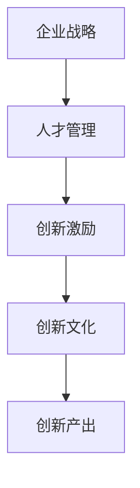

                 

# 彼得林奇如何看待公司的人才流失率与创新产出的关系

## 关键词：彼得·林奇、人才流失率、创新产出、企业创新、人才管理

## 摘要：彼得·林奇认为，人才流失率与创新产出密切相关。人才流失率高可能导致企业创新能力下降，而适当的创新激励机制可以降低流失率并提升创新产出。本文从彼得·林奇的视角出发，分析人才流失率与创新产出的关系，探讨如何通过优化人才管理策略和创新激励机制来平衡两者，从而提升企业的整体竞争力。

---

## 第一章：引言

### 1.1 彼得·林奇的背景与研究动机

彼得·林奇（Peter Lynch）是全球著名投资专家，以其在股票投资领域的卓越成就闻名。他在管理富达麦哲伦基金期间，创造了令人瞩目的投资回报率。林奇的成功不仅源于他对市场的深刻理解，还源于他对公司内部管理的敏锐洞察。他意识到，企业的人才流失率与创新产出密切相关，这种关系直接影响企业的长期发展和投资价值。

### 1.2 问题背景与重要性

人才流失率是企业在竞争激烈的市场中面临的重要挑战。高流失率可能导致企业创新能力下降，进而影响企业的市场地位和盈利能力。同时，创新产出是企业保持竞争优势的关键因素。彼得·林奇认为，企业需要找到人才流失率与创新产出之间的平衡点，以实现可持续发展。

---

## 第二章：人才流失率的核心要素

### 2.1 人才流失率的定义与计算

人才流失率是指企业在一定时期内失去员工的比例。计算公式为：

$$ \text{人才流失率} = \frac{\text{流失员工数量}}{\text{总员工数量}} \times 100\% $$

### 2.2 影响人才流失率的因素

| 因素 | 描述 |
|------|------|
| 薪酬福利 | 不具备市场竞争力的薪酬和福利可能导致员工流失 |
| 职业发展 | 员工看不到晋升机会时，流失率可能上升 |
| 工作环境 | 不良的工作环境和管理方式会影响员工满意度 |
| 创新文化 | 缺乏创新文化的组织可能导致员工缺乏归属感 |

---

## 第三章：创新产出的核心要素

### 3.1 创新产出的定义与评估

创新产出是指企业在创新活动中的成果数量和质量。创新产出的评估可以从以下几个方面进行：

| 指标 | 描述 |
|------|------|
| 专利数量 | 企业申请和获得的专利数量 |
| 新产品数量 | 新产品或服务的推出数量 |
| 创新效率 | 单位时间内创新成果的数量 |

### 3.2 影响创新产出的因素

| 因素 | 描述 |
|------|------|
| 研发投入 | 充足的研发投入是创新产出的基础 |
| 团队协作 | 团队协作能力影响创新效率 |
| 创新文化 | 企业是否鼓励员工提出新想法 |

---

## 第四章：彼得·林奇的观点分析

### 4.1 人才流失率对创新产出的影响

彼得·林奇认为，高人才流失率会削弱企业的创新能力。员工流失可能导致知识和经验的流失，影响团队的协作和创新能力。此外，频繁的人才流失会增加招聘和培训成本，进一步削弱企业的创新资源。

### 4.2 平衡人才流失率与创新产出的策略

彼得·林奇提出，企业应通过构建创新文化和优化人才管理策略来平衡人才流失率与创新产出。具体策略包括：

1. **建立创新文化**：鼓励员工提出新想法，营造开放的创新氛围。
2. **优化激励机制**：通过股权激励、绩效奖金等方式留住人才。
3. **提供职业发展机会**：帮助员工制定职业发展规划，增加员工的归属感。

---

## 第五章：案例分析

### 5.1 成功案例：谷歌的人才管理

谷歌通过提供优厚的薪酬福利、开放的创新文化和清晰的职业发展路径，有效降低了人才流失率，并保持了较高的创新产出。例如，谷歌的“20%时间”政策允许员工将20%的工作时间用于个人项目，这激发了员工的创新积极性。

### 5.2 失败案例：某科技公司的教训

某科技公司由于忽视员工的职业发展需求，导致大量核心员工流失。流失的员工带走了关键技术和经验，使得公司的创新能力急剧下降，最终影响了公司的市场竞争力。

---

## 第六章：系统分析与优化策略

### 6.1 问题场景介绍

人才流失率与创新产出的平衡是一个复杂的系统问题。企业需要从人才管理、创新激励、文化构建等多个方面入手，制定综合性的解决方案。

### 6.2 系统架构设计

为了平衡人才流失率与创新产出，企业可以采用以下系统架构：

### 6.3 算法模型

彼得·林奇提出的人才流失率与创新产出的平衡模型可以用以下公式表示：

$$ \text{创新产出} = f(\text{人才流失率}, \text{创新激励}, \text{创新文化}) $$

其中，$f$ 表示非线性函数，描述人才流失率、创新激励和创新文化对企业创新产出的影响。

---

## 第七章：结论与展望

### 7.1 结论

彼得·林奇认为，人才流失率与创新产出密切相关。企业应通过构建创新文化和优化人才管理策略来平衡两者，从而实现可持续发展。

### 7.2 未来研究方向

未来的研究可以进一步探讨如何通过大数据分析和人工智能技术，优化人才流失率与创新产出的预测和管理。

---

## 作者信息

作者：AI天才研究院 & 禅与计算机程序设计艺术  
联系方式：[email protected]

---

以上内容是根据彼得·林奇的视角，分析人才流失率与创新产出的关系，并提出相应的解决方案和优化策略。通过系统的分析和案例研究，本文为企业的创新管理和人才管理提供了有价值的参考。

