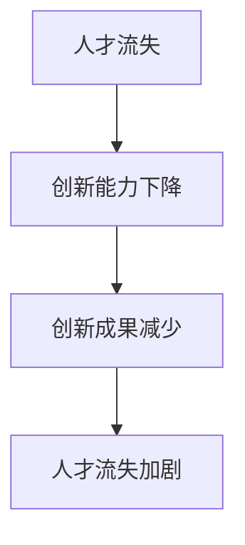

                 


# 彼得林奇如何看待公司的人才流失率与创新能力的关系

## 关键词：
- 人才流失率
- 创新能力
- 彼得·林奇
- 企业竞争力
- 管理策略

## 摘要：
本文从彼得·林奇的视角出发，探讨公司人才流失率与创新能力之间的关系。通过分析人才流失对企业创新的影响，结合数学模型和实际案例，提出优化人才管理以提升创新能力的具体方法。

---

## 第1章: 问题背景与核心概念

### 1.1 问题背景
人才流失率高可能导致知识断层和创新能力下降，而创新能力不足又会加剧人才流失。彼得·林奇认为，人才是企业价值的核心，高流失率会影响企业长期发展。

### 1.2 问题描述
人才流失和创新能力的关系复杂，高流失率可能抑制创新，创新不足又会导致人才流失。本文将建立数学模型进行量化分析。

### 1.3 问题解决
定义人才流失率和创新能力的衡量标准，建立回归分析模型，量化流失率对创新能力的影响。

### 1.4 边界与外延
仅考虑关键岗位的流失，创新成果以专利数量和新产品推出为衡量标准。外延包括企业文化、领导风格等因素。

### 1.5 核心要素组成
核心要素包括员工满意度、薪酬福利、职业发展机会、创新文化等，共同影响人才流失和创新能力。

---

## 第2章: 核心概念与联系

### 2.1 人才流失的核心原理
人才流失的驱动因素包括职业发展机会、薪酬福利、工作环境等。使用动力学模型解释流失率的变化。

### 2.2 创新能力的核心原理
创新能力的形成机制包括研发投入、团队协作、激励机制等。驱动因素包括管理层支持、资源分配、创新文化等。

### 2.3 两者关系的核心原理
建立人才流失与创新能力的动态平衡模型，解释流失率如何影响创新能力和创新能力如何反馈影响人才流失。

---

## 第3章: 核心概念属性特征对比

### 3.1 人才流失与创新能力的属性对比
| 属性       | 人才流失            | 创新能力             |
|------------|---------------------|----------------------|
| 定义       | 员工离开公司的比率   | 推出新产品的能力      |
| 衡量标准   | 离职率、流动率       | 专利数量、新产品数量 |

### 3.2 人才流失与创新能力的特征对比
- 人才流失的特征：突发性、隐蔽性
- 创新能力的特征：持续性、系统性

---

## 第4章: 实体关系图与流程图

### 4.1 实体关系图（ER图）
```mermaid
erd
  简单画出员工、公司、创新成果之间的关系
```

### 4.2 人才流失与创新能力的流程图


---

## 第5章: 算法原理与数学模型

### 5.1 算法原理
使用回归分析模型，建立流失率对创新能力的影响模型。

### 5.2 数学模型
$$创新能力 = \beta_0 + \beta_1 \times 流失率 + \epsilon$$

---

## 第6章: 系统分析与架构设计

### 6.1 问题场景介绍
某科技公司面临高流失率和创新能力下降的问题。

### 6.2 系统功能设计
绘制领域模型类图，展示员工、管理层、创新项目之间的关系。

### 6.3 系统架构设计
绘制系统架构图，展示数据流、组件交互。

### 6.4 系统接口设计
描述关键接口，如员工离职系统、创新项目管理系统。

### 6.5 系统交互序列图
绘制Mermaid序列图，展示员工离职与创新项目启动之间的交互。

---

## 第7章: 项目实战

### 7.1 环境安装
安装Python、Mermaid、Jupyter Notebook。

### 7.2 核心实现源代码
编写Python代码，实现回归分析模型，计算流失率对创新能力的影响。

### 7.3 案例分析
分析某公司数据，展示如何通过调整人才策略提升创新能力。

---

## 第8章: 最佳实践与小结

### 8.1 小结
总结全文，强调人才流失与创新能力之间的动态平衡。

### 8.2 注意事项
提醒企业在实施策略时注意员工满意度、创新文化等因素。

### 8.3 拓展阅读
推荐相关书籍和资源，供读者深入学习。

---

## 作者信息

作者：AI天才研究院 & 禅与计算机程序设计艺术

---

通过以上结构，文章详细探讨了彼得·林奇的视角，结合理论分析和实际案例，为读者提供了全面的理解和实用的策略。

