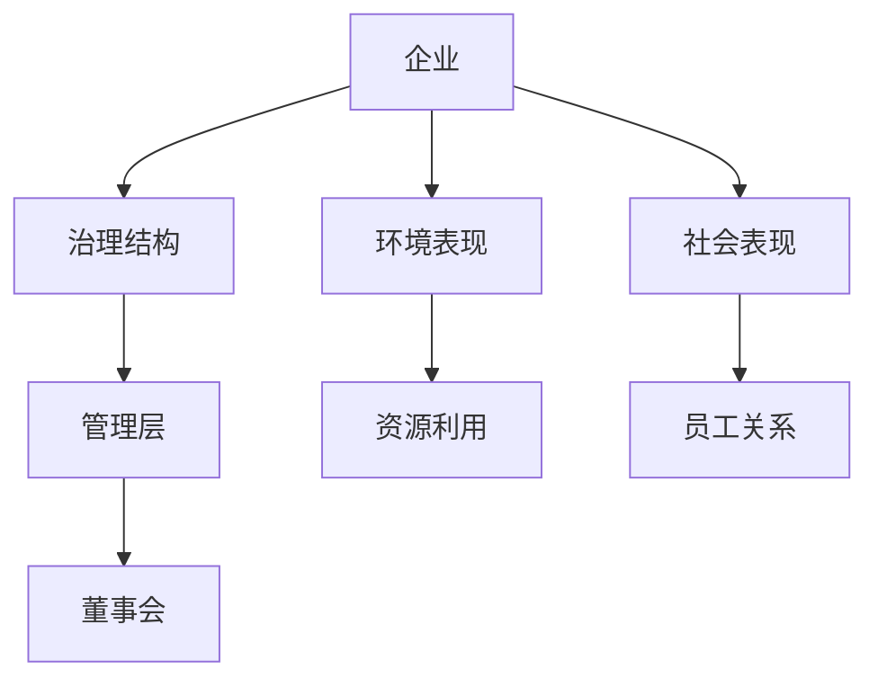
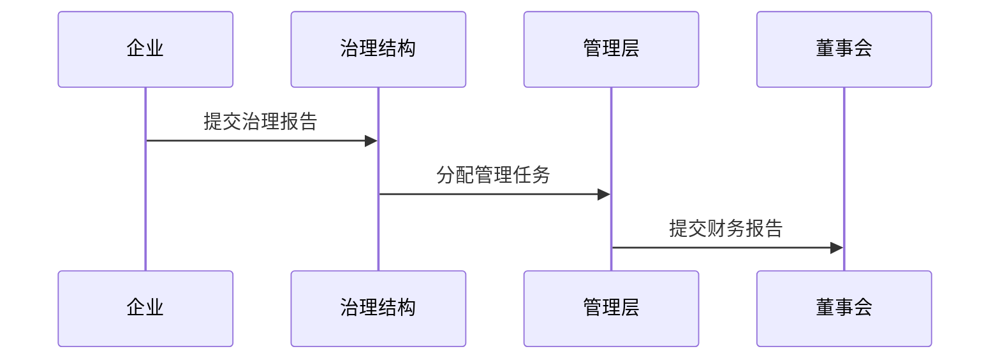

                 


# 彼得·林奇如何看待公司的可持续发展

> **关键词**：彼得·林奇，可持续发展，投资策略，企业治理，财务分析，行业趋势

> **摘要**：本文深入探讨了投资大师彼得·林奇对可持续发展的独特见解，分析了可持续发展对公司治理、财务表现和长期价值的影响。通过详细阐述林奇的投资哲学、行业分析方法和财务评估标准，本文揭示了如何将可持续性因素融入投资决策，为企业和投资者提供了实用的指导。

---

# 第一部分: 引言

## 第1章: 可持续发展与投资的背景

### 1.1 可持续发展的定义与重要性

#### 1.1.1 可持续发展的基本概念
可持续发展是指在满足当前需求的同时，不损害后代满足其需求的能力。这一理念强调经济、社会和环境的平衡发展。

#### 1.1.2 可持续发展对企业的影响
企业通过实施可持续发展战略，可以提升品牌价值、降低风险、增强竞争力，并在长期实现更大的经济效益。

#### 1.1.3 可持续发展与投资的关系
可持续发展已成为投资者评估企业价值的重要因素。越来越多的投资者将环境、社会和治理（ESG）指标纳入投资决策。

### 1.2 彼得·林奇与可持续投资

#### 1.2.1 彼得·林奇的背景介绍
彼得·林奇是全球著名投资大师，曾管理富达麦哲伦基金，创造了辉煌的投资业绩。他的投资哲学注重基本面分析和长期价值。

#### 1.2.2 林奇的投资哲学
林奇强调深入研究企业基本面，关注公司的财务健康、行业地位和长期盈利能力。他认为，成功的投资需要选择具有竞争优势和成长潜力的企业。

#### 1.2.3 可持续发展在林奇投资策略中的地位
林奇在其投资策略中高度重视企业的社会责任和治理结构。他认为，良好的治理和可持续的经营实践是企业长期成功的关键因素。

---

## 第2章: 可持续发展的核心概念

### 2.1 可持续发展的关键要素

#### 2.1.1 环境因素（E）
环境因素关注企业在资源使用、污染排放和气候变化等方面的表现。例如，绿色能源企业通过减少碳排放，提升环境表现。

#### 2.1.2 社会因素（S）
社会因素关注企业对员工、消费者和社区的影响。例如，公平的劳动实践和良好的员工关系有助于提升企业声誉。

#### 2.1.3 治理因素（G）
治理因素关注企业的管理结构和透明度。例如，高效的董事会和良好的内部控制机制有助于提升企业治理水平。

### 2.2 可持续发展与企业治理

#### 2.2.1 企业治理的定义
企业治理是指通过合理的组织结构和制度安排，确保企业目标的实现和利益相关者的权益得到保护。

#### 2.2.2 可持续发展与公司治理的关系
良好的公司治理是实现可持续发展的基础。有效的治理结构能够确保企业遵守法律法规，保护股东和利益相关者的权益。

#### 2.2.3 林奇对治理因素的关注
林奇在选择投资标的时，特别关注企业的治理结构。他认为，高效的管理层和透明的财务报告是企业长期成功的关键。

### 2.3 可持续发展与财务表现

#### 2.3.1 可持续发展对财务表现的影响
可持续发展能够提升企业的品牌价值、降低经营风险、增强市场竞争力，从而对财务表现产生积极影响。

#### 2.3.2 林奇对财务表现的重视
林奇认为，财务表现是评估企业价值的重要指标。他特别关注企业的盈利能力、现金流和股东权益等财务指标。

#### 2.3.3 可持续发展与企业长期价值的关系
可持续发展能够为企业创造长期价值。通过实现环境和社会目标，企业能够获得更多的市场机会和竞争优势。

---

## 第3章: 可持续发展的财务分析

### 3.1 财务分析的核心指标

#### 3.1.1 净利润
净利润是企业经营成果的综合指标，反映了企业的盈利能力。

#### 3.1.2 现金流
现金流是企业经营状况的重要指标，反映了企业的资金流动情况。

#### 3.1.3 股东权益
股东权益是企业净资产的体现，反映了股东对企业的投资价值。

### 3.2 可持续发展对财务表现的影响

#### 3.2.1 可持续发展与企业盈利能力
通过减少资源浪费和提高效率，企业可以降低成本，提升盈利能力。

#### 3.2.2 可持续发展与现金流的关系
良好的环境和社会表现能够提升企业的市场地位和客户忠诚度，从而改善现金流。

#### 3.2.3 可持续发展与股东价值的关联
可持续发展能够提升企业的长期价值，从而为股东创造更多的价值。

### 3.3 林奇对财务表现的评价标准

#### 3.3.1 林奇的财务分析方法
林奇通过分析企业的财务报表，评估其盈利能力、成长能力和财务健康状况。

#### 3.3.2 可持续发展在财务分析中的权重
林奇认为，可持续发展是企业长期成功的关键因素，因此在财务分析中具有重要权重。

#### 3.3.3 林奇对行业趋势的判断
林奇注重行业趋势分析，认为行业的发展前景是评估企业可持续发展的重要因素。

---

## 第4章: 可持续发展的行业分析

### 4.1 行业分析的重要性

#### 4.1.1 行业分析的基本概念
行业分析是通过研究行业的发展趋势、竞争格局和市场结构，评估行业的投资价值。

#### 4.1.2 可持续发展对行业的影响
可持续发展能够推动行业的转型升级，创造新的市场机会。

#### 4.1.3 林奇对行业的长期研究方法
林奇通过长期跟踪行业动态，深入研究行业的竞争优势和发展前景。

### 4.2 可持续发展在不同行业的表现

#### 4.2.1 绿色能源行业
绿色能源行业通过技术创新和政策支持，实现可持续发展。

#### 4.2.2 消费品行业
消费品行业通过优化供应链和减少浪费，提升可持续发展能力。

#### 4.2.3 信息技术行业
信息技术行业通过数字化转型和技术创新，推动可持续发展。

### 4.3 林奇对行业趋势的预测

#### 4.3.1 长期趋势的判断
林奇认为，可持续发展是未来行业发展的主要趋势。

#### 4.3.2 行业竞争优势的分析
林奇注重分析行业的竞争优势，选择具有长期增长潜力的行业。

#### 4.3.3 行业风险的评估
林奇通过分析行业的风险因素，评估行业的可持续发展潜力。

---

## 第5章: 可持续发展的系统架构设计

### 5.1 问题场景介绍

#### 5.1.1 问题背景
企业需要通过系统化的架构设计，实现可持续发展的目标。

#### 5.1.2 问题描述
企业需要在组织结构、流程管理和技术实现等方面进行优化，以支持可持续发展。

#### 5.1.3 问题解决
通过系统架构设计，企业可以实现可持续发展的目标。

### 5.2 系统功能设计

#### 5.2.1 领域模型设计
- **领域模型**：企业通过领域模型分析，确定可持续发展的核心要素和关键流程。

#### 5.2.2 系统架构设计
- **系统架构图**：通过架构图展示系统的功能模块和交互关系。

#### 5.2.3 系统接口设计
- **接口设计**：定义系统与其他系统或外部数据源的接口。

### 5.3 系统架构图



### 5.4 系统交互设计



---

## 第6章: 可持续发展的项目实战

### 6.1 项目背景介绍

#### 6.1.1 项目介绍
以苹果公司为例，分析其可持续发展战略的实施过程。

### 6.2 核心实现源代码

#### 6.2.1 Python代码实现

```python
import pandas as pd

def calculate_financial_metrics(data):
    metrics = {}
    metrics['net_profit'] = data['净利润'].mean()
    metrics['cash_flow'] = data['现金流'].sum()
    metrics['股东权益'] = data['股东权益'].max()
    return metrics

# 示例数据
data = {
    '净利润': [100, 200, 300],
    '现金流': [50, 100, 150],
    '股东权益': [200, 300, 400]
}
df = pd.DataFrame(data)
result = calculate_financial_metrics(df)
print(result)
```

### 6.3 代码应用解读与分析

#### 6.3.1 代码实现的功能
上述代码实现了对财务数据的分析，计算了净利润、现金流和股东权益等关键指标。

#### 6.3.2 代码的业务意义
通过分析财务数据，可以评估企业的财务表现，从而判断其可持续发展能力。

### 6.4 案例分析与详细解读

#### 6.4.1 苹果公司的可持续发展策略
苹果公司通过减少碳排放、优化供应链和提升社会责任，实现可持续发展的目标。

#### 6.4.2 苹果公司的财务表现
苹果公司的财务表现优异，净利润和现金流持续增长，股东权益不断提升。

### 6.5 项目小结

#### 6.5.1 项目总结
通过苹果公司的案例分析，我们可以看到，可持续发展能够提升企业的财务表现和市场竞争力。

#### 6.5.2 经验分享
企业应将可持续发展作为长期战略，通过优化治理结构、提升财务表现和行业地位，实现可持续发展目标。

---

## 第7章: 总结与最佳实践

### 7.1 总结

#### 7.1.1 核心内容回顾
本文深入探讨了彼得·林奇对可持续发展的看法，分析了可持续发展对企业治理、财务表现和行业趋势的影响。

#### 7.1.2 核心观点总结
可持续发展是企业长期成功的关键因素，企业应通过优化治理结构、提升财务表现和行业地位，实现可持续发展目标。

### 7.2 最佳实践 tips

#### 7.2.1 投资者
投资者应将可持续性因素纳入投资决策，选择具有长期价值的企业。

#### 7.2.2 企业
企业应通过优化治理结构、提升财务表现和行业地位，实现可持续发展目标。

#### 7.2.3 管理者
管理者应将可持续发展作为企业战略的重要组成部分，推动企业实现长期价值创造。

### 7.3 注意事项

#### 7.3.1 风险提示
可持续发展需要长期投入，企业在实施过程中可能面临短期挑战和风险。

#### 7.3.2 行业差异
不同行业的可持续发展策略和表现存在差异，投资者和企业在选择时需考虑行业特点。

### 7.4 拓展阅读

#### 7.4.1 推荐书籍
- 《彼得·林奇的投资哲学》
- 《可持续发展与企业治理》

#### 7.4.2 推荐网站
- 网站名称：可持续发展国际组织
- 网站链接：[https://www.un.org](https://www.un.org)

---

# 作者：AI天才研究院/AI Genius Institute & 禅与计算机程序设计艺术 /Zen And The Art of Computer Programming

---

以上就是《彼得·林奇如何看待公司的可持续发展》的完整文章大纲及内容。希望这篇博客能够帮助读者更好地理解可持续发展对企业的影响，以及如何将可持续性因素融入投资决策中。

